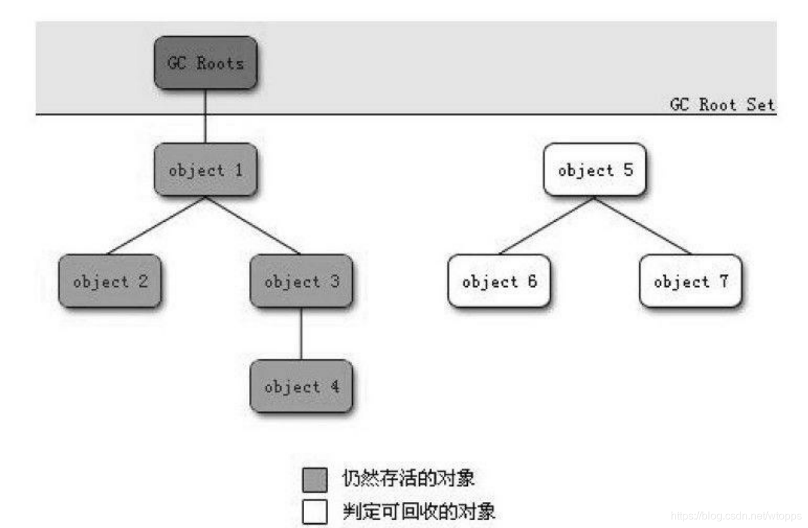
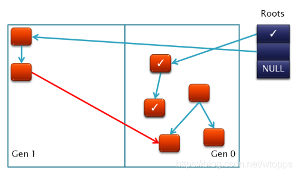
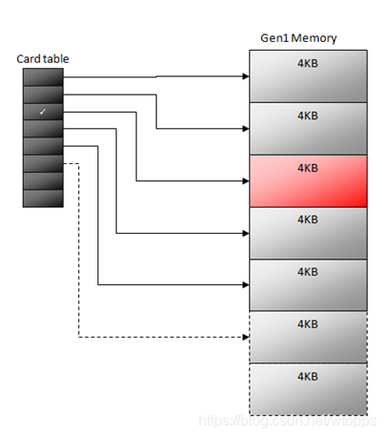
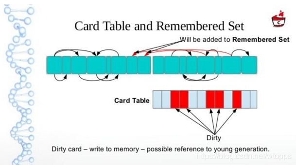

# GC Roots

原文：https://blog.csdn.net/wtopps/article/details/109186517

## GC Roots

JVM 在进行垃圾回收时，如何判断一个对象是否可以被回收，是通过“**可达性分析**”来判定对象是否存活的。

如上图所示，JVM 通过 GC Roots 来判定一个对象是否可以被回收。

所谓 GC Roots，或者说“Tracing GC的根集合”，就是一组必须活跃的引用。

例如，这些引擎可能包括：

* 所有 Java 线程当前活跃的栈帧里指向 GC 堆里的对象的引用。换句话说，当前所有正在被调用的方法的引用类型的参数、局部变量、临时值
* JVM 的一些静态数据结构里指向 GC 堆里的对象的引用。例如说 HotSpot JVM 里的 Universe 里有很多这样的引用
* JNI handles，包括 Global Handles 和 Local Handles
* （看情况）所有当前被加载的 Java 类
* （看情况）Java 类的引用类型静态变量
* （看情况）Java类的运行时常量池里的引用类型常量（String 或者 Class类型）
* （看情况）String 常量池（String Table）里的引用

注意，是一组必须活跃的引用，不是对象。

**执行 GC 操作的根本思路**：给定一个集合的引用作为根出发，通过引用关系遍历对象图，能被遍历到的（可到达的）对象就被判定为存活，其余对象（也就是没有被遍历到的）就自然被判定为死亡。

**注意：**是通过找出所有**活对象**来把其余空间认定为“无用”，而不是找出所有死掉的对象并回收它们占用的空间。

GC Roots 这组引用是 Tracing GC 的起点。要实现语义正确的“Tracing GC”，就必须要能完整枚举出**所有的 GC Roots**，否则就可能会漏扫描应该存活的对象，导致 GC 错误回收了那些被漏扫的活对象。

## Card Table

JVM 在进行 GC 时，同时要处理一种情况，即**跨生代引用的情况**。在执行部分生代收集时，从 GC 堆的非收集部分指向收集部分的引用，也必须作为 GC Roots 的一部分。

例如，当进行新生代的GC时，其中某些新生代的引用对象指向了老生代的对象，那么这种引用，也需要作为 GC Roots 的一部分。

那么 GC 收集器是如何知道所在的进行回收的生代中，哪些对象存在了跨生代引用呢？

最简单的实现方式，就是将全部堆区中的对象扫描一遍，以此来确定相互直接的引用关系，但是显而易见，这样的做法不可行，因为会带来巨大的性能损耗。

为此，JVM 使用了一个叫做“**Card Table（卡表）**”，也可以称为 Remembered Set （记忆结果集）的数据结构，用来标记老生代的某一块内存区域中的对象是否持有新生代对象的引用

Remembered Set 是一个抽象概念，而 Card Table 可以是 remembered set 的一种实现。

Remembered Set 是在实现部分垃圾收集（Partial GC）时用于记录从**非收集部分指向收集部分的指针的**集合的抽象数据结构。

Card Table 的数量取决于老年代的大小和每张 Card 对应的内存大小。每张 Card 在 Card Table 中对应一个 bit 位。当老生代中的某个对象持有了新生代对象的引用时，JVM 就把这个对象对应的 Card 所在的 Card Table 中位置标记为 dirty （bit 位设置为 1），这样在进行新生代 GC 时就不用扫描整个老生代，而是扫描 Card Table 中 Card 为 Dirty 对应的那些内存区域。如果这个 Card 没有对新生代的引用了，那么新生代 GC 就会把它标记为 Clean。

而每当生代中的对象引用关系发生变化时，JVM 需要知道这个变化，并更新 Card Table，这个操作称之为“ **Write barriers（写屏障）**”，每当对象的引用关系发生了变化时，write barrier 会拦截所有新插入的引用关系，并且按需要记录新的引用关系，更新 Card Table，以此保证 Card Table 的准确性。

## CMS 的实现

对于不同的GC收集器，跨生代引用记录的 Card Table 的实现有所不同，这里对CMS GC 的 Card Table 进行展开分析。

CMS GC 是 JVM GC 收集器中唯一可以只对老生代进行单独收集的 GC 收集器， CMS GC 对于 Card Table 的实现比较简单，它**只维护了一个 Card Table，来记录老生代对象对于新生代对象的引用**，当新生代执行 GC 操作时，查找老生代的 GC Roots 时，只需要扫描 Card Table，即可找到老生代 GC Roots。

而当 CMS GC 执行老生代 GC 操作时，由于没有维护新生代对象指向老生代对象引用的 Card Table，因此会将整个新生代作为 GC Roots 进行扫描。

## CMS 并发标记带来的问题

在 CMS 的并发标记阶段，可能会出现两个并发问题：

**第一**：CMS 在执行并发标记，同时，应用在修改老年代中对象的引用。这时，老年代的引用状态会发生改变，所以 CMS 要想办法把这种改变记录下来。

CMS 使用 Card Table 来记录这些改变，把发生改变的对象所在的 Card 标记为 dirty，然后在最终标记阶段再次扫描这些标记为 dirty 的 Card。（这样也会产生浮动垃圾）

**第二**：CMS 在执行并发标记，同时，新生代 GC 开始运行。注意，新生代 GC 也需要扫描 Card Table。在扫描的时候，要对标记为 dirty 的 card 进行分析，如果这个 card 没有对新生代的引用了，那么新生代 GC 就会把它标记为 clean。但是这样导致 CMS 收集器在最终标记阶段无法扫描这个 Card。

这样到底有影响吗？相信一种可能的情况，就是在 CMS 在执行并发标记的时候，其它线程先改变了一个 Card 里的对象引用，然后新生代 GC 开始运行（这时 CMS 仍然在执行并发标记），新生代 GC 如果扫描到这个 dirty Card 不在有新生代的引用，那么就会把它标记为 clean。这个时候就会出现了标记遗漏的情况了。

为了解决上面的问题，**Mod Union Table** 被引入了。它是一个位向量，每个单元的大小只有 1 位，每个单元对应一个 Card（Card的大小是 512 字节，Card Table 每个单元的大小是 1个字节），在新生代 GC 处理 dirty card 之前，先把该 Card 在 Mod Union Table 里面的对应项置位。

这样，CMS 在执行最终标记阶段的时候，就会扫描 Mod Union Table 和 Card Table 里被标记的项，以保证标记的准确性。