# JVM 详解

原文：https://www.toutiao.com/a6997654322737775108/


## 一、JVM 简介

​        JVM 是可运行 Java 代码的假象计算机，包括 **一套字节码指令集、一组寄存器、一个栈、一个垃圾回收、堆 和 一个存储方法域** 。JVM 是运行在操作系统之上的，它与硬件没有直接的交互。

​        JVM 相关的知识要点如下图所示：

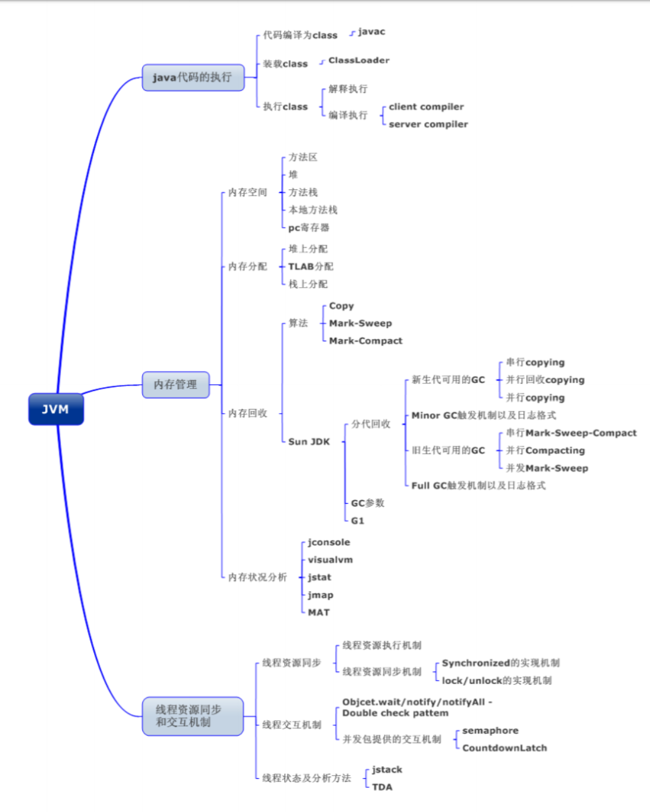

​        众所周知，Java源文件通过编译器，能产生相应的 .class 文件，也就是字节码文件，而字节码文件又通过 Java虚拟机的解释器，在特定机器上运行的机器吗。这个过程可以如下表示：

* Java源文件 -> 编译器 -> 字节码文件
* 字节码文件 -> JVM -> 机器吗

​        每一个平台的解释器是不同的，但是实现的虚拟机是相通的，这也就是Java能跨平台的原因。当一个程序从开始运行，这时虚拟机就开始实例化了，多个程序启动就会存在多个虚拟机实例。程序退出或关闭，则虚拟机实例消亡。多个虚拟机之间，数据不能共享。

## 二、JVM内存区域

* **按功能划分**

  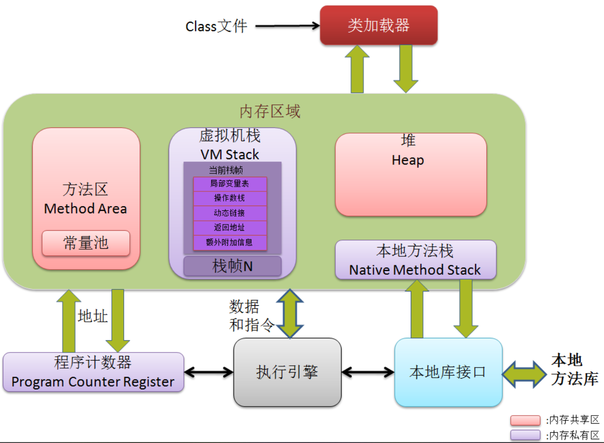

* **按内存是否共享划分**

  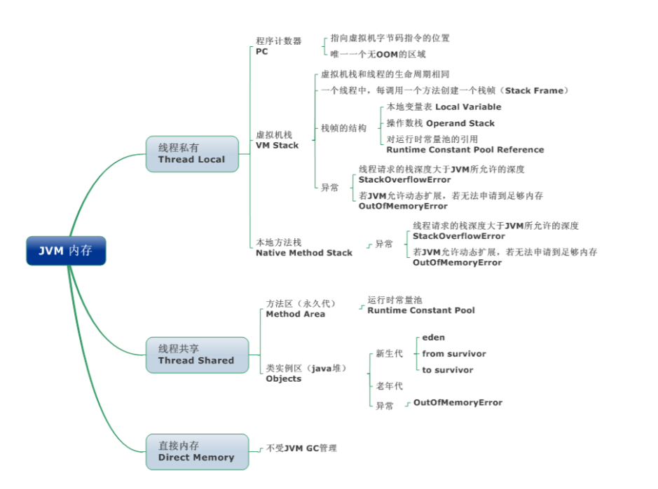

​        JVM 内存区域主要分为 **线程私有区域**（程序计数器、虚拟机栈、本地方法区）、**线程共享区域**（Java堆、方法区）、**直接内存**。

​       **线程私有数据区域生命周期与线程相同**，依赖用户线程的 **启动/结束** 而 **创建/销毁**（在 Hotspot VM 内，每个线程都与操作系统的本地线程直接映射，因此这部分内存区域的 **存/否** 跟随本地线程的 **生/死** 对应）。

​        线程共享区域随虚拟机的 **启动/关闭** 而 **创建/销毁**。

​        直接内存并不是 JVM 运行时数据区的一部分，但也会被频繁的使用：在 JDK 1.4 引入的 NIO 提供了基于 Channel  与 Buffer 的IO方式，它可以使用 Native 函数库直接分配堆外内存，然后使用 DirectByteBuffer 对象作为这块内存的引用进行操作，这就避免了在Java堆和Native 堆中来回复制数据，因此在一些场景中可以显著提升性能。

### 2.1 程序计数器

​        程序计算器，**是线程私有的**。

​        **一块较小的内存空间，是当前线程锁执行的字节码的行号指示器**，每条线程都要有一个**独立的**程序计数器，这类内存也称为线程私有的内存。正在执行 java 方法的话，计数器记录的是虚拟机字节码指令的地址（当前指令的地址）。如果还是 Native 方法，则为空。这个内存区域是唯一一个在虚拟机中没有固定任何 OutOfMemoryError 情况的区域。

### 2.2 虚拟机栈

​        **栈，是线程私有的**。

​        描述 Java 方法执行的内存模型，每个方法在执行的同时都会创建一个栈帧（Stack Frame）用于存储局部变量表、操作数栈、动态链接、方法出口等信息。每一个方法从调用直到执行完成的过程，就对应着一个栈帧在虚拟机栈中入栈道出栈的过程。

​        **栈帧（Stack Frame）是用来存储数据和部分过程结果的数据结构**。同时也被用来处理动态链接（Dynamic Linking）、方法返回值和异常分派（Dispatch Exception）。栈帧随着方法调用而创建，随着方法结束而销毁 -- 无论方法是正常完成还是异常完成（抛出了在方法内未被捕获的异常）都算作方法结束。

​        栈帧的结构图：

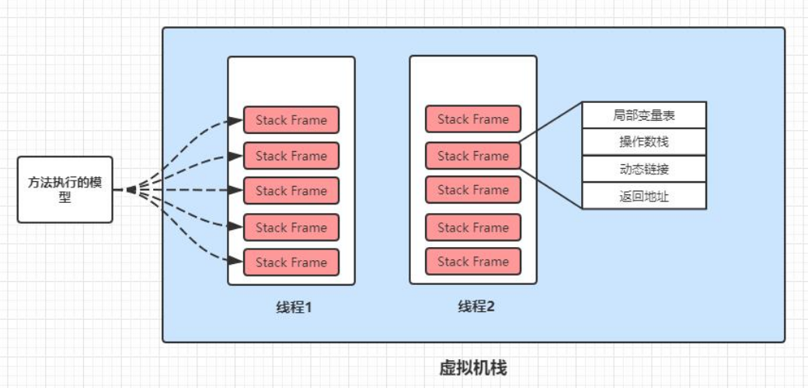

### 2.3 本地方法区

​        **本地方法区，是线程私有的**。

​        本地方法区和 Java Stack 作用类似，区别是：虚拟机栈为执行 Java 方法服务，而本地方法栈则为 **Natvie 方法**服务。如果一个 VM 实现使用 C-linkage 模型来支持 Native 调用，那么该栈将会是一个 C 栈，但 HotSpot VM 直接就把本地方法和虚拟机栈合二为一。

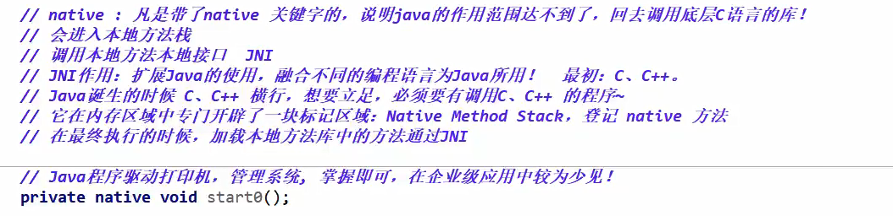

### 2.4 堆

​        **堆，是线程共享的**。

​        运行时数据区，是被线程共享的一块内存区域，创建的对象和数组都保存在 Java 堆内存中，也是垃圾收集器进行垃圾收集的最重要的内存区域。

​        由于现代 VM 采用分代收集算法，因此 Java 堆从 GC 的角度还可以细分为：**新生代**（**Eden**区、**SurvivorForm**区 和 **ServivorTo** 区）和**老年代**。如下图所示：

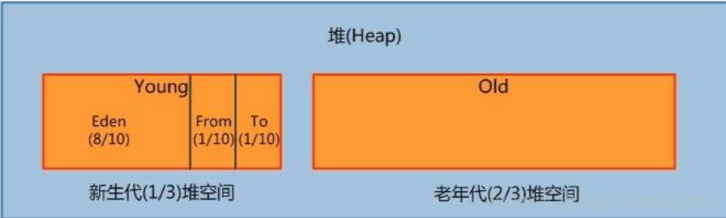

#### 2.4.1 新生代

​        新生代是用来存放新生成的对象。一般占据堆的 1/3 空间。由于频繁创建对象，所以新生代会频繁触发 ***MinorGC*** 进行垃圾回收。新生代又分为 Eden区、SurvivorFrom区 和 SurviviorTo 区：

* **Eden区**：通常叫做“伊甸园区”。Java新对象的出生地（如果新创建的对象占用内存很大，则直接分配到老年代）。当 Eden 区内存不够的时候就会触发 **MinorGC** 对新生代区进行一次垃圾回收。
* **SurvivorFrom区**：也叫做“幸存0区”。上一次 GC 的幸存者，作为这一次 GC的被扫被扫描者。
* **SurviviorTo区**：也叫做“幸存1区”。保留了一次 MinorGC 过程中的幸存者。

**MinorGC的过程**

​        通常，这个过程由这几步组成： ***复制-> 清空 -> 互换***

1. **复制**：是指，把eden、surviviorFrom区域中的对象复制到 SurviviorTo区域去，对象的年龄 +1。首先，把 Eden 和 SurviviorFrom 区域中存活的对象复制到 SurviviorTo 区域（如果有对象的年龄已经达到了老年代的标准，则复制到老年代区域），同时把这些对象的年龄+1（如果 SurviviorTo 不够位置了，就放到老年代区）
2. **清空**：然后，清空 Eden、SurviviorFrom 区域中的对象
3. **互换**：最后，SurviviorTo 和 SurviviorFrom 区域互换，即原 SurviviorTo 称为下一次 GC 时的 SurviviorFrom 区

#### 2.4.2 老年代

​        老年代区域，主要存放应用程序中生命周期长的内存对象。

​        老年代的对象比较稳定，所以 ***Major GC*** 不会频繁执行。在进行 Major GC 前，一般都先进行一次 Minor GC，使得有新生代的对象晋升进入老年代，导致空间不够用时才触发。当无法找到足够大的连续空间分配给新创建的较大对象时，也会提前出发一次 Major GC 进行垃圾回收，腾出空间。

​        **Major GC 采用标记清除法**：首先扫描一次所有老年代，标记出存活的对象，然后回收没有标记的对象。Major GC 的耗时比较长，因为要扫描再回收。**Major GC 会产生内存碎片**，为了减少内存损耗，一般需要进行合并或者标记出来方便下次直接分配。当老年代也满了，装不下的时候，就会抛出 OOM 异常。

#### 2.4.3 测试堆内存

```java
public class TestJVM {
  public static void main(String[] args) {
    // 返回虚拟机试图使用的最大内存
    long max = Runtime.getRuntime().maxMemory();
    // 返回虚拟机的初始化总呢村
    long total = Runtime.getRumtime().totoalMemory();
    
    // 默认情况下，分配的总内存是电脑运行内存的1/4，而初始化内存是1/64
    System.out.println("max"+max+"字节\t"+(max/(double)1024/1024)+"MB");
    System.out.println("total"+total+"字节\t" + 
                       (total/(double)1024/1024)+"MB");
    // 运行时，需要添加 VM的参数（Options）：
    // -Xms1024m -Xmx1024m -XX:+PrintGCDetails
  }
}
```

默认参数的运行结果：

```shell
max1873805312字节 	1787.0MB
total126877696字节  121.0MB
```

如下图，添加了VM 参数：*-Xms1024m -Xmx1024m -XX:+PrintGCDetails*，再次执行的结果：

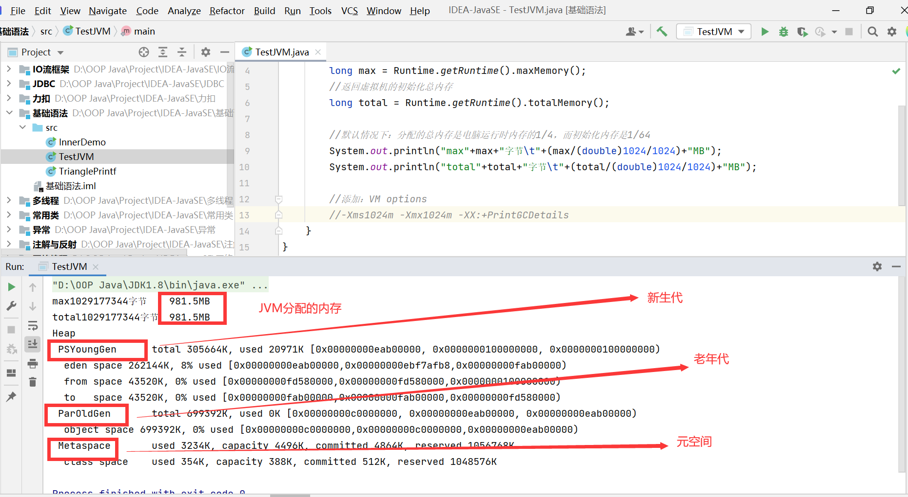

### 2.5 方法区/永久代

​        **方法区**（Method Area）只是 JVM 规范中定义的一个概念，常用于存储 被 **JVM 加载的类信息、常量、静态变量、即时编译器编译后的代码** 等数据。具体放在哪里，不同的实现可以放在不同的地方。**HotSpot VM 把 GC 分代收集扩展至方法区**，即使用 Java 堆一样管理这部分内存，而不必为方法区开发专门的内存管理器（永久代的内存回收的主要目标是针对常量池的回收和类型的卸载，因此受益一般很小）

#### 2.5.1 常量池

​        **运行时常量池**是方法区的一部分。class 文件中除了有类的版本号、字段、方法、接口等**描述信息**外，还有一项信息是常量池（Constant Pool Table），用于存放编译期生成的各种字面量和符号引用，这部分内容将在类加载后存放到方法区的运行时常量池中。Java 虚拟机对 class 文件的每一部分（自然也包括常量池）的格式都有严格的规定，每一个字节用于存储哪种数据都必须符合规范上的要求，这样才会被虚拟机认可、装载和执行。

​        常量池是为了避免频繁的创建和销毁对象而影响系统性能，其实现了对象的共享。例如，字符串常量池，在编译阶段就把所有的字符串文字放到了一个常量池中。Java 中基本类型的包装类的大部分都实现了常量池技术，即Byte、Short、Integer、Long、Character、Boolean。**前 5 种包装类默认创建了数值 *[-128 , 127]* 的相应类型的缓存数据，但是超出此范围仍然会去创建新的对象**。两种浮点数类型的包装类， Float、Double ，并没有实现常量池技术。

​        *注：上述默认的数值范围，可以通过修改JDK源码来扩大或者缩小*

#### 2.5.2 永久代

​        **永久代**是 HotSpot VM 特有的概念，指内存的永久保存区域，**主要存放 class 和 Meta（元数据）的信息**。Class 在被加载的时候被放入永久区域，它和存放实例的区域不同，**GC 不会在主程序运行期间堆永久区进行清理**。所以，这也导致了永久区会随着加载的 class 的增多而胀满，最终抛出 OOM 异常。

​        **永久代也是方法区的一种实现**，别的 JVM 都没有这个东西。虽然 **Java 虚拟机规范把方法区描述为<font color='red'>堆</font>的一个逻辑部分**，但是它却有一个别名叫做 ***Non-Heap（非堆）***，目的应该是与 Java 堆区分开来。

​        在JDK8中，永久代已经被移除，被一个称为“**元数据区（元空间）**”的区域所取代。元空间的本质和永久代类似，**元空间与永久代之间最大的区别在于**：<font color='red'>**元空间并不在虚拟机中，而是使用本地内存**</font>。因此，默认情况下，元空间的大小仅受本地内存的限制。因此，类的元数据放入 natvie memory，字符串池和类的静态变量放入 java 堆中，这样可以加载多少类的元数据就不再由 ***MaxPermSize*** 控制，而由系统的实际可用空间来控制。

## 三、JVM 类加载器

​        虚拟机设计团队把加载动作放到 JVM 外部实现，以便让应用程序决定如何获取所需的类。JVM 提供了 3 种类加载器：

1. **启动类加载器**（Boostrap ClassLoader）：负责加载 *JAVA_HOME\lib* 目录中的；或者通过 *-Xbootclasspath* 参数指定路径中的，且被虚拟机认可（按文件名识别，如 rt.jar）的类

2. **扩展类加载器**（Extension ClassLoader）：负责加载 *JAVA_HOME\lib\ext* 目录中的；或者通过 *java.ext.dirs* 系统变量指定路径中的类库

3. **应用程序类加载器**（Application ClassLoader）：负责加载用户路径（classpath）上的类库。JVM 通过**双亲委派模型**进行类的加载，也可以通过继承 *java.lang.ClassLoader* 实现自定义的类加载器。

   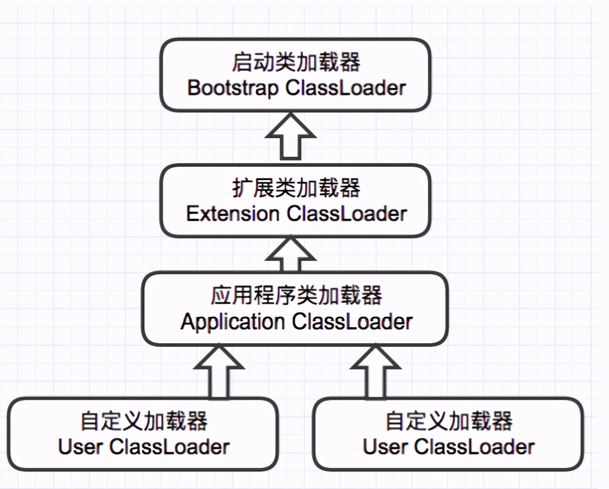

## 四、双亲委派机制

​        当一个类收到了类加载请求，它首先不会尝试自己去加载这个类，而是把这个请求委派给父类去完成，每一个层次类加载器都是如此，因此所有的加载请求都应该传送到启动类加载其中，只有当父类加载器反馈自己无法完成这个请求的时候（在它的加载器路径下没后找到所需要的class），子类加载器才会尝试自己去加载。

​        采用双亲委派的一个好处，保证使用不同的类加载器最终得到的都是同样一个 Object 对象。比如，加载位于 rt.jar 包中的类 java.lang.Object，不管是哪个加载器加载这个类，最终都是委托给顶层的启动类加载器先进行加载。

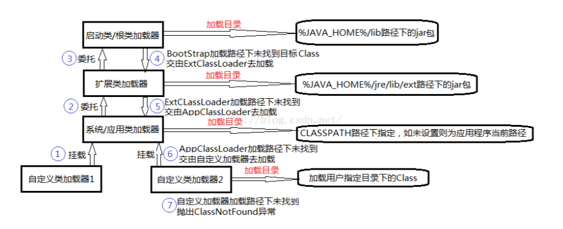

## 五、沙箱安全机制

​        Java 安全模型的核心是 Java沙箱（SandBox）。什么是沙箱？**沙箱是一个限制程序运行的环境**。沙箱机制就是将 Java 代码限定在虚拟机特定的运行环境中，并且严格限制代码对本地系统资源访问，通过这样的措施来保证对代码的有效隔离，防止对本地系统造成破坏。**沙箱主要限制系统资源访问**。那么系统资源包括哪些呢？CPU、内存、文件系统、网络。不同级别的沙箱对这些资源的访问的控制也可以不一样。

### 5.1 JVM的安全模型

​        所有的 Java 程序运行都可以指定沙箱，可以定制安全策略。

#### 5.1.1 JDK 1.0的安全模型

​        在 Java 中将执行程序分成本地代码和远程代码两种，本地代码默认视为可信任的；而远程代码则被看作是不受信的。对于受信的本地代码，可以访问一切本地资源；而对于非受信的远程代码，在早期的 Java 实现中，安全依赖于沙箱机制。如下图是JDK1.0 的安全模型：

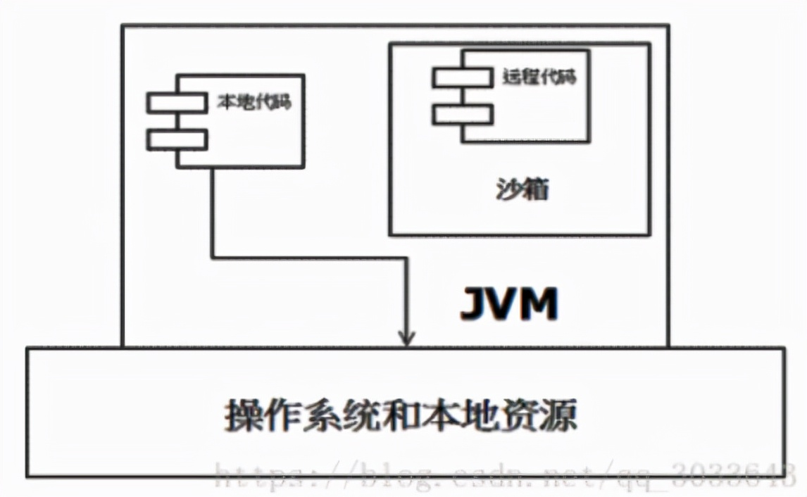

#### 5.1.2 JDK1.1 安全模型

​        但是如此严格的安全机制也给程序的功能扩展带来了障碍。比如当用户希望远程代码访问本地系统的文件时，就无法实现。因此在后续的 JDK 1.1 中，针对安全机制做了改进，增加了**安全策略**，允许用户指定代码对本地资源的访问权限。如下图是 JDK1.1 的安全模型：

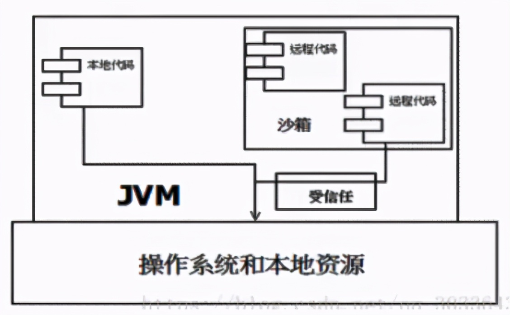

#### 5.1.3 JDK1.2 安全模型 

​       在 JDK 1.2 中，再次改进了安全机制。增加了 **代码签名** 。不论本地代码还是远程代码，都会按照用户的安全策略设定，由类加载器加载到虚拟机中权限不同的运行空间，来实现差异化的代码执行权限控制。如下图是 JDK 1.2 的模型：

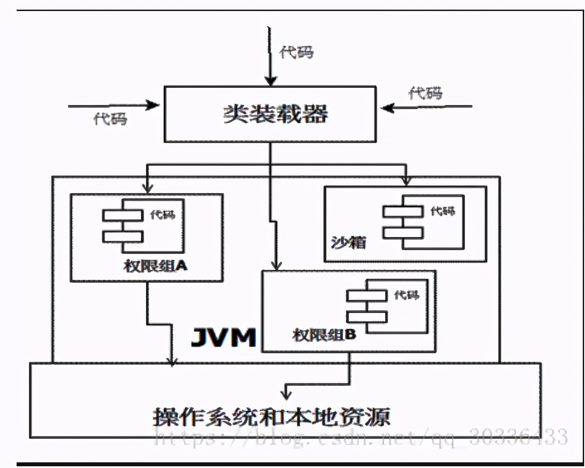

#### 5.1.4 JDK1.6+ 安全模型

​        当前最新的安全机制实现，则引入了域（Domain）的概念。虚拟机会把所有代码加载到不同的**系统域**和**应用域**，系统域部分专门负责与关键资源进行交互，而各个应用域部分则通过系统域的部分代理来对各种需要的资源进行访问（*PS：有些像Linux里的用户态、内核态*）。虚拟机中不同的受保护域（Protected Domain），对应不一样的权限。存在于不同域中的类文件就具有了当前域的全部权限，如下图是 JDK1.6 的安全模型：

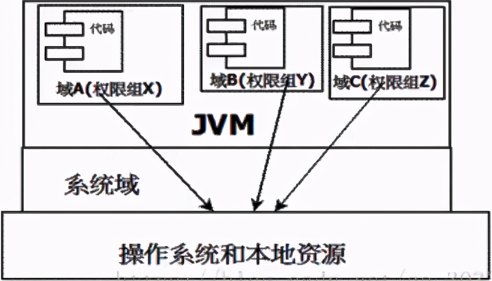


### 5.2 沙箱的组成

​        沙箱基本上有两个组件组成：

* **字节码校验器**（bytecode verifier）：确保 Java 类文件遵循 Java 语言规范。这样可以帮助 Java 程序实现内存保护。但并不是所有的类文件都会经过字节码校验，比如核心类
* **类装载器**（class loader）：其中类装载器在 3 个方面对 Java 沙箱起作用：它可以防止恶意代码去干涉善意的代码；**双亲委派机制**保护了被信任的类库，**边界**将代码归入保护域，确定了代码可以进行哪些操作


​        虚拟机为不同的类加载器载入的类提供了不同的命名空间，命名空间由一系列唯一的名称组成，每一个被装在的类将有一个名字，这个命名空间是有 Java 虚拟机为每一个类装载器维护的，它们互相之间设置不可见。类装载器采用的机制是双亲委派模式：

1. 从最内层 JVM 自带类加载器开始加载，外层恶意同名类得不到加载从而无法使用
2. 由于严格通过包来区分了访问域，外层恶意的类通过内置代码也无法获得权限访问到内层类，破坏代码就自然无法生效
3. **存取控制器**（access controller）：存取控制器可以控制核心 API 对操作系统的存取权限，而这个控制的策略设定，可以由用户指定
4. **安全管理器**（security manager）：是核心 API 和操作系统之间的主要接口。实现权限控制，比存取控制器优先级高
5. 安全软件包（security Package）：java.security 下的类和扩展包下的类，允许用户为自己的应用增加新的安全特性，包括：安全提供者消息摘要数字签名加密鉴别

## 六、GC垃圾回收算法

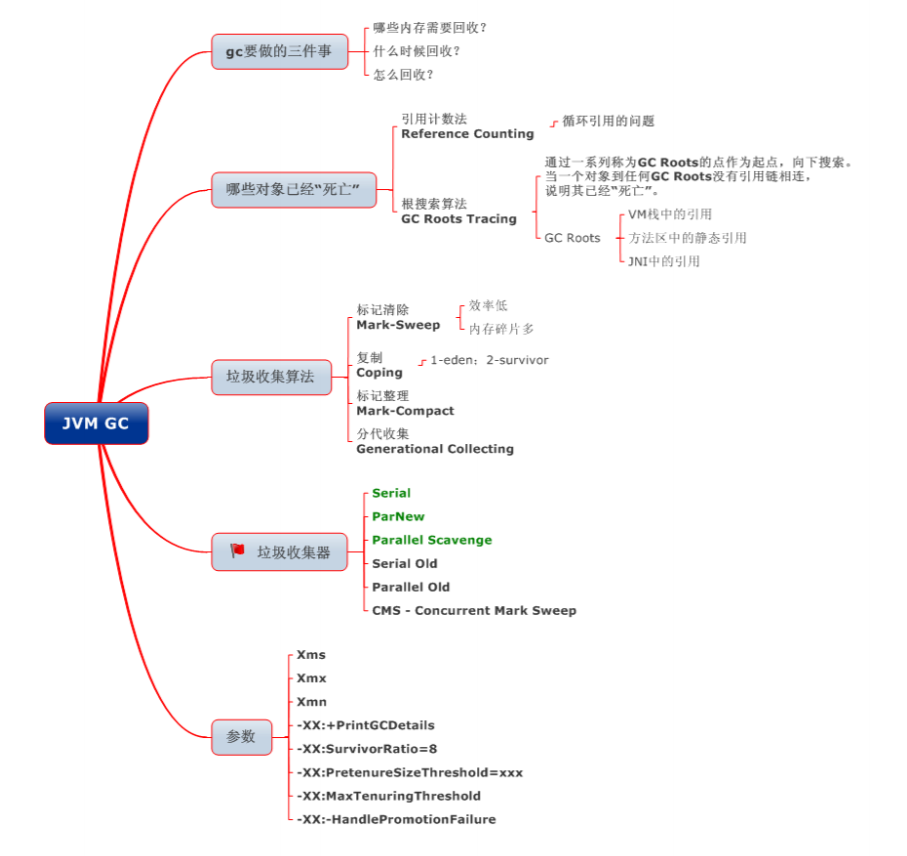

### 6.1 如何确定垃圾

#### 6.1.1 引用计数法

​        在Java中，**引用和对象是有关联的**。如果要操作对象则必须用引用进行。因此，很显然一个简单的办法是通过引用计数来判断一个对象是否可以回收。简单说，即一个对象如果没有任何与之关联的引用，即它们的引用计数都为0，则说明对象不太可能再被用到，那么这个对象就是可回收对象。

#### 6.1.2 可达性分析

​        为了解决引用计数法的循环引用问题，Java 使用了可达性分析的方法。通过一系列的 GC roots 对象作为起点搜索。**如果在 GC roots 和一个对象之间没有可达路径，则称该对象是不可达的**。要注意的是，<font color='red'>不可达对象不等价于可回收对象，不可达对象变为可回收对象至少要经过两次标记过程</font>。两次标记后仍然是可回收对象，则将面临回收。

### 6.2 标记清除算法（Mark-Sweep）

​        最基础的垃圾回收算法，分为两阶段：**标注**和**清除**。标记阶段标记出所有需要回收的对象，清楚阶段回收被标记的对象所占用的空间。如图所示：

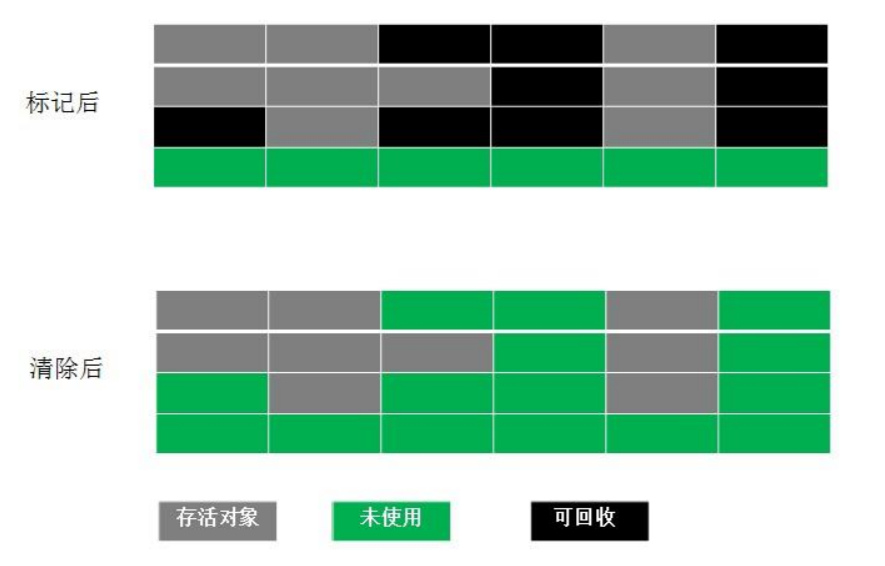

​        从图中可以发现，该算法最大的问题是 **内存碎片化严重**，后续可能发生大对象不能找到可利用空间的问题。

### 6.3 复制算法（copying）

​        复制算法，是为了解决 Mark-Sweep 算法内存碎片好的缺陷而被提出的算法。按照内存容量将内存划分为等大小的两块。每次只使用其中一块，当这一块内存满后将尚存活的对象复制到另一块上去，把已使用的内存清掉。如下图所示：

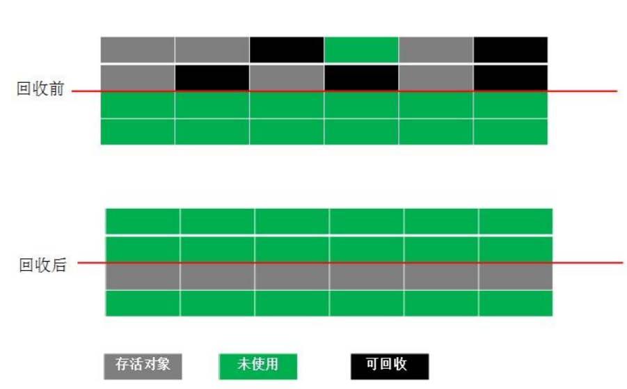

​        这种算法虽然实现简单，内存效率高，不易产生碎片，但是最大的问题是可用内存被压缩到原来的一半。且存活对象增多的话，copying 算法的效率会大大降低。

### 6.4 标记整理算法（Mark-Compact）

​        这个算法结合了上面两个算法，避免了上面两个算法的缺点。标记阶段和 Mark-sweep 算法相同，**标记后不是清理对象，而是将存活对象移向内存的一端**。然后清除端边界外的对象。如下图所示：

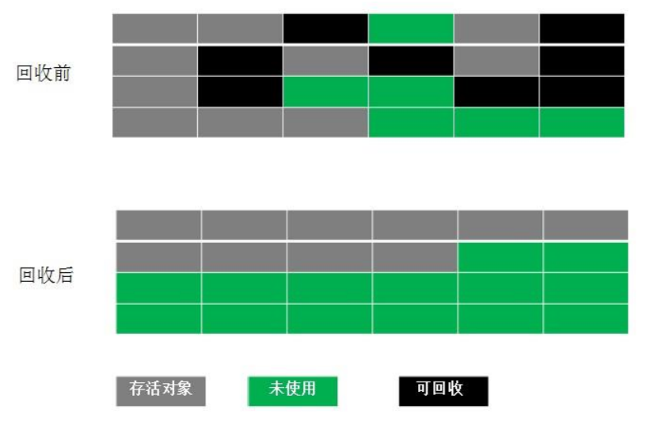

### 6.5 分代收集算法

​        分代收集法是目前大部分 JVM 所采用的方法，其核心思想是根据对象存活的不同生命周期将内存划分为不同的域，一般情况下，将 GC 堆划分为**老生代**（Tenured/Old Generation）和**新生代**（Young Generation）。**老生代的特点**是每次垃圾回收时只有少量对象需要被回收；**新生代的特点**是每次垃圾回收时都有大量的垃圾需要被回收。

​        因此可以根据不同区域选择不同的算法。

#### 6.5.1 新生代与复制算法

​        目前大部分 JVM 的GC 对于新生代都采取 **Copying 算法**，因为新生代中每次垃圾回收都要回收大部分对象，即要复制到操作比较少，但通常并不是按照 ***1:1*** 来划分新生代。

​        一般将新生代划分为一块比较大的 Eden空间和两个较小的Survivor空间（From Space，To Space），每次使用 Eden 空间和其中的一块 Survivor空间，当进行回收时，将该两块空间中还存活的对象复制到另一块 Survivor空间中。


#### 6.5.2 老年代与标记复制算法

​        而老年代因为每次回收的对象少，因而采用 **Mark-Compact算法**。

1. Java虚拟机提到过的处于方法区的永生代（Permanet Generation），它用来存储 class 类、常量、方法描述等。对永生代的回收主要包括废弃常量和无用的类
2. 对象的内存分配主要在新生代的 Eden Space 和 Survivor Space 的 From Space（Survivor 目前存放对象的那一块），少数情况会直接分配到老生代
3. 当新生代的Eden Space 和 From Space 空间不足时就会发生一次 GC，进行 GC 后，Eden Space 和 From Space 区的存活对象会被挪到 To Space，然后将Eden Space 和 From Space 进行清理
4. 如果 To Space 没有足够空间存储某个对象，则将这个对象存储到老年代
5. 在进行GC后，使用的便是 Eden Space 和 To Space 了，如此反复循环
6. 当对象在 Survivor 区躲过一次 GC后，其年龄就会+1。**默认情况下，年龄达到15的对象会被移到老生代中**。

