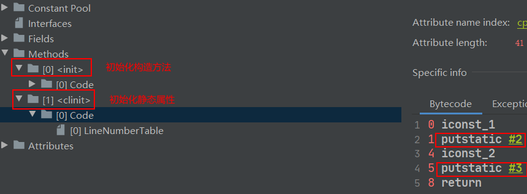

# JVM 初始化阶段简述

原文：https://www.toutiao.com/a7050853464154440231/?log_from=4601ca5953cf78_1641703107139


## 1. <clinit>() 方法

JVM 初始化阶段就是执行类变量构造器方法<clinit>( ) 的过程。对准备阶段产生的默认零值进行赋值。此方法无需定义，是由 javac 编译器**自动收集类中的所有类变量的赋值动作和静态代码块**，并将其进行合并。

只有被 static 修饰并且赋值的静态属性才会产生 <clinit>( ) 方法，不管是直接赋值，还是在静态块中赋值，最后都会被合并成一个 <clinit>( ) 方法，并按照代码中的顺序依次赋值

```java
public class JvmDemo1 {
    private static int value1 = 1;
    private static int value2;
    static {
        value2 = 2;
    }
}
```

 

若当前类具有父类，JVM 会保证子类的 <clinit>( ) 执行前，父类的 <clinit>( ) 已经执行完毕。

## 2. static 与 final 搭配初始化时机

使用 static + final 修饰字段的**显示**赋值的操作，到底是在哪个阶段进行的赋值？

* **情况1**：在连接阶段的准备环境赋值（连接阶段包括：验证、准备和解析）

  在连接阶段的准备环节赋值情况有以下2种：

  * 对于基本数据类型的字段来说（int、float等），如果使用了 static final 修饰，通常是在连接阶段的准备环节进行赋值
  * 对于字符串 String 类型来说，如果使用字面量的方式赋值（String str = "a"），通常是在连接阶段的准备环节进行赋值

* **情况2**：在初始化阶段<clinit>( ) 中赋值。因为初始化阶段才开始有代码执行

排除上述在准备阶段赋值的两种情况，剩余的都是在初始化阶段进行赋值。

**最终结论**：使用 static + final 组合修饰，且显示赋值中不涉及到方法或者构造器调用的基本数据类型或者 String 类型的显示赋值，是在连接阶段的准备环节进行。以下是例子：

```java
// 在连接阶段的准备环节赋值
public static final int INT_CONSTANT = 10;  
 // 在初始化阶段clinit>()中赋值
public static final int NUM1 = new Random().nextInt(10);   
// 在初始化阶段<clinit>()中赋值
public static int a = 1;                                                  
// 在初始化阶段<clinit>()中赋值
public static final Integer INTEGER_CONSTANT1 = Integer.valueOf(100);     
// 在初始化阶段<clinit>()中概值
public static Integer INTEGER_CONSTANT2 = Integer.valueOf(100);     
 // 在连接阶段的准备环节赋值
public static final String s0 = "helloworld0";           
 // 在初始化阶段<clinit>()中赋值
public static final String s1 = new String("helloworld1");      
 // 在初始化阶段<clinit>()中赋值
public static String s2 = "hellowrold2";    
```

## 3. 类的初始化情况

Java 程序对类的使用，分成两种情况：**主动使用** 和 **被动使用**。

### 3.1 主动使用

Class 只有在必须要首先使用的时候才会被装载，Java虚拟机不会无条件地装载 Class。 JVM 规定：**一个类或者接口在初次使用前，必须要进行初始化**，这里指的“使用”是主动使用，主动使用只有以下几种情况：

1. **实例化**：

   使用 new 关键字，或者通过克隆、反序列化创建一个实例。

   ```java
   /**
    * 订单类
    */
   class Order implements Serializable {
       static {
           System.out.println("Order类的初始化");
       }
   }
   
   public void test() {
       ObjectOutputStream oos = null;
       ObjectInputStream ois = null;
       try {
           // 序列化
           oos = new ObjectOutputStream(
               new FileOutputStream("order.dat"));
           oos.writeObject(new Order());
           // 反序列化
           ois = new ObjectInputStream(
               new FileOutputStream("order.dat"));
           Order order = ois.readObject();
       } catch (Exception e){
           e.printStackTrace();
       } finally {
           ......
       }
   }
   ```

   

2. **静态方法**：调用类的静态方法

   ```java
   public class ClinitDemo {
       @Test
       public void test(){
           Order.staticMethod();
       }
   }
   
   class Order implements Serializable {
       static {
           System.out.println("Order类的初始化");
       }
   
       public static void staticMethod(){
           System.out.println("静态方法");
       }
   }
   ```

   

3. **静态字段**：当使用类、接口的静态字段时（final 修饰特殊考虑）

   ```java
   public class ActiveUse {
       @Test
       public void test() {
           // 执行<clinit>()初始化
           System.out.println(User.num);
           // 不执行<clinit>()初始化
           System.out.println(User.num1);
           // 执行<clinit>()初始化
           System.out.println(User.num2);
       }
   
       @Test
       public void test2(){
           // 不执行<clinit>()初始化，接口中的变量默认都是final
           System.out.println(CompareA.num);
           // 不执行<clinit>()初始化
           System.out.println(CompareA.num1);
           // 执行<clinit>()初始化
           System.out.println(CompareA.num2);
       }
   }
   
   class User {
       static {
           System.out.println("User类的初始化");
       }
       public static int num = 1;
       public static final int num1 = 1;
       public static final int num2 = new Random().nextInt(10);
   }
   
   interface CompareA{
       public static final Thread t = new Thread(){
           {
               System.out.println("CompareA的初始代码块");
           }
       };
   
       public static int num = 1;
       public static final int num1 = 1;
       public static final int num2 = new Random().nextInt(10);
   }
   ```

   

4. **反射**：当使用 java.lang.reflect 包中的反射创建类实例

   ```java
   public class ActiveUse1 {
       @Test
       public void test(){
           try {
               Class.forName("com.lr.gc.Order");
           } catch (ClassNotFoundException e) {
               e.printStackTrace();
           }
       }
   }
   
   class Order implements Serializable {
       static {
           System.out.println("Order类的初始化");
       }
   }
   ```

   

5. **继承**：当初始化子类时，如果发现其父类还没有进行初始化，则需要先触发其父类的初始化，但是这条规则并不适用于接口。

   - 在初始化一个类时，并不会先初始化它所实现的接口。
   - 在初始化一个接口时，并不会先初始化它的父接口。

   ```java
   public class ActiveUse {
       @Test
       public void test(){
           // 先初始化Father，后初始化Child，并不会先初始化它所实现的接口
           System.out.println(Child.num);
       }
   
       @Test
       public void test1(){
           // 在初始化一个接口时，并不会先初始化它的父接口
           System.out.println(CompareC.t);
       }
   }
   
   class Father{
       static {
           System.out.println("Father类的初始化过程");
       }
   }
   
   class Child extends Father implements CompareB{
       static {
           System.out.println("child类的初始化过程");
       }
       public static int num = 1;
   }
   
   /**
    * 在初始化一个类时，并不会先初始化它所实现的接口
    */
   interface CompareB{
       public static final Thread t = new Thread(){
           {
               System.out.println("CompareB的初始代码块");
           }
       };
   }
   
   /**
    * 在初始化一个接口时，并不会先初始化它的父接口
    */
   interface CompareC extends CompareB{
       public static final Thread t = new Thread(){
           {
               System.out.println("CompareC的初始代码块");
           }
       };
       public static int num = 1;
   }
   ```

   

6. **default方法**：如果一个接口定义了default方法，那么直接或间接实现该接口的类在进行初始化前，该接口要在其之前被初始化。

   ```java
   public class ActiveUse1 {
       @Test
       public void test(){
           // 先初始化Father，后初始化Child，并不会先初始化它所实现的接口
           System.out.println(Child.num);
       }
   }
   
   class Father{
       static {
           System.out.println("Father类的初始化过程");
       }
   }
   
   class Child extends Father implements CompareB{
       static {
           System.out.println("child类的初始化过程");
       }
       public static int num = 1;
   }
   
   /**
    * 在初始化一个类时，并不会先初始化它所实现的接口
    */
   interface CompareB{
       public static final Thread t = new Thread(){
           {
               System.out.println("CompareB的初始代码块");
           }
       };
       public default void method(){
           System.out.println("初始化调用default method");
       }
   }
   ```

   

### 3.2 被动使用

**被动使用不会引起类的初始化**。也就是说，并不是在代码中出现的类，就一定会被加载或者初始化。如果不符合主动使用的条件，类就不会初始化。

1. **静态字段**：通过子类引用父类的静态变量，不会导致子类初始化。

   ```java
   public class PassiveUse {
    	@Test
       public void test() {
           System.out.println(Child.num);
       }
   }
   
   class Child extends Parent {
       static {
           System.out.println("Child类的初始化");
       }
   }
   
   class Parent {
       static {
           System.out.println("Parent类的初始化");
       }
       public static int num = 1;
   }
   ```

   

2. **数组定义**：通过数组定义类引用，不会触发此类的初始化

   ```java
   Parent[] parents= new Parent[10];
   // 不会对Parent进行初始化
   System.out.println(parents.getClass()); 
   // new的话才会初始化
   parents[0] = new Parent();
   ```

   

3. **引用常量**：引用常量不会触发类或者接口的初始化，因为常量在连接阶段就已经被显示赋值了。

   ```java
   public class PassiveUse {
       public static void main(String[] args) {
           // 接口中static默认为常量
           System.out.println(Serival.num);
           // 但引用其他类的话还是会初始化
           System.out.println(Serival.num2);
       }
   }
   
   interface Serival {
       public static final Thread t = new Thread() {
           {
               System.out.println("Serival初始化");
           }
       };
   
       public static int num = 10; 
       public static final int num2 = new Random().nextInt(10);
   }
   ```

   

4. **loadClass方法**：调用 ClassLoader 类的 loadClass( ) 方法加载一个类，并不是对类的主动使用，不会导致类的初始化。

   ```java
   Class clazz = ClassLoader
       .getSystemClassLoader()
       .loadClass("com.test.java.Person");
   ```

   