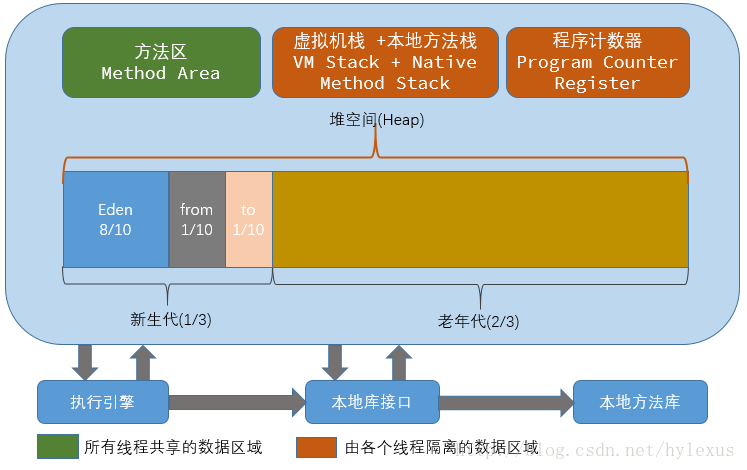

# JDK8 JVM的内存分配

另一个参考： https://www.cnblogs.com/sunankang/p/14396244.html


从JDK8开始，JVM废弃了永久代（PermGen），使用了元空间（metaspace）

## 背景

### JDK8之前的JVM永久代（PermGen）在哪里

JDK8之前的HotSpot JVM的结构（*虚拟机栈与本地方法栈合在一起*）如下：



​                                                            HotSpot JVM结构（JDK8以前）

从上图可以看出，方法区（Method Area）与Heap堆都是线程共享的内存区域。

在HotSpot JVM中，就来讨论**永久代**，就是上图的方法区（JVM规范中称为方法区，左上角的绿色方块）。《Java虚拟机规范》只是规定了有方法区这个概念和它的作用，并没有规定如何去实现它。所以，在其他的JVM（比如JRockit VM，IBM J9 VM）不存在永久代。

### JDK8 JVM的内存模型

JDK8的内存模型的变化：


​                                                            JDK8 JVM的内存结构

1. 新生代：Eden + From Servivor + To Servivor
2. 老年代：OldGen
3. 永久代（方法区实现）： PermGen 被MetaSpace（本地内存）替代

## 为什么废弃永久代

### 官方动机

移除永久代是为了融合HotSpot JVM与JRockit VM而做的努力，因为JRockit没有永久代，不需要配置。

原文如下：

> This is part of the JRockit and Hotspot convergence effort. JRockit customers do not need to configure the permanent generation (since JRockit does not have a permanent generation) and are accustomed to not configuring the permanent generation.

### 现实原因

我们以前经常遇到的OOM（java.lang.OutOfMemoryErr:PermGen）就是因为永久代不够用，或者有内存泄露造成的。

## 理解元空间

### 元空间大小

**方法区主要用于存储类的信息、常量池、方法数据、方法代码**等。方法区逻辑上属于**堆**的一部分，但是为了与堆进行区分，通常又称为“非堆”。

**元空间的本质**和永久代类似，**都是对JVM规范中方法区的实现**。不过，元空间与永久代之间最大的区别在于：**元空间并不在虚拟机中，而是使用了本地内存**。所以，元空间可以使用的内存大小，理论上，取决于32位/64位系统可虚拟的内存大小。

#### 常用的配置参数

##### MetaspaceSize

**初始Metaspace大小** 。此参数用于设置初始化的metaspace大小，控制元空间发生GC的阈值。GC后，动态增加或降低Metaspace Size。在默认的情况下，这个值大小根据不同的平台在12M到20M浮动。使用 

```shell
java -XX:+PrintFlagsInitial
```

 命令，可以查看机器上初始化的参数值。

##### MaxMetaspaceSize

**最大Metaspace大小** 。 此参数用于设置Metaspace增长的上限，防止因为某些情况导致Metaspace无限地使用本地内存，影响到其他程序。默认的值为4294967295B（大约4096MB）。

##### MinMetaspaceFreeRatio

**最小空闲比** 。 当进行过**Metaspace GC后**，会计算当前Metaspace的**空闲空间比**。如果空闲比 **小于\(\<\)** 这个参数值（即实际非空闲占比过大，内存不够用），那么JVM将增长Metaspace大小。**默认值是40，即40%。**

设置该参数可以控制Metaspace的增长速度，太小的值会导致Metaspace增长缓慢，Metaspace的使用逐渐趋于饱和，可能会影响之后类的加载。而太大又会导致Metaspace增长过快，浪费内存。

##### MaxMetaspaceFreeRatio

**最大空闲比** ，同MixMetaspaceFreeRatio作用类似。GC之后计算了空闲比，如果比值 **大于\(\>\)** 这个参数值，那么JMV将会释放Metaspace的部分空间。**默认值是70，即70%。**

##### MaxMetaspaceExpansion

Metaspace增长时的最大幅度，即每次增长的内存大小不能 **超过\(\>\)** 这个参数设置的值。默认值是5452592B（大约为5MB）。

##### MinMetaspaceExpansion

Metaspace增长时的最小幅度。即每次增长的内存大小不能 **小于\(\<\)** 这个参数设置的值。默认值为340784B（大约330KB为）。


## 方法区内部结构

虽然方法区已经被Metaspace取代，但是功能没有变化，只是被移到了元空间中。方法区主要的存储的数据信息如下：

### 类型信息

对每个加载的类型（类Class、接口Interface、枚举enum、注解annotation），JVM 必须在方法区存储以下的类型信息：

* 类型的完整有效名称、全限定名
* 类型直接父类的全限定名
* 类型的修饰符（public、abstract、final的某个子集）
* 类型**直接**接口的一个**有序**列表

### 域（Field）信息（属性、字段）

* JVM 必须在方法区中保存类型的所有域的相关信息，以及域的声明顺序
* 域的相关信息包括：域名城、域类型、域修饰符 (public、private、protected、static、final、volatile、transient的某个子集)

### 方法（method）信息

JVM 必须保存所有方法的以下信息，同域信息一样包括声明顺序：

* 方法名称
* 方法的返回类型（或 void）
* 方法参数的属性和类型，顺序
* 方法的修饰符（public、private、protected、static、final、synchronized、native、abstract的子集）

### non-final的类变量

类变量，就是静态变量。静态类变量和类关联在一起，随着类的加载而加载，它们成为类数据在逻辑上的一部分，类变量被类所有实例共享，即使没有类实例，也可以访问。

### 全局常量（static final）

被声明为static final 的类变量处理方式则不同，每个全局变量**在编译的时候就会被分配了**。

### 运行时常量池

* 运行时常量（Runtime Constant Pool）是方法区的一部分
* 常量池表（Constant Pool Table）是 Class 文件的一部分，用于存放编译期间生成的各种字面量与符号引用，这部分内容将在类加载后存放到方法区的运行时常量池中
* 当类和接口加载到虚拟机后，就会创建对应的运行时常量池
* JVM 为每个已加载的类型（类或接口）都维护一个常量池，池中的数据项像数组项一样，是通过索引访问的
* 运行时常量池中包含多种不同的常量，包括编译期间就已经明确的数值字面量，也包括到运行期解析后才能获得的方法或者字段引用。此时不再是常量池中的符号地址，这里转换为真实的地址
  * 运行时常量池对比 Class 文件的常量池的另一个重要特性是具备动态性
* 运行时常量池类似于传统编程语言的符号表，但是它所包含的数据却比符号表要更加丰富
* 当创建接口或类的运行时常量池时，如果构造运行时常量池所需的内存空间超过了方法区能提供的最大空间，JVM 就会抛出 OOM 异常

