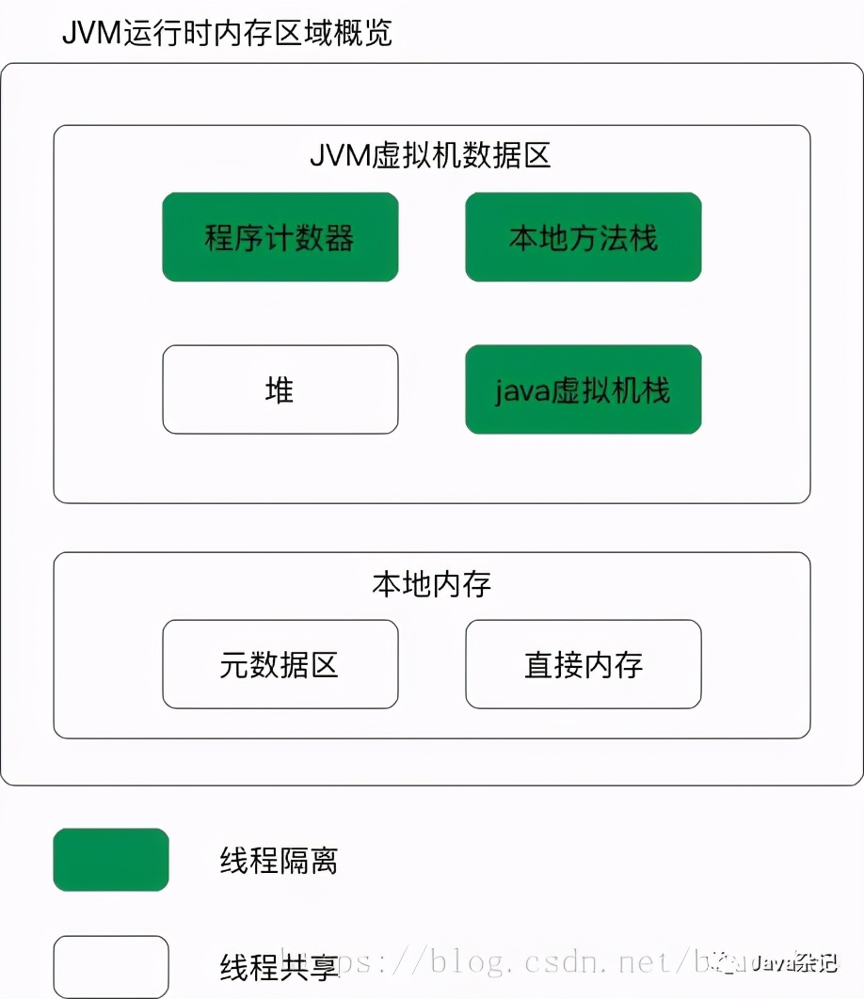
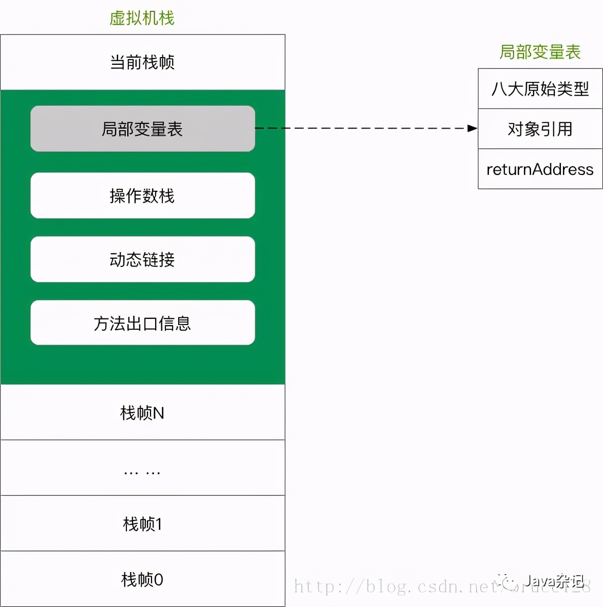
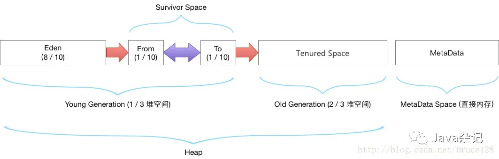

# JDK1.8 JVM运行时数据区域划分

原文：https://www.toutiao.com/i6972399540460732942/


### 目录

1. JDK1.8 JVM运行时内存区域概览
2. 各区域介绍


## 一. JDK1.8 JVM运行时内存区域概览



​        主要是介绍JDK1.8的JVM运行时数据区域划分。1.8和1.7对比，最大的差异就是：**元数据区**取代了**永久代**。*元空间的本质和永久代类似，都是对JVM规范中，方法区的实现*。不过，元空间与永久代之间**最大的区别在于：元数据空间并不在虚拟机中，而是使用了本地内存**。

## 二. 各区域介绍

### 2.1 程序计数器

​        每个线程一块，指向当前线程正在执行的字节码代码的行号。如果当前线程执行的是native方法，则其值为null。

### 2.2 Java虚拟机栈



​        **线程私有，每个线程对应一个Java虚拟机栈，其生命周期与线程同进同退**。每个Java方法在被调用的时候都会创建一个栈帧，并入栈。一旦完成调用，则出栈。所有的栈帧都出栈后，线程也就完成了使命。

### 2.3 本地方法栈

​        功能与Java虚拟机栈十分相似。区别在于，**本地方法栈为虚拟机使用到的native方法服务**。

### 2.4 堆



​        **堆**，是JVM内存占用最大，管理最复杂的一个区域。其**唯一的用途就是存放对象实例**：**几乎所有的对象实例及数组都在堆上进行分配**。JDK1.7后，字符串常量池也从永久代中剥离出来，存放在堆中。堆，有自己进一步的内存分块划分，按照GC分代收集角度的划分，请参考上面的图。

#### 2.4.1 堆空看内存分配（默认情况）

* 老年代：三分之二的堆空间
* 年轻代：三分之一的堆空间
* eden区：8/10的年轻代空间
* Survivor0: 1/10的年轻代空间
* Survivor1: 1/10的年轻代空间

​        命令行上执行如下命令，查看所有默认的JVM参数：

```shell
java -XX:+PrintFlagsFinal -version
```

​        **输出**：输出有大几百行，截取其中两个有关联的参数：

> ```shell
> [Global flags]
>     uintx InitialSurvivorRatio                      = 8                                   {product}
>     uintx NewRatio                                  = 2                                   {product}
>     ... ...
> java version "1.8.0_91"
> Java(TM) SE Runtime Environment (build 1.8.0_91-b14)
> Java HotSpot(TM) 64-Bit Server VM (build 25.91-b14, mixed mode)
> ```

​        **参数解释**

```shell
-XX:InitialSurvivorRatio  - 新生代Eden/Survivor空间的初始比例
-XX:Newratio              - Old区 和 Yong区 的内存比例
```

​        **推算**

​       默认参数下，如果仅给出eden区40M，求堆空间大小：

> ```
> 根据比例可以推算出，两个survivor区各5M，年轻代50M。老年代是年轻代的两倍，即100M。那么堆总大小就是150M。
> ```

#### 2.4.2 字符串常量池

​        JDK1.7 就开始了“去永久代”的工作了。JDK1.7 把字符串常量池从永久代中剥离出来，存放在堆空间中。

* **JVM参数配置**

  ```shell
  -XX:MaxPermSize=10m
  -XX:PermSize=10m
  -Xms100m
  -Xmx100m
  -XX:-UseGCOverheadLimit
  ```

* **测试代码**

  ```java
  public class StringOomMock {
    
    public static void main(String[] args) {
      try {
        List<String> list = new ArrayList<String>();
        for (int i = 0; ; i++) {
          System.out.println(i);
          list.add(String.valueOf("String" + i++).intern());
        }
      } catch (java.lang.Exception e) {
        e.printStackTrace();
      }
    }
  }
  ```

* **JDK1.6下运行结果**

  JDK1.6 环境是出现**永久代OOM**：

  > ```shell
  > 153658
  > 153660
  > Exception in thread "main" java.lang.OutOfMemoryError: PermGen space
  >   at java.lang.String.intern(Native Method)
  >   at com.jd.im.StringOomMock.main(StringOomMock.java:17)
  > ```

* **JDK1.7下运行结果**

  JDK1.7下是出现**堆OOM**，并伴随频繁的FullGC，CPU一直高位运行

  > ```shell
  > 2252792
  > 2252794
  > 2252796
  > 2252798
  > *** java.lang.instrument ASSERTION FAILED ***: "!errorOutstanding" with message can't create name string at ../../../src/share/instrument/JPLISAgent.c line: 807
  > Exception in thread "main" java.lang.OutOfMemoryError: Java heap space
  >   at java.nio.CharBuffer.wrap(CharBuffer.java:369)
  >   at sun.nio.cs.StreamEncoder.implWrite(StreamEncoder.java:265)
  >   at sun.nio.cs.StreamEncoder.write(StreamEncoder.java:125)
  >   at java.io.OutputStreamWriter.write(OutputStreamWriter.java:207)
  >   at java.io.BufferedWriter.flushBuffer(BufferedWriter.java:129)
  >   at java.io.PrintStream.write(PrintStream.java:526)
  >   at java.io.PrintStream.print(PrintStream.java:597)
  >   at java.io.PrintStream.println(PrintStream.java:736)
  >   at com.jd.im.StringOomMock.main(StringOomMock.java:16)
  > ```

* **JDK1.8下运行结果**

  JDK1.8 运行结果同1.7，是**堆空间OOM**：

  > ```shell
  > 2236898
  > 2236900
  > 2236902
  > Exception in thread "main" java.lang.OutOfMemoryError: Java heap space
  >   at java.lang.Integer.toString(Integer.java:403)
  >   at java.lang.String.valueOf(String.java:3099)
  >   at java.io.PrintStream.print(PrintStream.java:597)
  >   at java.io.PrintStream.println(PrintStream.java:736)
  >   at com.jd.im.StringOomMock.main(StringOomMock.java:16)
  > ```

### 2.5 元数据区

​        元数据区取代了JDK1.7版本及以前的永久代。**元数据区和永久代本质上都是方法区的实现**。<font color='red'>**方法区存放虚拟机加载的类信息，静态变量，常量等数据**</font>。

#### 2.5.1 元数据OOM测试

* **JVM参数配置**

  > ```shell
  > -XX:MetaspaceSize=8m 
  > -XX:MaxMetaspaceSize=50m
  > ```

* **测试代码**

  借助cglib框架生成新类：

  ```java
  public class MetaSpaceOomMock {
    
    public static void main(String[] args) {
      ClassLoadingMXBean loadingBean = ManagementFactory.getClassLoadingMXBean();
      while (true) {
        Enhancer enhancer = new Enhancer();
        enhancer.setSuperclass(MetaSpaceOomMock.class);
        enhancer.setCallbackTypes(new Class[]{Dispatcher.class, MethodInterceptor.class});
        enhancer.setCallbackFilter(new CallbackFilter() {
          @Override
          public int accept(Method method) {
            return 1;
          }
          
          @Override
          public boolean equals(Object obj) {
            return super.equals(obj);
          }
        });
        
        Class clazz = enhancer.createClass();
        System.out.println(clazz.getName());
        //显示数量信息（共加载过的类型数目，当前还有效的类型数目，已经被卸载的类型数目）
        System.out.println("total: " + loadingBean.getTotalLoadedClassCount());
        System.out.println("active: " + loadingBean.getLoadedClassCount());
        System.out.println("unloaded: " + loadingBean.getUnloadedClassCount());
      }
    }
  }
  ```

* **运行结果输出**

  > ```shell
  > jvm.MetaSpaceOomMock$$EnhancerByCGLIB$$567f7ec0
  > total: 6265
  > active: 6265
  > unloaded: 0
  > jvm.MetaSpaceOomMock$$EnhancerByCGLIB$$3501581b
  > total: 6266
  > active: 6266
  > unloaded: 0
  > Exception in thread "main" net.sf.cglib.core.CodeGenerationException: java.lang.reflect.InvocationTargetException-->null
  >   at net.sf.cglib.core.AbstractClassGenerator.generate(AbstractClassGenerator.java:345)
  >   at net.sf.cglib.proxy.Enhancer.generate(Enhancer.java:492)
  >   at net.sf.cglib.core.AbstractClassGenerator$ClassLoaderData$3.apply(AbstractClassGenerator.java:93)
  >   at net.sf.cglib.core.AbstractClassGenerator$ClassLoaderData$3.apply(AbstractClassGenerator.java:91)
  >   at net.sf.cglib.core.internal.LoadingCache$2.call(LoadingCache.java:54)
  >   at java.util.concurrent.FutureTask.run(FutureTask.java:266)
  >   at net.sf.cglib.core.internal.LoadingCache.createEntry(LoadingCache.java:61)
  >   at net.sf.cglib.core.internal.LoadingCache.get(LoadingCache.java:34)
  >   at net.sf.cglib.core.AbstractClassGenerator$ClassLoaderData.get(AbstractClassGenerator.java:116)
  >   at net.sf.cglib.core.AbstractClassGenerator.create(AbstractClassGenerator.java:291)
  >   at net.sf.cglib.proxy.Enhancer.createHelper(Enhancer.java:480)
  >   at net.sf.cglib.proxy.Enhancer.createClass(Enhancer.java:337)
  >   at jvm.MetaSpaceOomMock.main(MetaSpaceOomMock.java:38)
  > Caused by: java.lang.reflect.InvocationTargetException
  >   at sun.reflect.GeneratedMethodAccessor1.invoke(Unknown Source)
  >   at sun.reflect.DelegatingMethodAccessorImpl.invoke(DelegatingMethodAccessorImpl.java:43)
  >   at java.lang.reflect.Method.invoke(Method.java:498)
  >   at net.sf.cglib.core.ReflectUtils.defineClass(ReflectUtils.java:413)
  >   at net.sf.cglib.core.AbstractClassGenerator.generate(AbstractClassGenerator.java:336)
  >   ... 12 more
  > Caused by: java.lang.OutOfMemoryError: Metaspace
  >   at java.lang.ClassLoader.defineClass1(Native Method)
  >   at java.lang.ClassLoader.defineClass(ClassLoader.java:763)
  >   ... 17 more
  > ```

​        如果是JDK1.7，那么报OOM的将是PermGen区域。

### 2.6 直接内存

​        JDK1.4引入NIO，它可以使用Native函数直接分配堆外内存。

