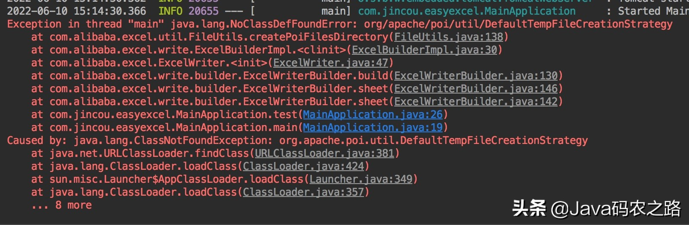
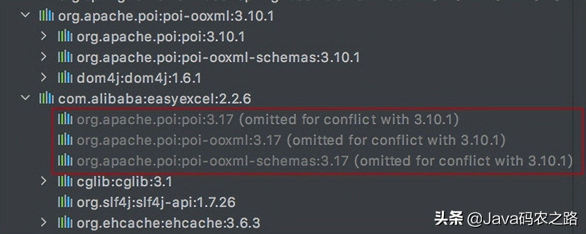
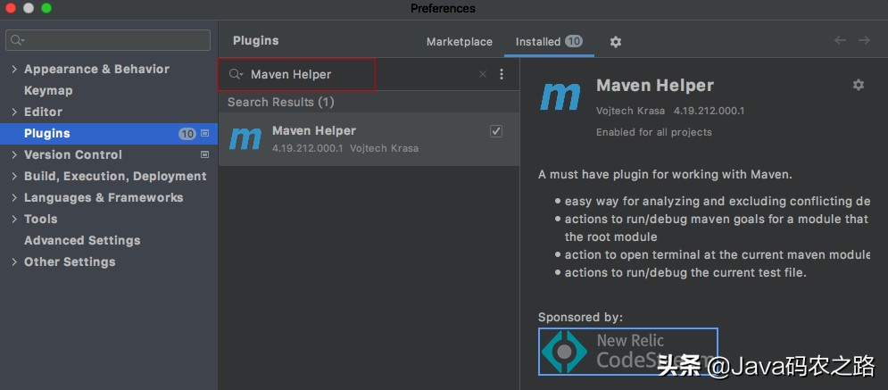
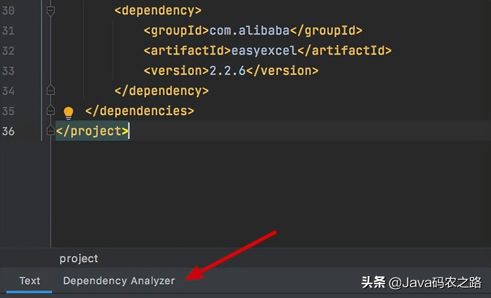
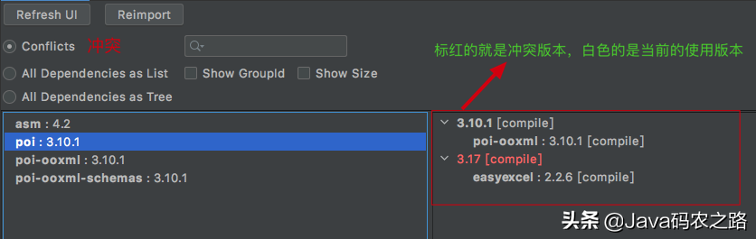
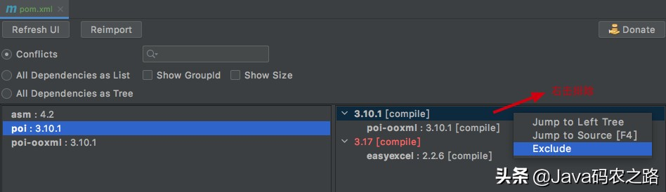

# 解决Mave依赖冲突

原文：https://www.toutiao.com/article/7109462481701175808/


## 一. 前言

### 什么是依赖冲突

依赖冲突是指项目依赖的某一个 jar 包有多个不同的版本，因而造成了包版本冲突。


### 依赖冲突的原因

在 Maven项目中的 pom 中一般会引用许多 dependency。例如，项目A有这样的依赖关系：

``` shell
A -> C -> X(1.0)
B -> D -> X(2.0)
```

X 是 A 的传递性依赖，但是两条依赖路径上有两个版本的 X，那么哪个 X 会被 Maven 解析使用呢？两个版本都被解析显然是不对的，因为那样会造成依赖重复，因此必须选择一个。

至于怎么选择肯定有它的规则，这里先假设最终引用的是 X(1.0) 版本，这样会不会有问题呢？

**答案是肯定的：会有问题**

1. 如果 B 引用 X(2.0) 的新创建类，但是因为最终被解析的是 X(1.0)，就会出现很典型的 NoClassDefFoundError 或者 ClassNotFound Exception 错误
2. 如果 B 引用 X(2.0) 的新创建的方法，但是因为最终被解析的是 X(1.0) ，所以就会抛出 NoSuchMethodError 系统异常

但换个角度，最终解析的是 X(2.0) 就没问题了吗？

**答案是：不一定**

1. 如果 X(2.0) 删除了 X(1.0) 的一些类，但是 A 已经引用了，同样也会报 NoClassDefError 或者 ClassNotFoundException 错误
2. 如果 X(2.0) 删掉了 X(1.0) 的一些方法，且A 已经引用了，同样也会报 NoSuchMethodError 错误

所以说具体问题具体分析，到底采用哪个版本还需要看实际项目。也可能需要升级对应的 A 或者 B 才能解决问题。


如果有两个版本的 X，Maven 是依据什么原则来选择的呢？

## 二. Maven 依赖原则

Maven 依赖主要有两大原则。

### 2.1 路径最近者优先

相同的 Jar 不同版本，根据依赖的路径长短来解决引入哪个依赖。例如：

``` shell
依赖路径一： A -> B -> C -> X(1.0)
依赖路径二： F -> D -> X(2.0)
```

该例子中，X(1.0) 的路径长度为3， 而 X(2.0) 的路径长度为2， 因此 X(2.0) 会被解析使用。依赖调解第一原则不能解决所有问题，比如这样相同长度路径的依赖关系：

``` shell
依赖路径一： A -> B -> Y(1.0)
依赖路径二： C -> D -> Y(2.0)
```

Y(1.0) 和 Y(2.0) 具有相同的依赖路径长度。此时就需要用到依赖调解第二原则。

### 2.2 第一声明者优先

在依赖路径长度相等的前提下，在POM中依赖声明的顺序决定了谁会被解析使用。**顺序最前的那个依赖优胜**。该示例中，如果 A 的依赖声明在 C 之前，那么 Y(1.0) 就会被解析使用。

注意，**子POM 内声明的优先于父POM中的依赖。**

## 三. 如何排除依赖

需要先解释一下什么是**传递性依赖**。

### 3.1 传递性依赖

项目中，引用了 A 的依赖，A的依赖通常又会引入 B 的 Jar 包，B 可能还引入 C 的 Jar包。

这样，当在 POM 文件中添加了 A 的依赖，Maven 会自动把所有相关依赖都添加进来。

这里举个例子，比如为了实现导入导出功能，肯能会引入POI：

``` xml
<dependency>
     <groupId>org.apache.poi</groupId>
     <artifactId>poi-ooxml</artifactId>
     <version>3.10.1</version>
</dependency>
```

当引入POI的时候，它其实还会引入其他的Jar包：

``` xml
<dependencies>
    <dependency>
       <groupId>org.apache.poi</groupId>
       <artifactId>poi</artifactId>
       <version>3.10.1</version>
    </dependency>
    <dependency>
      <groupId>org.apache.poi</groupId>
      <artifactId>poi-ooxml-schemas</artifactId>
      <version>3.10.1</version>
    </dependency>
    <dependency>
        <groupId>dom4j</groupId>
        <artifactId>dom4j</artifactId>
        <version>1.6.1</version>
    </dependency>
</dependencies>
```

就这样一层层的，Maven 会自动把所有相关的依赖都添加进来。传递性依赖会给项目引入很多依赖，简化项目依赖管理，但是也会带来问题。

最明显的问题就是容易发生依赖冲突。

### 3.2 如何排除依赖

使用关键字：***exclusions*** 和 ***exclusion***

exclusions 可以包含一个或者多个 exclusion 子元素。因此可以排除一个或者多个传递性依赖。

需要注意的是，声明 exlusion 的时候只需要 ***groupId*** 和 ***artifactId*** ，而不需要 version 元素。例如：

``` xml
<dependency>
        <groupId>org.apache.poi</groupId>
        <artifactId>poi-ooxml</artifactId>
        <version>3.10.1</version>
            <!--排除poi依赖-->
        <exclusions>
            <exclusion>
                <artifactId>poi</artifactId>
                <groupId>org.apache.poi</groupId>
             </exclusion>
        </exclusions>
</dependency>
```


## 四. 实例演示如何解决依赖冲突

先来举个有冲突的例子。

### 4.1 制造依赖冲突

在项目中，即引用了 org.apache.poi，又引用了 com.alibaba 的 easyexcel。POM如下：

``` xml
   <dependency>
        <groupId>org.apache.poi</groupId>
        <artifactId>poi-ooxml</artifactId>
        <version>3.10.1</version>
   </dependency>
   <dependency>
        <groupId>com.alibaba</groupId>
        <artifactId>easyexcel</artifactId>
        <version>2.2.8</version>
   </dependency>
```

然后在项目中添加如下代码：

``` java
@SpringBootApplication
public class MainApplication {
	public static void main(String[] args) {
		SpringApplication.run(MainApplication.class, args);
		test();

	}
	public static void test() {
		//1.获取文件地址
		String fileName = "/excel/test.xlsx";
		//2、调用easyExcel里面的方法实现写操作
		EasyExcel.write(fileName, UserDto.class)
            .sheet("某某报表")
            .doWrite(new ArrayList<>());
	}
}
```

发现在 SpringBoot 启动时出现 NoClassDefFoundError 异常：



这就是依赖冲突导致的异常报错。

为什么会这样呢？可以通过 IDEA 看一下，打开 maven 菜单，点击 “show dependencies”：



看到这里大致明白，因为当前的 easyexcel 引入的 poi 是3.17版本，但是根据 maven依赖原则，实际引入的poi版本是3.10.1版本。

而 DefaultTempFileCreationStrategy 这个类在3.10.1 版本中是没有的，只有 3.17 版本才有。所以报了这个错误。

然后再来思考一个问题：上面这个案例一眼就知道是最终应用哪个依赖里的哪个版本，但如果项目中依赖许许多多的jar，肉眼排查就没那么方便了，这里推荐一个Maven管理插件。

### 4.2 Maven Helper 插件分析 jar 包冲突

选择并下载插件：



在 pom 文件中看到 dependency analyzer 标志，说明 manve helper 插件安装成功。



点击 dependency analyzer 之后就会进入到下面的页面：



从图中能看到有哪些jar存在冲突，存在冲突的情况下最终采用哪个依赖的版本。**标红的就是版本冲突，白色的是当前的解析版本**。

如果想保留标红的版本，可以表白区域右击选择**排除（Exclude）**



然后再看看POM文件，发现在 org.apache.poi 中已经移除了 poi 了：

``` xml
<dependency>
       <groupId>org.apache.poi</groupId>
       <artifactId>poi-ooxml</artifactId>
       <version>3.10.1</version>
       <exclusions>
          <exclusion>
             <artifactId>poi</artifactId>
             <groupId>org.apache.poi</groupId>
           </exclusion>
       </exclusions>
    </dependency>
    <dependency>
       <groupId>com.alibaba</groupId>
       <artifactId>easyexcel</artifactId>
       <version>2.2.6</version>
    </dependency>
```

此时再来看看最终引用的POI是哪个版本（图有错，不引用了）。

## 五. 总结

**一般在解决依赖冲突的时候，都会选择保留jar高的版本**，因为大部分jar在升级的时候都会做到向下兼容，所以只要保留高的版本就不会有什么问题。

但是有些包，版本变化大没法去做向下兼容，高版本删了低版本的某些类或者某些方法，那么这个时候就不能一股脑的去选择高版本，但也不能选择低版本。

就比如下面这个案例

``` xml
依赖链路一：A -> B -> C -> X(1.0)
依赖链路二：F -> D -> X(2.0)
```

X(2.0) 没有对 X(1.0) 做向下兼容也就是说可能存在排除哪个都不行，那怎么办?只能考虑升级A的版本或者降低F的版本。比如A升级到A(2.0),使它依赖的X版本，变成X(2.0)这样的话就解决依赖冲突。

但话有说回来 A升级到A(2.0) 可能会影响许许多多的地方，比如自己项目中代码是否需要改变，或者因为 A升级到A(2.0) 导致 B和C的版本有所改变，这些影响点都需要考虑的。所以说为什么说一个大型项目稳定后，pom文件的升级是件繁琐的事情，那是因为考虑的东西是在太多了，稍有不慎就会因为依赖冲突而导致系统报错。

