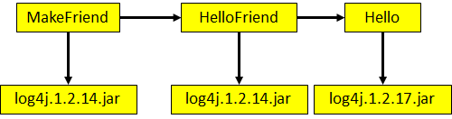
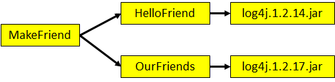

# Maven 依赖的传递性

原文：https://www.toutiao.com/i6989794597526405668/?group_id=6989794597526405668

## 依赖的传递性

​        当存在间接依赖的情况时，主工程对间接依赖的 jar 可以访问吗？这要看间接依赖的 jar 包引入时的依赖范围，只有依赖范围是 compile 时，才可以访问。参考下表：

<table>
    <tr>
      <th colspan="3">Maven工程</th>
      <th>依赖范围</th>
      <th>对A可见性</th>
    </tr>
    <tr>
      <td rowspan="3">A</td>
      <td rowspan="3">B</td>
      <td>C</td>
      <td>compile</td>
      <td>可见</td>
    </tr>
    <tr>      
      <td>D</td>
      <td>test</td>
      <td>不可见</td>
    </tr>
    <tr>      
      <td>E</td>
      <td>provided</td>
      <td>不可见</td>
    </tr>
</table>

## 依赖原则：解决 jar 包冲突

### 1. 路径最短者优先

### 2. 路径相同时，先声明者优先

注：这里的“声明”的先后顺序指的是：***dependency标签配置的先后顺序***