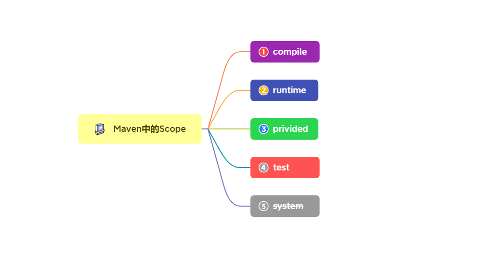

# Maven 依赖的作用域

原文：https://www.toutiao.com/article/7124135039881118223/?log_from=60600532a760d_1659145725148

Maven是目前Java开发主要使用的依赖管理构建工具之一。但是很多人在引用依赖的时候直接引用坐标，而没有考虑依赖的作用范围，结果导致出现这样那样的问题。

### 要选择正确的 scope

scope 是Maven 坐标的一个关键字，它主要用来限制依赖的作用域。它有物种类型：

#### compile

大部分情况下使用这个作用域。它也是 Maven 默认的 scope。这个作用域表示**该依赖从Java代码编译、测试以及运行**这些环节都会参与。

#### runtime

此作用域，只参与运行时，跳过了编译阶段。当然，它打 fat jar时也会像 compile 一样打包。

比如常用到的数据库驱动，一般都是 runtime 的scope。

#### provided

这个作用域表示，系统 JDK 和容器运行时提供对应的依赖库，自己不引入，仅仅使用这个依赖。在一些通用规范和插件扩展使用该选项比较普遍。举个例子，servlet api 希望 Servlet 容器提供，但是在代码里，还希望去调用 HttpServletRequest 这类的API，此时就可以用 provided。

还有一个场景。例如自己开发一个针对某个类库 A 的扩展类库 B。那么在类库B中肯定要引用到A。如果不使用 provided，当开发完扩展类库 B，直接引用 B就能使用完整的功能；如果开发类库B时使用了 provided，当需要用到B时，就需要同时引用 A 和 B。为什么要这样做呢？因为这样做可以让扩展类库更加纯粹，仅仅提供扩展功能，而不干涉主类库的功能，彻底的插件化。

**provided 声明的类库不会被打包**。

#### system

system 这个scope 与 provided 正好相反。 provided 是要求别人提供，而 system 则是不要求别人不提供而是自己提供，Maven 不会在本地存储库中查找。使用 system 的大部分没有托管在 Maven 中央仓库和私有仓库，另外 **provided 不会被打包，知识申明一个调用关系，system 会被打包**。

#### test

#### optional

optional 不是 scope 的一个选项，而是一个关键字。它的选项是布尔值（true ｜ false）。这里要说一下，是因为它也能控制依赖的作用域，只不过它的场景和上面的不一样。它用来声明依赖是否是可选的（optional）而不向上传递。

来举一个例子，自己开发了一个类库，使用了**lombok**。但是很多开发者很反感**lombok**，一看这个类库里面用**lombok**他们就不用了。为了推广这个类库，肯定要想办法照顾这一部分人，所以就让**lombok**的**optional**值设置为true。这样不耽误类库中**lombok**注解的使用，也不影响使用了类库的开发者。可以去看看**Spring Boot Starter**，里面使用了大量的**optional**。

#### 注意：

要注意和**provided**的区别，**provided**是这个库一定要用，但是不提供使用到的这个类库，需要JDK或者容器提供；**optional**是这个库也要用，但使用可以不引用。