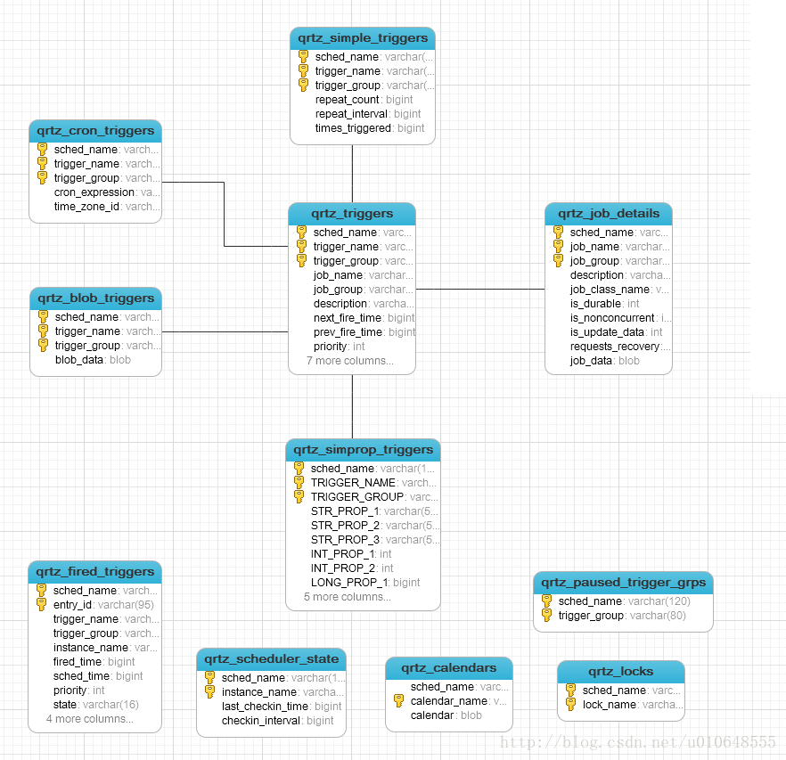
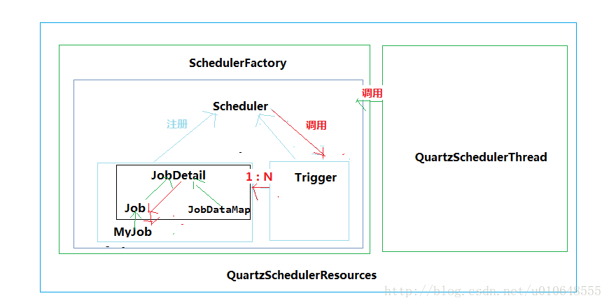

# Quartz介绍

原文： https://aflyun.blog.csdn.net/article/details/54863144


## 一. 介绍

​        Quartz是OpenSymphony开源组织在Job scheduling领域又一个开源项目，是完全由java开发的一个开源的任务日程管理系统，“任务进度管理器”就是一个在预先确定（被纳入日程）的时间到达时，负责执行（或者通知）其他软件组件的系统。
​        Quartz用一个小Java库发布文件（.jar文件），这个库文件包含了所有Quartz核心功能。这些功能的主要接口(API)是Scheduler接口。它提供了简单的操作，例如：将任务纳入日程或者从日程中取消，开始/停止/暂停日程进度。

## 二. 定时器种类

​        Quartz中有五种类型的触发器：

* SimpleTrigger
* CronTrigger
* DateIntervalTrigger
* NthIncludedDayTrigger
* org.quartz.Calendar 类

​        常用的触发器：

* SimpleTrigger：用来触发只执行一次，或者在给定的时间触发并重复N次，且每次执行延迟一定时间的任务
* CronTrigger：按照日历触发，例如：每个周五、每个月10号中午12:13分，等等。类似Linux的Cron

## 三. 存储方式

​        采用两种方式存储定时任务的信息：

* RAMJobStore
* JDBCJobStore

​        这两种方式的优缺点如下表：

| 类型         | 优点                                                         | 缺点                                                         |
| ------------ | ------------------------------------------------------------ | ------------------------------------------------------------ |
| RAMJobStore  | 不要外部数据库，配置容易，运行速度快                         | 因为调度程序信息是存储在被分配给JVM的内存里面，所以，当应用程序停止运行时，所有调度信息将被丢失。另外因为存储到JVM内存里面，所以可以存储多少个Job和Trigger将会受到限制 |
| JDBCJobStore | 支持集群，因为所有信息都会保存到数据库中，可以控制事物，还有就是，如果应用服务器关闭或者重启，任务信息都不会丢失，并且可以恢复因服务器关闭或者重启而导致执行失败的任务 | 运行速度相对较慢                                             |

## 四. Quartz的表的ER

​        Quartz的表关系图



​        各个表的说明

| 表名                      | 说明                                                         |
| ------------------------- | ------------------------------------------------------------ |
| qrtz_blob_triggers        | Trigger作为Blob类型存储(用于Quartz用户用JDBC创建他们自己定制的Trigger类型，JobStore 并不知道如何存储实例的时候) |
| qrtz_calendars            | 以Blob类型存储Quartz的Calendar日历信息， quartz可配置一个日历来指定一个时间范围 |
| qrtz_cron_triggers        | 存储Cron Trigger，包括Cron表达式和时区信息                   |
| qrtz_fired_triggers       | 存储与已触发的Trigger相关的状态信息，以及相联Job的执行信息   |
| qrtz_job_details          | 存储每一个已配置的Job的详细信息                              |
| qrtz_locks                | 存储程序的非观锁的信息(假如使用了悲观锁)                     |
| qrtz_paused_trigger_graps | 存储已暂停的Trigger组的信息                                  |
| qrtz_scheduler_state      | 存储少量的有关 Scheduler的状态信息，和别的 Scheduler 实例(假如是用于一个集群中) |
| qrtz_simple_triggers      | 存储简单的 Trigger，包括重复次数，间隔，以及已触的次数       |
| qrtz_triggers             | 存储已配置的 Trigger的信息                                   |
| qrtz_simprop_triggers     |                                                              |


## 五. 核心类和关系

### 5.1 核心类

* QuartzSchedulerThread：负责执行在QuartzScheduler注册的Trigger工作的线程
* ThreadPool：Scheduler使用一个线程池作为任务运行的基础设施，任务通过共享线程池中的线程提供运行效率
* QuartzSchdulerResources：包含创建QuartzScheduler实例所需的所有资源（JobState、ThreadPool等）
* SchedulerFactory：提供用于获取调度程序实例的客户端可用句柄的机制
* JobStore：通过类实现的接口，这些类要为org.quartz.core.QuartzScheduler的使用提供一个org.quartz.Job和org.quartz.Trigger存储机制。作业和触发器的存储应该以其**名称和组的组合**为唯一性
* QuartzScheduler：这是Quartz的核心，它是org.quartz.Scheduler接口的间接实现，包含调度org.quartz.Jobs，注册org.quartz.JobListener实例等的方法
* Scheduler：这是Quartz Scheduler的主要接口，代表一个独立运行容器。调度程序维护JobDetails和触发器的注册表。 一旦注册，调度程序负责执行作业，当他们的相关联的触发器触发（当他们的预定时间到达时）
* Trigger：具有所有触发器通用属性的基本接口，描述了job执行的时间出发规则。 - 使用TriggerBuilder实例化实际触发器
* JobDetail：传递给定作业实例的详细信息属性。 JobDetails将使用JobBuilder创建/定义
* Job：要由表示要执行的“作业”的类实现的接口。只有一个方法 void execute(jobExecutionContext context)
  (jobExecutionContext 提供调度上下文各种信息，运行时数据保存在jobDataMap中)
* StatefulJob：Job的子接口，代表有状态任务。有状态任务不可并发，前次任务没有执行完，后面任务处于阻塞等到

### 5.2 关系



​       一个Job可以被多个Trigger绑定，一个Trigger只能关联一个Job。

## 六. 配置文件

​        配置文件是 quartz.properties样例：

```properties
//调度标识名 集群中每一个实例都必须使用相同的名称 （区分特定的调度器实例）
org.quartz.scheduler.instanceName：DefaultQuartzScheduler
//ID设置为自动获取 每一个必须不同 （所有调度器实例中是唯一的）
org.quartz.scheduler.instanceId ：AUTO
//数据保存方式为持久化 
org.quartz.jobStore.class ：org.quartz.impl.jdbcjobstore.JobStoreTX
//表的前缀 
org.quartz.jobStore.tablePrefix ： QRTZ_
//设置为TRUE不会出现序列化非字符串类到 BLOB 时产生的类版本问题
//org.quartz.jobStore.useProperties ： true
//加入集群 true 为集群 false不是集群
org.quartz.jobStore.isClustered ： false
//调度实例失效的检查时间间隔 
org.quartz.jobStore.clusterCheckinInterval：20000 
//容许的最大作业延长时间 
org.quartz.jobStore.misfireThreshold ：60000
//ThreadPool 实现的类名 
org.quartz.threadPool.class：org.quartz.simpl.SimpleThreadPool
//线程数量 
org.quartz.threadPool.threadCount ： 10
//线程优先级 
org.quartz.threadPool.threadPriority ： 5（threadPriority 属性的最大值是常量 java.lang.Thread.MAX_PRIORITY，等于10。最小值为常量 java.lang.Thread.MIN_PRIORITY，为1）
//自创建父线程
//org.quartz.threadPool.threadsInheritContextClassLoaderOfInitializingThread： true 
//数据库别名
org.quartz.jobStore.dataSource ： qzDS
//设置数据源
org.quartz.dataSource.qzDS.driver:com.mysql.jdbc.Driver
org.quartz.dataSource.qzDS.URL:jdbc:mysql://localhost:3306/quartz
org.quartz.dataSource.qzDS.user:root
org.quartz.dataSource.qzDS.password:123456
org.quartz.dataSource.qzDS.maxConnection:10
```

## 七. JDBC插入顺序

​        主要的JDBC操作类，执行SQL的顺序如下：

```bash
Simple_trigger ：插入顺序
qrtz_job_details --->  qrtz_triggers --->  qrtz_simple_triggers --->
qrtz_fired_triggers

Cron_Trigger：插入顺序
qrtz_job_details --->  qrtz_triggers --->  qrtz_cron_triggers --->
qrtz_fired_triggers
```

