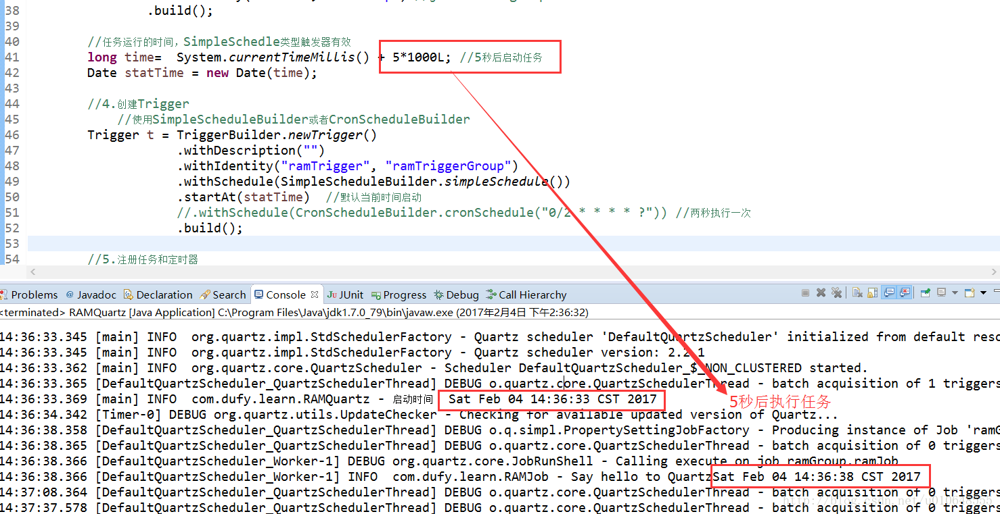
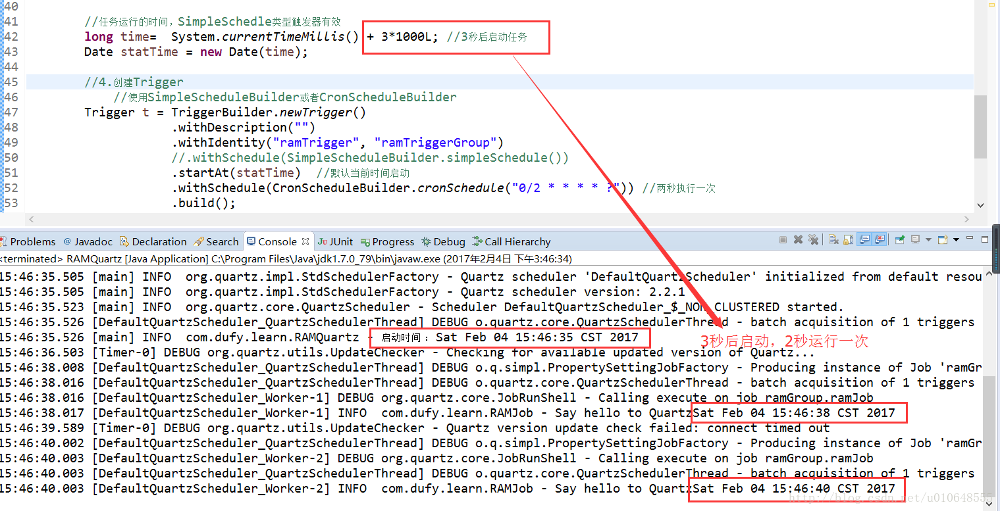
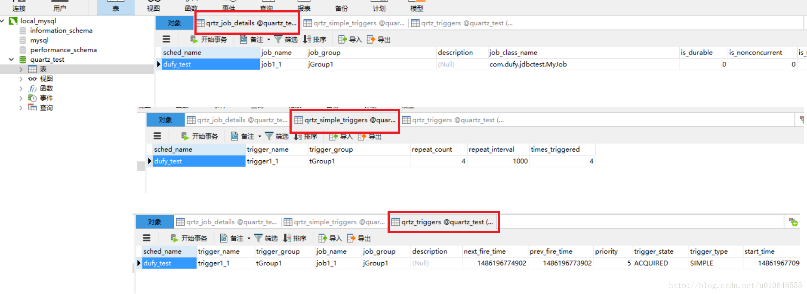
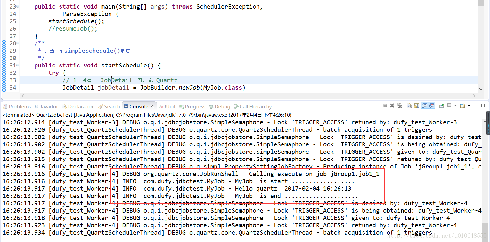

# Quartz简单样例

原文： https://blog.csdn.net/u010648555/article/details/54863394


面介绍Quartz入门的示例，**由于Quartz的存储方式分为RAM和JDBC，分别对这两种进行简单的说明。并附上代码！**
首先需要添加Quartz的Jar包 ，我使用的是quartz.2.2.1版本！

使用Maven作为包管理，添加Quartz的类库：

```properties
<!-- quartz -->
<dependency>
		 <groupId>org.quartz-scheduler</groupId>
		 <artifactId>quartz</artifactId>
		 <version>2.2.1</version>
</dependency>
<dependency>
     <groupId>org.quartz-scheduler</groupId>
     <artifactId>quartz-jobs</artifactId>
     <version>2.2.1</version>
</dependency>

```


## 一. RAM方式

### 1.1 创建Job

​        Job要执行的业务逻辑应该在这个类中完成。

```java
import java.util.Date;

import org.quartz.Job;
import org.quartz.JobExecutionContext;
import org.quartz.JobExecutionException;
import org.slf4j.Logger;
import org.slf4j.LoggerFactory;

public class RAMJob implements Job{
	
	private static Logger _log = LoggerFactory.getLogger(RAMJob.class);
	
	@Override
	public void execute(JobExecutionContext arg0) throws JobExecutionException {
		
		_log.info("Say hello to Quartz" + new Date());
	}
	
}
```

### 1.2 测试Job

​        这个应该算是使用Quartz框架启动Job的逻辑，与业务关系不大。

```java
import java.util.Date;

import org.quartz.CronScheduleBuilder;
import org.quartz.JobBuilder;
import org.quartz.JobDetail;
import org.quartz.Scheduler;
import org.quartz.SchedulerException;
import org.quartz.SchedulerFactory;
import org.quartz.SimpleScheduleBuilder;
import org.quartz.Trigger;
import org.quartz.TriggerBuilder;
import org.quartz.impl.StdSchedulerFactory;
import org.slf4j.Logger;
import org.slf4j.LoggerFactory;

/**
 * This is a RAM Store Quartz!
 *
 */
public class RAMQuartz {

	private static Logger _log = LoggerFactory.getLogger(RAMQuartz.class);
	
	public static void main(String[] args) throws SchedulerException {
		// 1.创建Scheduler的工厂
		SchedulerFactory sf = new StdSchedulerFactory();
		// 2.从工厂中获取调度器实例
		Scheduler scheduler = sf.getScheduler();
		
		//====================================
		// 3.创建JobDetail
    //====================================
		JobDetail jb = JobBuilder.newJob(RAMJob.class)
				.withDescription("this is a ram job") //job的描述
				.withIdentity("ramJob", "ramGroup") //job 的name和group
				.build();
		
		// 任务运行的时间，SimpleSchedle类型触发器有效
		long time=  System.currentTimeMillis() + 3*1000L; //3秒后启动任务
		Date statTime = new Date(time);
		
    //==================================================
		// 4.创建Trigger
		//   使用SimpleScheduleBuilder或者CronScheduleBuilder
    //==================================================
		Trigger t = TriggerBuilder.newTrigger()
					.withDescription("")
					.withIdentity("ramTrigger", "ramTriggerGroup")
					//.withSchedule(SimpleScheduleBuilder.simpleSchedule())
					.startAt(statTime)  //默认当前时间启动
					.withSchedule(CronScheduleBuilder.cronSchedule("0/2 * * * * ?")) //两秒执行一次
					.build();
		
    //================================================
		// 5.注册任务和定时器
    //   关联上业务逻辑（job）和定时逻辑（trigger）
    //================================================
		scheduler.scheduleJob(jb, t);
		
    //====================================
		// 6.启动 调度器
    //====================================
		scheduler.start();
		_log.info("启动时间 ： " + new Date());
			
	}
}
```

### 1.3 运行结果






## 二. JDBC方式

​        使用jdbc方式，就要配置quartz.properties文件，并且在开始的时候在数据库中新增表！选择数据库为mysql。

先配置JDBC连接：

```properties
#JDBC驱动
org.quartz.dataSource.qzDS.driver:com.mysql.jdbc.Driver
org.quartz.dataSource.qzDS.URL:jdbc:mysql://localhost:3306/quartz_test
org.quartz.dataSource.qzDS.user:root
org.quartz.dataSource.qzDS.password:root
org.quartz.dataSource.qzDS.maxConnection:10
```

### 2.1 MyJob

​        Job要执行的业务逻辑应该在这个类中完成。

```java
import java.text.SimpleDateFormat;
import java.util.Date;

import org.quartz.Job;
import org.quartz.JobExecutionContext;
import org.quartz.JobExecutionException;
import org.slf4j.Logger;
import org.slf4j.LoggerFactory;

public class MyJob implements Job{
	private static final Logger log = LoggerFactory.getLogger(MyJob.class);

	@Override
	public void execute(JobExecutionContext context)throws JobExecutionException {
		log.info("MyJob  is start ..................");
		
		log.info("Hello quzrtz  "+
				new SimpleDateFormat("yyyy-MM-dd HH:mm:ss ").format(new Date()));
		
		log.info("MyJob  is end .....................");
	}
}
```

### 2.2 测试类QuartzJdbcTest

```java
import java.text.ParseException;
import java.util.List;

import org.quartz.CronScheduleBuilder;
import org.quartz.CronTrigger;
import org.quartz.JobBuilder;
import org.quartz.JobDetail;
import org.quartz.JobKey;
import org.quartz.Scheduler;
import org.quartz.SchedulerException;
import org.quartz.SchedulerFactory;
import org.quartz.SimpleScheduleBuilder;
import org.quartz.SimpleTrigger;
import org.quartz.Trigger;
import org.quartz.TriggerBuilder;
import org.quartz.TriggerKey;
import org.quartz.impl.StdSchedulerFactory;

public class QuartzJdbcTest {
	
	public static void main(String[] args) throws SchedulerException,
			ParseException {
		startSchedule();
		//resumeJob();
	}
  
	/**
	 * 开始一个simpleSchedule()调度
	 */
	public static void startSchedule() {
		try {
      //==================================================
			// 1、创建一个JobDetail实例，指定Quartz
      //==================================================
			JobDetail jobDetail = JobBuilder.newJob(MyJob.class) // 任务执行类
					.withIdentity("job1_1", "jGroup1")               // 任务名，任务组 
					.build();
			
      //==================================================
			// 触发器类型
      //==================================================
			SimpleScheduleBuilder builder = 
             SimpleScheduleBuilder.repeatSecondlyForTotalCount(5); // 设置执行次数
			
      // 也可以选择Cron的方式
			//CronScheduleBuilder builder = CronScheduleBuilder.cronSchedule("0/2 * * * * ?");
      
      //==================================================
			// 2、创建Trigger
      //==================================================
			Trigger trigger = TriggerBuilder.newTrigger()
					.withIdentity("trigger1_1", "tGroup1").startNow()
					.withSchedule(builder)
					.build();
			
      //==================================================
			// 3、创建Scheduler
      //==================================================
			Scheduler scheduler = StdSchedulerFactory.getDefaultScheduler();
			scheduler.start();
      
      //==================================================
			// 4、调度执行
      //==================================================
			scheduler.scheduleJob(jobDetail, trigger);
			try {
				Thread.sleep(60000);
			} catch (InterruptedException e) {
				e.printStackTrace();
			}

      //==================================================
			// 关闭调度器
      //==================================================
			scheduler.shutdown();

		} catch (SchedulerException e) {
			e.printStackTrace();
		}
	}

	/**
	 * 从数据库中找到已经存在的job，并重新开户调度
	 */
	public static void resumeJob() {
		try {
			SchedulerFactory schedulerFactory = new StdSchedulerFactory();
			Scheduler scheduler = schedulerFactory.getScheduler();
			JobKey jobKey = new JobKey("job1_1", "jGroup1");
			List<? extends Trigger> triggers = scheduler.getTriggersOfJob(jobKey);
			//SELECT TRIGGER_NAME, TRIGGER_GROUP FROM {0}TRIGGERS WHERE SCHED_NAME = {1} AND JOB_NAME = ? AND JOB_GROUP = ?
			// 重新恢复在jGroup1组中，名为job1_1的 job的触发器运行
			if(triggers.size() > 0){
				for (Trigger tg : triggers) {
					// 根据类型判断
					if ((tg instanceof CronTrigger) || (tg instanceof SimpleTrigger)) {
						// 恢复job运行
						scheduler.resumeJob(jobKey);
					}
				}
				scheduler.start();
			}
			
		} catch (Exception e) {
			e.printStackTrace();

		}
	}
}
```

### 2.3 运行结果

#### 2.3.1 数据库数据 



#### 2.3.2 Job输出

