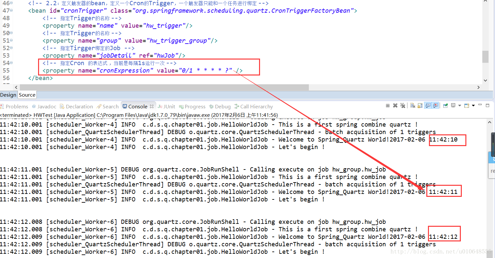
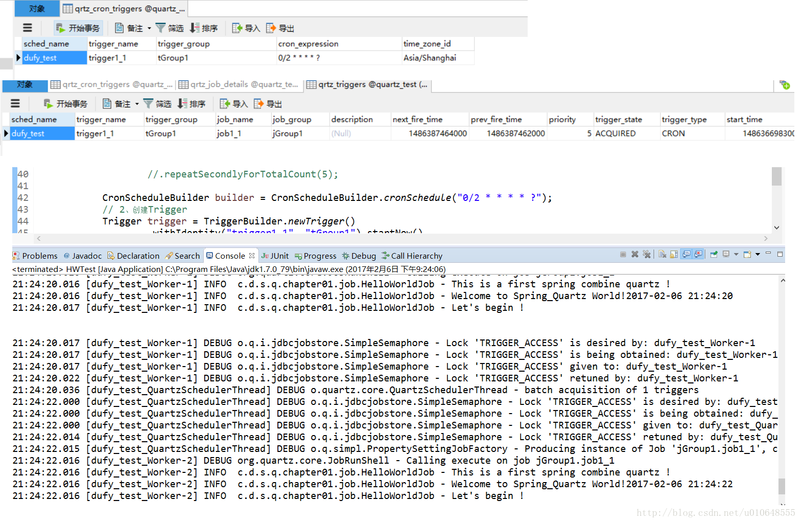

# Quartz与Spring集成 

原文： https://blog.csdn.net/u010648555/article/details/54891264


Spring无缝的集成了Quartz，简单方便的让企业级应用更好的使用Quartz进行任务的调度。下面就对Spring集成Quartz进行简单的介绍和示例讲解！这里也介绍Spring和Quartz集成存储方式使用的是RAM方式和JDBC方式！ 


## 一. Jar包依赖

​        也是使用Maven来管理Jab：

```properties
   <!-- quartz 的jar -->
  <dependency>
		 <groupId>org.quartz-scheduler</groupId>
		 <artifactId>quartz</artifactId>
		 <version>2.2.1</version>
	</dependency>
	<dependency>
        <groupId>org.quartz-scheduler</groupId>
        <artifactId>quartz-jobs</artifactId>
        <version>2.2.1</version>
    </dependency>
    <!-- spring相关jar -->
		<dependency>
			<groupId>org.springframework</groupId>
			<artifactId>spring-context</artifactId>
			<version>4.0.5.RELEASE</version>
		</dependency>
		<dependency>
			<groupId>org.springframework</groupId>
			<artifactId>spring-context-support</artifactId>
			<version>4.0.5.RELEASE</version>
		</dependency>
		<dependency>
			<groupId>org.springframework</groupId>
			<artifactId>spring-jdbc</artifactId>
			<version>4.0.5.RELEASE</version>
		</dependency>
		<dependency>
			<groupId>org.springframework</groupId>
			<artifactId>spring-orm</artifactId>
			<version>4.0.5.RELEASE</version>
		</dependency>
		<dependency>
			<groupId>org.springframework</groupId>
			<artifactId>spring-tx</artifactId>
			<version>4.0.5.RELEASE</version>
		</dependency>
		<dependency>
			<groupId>org.springframework</groupId>
			<artifactId>spring-aspects</artifactId>
			<version>3.2.3.RELEASE</version>
		</dependency>
		<dependency>
			<groupId>org.springframework</groupId>
			<artifactId>spring-test</artifactId>
			<version>4.0.5.RELEASE</version>
		</dependency>
		<dependency>
			<groupId>org.springframework</groupId>
			<artifactId>spring-oxm</artifactId>
			<version>4.0.5.RELEASE</version>
		</dependency>
    
    <!-- 日志相关jar包 -->
	<dependency>
		<groupId>org.slf4j</groupId>
		<artifactId>slf4j-api</artifactId>
		<version>1.7.5</version>
	</dependency>
	<dependency>
		<groupId>org.slf4j</groupId>
		<artifactId>jcl-over-slf4j</artifactId>
		<version>1.7.5</version>
	</dependency>
	<dependency><!--   Failed to load class "org.slf4j.impl.StaticLoggerBinder". -->
		<groupId>ch.qos.logback</groupId>
		<artifactId>logback-classic</artifactId>
		<version>1.0.13</version>
	</dependency>
  <!-- MySql的包 -->
	<dependency>
		<groupId>mysql</groupId>
		<artifactId>mysql-connector-java</artifactId>
		<version>5.1.31</version>
	</dependency>

```

​         如果使用SpringBoot，则更简单：

```properties
    <dependencies>
        <dependency>
            <groupId>org.springframework.boot</groupId>
            <artifactId>spring-boot-starter-quartz</artifactId>
        </dependency>
        <dependency>
            <groupId>org.mybatis.spring.boot</groupId>
            <artifactId>mybatis-spring-boot-starter</artifactId>
            <version>2.1.4</version>
        </dependency>

        <dependency>
            <groupId>org.springframework.boot</groupId>
            <artifactId>spring-boot-devtools</artifactId>
            <scope>runtime</scope>
            <optional>true</optional>
        </dependency>
        <dependency>
            <groupId>mysql</groupId>
            <artifactId>mysql-connector-java</artifactId>
            <scope>runtime</scope>
        </dependency>
        <dependency>
            <groupId>org.springframework.boot</groupId>
            <artifactId>spring-boot-starter-test</artifactId>
            <scope>test</scope>
        </dependency>
    </dependencies>
```

## 二. 任务类Job

### 2.1 业务Job类

```java
import java.text.SimpleDateFormat;
import java.util.Date;

import org.quartz.Job;
import org.quartz.JobExecutionContext;
import org.quartz.JobExecutionException;
import org.slf4j.Logger;
import org.slf4j.LoggerFactory;

/**
 * Spring 整合 Quartz 的  Hello World!
 * @author dufy
 * @date 2017.02.26
 *
 */
public class HelloWorldJob implements Job{

	private Logger log = LoggerFactory.getLogger(this.getClass());
	
	public void execute(JobExecutionContext arg0) throws JobExecutionException {
		log.info(" This is a first spring combine quartz !");
		log.info(" Welcome to Spring_Quartz World!"
           + new SimpleDateFormat("yyyy-MM-dd HH:mm:ss").format(new Date()) );
		log.info(" Let's begin ! \n \n");
	}
}
```

### 2.2 Quartz测试类

```java
import org.springframework.context.ApplicationContext;
import org.springframework.context.support.ClassPathXmlApplicationContext;

public class HWTest {

	public static void main(String[] args) {
		ApplicationContext ac = new ClassPathXmlApplicationContext("spring_quartz.xml");
	}
}
```

## 三. 配置文件和运行结果

### 3.1 RAM存储的配置文件

#### 3.1.1 配置文件

```xml
<?xml version="1.0" encoding="UTF-8"?>
<beans xmlns="http://www.springframework.org/schema/beans"
	xmlns:context="http://www.springframework.org/schema/context" xmlns:p="http://www.springframework.org/schema/p"
	xmlns:aop="http://www.springframework.org/schema/aop" xmlns:tx="http://www.springframework.org/schema/tx"
	xmlns:xsi="http://www.w3.org/2001/XMLSchema-instance"
	xsi:schemaLocation="http://www.springframework.org/schema/beans http://www.springframework.org/schema/beans/spring-beans-4.0.xsd
	http://www.springframework.org/schema/context http://www.springframework.org/schema/context/spring-context-4.0.xsd
	http://www.springframework.org/schema/aop http://www.springframework.org/schema/aop/spring-aop-3.0.xsd http://www.springframework.org/schema/tx http://www.springframework.org/schema/tx/spring-tx-3.0.xsd
	http://www.springframework.org/schema/util http://www.springframework.org/schema/util/spring-util-4.0.xsd">

	<!-- 
		Spring整合Quartz进行配置遵循下面的步骤：
		1：定义工作任务的Job
		2：定义触发器Trigger，并将触发器与工作任务绑定
		3：定义调度器，并将Trigger注册到Scheduler
	 -->
	<!-- 1：定义任务的bean ，这里使用JobDetailFactoryBean,也可以使用MethodInvokingJobDetailFactoryBean ，配置类似-->
	<bean name="hwJob" class="org.springframework.scheduling.quartz.JobDetailFactoryBean">
		<!-- 指定job的名称 -->
		<property name="name" value="hw_job"/>
		<!-- 指定job的分组 -->
		<property name="group" value="hw_group"/>
		<!-- 指定具体的job类 -->
		<property name="jobClass" value="com.dufy.spring.quartz.chapter01.job.HelloWorldJob"/>
		<!-- 必须设置为true，如果为false，当没有活动的触发器与之关联时会在调度器中会删除该任务  -->
		<property name="durability" value="true"/>
		<!-- 指定spring容器的key，如果不设定在job中的jobmap中是获取不到spring容器的 -->
		<property name="applicationContextJobDataKey" value="applicationContext"/>
	</bean>
	<!-- 2.1：定义触发器的bean，定义一个Simple的Trigger，一个触发器只能和一个任务进行绑定 -->
	<!-- <bean name="simpleTrigger" class="org.springframework.scheduling.quartz.SimpleTriggerFactoryBean">
		指定Trigger的名称
		<property name="name" value="hw_trigger"/>
		指定Trigger的名称
		<property name="group" value="hw_trigger_group"/>
		指定Tirgger绑定的Job
		<property name="jobDetail" ref="hwJob"/>
		指定Trigger的延迟时间 1s后运行
		<property name="startDelay" value="1000"/>
		指定Trigger的重复间隔  5s
		<property name="repeatInterval" value="5000"/>
		指定Trigger的重复次数
		<property name="repeatCount" value="5"/>
	</bean> -->
	
	<!-- 2.2：定义触发器的bean，定义一个Cron的Trigger，一个触发器只能和一个任务进行绑定 -->
	<bean id="cronTrigger" class="org.springframework.scheduling.quartz.CronTriggerFactoryBean">
		<!-- 指定Trigger的名称 -->
		<property name="name" value="hw_trigger"/>
		<!-- 指定Trigger的名称 -->
		<property name="group" value="hw_trigger_group"/>
		<!-- 指定Tirgger绑定的Job -->
		<property name="jobDetail" ref="hwJob"/>
		<!-- 指定Cron 的表达式 ，当前是每隔1s运行一次 -->
		<property name="cronExpression" value="0/1 * * * * ?" />
	</bean>
	
	
	<!-- 3.定义调度器，并将Trigger注册到调度器中 -->
	<bean id="scheduler" class="org.springframework.scheduling.quartz.SchedulerFactoryBean">
		<property name="triggers">
			<list>
				<!-- <ref bean="simpleTrigger"/> -->
				<ref bean="cronTrigger"/>
			</list>
		</property>
		<!-- <property name="autoStartup" value="true" /> -->
	</bean>
	
</beans>
```

#### 3.1.2 运行结果

下图为Cron的Trigger运行结果，Simple的Trigger运行结果，可以自行进行查看：



### 3.2 JDBC存储的配置文件

#### 3.2.1 Spring配置文件

```properties
<?xml version="1.0" encoding="UTF-8"?>
<beans xmlns="http://www.springframework.org/schema/beans"
	xmlns:context="http://www.springframework.org/schema/context" xmlns:p="http://www.springframework.org/schema/p"
	xmlns:aop="http://www.springframework.org/schema/aop" xmlns:tx="http://www.springframework.org/schema/tx"
	xmlns:xsi="http://www.w3.org/2001/XMLSchema-instance"
	xsi:schemaLocation="http://www.springframework.org/schema/beans http://www.springframework.org/schema/beans/spring-beans-4.0.xsd
	http://www.springframework.org/schema/context http://www.springframework.org/schema/context/spring-context-4.0.xsd
	http://www.springframework.org/schema/aop http://www.springframework.org/schema/aop/spring-aop-3.0.xsd http://www.springframework.org/schema/tx http://www.springframework.org/schema/tx/spring-tx-3.0.xsd
	http://www.springframework.org/schema/util http://www.springframework.org/schema/util/spring-util-4.0.xsd">


	<!-- =========JDBC版=========== -->
	<!-- 
		持久化数据配置，需要添加quartz.properties
	 -->
	<bean name="scheduler" class="org.springframework.scheduling.quartz.SchedulerFactoryBean">
        <property name="applicationContextSchedulerContextKey" value="applicationContextKey"/>
        <property name="configLocation" value="classpath:quartz.properties"/>	
	</bean>
	
</beans>
```

#### 3.2.2 quartz.properties

```properties
# Default Properties file for use by StdSchedulerFactory
# to create a Quartz Scheduler Instance, if a different
# properties file is not explicitly specified.
#

#============================================================================
# Configure Main Scheduler Properties
#============================================================================
org.quartz.scheduler.instanceName: dufy_test
org.quartz.scheduler.instanceId = AUTO

org.quartz.scheduler.rmi.export: false
org.quartz.scheduler.rmi.proxy: false
org.quartz.scheduler.wrapJobExecutionInUserTransaction: false
#============================================================================
# Configure ThreadPool
#============================================================================
org.quartz.threadPool.class: org.quartz.simpl.SimpleThreadPool
org.quartz.threadPool.threadCount: 2
org.quartz.threadPool.threadPriority: 5
org.quartz.threadPool.threadsInheritContextClassLoaderOfInitializingThread: true

org.quartz.jobStore.misfireThreshold: 60000
#============================================================================
# Configure JobStore
#============================================================================
 
#default config
#org.quartz.jobStore.class: org.quartz.simpl.RAMJobStore
#持久化配置
org.quartz.jobStore.class:org.quartz.impl.jdbcjobstore.JobStoreTX
org.quartz.jobStore.driverDelegateClass:org.quartz.impl.jdbcjobstore.StdJDBCDelegate
org.quartz.jobStore.useProperties:true

#============================================================================
#havent cluster spring
#============================================================================
org.quartz.jobStore.isClustered = false  

#数据库表前缀
org.quartz.jobStore.tablePrefix:qrtz_
org.quartz.jobStore.dataSource:qzDS

#============================================================================
# Configure Datasources
#============================================================================
#JDBC驱动
org.quartz.dataSource.qzDS.driver:com.mysql.jdbc.Driver
org.quartz.dataSource.qzDS.URL:jdbc:mysql://localhost:3306/quartz_test
org.quartz.dataSource.qzDS.user:root
org.quartz.dataSource.qzDS.password:root
org.quartz.dataSource.qzDS.maxConnection:10
```

#### 3.2.3 修改测试类

```java
import org.quartz.CronScheduleBuilder;
import org.quartz.JobBuilder;
import org.quartz.JobDetail;
import org.quartz.Scheduler;
import org.quartz.SchedulerException;
import org.quartz.SimpleScheduleBuilder;
import org.quartz.Trigger;
import org.quartz.TriggerBuilder;
import org.quartz.impl.StdScheduler;
import org.quartz.impl.StdSchedulerFactory;
import org.springframework.context.ApplicationContext;
import org.springframework.context.support.ClassPathXmlApplicationContext;

public class HWTest {
	
	 private static Scheduler scheduler;
	 
	public static void main(String[] args) {
		ApplicationContext ac = new ClassPathXmlApplicationContext("spring_quartz.xml");

		 scheduler = (StdScheduler)ac.getBean("scheduler");
		 
		 startSchedule();
	}
	
	public static void startSchedule() {
		try {
      //============================================
			// 1、创建一个JobDetail实例，指定Quartz
      //============================================
			JobDetail jobDetail = JobBuilder.newJob(HelloWorldJob.class) // 任务执行类
					.withIdentity("job1_1", "jGroup1")                       // 任务名，任务组
					.build();
			
			// 触发器类型
			//SimpleScheduleBuilder builder = 
				  //SimpleScheduleBuilder.repeatSecondlyForTotalCount(5);  // 设置执行次数
		
			CronScheduleBuilder builder = CronScheduleBuilder.cronSchedule("0/2 * * * * ?");
      //============================================
			// 2、创建Trigger
      //============================================
			Trigger trigger = TriggerBuilder.newTrigger()
					.withIdentity("trigger1_1", "tGroup1").startNow()
					.withSchedule(builder)
					.build();
			
      //============================================
			// 3、创建Scheduler
      //============================================
		  scheduler = StdSchedulerFactory.getDefaultScheduler();
			scheduler.start();
      //============================================
			// 4、调度执行
      //============================================
			scheduler.scheduleJob(jobDetail, trigger);
			
		} catch (SchedulerException e) {
			e.printStackTrace();
		}
	}

}
```

​        使用的Cron类型的触发进行存储，运行期间可以在数据库查看到指定的任务已经保存到数据库，并看到控制台打印的信息！

#### 3.2.4 测试结果



