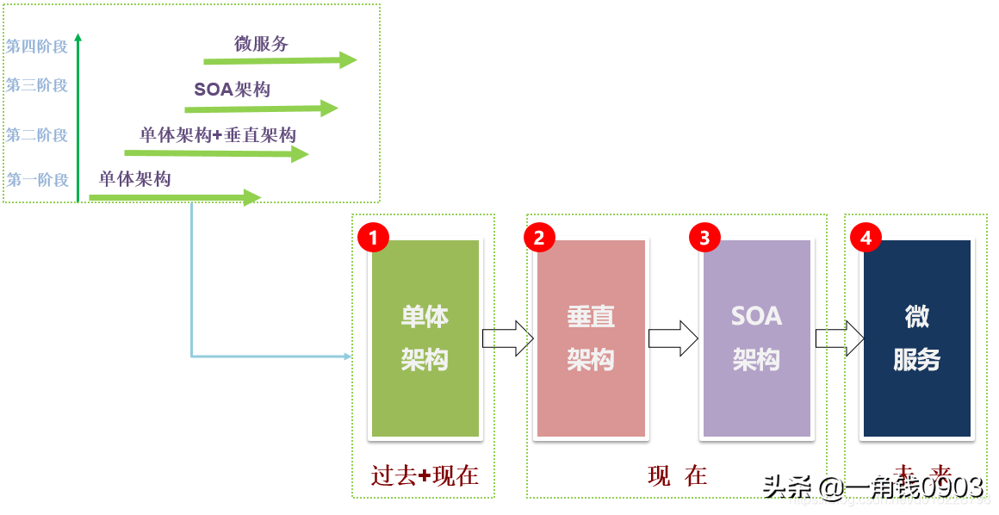
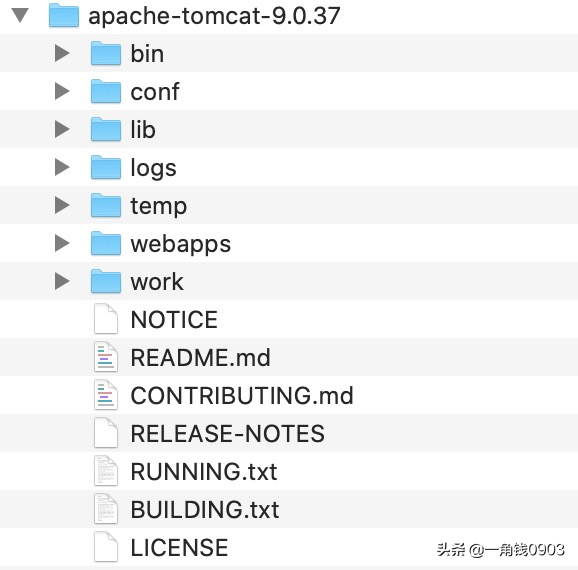

# Tomcat 深入解析与性能优化

原文：https://www.toutiao.com/a6870127673989923336/


## 一. 前言

​        在 Java 应用中，常用的 Web 容器一般有 Tomcat、weblogic、jetty、undertow 等。但从 Java 2019 和 2020 生态使用报告可以看到，Tomcat 的用户量还是比较大的。下图供参考：

​        2019 Java 生态报告


​        2020 Java 生态系统报告：


​        从软件架构的发展角度来看，软件架构大致经历了如下几个阶段：



​        从 Java Web 角度来看，架构大致经历了如下阶段：


​        从当前企业使用的架构角度看，使用 **SSM 架构**项目比较多，SSH 基本上被淘汰（把部分是老项目，依旧在维护），很大一部分**企业转向了微服务架构**了。

​        基于 Spring 生态来说，大部分中小企业都是使用 SpringBoot，因为 SpringBoot 集成了 Tomcat、jetty 和 undertwo 容器。但是依旧需要花时间来研究tomcat，为啥呢？因为：

1. 当前 Tomcat 依然是主流 Java Web 容器，符合 Java 生态发展
2. 在 Java Web 项目调优中，如 SSM 项目，在优化项目时，JVM 和 Tomcat 同样重要，都需要优化
3. 尽管 SpringBoot 内置了 Tomcat，且配置了默认的 Tomcat 参数，但是当默认的 Tomcat 参数满足不了项目优化需求时，就需要优化人员手动进行相关的参数优化，研究 Tomcat 就非常有必要了
4. 熟悉 Tomcat 架构，是后续进行项目优化的基础，是必备条件

## 二. Tomcat 架构说明

​        Tomcat 架构研究，涉及到如下的知识点：

* Tomcat 目录结构
* Tomcat 简要架构
* Tomcat 各组件及关系
* Tomcat Server.xml 配置详解
* Tomcat 启动参数说明（启动脚本）

​        Tomcat 是一个基于 JVM 的 web 容器，其实现了 Java EE 中的 Servlet 与 JSP 规范，与 Ngnix、Apache 服务器不同点，在于一般用于动态请求处理。在架构设计上，Tomcat 采用**面向组件**的方式设计，即整体功能是通过组件的方式拼装完成；另外，每个组件都可以被替换以保证灵活性。

​        下图就是 Tomcat 的整个架构：


​        通过 Tomcat 官方站点看到，Tomcat已经更新到了 10 版本了，但是当前大部分企业都还在使用 Tomcat 8 或者 9：


## 三. Tomcat 目录



* **bin**：可执行文件，以 *.sh* 结尾的是 **nux* 系统下的可执行文件；*.bat* 是win可执行文件
* **conf**：配置文件都在这个目录下
* **lib**：tomcat 相关的 Jar 包
* **temp**：临时文件
* **webapps**：存放用户开发的应用的目录
* **work**：工作目录，编译后的文件都在这里

### 3.1 bin目录


* **catalina.sh**：真正启动 Tomcat 的文件，可以在这里设置 JVM 参数
* **startup.sh**：程序项目命令文件，调用了 *catalina.sh*
* **version.sh**：查看 tomcat 版本的命令
* **shutdown.sh**：关闭 Tomcat 的命令

### 3.2 conf 目录


#### 3.2.1 catalina.policy

​        项目安全文件，用来防止欺骗代码或者 JSP 执行带有像 ***System.exit(0)*** 这样的命令的可能影响容器的破坏性代码。只有当前 Tomcat 用 ***-security*** 命令行参数启动时这个文件才会被使用，即启动 tomcat 时，使用： ***startup.sh -security*** 。 下面是一个示例：


​        上图中，Tomcat 容器下部署了两个项目，项目1 和 项目2.由于项目1 中有代码 *System.exit(0)* ，当访问该代码时，该代码会导致整个 Tomcat 停止，从而导致 项目2 也停止。

​        为了解决因 项目1 存在欺骗代码或不安全代码导致损害 Tomcat 容器，从而影响其他项目正常运行的问题，启动 Tomcat 容器时，加上 *-security* 参数，即使 项目1 中有 *System.exit(0)* 这样的代码，也只会停止 项目1，不会影响 Tomcat 以及其他的应用。起作用的就是这个 catalina.policy 文件。

#### 3.2.2 catalina.properties

​        这个文件配置 tomcat 启动相关的信息

#### 3.2.3 context.xml

​        监视并加载资源的配置文件，当监视的文件发生变化时，自动加载


#### 3.2.4 jaspic-providers.xml 和 jaspic-providers.xsd

​         这两个文件不常用，可忽略

#### 3.2.5 logging.properties

​        日志配置文件，定义了 tomcat 日志的输出格式，日志级别等信息

#### 3.2.6 server.xml

​        Tomcat 核心架构组件文件

#### 3.2.7 tomcat-users.xml 和 tomcat-users.xsd

​        Tomcat 用户文件，如配置远程登录账号

#### 3.2.8 web.xml

​        Tomcat 全局配置文件

### 3.3. lib 目录

​        lib文件夹主要用来存放tomcat依赖jar包，如下为 tomcat 的lib文件夹下的相关jar包。


​        每个 jar 包功能就不讲解了，这里主要分析 ecj-4.13.jar，这个 jar 包起到了将 .java 编译成 .class 字节码的作用。

​        假设要编译 MyTest.java，那么 JDK 会执行两步：

* 第一步，把 MyTest.java 编译成 MyTest.class：*javac MyTest.java*
* 第二部，执行 MyTest.class：java MyTest.class

​         那么，使用 ecj-4.13.jar 时如何做的呢？只需一步：

* *java -jar ecj-4.13.jar MyTest.java*

### 3.4 logs 目录 

​        该文件夹表示tomcat日志文件，大致包括如下六类文件：


| 日志文件                      | 说明                                                         |
| ----------------------------- | ------------------------------------------------------------ |
| catalina.date.log             | 表示 Tomcat 启动的log文件                                    |
| catalina.out                  | 表示 catalina.date.log 日志汇总                              |
| host-managet.date.log         | 表示访问 webapps 下 host-manager 项目的日志，如访问 http://{ip}:8080/host-manager/html |
| localhost.date.log            | 表示 tomcat 在启动时，自身访问服务，这个日志只记录 tomcat 访问日志，而非业务项目日志 |
| localhost_access.log.date.txt | 表示访问 tomcat 所有项目的日志记录，如下表示访问项目  localhost, host-manager.html, manager.html 和 test/index.html 四个项目日志记录 |
| manager.date.log              | 表示访问 webapps 下 manager 项目日志，如访问 http://{ip}:8080/manager/html |

### 3.5. temp 目录

​        temp目录用户存放tomcat在运行过程中产生的临时文件。（清空不会对tomcat运行带来影响）。

### 3.6 webapps 目录

​        webapps目录用来存放应用程序，当tomcat启动时会去加载webapps目录下的应用程序。可以以文件夹、war包、jar包的形式发布应用。

​        当然，你也可以把应用程序放置在磁盘的任意位置，在配置文件中映射好就行。

### 3.7 work 目录

​        work目录用来存放tomcat在运行时的编译后文件，例如JSP编译后的文件。清空work目录，然后重启tomcat，可以达到清除缓存的作用。

## 四. Tomcat 简要架构


### 4.1 Tomcat 各组件关系

* Server 和 Service
* Connector 连接器
  * HTTP 1.1
  * SSL https
  * AJP (Apache JServ Protocol) apache 私有协议，用于 apache 反向代理 Tomcat
* Container
  * Engine 引擎 catalina
  * Host 虚拟机，基于域名 分发请求
  * Context 隔离各个 Web 应用，每个 Context 的 ClassLoader 都是独立的
* Component
  * Manager：管理器
  * logger：日志管理
  * loader：装载器
  * peipeline：管道
  * valve：管道中的阀


## 五. server.xml 详解

​        Server 的基本配置：

```xml
<Server port="8005" shutdown="SHUTDOWN">
    <Listener /><!-- 监听器 -->
    <GlobaNamingResources> <!-- 全局资源 -->
    </GlobaNamingResources
    <Service>          <!-- 服务 用于 绑定 连接器与 Engine -->
        <Connector 8080/> <!-- 连接器-->
        <Connector 8010 /> <!-- 连接器-->
        <Connector 8030/> <!-- 连接器-->
        
        <Engine>      <!-- 执行引擎-->
            <Logger />
            <Realm />
               <host "www.test.com" appBase="">  <!-- 虚拟主机-->
                   <Logger /> <!-- 日志配置-->
                   <Context "/applction" path=""/> <!-- 上下文配置-->
               </host>
        </Engine>
    </Service>
</Server>
```

### 5.1 server

​        root 元素，server的顶层配置。主要的配置属性有：

* **port**：执行关闭命令的端口号

* **shutdown**：关闭命令

  ```shell
  # 基于 telnet 执行 shutdown 命令
  telnet 127.0.0.1 8005
  shutdown
  ```

### 5.2 service

​        服务：将多个connector 与一个Engine组合成一个服务，可以配置多个服务。

### 5.3 Connector

​        连接器：用于接收 指定协议下的连接 并指定给唯一的Engine 进行处理。

​        主要属性：

* **protocal**：监听协议，默认是 ***http/1.1***
* **port**：指定服务器端要创建的端口号
* **minThread**：服务器**启动时**创建的处理请求的线程数
* **maxThread**：最大可以创建的处理请求的线程数
* **enableLookups**：如果为 ***true***，则可以通过调用 ***request.getRemoteHost()*** 进行 DNS 查询来得到远程客户端的实际主机名；若是 ***false***，则只能返回其 ip 地址
* ***redirectPort***：指定服务器正在处理 http 请求时收到了一个 SSL 传输请求后重定向的端口号
* **acceptCount**：指定当前所有可以使用的处理请求的线程数都被使用时，可以放到处理队列中的请求数，超过这个数的请求将不予处理，默认是 ***100***
* **address**：绑定客户端特定的地址，127.0.0.1
* **bufferSize**：**每个请求**的缓冲区大小。总大小则是： bufferSize * maxThreads
* **compression**：是否启用文档压缩
* **compressionMinSize**：文档压缩的最小大小
* **compressableMineTypes**：压缩的类型：text/html, text/xml, text/plain
* **connectionTimeout**：客户端发起连接到服务器端接收为止，指定超时的时间数（单位：毫秒）
* **connectionUploadTimeout**：upload 情况下的连接超时时间
* **disableUploadTimeout**：如果是 ***True***，则使用 connectionTimeout
* **keepAliveTimeout**：当长连接闲置，指定时间主动关闭连接，前提是客户端请求头带上这个 head"connection" "keep-alive"
* **maxKeepAliveRequests**：最大的长连接数，默认是 ***100***
* **maxSpareThreads**：BIO 模式下最大的闲置线程数
* **minSpareThreads**：BIO 模式下最小的闲置线程数
* **SSLEnabled**：是否开启SSL 验证，在 https 访问时需要开启

​        这是一个例子：

```xml
<Connector port="8860"
           protocol="org.apache.coyote.http11.Http11NioProtocol"
           connectionTimeout="20000"
           redirectPort="8862"
           URIEncoding="UTF-8"
           useBodyEncodingForURI="true"
           compression="on" 
           compressionMinSize="2048"
compressableMimeType="text/html,text/xml,text/plain,text/javascript,text/css,application/x-json,application/json,application/x-javascript"
           maxThreads="1024" 
           minSpareThreads="200"
           acceptCount="800"
           enableLookups="false"
/>
```

### 5.4 Engine

​        引擎：用于处理连接的执行器，默认的引擎是catalina。一个service 中只能配置一个Engine。

​        主要属性：name 引擎名称 defaultHost 默认host

### 5.5 Host

​        虚拟机：基于域名匹配至指定虚拟机。类似于nginx 当中的server,默认的虚拟机是localhost。

​        示例，配置 Host：

```xml
<Host name="www.test.com"  
      appBase="/usr/www/test"
      unpackWARs="true" 
      autoDeploy="true">
        <Valve className="org.apache.catalina.valves.AccessLogValve" 
               directory="logs"
               prefix="www.luban.com.access_log" 
               suffix=".txt"
               pattern="%h %l %u %t "%r" %s %b" />
</Host>
```

### 5.6 Context

​        应用上下文：一个host 下可以配置多个Context ，每个Context 都有其独立的classPath。相互隔离，以免造成ClassPath 冲突。

​        示例，配置 Context：

```xml
<Context docBase="hello" path="/h" reloadable="true"/>
```

### 5.7 Valve

​        阀门：可以理解成 request 的过滤器，具体配置要基于具体的 Valve 接口的子类。以下即为一个访问日志的Valve：

```xml
<Valve className="org.apache.catalina.valves.AccessLogValve" 
       directory="logs"
       prefix="www.luban.com.access_log" 
       suffix=".txt"
       pattern="%h %l %u %t "%r" %s %b" 
/>
```

## 六. Tomcat 启动参数

​        平时启动 Tomcat 的过程大致如下：

1. 复制 war 到 tomcat_home/webapps 目录
2. 执行 startup.sh 脚本
3. 启动过程中， war 包会自动被解压

​        但是，如果在开发环境（如： Eclipse 或者 IDEA）中启动 Web 项目时，并不会把 war 包复制到 webapps 目录下。而是在 Tomcat 程序文件之外创建一个部署目录，在一般生成环境中也是如此。即：Tomcat 程序目录和部署目录是分离的。具体如何做呢？

​        只需要在启动时指定 TOMCAT_HOME 与 CATALINA_BASE 参数即可。

| 启动参数        | 描述说明                                                     |
| --------------- | ------------------------------------------------------------ |
| JAVA_OPS        | JVM 启动参数。设置内存，编码等，如： - Xm100m -Xmx200m -Dfile,endoding=UTF-8 |
| JAVA_HOME       | 指定 JDK 目录。如果未设定，则从 系统环境 中去找              |
| CATALINA_HOME   | Tomcat 程序跟目录                                            |
| CATALINA_BASE   | 应用部署目录，默认是 $CATALINE_HOME                          |
| CATALINA_OUT    | 应用日志输出目录，默认是 $CATALINA_BASE/log                  |
| CATALINA_TMPDIR | 应用临时目录，模式是 $CATALINA_BASE/temp                     |

​        可以编写一个脚本来实现自定义配置：

* 更新启动脚本

  ~~~sh
  #!/bin/bash -e
  export now_time=$(date +%Y-%m-%d_%H-%M-%S)
  echo "deploy time:$now_time"
  
  app=$1
  version=$2
  mkdir -p war/
  #从svn下载程序至 war目录
  war=war/${app}_${version}.war
  echo "$war"
  svn export svn://192.168.0.253/release/${app}_${version}.war $war
  
  deploy_war() {
  #解压版本至当前目录
  target_dir=war/${app}_${version}_${now_time}
  unzip -q $war -d $target_dir
  rm -f appwar
  ln -sf $target_dir appwar
  target_ln=`pwd`/appwar
  echo '<?xml version="1.0" encoding="UTF-8" ?>
  <Context docBase="'$target_ln'" allowLinking="false">
  </Context>' > conf/Catalina/localhost/ROOT.xml
  #重启Tomcat服务
  ./tomcat.sh restart
  }
  
  deploy_war
  ```
  ~~~

* 自动部署脚本

  ~~~sh
  #!/bin/bash -e
  export now_time=$(date +%Y-%m-%d_%H-%M-%S)
  echo "deploy time:$now_time"
  
  app=$1
  version=$2
  mkdir -p war/
  #从svn下载程序至 war目录
  war=war/${app}_${version}.war
  echo "$war"
  svn export svn://192.168.0.253/release/${app}_${version}.war $war
  
  deploy_war() {
  #解压版本至当前目录
  target_dir=war/${app}_${version}_${now_time}
  unzip -q $war -d $target_dir
  rm -f appwar
  ln -sf $target_dir appwar
  target_ln=`pwd`/appwar
  echo '<?xml version="1.0" encoding="UTF-8" ?>
  <Context docBase="'$target_ln'" allowLinking="false">
  </Context>' > conf/Catalina/localhost/ROOT.xml
  #重启Tomcat服务
  ./tomcat.sh restart
  }
  
  deploy_war
  ```
  ~~~


## 七. Tomcat 网络通信模型

### 7.1 Tomcat 支持四种线程模型

#### 7.1.1 什么是 I/O

​        I/O 是指为数据传输所提供的输入输出流，其输入输出对象可以是：文件、网络服务、内存等。


#### 7.1.2 什么是I/O模型

​        有这么一个问题：假设应用在从硬盘中读取一个大文件，此过程中，CUP会与硬盘一样处于高负载状态吗？

​        答案是：CPU 负载并没有太高的增长。

​        通常情况下，I/O 操作是比较耗时的，所以为了高效的使用硬件，应用程序可以用一个专门的线程进行 I/O 操作，而另外一个线程则利用 CPU 的空闲去做其它计算。这种为了提高应用效率而采用的 I/O 操作方法就是 I/O 模型。

#### 7.1.3 各个I/O 模型简要说明

* **BIO**

  ***阻塞式 I/O***：即 Tomcat 使用传统的 java.io 进行操作。该模式下每个请求都会创建一个线程，对性能开销大，不适合高并发的场景。优点是稳定，适合连接数目小且固定架构

* **NIO**

  ***非阻塞式 I/O***：JDK 1.4 之后实现的新I/O。该模式基于**多路复用**选择器监测连接状态再通知线程处理，从而达到非阻塞的目的。比传统 ***BIO*** 能更好地支持并发性能。

  ***Tomcat 8.0 之后默认采用这个模式***

* **APR**

  ***可移植运行库***：全称是 Apache Portable Runtime，Apache 可移植运行库，是Apache HTTP 服务器的支持库。可以简单的理解为：Tomcat 将以 JNI 的形式调用 Apache HTTP 服务器的核心动态链接库来处理文件读取或网络传出操作。使用需要编译安装 APR 库

* **AIO**

  ***异步非阻塞式I/O***：JDK 7 后支持。与 NIO 不同在于：不需要多路复用选择器，而是请求处理线程执行完成后执行回调机制，已继续执行后续操作。***Tomcat 8 之后支持***

### 7.2 使用指定 IO模型的配置方式

​        修改配置文件 ***server.xml*** 中的 <Connector protocol="HTTP/1.1"> 即可。默认的配置情况是，Tomcat 8.0 之前是 BIO，之后是 NIO。

* BIO

  ```xml
  protocol="org.apache.coyote.http11.Http11Protocol"
  ```

* NIO

  ```xml
  protocol="org.apache.coyote.http11.Http11NioProtocol"
  ```

* AIO

  ```xml
  protocol="org.apache.coyote.http11.Http11Nio2Protocol"
  ```

* APR

  ```xml
  protocol="org.apache.coyote.http11.Http11AprProtocol"
  ```


### 7.3 Tomcat BIO、NIO 实现过程源码分析

#### 7.3.1 BIO 与 NIO 的区别

​        模拟 4 个客户端请求，每个客户端发送 ***50个/秒***  请求，共 200 个请求：


* BIO 配置

  ```xml
  <Connector port="8080"
             protocol="org.apache.coyote.http11.Http11Protocol"
             connectionTimeout="20000"
             redirectPort="8443"
             compression="on" 
             compressionMinSize="1024"
             compressableMimeType="text/html,text/xml,text/plain,text/javascript,text/css,application/x-json,application/json,application/x-javascript"   
             maxThreads="500" 
             minSpareThreads="1"/>
  ```

* NIO 配置

  ```xml
  <Connector port="8080" 
             protocol="org.apache.coyote.http11.Http11NioProtocol"
             connectionTimeout="20000"
             redirectPort="8443"
             compression="on" 
             compressionMinSize="1024"
                 compressableMimeType="text/html,text/xml,text/plain,text/javascript,text/css,application/x-json,application/json,application/x-javascript"    
             maxThreads="500" 
             minSpareThreads="1"/>
  ```

  

* 演示数据

  | 场景         | 每秒提交数 | BIO执行线程         | NIO执行线程     |
  | ------------ | ---------- | ------------------- | --------------- |
  | 预测         | 200        | 200 线程            | 20 线程         |
  | 实验环境     | 200        | 55 wait 个线程      | 23 个线程       |
  | 模拟生产环境 | 200        | 229 个 running 线程 | 20 个 wait 线程 |

* 生成环境重要因素

  1. 网络
  2. 程序执行 业务用时
  3. 源码地址：https://github.com/org-hejianhui/bit-bigdata-transmission

* BIO 线程模型

  

* BIO 源码

  1. 线程组

     Accept 线程组： acceptorThreadCount 默认1 个

     exec 线程组： maxThread

     JIoEndPoint：Acceptor extends Runnable，SocketProcessor extends Runnable

  2. 流程

     

* BIO 小结

  线程数量会受到：***客户端阻塞、网络延迟、业务处理慢***（导致线程数量多）等因素影响

* NIO 线程模型

  

  Accept 线程组：默认两个轮询器

  Poller Selector PollerEvent 轮询线程状态

  SocketProcessor

* NIO 流程

  

* NIO 小结

  线程数量会受到 ***业务处理慢***（导致线程数量多）的影响

### 7.4 Tomcat Connector 并发参数解读

| 名称                               | 描述                                                         |
| ---------------------------------- | ------------------------------------------------------------ |
| acceptCount                        | 等待最大队列（此时，所有线程都在运行）                       |
| address                            | 绑定客户端特定地址，127.0.0.1                                |
| bufferSize                         | 每个请求的缓冲区大小。总大小： bufferSize * maxThreads       |
| compression                        | 是否启用文档压缩                                             |
| compressableMimeType               | text/html, text/xml, text/plain                              |
| connectionTimeout                  | 客户发起连接 到 服务器端接收为止，中间最大的等待时间         |
| connectionUploadTimeout            | upload 情况下连接超时时间                                    |
| disableUploadTimeout               | true，则使用 connectionTimeout                               |
| enableLookups                      | 否是禁用 DNS 查询。true，返回域名；false 返回 ip             |
| keepAliveTimeout                   | 当长连接闲置，指定时间主动关闭连接。前提是客户端请求头带着： head"connection" "keep-alive" |
| maxKeepAliveRequests               | 最大的 长连接数                                              |
| maxHttpHeaderSize                  |                                                              |
| maxSpareThreads                    | BIO 模式下，最多闲置线程数量                                 |
| maxThreads（执行线程）             | 最大**执行**线程数                                           |
| minSpareThreads（初始业务线程 10） | BIO 模式下，最小闲置线程数                                   |


## 八. Tomcat 类加载机制源码解析

### 8.1 类加载本质

​        类加载器负责将 class 的字节码形式转换成内存形式的 class 对象。字节码可以来自于磁盘的 .class 文件，也可以是 .jar 里的 .class，也可以是来自远程服务器提供的字节流。字节码的本质就是一个字节数组 byte[]， 它有特定的复杂的内部格式。

​        JVM 运行实例中，会存在多个 ClassLoader，不同的 ClassLoader 会从不同的地方加载字节码文件。它可以从不同的文件目录加载，也可以从不同的 jar 文件中加载，也可以从网络上不同的静态文件服务器来下载字节码加载。

​       JVM 里的 CalssLoader 的层次架构：


#### 8.1.1 BootstrapClassLoader

​        该 ClassLoader 称为启动类加载器，是 JVM 最顶层的类加载器，负责加载 JDK 中的核心类库，如: rt.jar、resources.jar、charsets.jar 等。可以通过下面程序获得该类加载器从哪些地方加载了相关的 jar 或者 class 文件：

```java
URL[] ursl = sun.misc.Launcher.getBootstrapClassPath().getURLs();
for (URL url: urls) {
    System.out.println(url.toExternalForm());
}
```

​        以下是一个执行结果：

```sh
file:/Library/Java/JavaVirtualMachines/jdk1.8.0_201.jdk/Contents/Home/jre/lib/resources.jar
file:/Library/Java/JavaVirtualMachines/jdk1.8.0_201.jdk/Contents/Home/jre/lib/rt.jar
file:/Library/Java/JavaVirtualMachines/jdk1.8.0_201.jdk/Contents/Home/jre/lib/sunrsasign.jar
file:/Library/Java/JavaVirtualMachines/jdk1.8.0_201.jdk/Contents/Home/jre/lib/jsse.jar
file:/Library/Java/JavaVirtualMachines/jdk1.8.0_201.jdk/Contents/Home/jre/lib/jce.jar
file:/Library/Java/JavaVirtualMachines/jdk1.8.0_201.jdk/Contents/Home/jre/lib/charsets.jar
file:/Library/Java/JavaVirtualMachines/jdk1.8.0_201.jdk/Contents/Home/jre/lib/jfr.jar
file:/Library/Java/JavaVirtualMachines/jdk1.8.0_201.jdk/Contents/Home/jre/classes
```

​        从 rt.jar 中选择 String 类来看一下类加载器是什么：

```java
ClassLoader classLoader = String.class.getClassLoader();
System.out.println(classLoader);
```

​        执行结果：

```sh
null
```

​        由此可知，BootstrapClassLoader 对 Java 是不可见的，所以返回 null。即：如果一个 class 的 ClassLoader 是 null，则说明该类是被 BootstrapClassLoader 加载的。因为 BootstrapClassLoader 是 C/C++ 编写的，所以对于JVM而言是看不见的。

#### 8.1.2 Extension ClassLoader

​        ExtClassLoader， 该加载器本称为扩展类加载器，主要负责加载 Java 的扩展类库，默认加载 ***JAVA_HOME/jre/lib/ext/*** 目录下的所有 jar 包，或者由 ***java.ext.dirs*** 系统属性指定的 jar 包。放入这个目录下的 jar 包对 AppClassLoader 加载器都是可见的（因为 *ExtClassLoader* 是 *AppClassLoader* 的父加载器，并且 Java 类加载器采用了委托机制）。

​        ExtClassLoader 的类扫描路径通过执行下面代码可以查看：

```java
String extDirs = System.getProperty("java.ext.dirs");
for (String path : extDirs.split(";")) {
  System.out.println(path);
}
```

​        执行结果如下（Mac系统）:

```sh
/Users/jaly/Library/Java/Extensions:/Library/Java/JavaVirtualMachines/jdk1.8.0_201.jdk/Contents/Home/jre/lib/ext:/Library/Java/Extensions:/Network/Library/Java/Extensions:/System/Library/Java/Extensions:/usr/lib/java
```

​        jre/lib/ext路径下内容为:


​        从上面的路径中随意选择一个类，看看它的类加载器，可以得到：

```sh
sun.misc.Launcher$ExtClassLoader@4439f31e
null
```

​        从上面的结果可知，ExtClassLoader 的父加载器是 ***null***，可以确定是 BootstrapClassLoader。

> ​        Bootstrap ClassLoader是由C/C++编写的，它本身是虚拟机的一部分，所以它并不是一个JAVA类，也就是无法在java代码中获取它的引用，JVM启动时通过Bootstrap类加载器加载rt.jar等核心jar包中的class文件，之前的int.class,String.class都是由它加载。然后呢，前面已经分析了，JVM初始化sun.misc.Launcher并创建Extension ClassLoader和AppClassLoader实例。并将ExtClassLoader设置为AppClassLoader的父加载器。Bootstrap没有父加载器，但是它却可以作用一个ClassLoader的父加载器。比如ExtClassLoader。这也可以解释之前通过ExtClassLoader的getParent方法获取为Null的现象。

#### 8.1.3 AppClassLoader

​        AppClassLoader 才是直接面向用户的加载器。它会加载 Classpath 环境变量里定义路径里的 jar 包和目录。自己编写的代码以及使用第三方 jar 包通常都是由它加载的。

​        加载 ***System.getProperty("java.class.path")*** 所制定的路径或者 jar。在使用 Java 运行程序时，也可以加上 ***-cp*** 来覆盖原有的 Classpath 设置，例如： java -cp ./javasoft/classes HelloWorld

```java
public class AppClassLoaderTest {
    public static void main(String[] args) {
        System.out.println(ClassLoader.getSystemClassLoader());
    }
}
```

​        输出结果：

```sh
sun.misc.Launcher$AppClassLoader@18b4aac2
```

​        以上结论说明调用 ***ClassLoader.getSystemClassLoader()*** 可以获得 ***AppClassLoader*** 类加载器。 

```java
protected ClassLoader() {
    this(checkCreateClassLoader(), getSystemClassLoader());
}
```

​        通过查看 ClassLoader 的源码发现，在没有特定说明的情况下，用户自定义的任何类加载器都将该类加载器作为自定义类加载器的父加载器。

​        通过执行上面的代码即可获得 classpath 的加载路径。

​        在上面的main函数的类的加载就是使用 ***AppClassLoader*** 加载器进行加载的,可以通过执行下面的代码得出这个结论：

```java
public class AppClassLoaderTest {

    public static void main(String[] args) {
        ClassLoader classLoader = Test.class.getClassLoader();
        System.out.println(classLoader);
        System.out.println(classLoader.getParent());
    }

    private static class Test {
    }
}
```

​        执行结果如下：

```sh
sun.misc.Launcher$AppClassLoader@18b4aac2
sun.misc.Launcher$ExtClassLoader@2d209079
```

从上面的运行结果可以得知AppClassLoader的父加载器是ExtClassLoader


### 8.2 Tomcat 的类加载顺序


​        在 Tomcat 中，默认的行为是，先尝试在 Bootstrap 和 Extention 中进行类型加载，如果加载不到，则在 Webapp ClassLoader 中加载，如果还是找不到则在 Common 中进行查找。

### 8.3 NoClassDefFoundError

​         NoClassDefFoundError 是在 JavaEE 开发中常遇到的问题。该问题会随着所使用的 Java EE 中间件环境的复杂度以及应用本身的体谅变得更加复杂，尤其是现在的 Java EE 服务器具有大量的类加载器。

​        在 Java Doc 中对 NoClassDefFoundError 的产生是由于 JVM 或者 类加载器实例 尝试加载该类型的定义，但是该定义却没有找到，影响了执行路径。换句话说，在编译时这个类是能够找到的，但是在执行时却找不到了。

​        这一刻，IDE 是没有出错提示的，但是在运行时却出现了错误。

### 8.4 NoSuchMethodError

​        在另一个场景中，可能遇到这样的错误：NoSuchMethodError。这个错误代表这个类型是存在的，但是一个不正确的版本被加载了，因为有些方法没有被定义。

### 8.5 ClassCastException

​        ClassCastException，在一个类加载器的情况下，一般出现这种错误都会是在转型操作时，比如：A a = (A) method();，很容易判断出来method()方法返回的类型不是类型A，但是在 JavaEE 多个类加载器的环境下就会出现一些难以定位的情况

