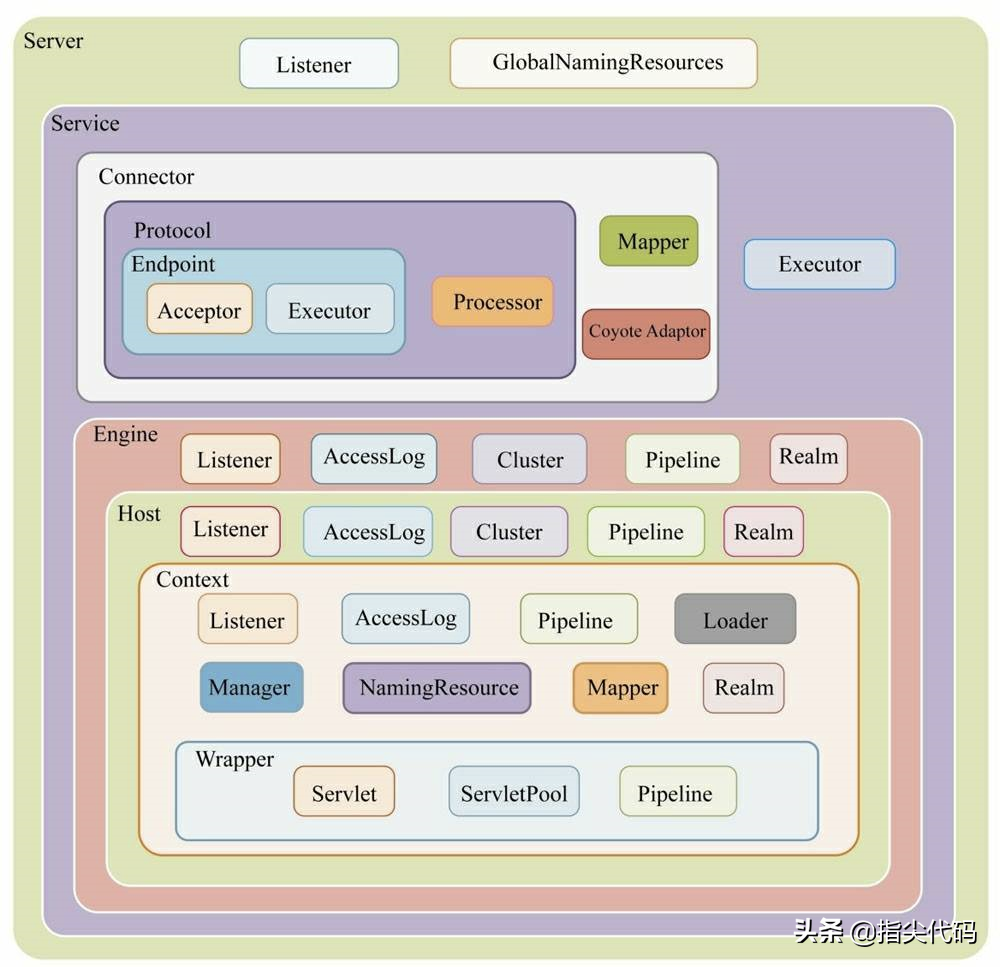
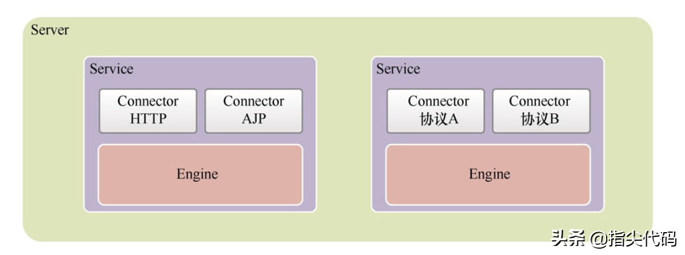
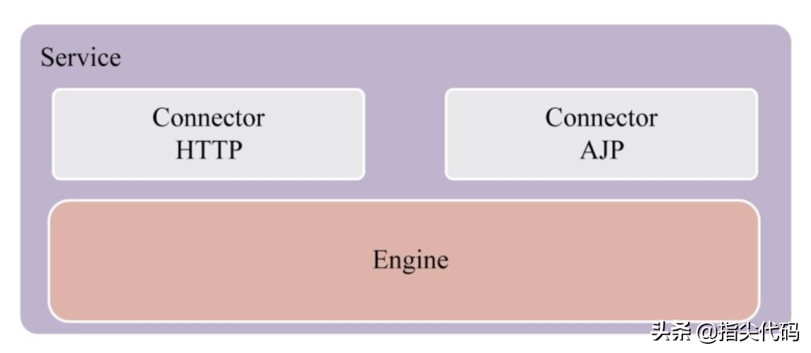
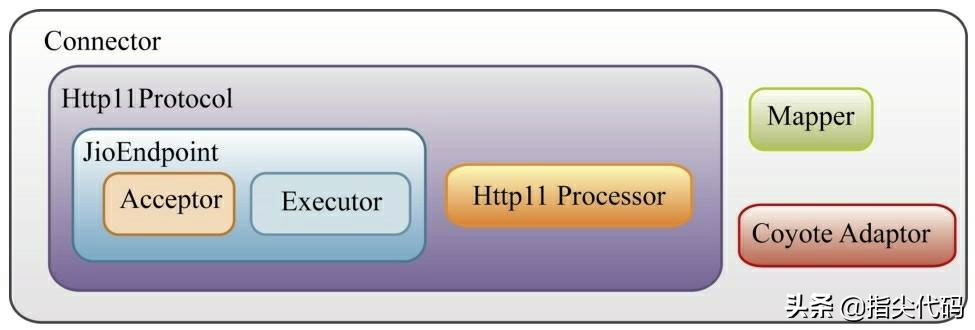
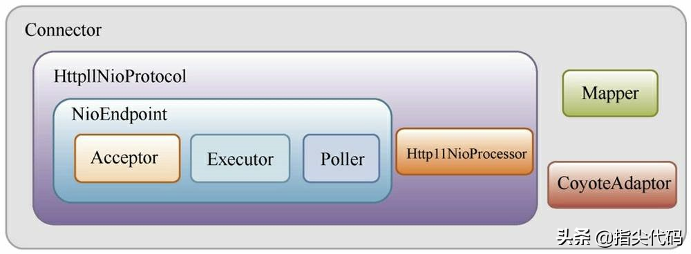

# Tomcat 整体架构分析

原文：https://www.toutiao.com/a7012911421554147844/


## 1. 整体架构简析

如果将 Tomcat 的结构高度抽象的话，那么 Tomcat 其实可以看成只是由**连接器**（Connector）和**容器**（Container）两个组件构成。其中：

* **Connector 件**：负责在服务器端处理客户端连接，包括接收客户端连接、接收客户端的消息报文以及消息报文的解析等工作

*  **Container 组件**：负责对客户端的请求进行逻辑处理，并把结果返回给客户端。Container 组件其实还可以再细分，分成：

  * Engine 组件
  * Host 组件
  * Context 组件
  * Wrapper 组件

  

从 Tomcat 服务器配置文件 ***Server.xml*** 的内容格式看，它所描述的 Tomcat 也符合上图的层级结构，以下就是 Server.xml 简洁的配置节点，所以从 server.xml 文件也能看出 Tomcat的大体结构：

```xml
<? xml version='1.0' encoding='utf-8'? >
<Server>
    <Listener/>
    <GlobalNamingResources>
        <Resource/>
    </GlobalNamingResources>
    <Service>
        <Executor/>
        <Connector/>
        <Engine>
            <Cluster/>
            <Realm/>
            <Host>
            <Context/>
            </Host>
        </Engine>
    </Service>
</Server>
```

## 2. Server 组件

**Server** 是最顶级的组件，它**代表 Tomcat 的运行实例，在一个 JVM 中只包含一个Server。** 在 Server 的整个生命周期中，不同阶段有不同的事情要完成。为了方便扩展，它引入了监听器方式，所以它包含了 ***Listener*** 组件。另外，为了方便在 Tomcat 中集成 JNDI，引入了 ***GlobalNamingResources*** 组件。同时，还包含了 Service 的核心组件。

```xml
<? xml version='1.0' encoding='utf-8'? >
<Server>
    <!-- 配置一个或多个Listener -->
    <Listener/>
    <!-- 配置JNDI资源 -->
    <GlobalNamingResources>
    	<Resource/>
    </GlobalNamingResources>
    <!--配置一个或多个Service-->
    <!--注意一个Tomcat实例中可以配置多个Service，这些Service通过监听不同的端口来区分-->
    <Service>
		...
    </Service>
</Server>
```

Server 组件在 Tomcat 中的实现类是 ***StandardServer***，除了表示 Service 的一个对象数组外，主要是一些关于 Tomcat 的属性，比如 Port、address 等。

## 3. Service 组件

**Service 组件是连接器（Connector）和容器（Container）的组合**。一个 Tomcat 实例中，可以有**多个** Service 组件，它们**彼此独立**。***StandardService*** 是 Service 组件的实现类。如果上面的 Server 组件代表 Tomcat 服务器实例的话，那么 servcie 组件就是这个服务器上面对外提供的一个个具体的服务。这个服务监听着不同的端口，要反问哪些服务必须指定这些服务对应的端口。这样一类比的话，就和具体的硬件服务器很想了。

```java
public class StandardService extends LifecycleMBeanBase implements Service {
    private Server server = null;
    protected Connector connectors[] = new Connector[0];
    private Engine engine = null;
    protected final Mapper mapper = new Mapper();
}
```

server 表示其所属的 Server，Engine 作为处理该 service 中 Connector 的容器。Mapper 可以看作是映射器，要来处理请求地址到处理该请求的容器及 Servlet 的映射。



另外，service 组件还有一个 Executor 组件，这个线程池组件可以让多个连接器组件共享，而不是每个连接器组件都是用自己的线程池。

## 4. Connector 组件



表示 Tomcat 中的连接器，其主要作用是监听并转化 Socket 请求，并交由 Container 处理。其实，就是对不同协议及协议处理器进行封装。下面是需要关注的几个属性域：

```java
public class Connector extends LifecyleMBean {
    protected Servcie servcie = null;
    protected final ProtocalHandler protocalHandler;
}
```

不同的协议会对应不同的 Connector，目前 Tomcat 支持 HTTP（HTTPS）和 AJP 两种协议的 Connector。另外，同一种协议的内部也会根据网络 IO 方式的不同分为阻塞 IO 和非阻塞IO。下面以 HTTP 协议为例子简单介绍：



* **Http11Protocal 组件**：是 HTTP 协议 1.1 版本的抽象，它包含接收客户端连接、接收客户端消息报文、报文解析处理、对客户端响应等整个过程。**它主要包含 JioEndpoint 组件 和 Http11Processor 组件**。启动时，JioEndpoint 组件内部的 **Acceptor 组件将启动某个端口的监听**，一个请求到来后将被扔进线程池 Executor，线程池进行任务处理，处理过程中将通过 Http11Processor 组件对 HTTP协议解析并传递到 Engine 容器继续处理
* **Mapper 组件**：客户端请求的路由导航组件，通过它能对一个完整的请求地址进行路由，通俗地说，就是它能通过请求地址找到对应的 Servlet
* **CoyoteAdaptor组件**：一个将 Connnector 和 Container 适配起来的适配器



如上图所示，在非阻塞I/O方式下，Connector的结构类似阻塞模式，Http11Protocol组件改成Http11NioProtocol组件，JioEndpoint组件改成***NioEndpoint***, Http11Processor 组件改成 ***Http11NioProcessor*** 组件，这些类似的组件的功能也都类似。唯独多了一个 ***Poller*** 组件，它的职责是在非阻塞I/O方式下轮询多个客户端连接，不断检测、处理各种事件，例如不断检测各个连接是否有可读，对于可读的客户端连接则尝试进行读取并解析消息报文。

## 5. Engine组件

Tomcat 内部有 4 个界别的容器，分别是： Engine、Host、Context 和 Wrapper。Engine 代表全局 Servlet 引擎，**每个 Service 组件只能包含一个 Engine 容器组件，但 Engine 组件可以包含若干 Host 容器组件**。除了 Host 之外，它还包含如下组件：

* **Listener组件**：可以在 Tomcat 生命周期中完成某些 Engine 容器相关工作的监听器
* **AccessLog组件**：客户端的访问日志，所有客户端访问都会被记录
* **Cluster组件**：它提供集群功能，可以将 Engine 容器需要共享的数据同步到集群中的其他 Tomcat 实例上
* **Pipeline组件**：Engine 容器对请求进行处理的管道
* **Realm组件**：提供了 Engine 容器级别的用户-密码-权限的数据对象

## 6. Host 组件

Tomcat 中 Host 组件代表虚拟主机，这些虚拟主机可以存放多个 Web 应用的抽象（Context 容器）。除了 Context 组件之外，还包含如下组件：

* **Listener组件**：可以在 Tomcat 生命周期中完成某些 Host 容器相关工作的监听器
* **AccessLog组件**：客户端的访问日志，对该虚拟主机上所有 Web 应用的访问都会被记录
* **Cluster组件**：它提供集群功能，可以将 Host 容器需要共享的数据同步到集群中的其他 Tomcat 实例上
* **Pipeline组件**：Host 容器对请求进行处理的管道
* **Realm组件**：提供了 Host 容器级别的用户-密码-权限的数据对象，配合资源认证模块使用

## 7. Context 组件

Context 组件是 Web 应用的抽象，Web 应用部署到 Tomcat 后运行时就会转化成 Context 对象。它包含了各种静态资源、若干 Servlet （Wrapper 容器）以及各种其他动态资源。它主要包含如下组件：

* **Listener组件**：可以在 Tomcat 生命周期中完成某些 Context 容器相关工作的监听器
* **Filter 组件**：过滤器组件，提供统一的业务逻辑处理
* **AccessLog组件**：客户端的访问日志，对该 Web 应用的访问都会被记录
* **Pipeline组件**：Context 容器对请求进行处理的管道
* **Realm组件**：提供了 Context 容器级别的用户-密码-权限的数据对象，配合资源认证模块使用
* **Loader组件**：Web 应用加载器，用于加载 Web 应用的资源，它要保证不同的 Web 应用之间的资源隔离
* **Manager组件**：会话管理器，用于管理对应 Web 应用的会话，包括维护绘画的生成、更新和销毁
* **NamingResource组件**：命名资源，它负责将 Tomcat 配置文件的 server.xml 和 Web应用的 Context.xml 资源和属性映射到内存中
* **Mapper组件**：Servlet 映射器，它属于 Context 内部的路由映射器，只负责该 Context 容器的路由导航
* **Wrapper组件**：Context 的子容器

## 8. Wrapper 组件

Wrapper 容器是 Tomcat 中 4 个级别的容器中最小的，与之相对应的是 Servlet，一个 Wrapper 对应一个 Servlet。它包含如下组件：

* **Servlet 组件**：Servlet 即 Web 应用开发常用的Servlet，会在在 servlet中编写好请求的逻辑处理
* **ServeltPool 组件**：Servlet 对象池，当 Web 应用的 Servlet 实现了 ***SingleThreadModel*** 接口时，则会在 Wrapper 中产生一个 Servlet 对象池。线程执行时，需要现从对象池中获取一个 Servlet 对象，ServletPool 组件能保证 Servlet 对象的线程安全
* **Pipeline 组件**：Wrapper 容器对请求进行处理的管道