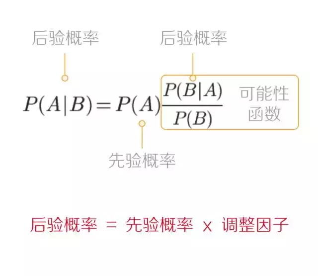

# 贝叶斯定理

原文： https://www.toutiao.com/a6464148477759717901/?channel=&source=search_tab

## 一. 贝叶斯定理是什么

​        贝叶斯定理是一种**在已知其他概率的情况下**求概率的方法：

这个公式如何理解呢？

​        首先，对于贝叶斯定理，还是要先了解各个概率所对应的事件：

* $P(A|B)$ ：是在 B 发生的情况下 A 发生的概率
* $P(A)$      ：是A 发生的概率
* $P(B|A)$ ：是在 A 发生的情况下 B 发生的概率
* $P(B)$      ：是B发生的概率

为了便于记住，对于贝叶斯公式，记住：***AB AB AB***，然后再做分组：**"AB = A×BA/B"**

**名词解释**

* **先验概率**：根据过往经验和分析得到的概率，先验概率并不会随着后续发生的情况而改变
* **似然估算**：当特定观测出现时，对该观测而言模型的好坏程度，上图中的“调节因子”就是似然估算值。当似然值越大时，模型参数越优
* **后验概率**：就是Bayes定义，表示一种条件概率

## 二. 如何理解

通过例子来加强对Bayes公式的理解。

### 例子一：

京西大旅馆为了庆祝开业三周年的好日子，老板刘强西准备带着实习生小天去郊外旅游，不过一大早天空多云：

* 50%的雨天的早上是多云的 - *参考点一*
* 多云的早上其实挺多的（大约40%的日子早上是多云的）*参考点二*
* 这个月干旱为主（平均30天里一般只有3天会下雨）*参考点三*

用"**雨**"来代表今天下雨，"**云**"来代表早上多云。那么根据Bayes公式：

* 当早上多云时，当天会下雨的可能性是： $ P(雨|云) = P(雨) \cdot \frac{P(云|雨)}{P(云)} $

如果已知的概率如下：

* $P(雨)$       是今天下雨的概率 = $ 10 \% $  （*参考点三*）
* $P(云|雨)$ 是在下雨天早上有云的概率 = $50\%$ （*参考点一*）
* $P(云)$      是早上多云的概率 = $40\%$ （*参考点二*）

那么，就能得出今天在多云的情况下，下雨的概率： $P(雨|云) = 10\% \times \frac{50\%}{40\%} = 10\% \times 1.25 = 12.5 \%$

### 例子二：

​        对于公式中的***A***，可能还有两种情况。应该听说过“假阳性”、“假阴性”，是些疾病检测一般喜欢用名词。贝叶斯定理虽然只是一个概率计算公式，但其最著名的一个用途便是“假阳性”和“假阴性”检测。

​        假设例子一中的“刘强西”得了一只猫。把玩两天后，突然浑身发痒，实习生小天就想起来是不是刘强西对猫过敏，于是刘强西就做了一个简单的过敏检测：

> - 对于**真的有**这种过敏的人，检测有 **80%** 的机会给回 "有" 的结果；
> - 对于**没有**这种过敏的人，检测有 **10%** 的机会给回 "有" 的结果（而这种情况，称之为"假阳性"）。

​        从实际情况看，京西大旅馆的村子有 1% 的人有这种过敏，而刘强西的检测结果是 "有"，那么刘强西真的有这种过敏的可能性有多大？这回，Bayes公式写成这个形式：
$$
P(过敏|有) = P(过敏) \times \frac{P(有|过敏)}{P(有)}
$$
之前的统计结果数据如下：

> * $P(过敏)$      是有这种过敏的概率 = $1\%$
> * $P(有|过敏)$ 是对于真的有这种过敏的人，检测的结果是 "有" = $80\%$
> * $P(有)$           是对于任何人，检测的结果是 **"有" = ??%**

糟糕！并不知道检测结果是 "有" 的一般可能性是多少……

不过可以把**有**这种过敏和**没有**这种过敏的概率***相加***来求这个一般概率：

> - 1% 的人有这种过敏，检测对 80% 的这些人说 "有"
> - 99% 的人没有这种过敏，检测对 10% 的这些人说 "有"

把概率加起来：$P(有) = 1\% × 80\% + 99\% × 10\% = 0.8\% + 9.9\% = 10.7\%$

就是说大约 10.7% 的人会得到 "有" 的检测结果。那此时就可以计算出，刘强西真正对猫过敏的概率为：
$$
P(过敏|有) = 1\% \times \frac{80\%}{10.7\%}= 7.48 \%
$$
**此时也就有了贝叶斯定理特别版**：
$$
P(A|B) = \frac{P(A)P(B|A)}{P(A)P(B|A) + P(非A)P(B|非A)}
$$

