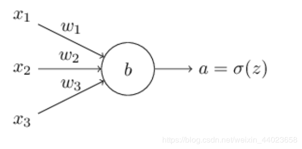

# 交叉熵代价函数

原文：https://www.toutiao.com/a6854132616061420044/

https://blog.csdn.net/XiaoXIANGZI222/article/details/53897516?utm_source=blogxgwz9

交叉熵代价函数（Cross-entropy cost function）是用来衡量人工神经网络（ANN）的预测值与实际值的一种方式。与二次代价函数相比，它更有效地促进ANN的训练。在介绍交叉熵代价函数之前，先介绍二次代价函数，以及其存在的不足。

## 二次代价函数的不足

ANN的设计目的之一是为了使机器可以像人一样学习知识。人在学习分析新事物时，当发现自己犯的错误越大时，改正的力度就越大。比如投篮：当运动员发现自己的投篮方向偏离正确方向越远，那么他调整的投篮角度就应该越大，篮球就更容易投进篮筐。同理，我们希望，ANN在训练时，如果预测值与实际值的误差越大，那么在反向传播训练的过程中，各种参数调整的幅度就要更大，从而使训练更快收敛。然而，如果使用二次代价函数训练ANN，看到的实际效果是：如果误差越大，参数调整的幅度可能更小，训练更缓慢。

以一个神经元的二类分类训练为例，进行两次实验（ANN常用的激活函数为sigmoid函数，该实验也采用该函数）：输入以相同的样本数据 $x = 1.0$ （该样本对应的实际分类 $y = 0$ ）；两次实验各自随机初始化参数，从而在各自的第一时间前向传播后得到不同的输出值，形成不同的代价（误差）：

二次实验分析：第一次输出值为0.82的实验一中，随机初始化参数，使得第一次输出值为0.82（该样本对应的实际值为0）；经过300次迭代训练后，输出值有0.82降到0.09，逼近实际值。而在实验二中，第一次输出值为0.98，同样经过300次迭代训练，输出值只降到了0.20。

从两次实验的代价曲线中可以看出：实验一的代价随着训练次数增加而快速降低，但实验二的代价在一开始下降得非常缓慢；直观上看，初始的误差越大，收敛得越缓慢。

其实，误差大导致训练缓慢的原因在于使用了二次代价函数。二次代价函数的公式如下：
$$
C = \frac{1}{2n}\sum_x{\|y(x) - a^L(x) \|^2}
$$
其中，$C$ 代表代价，  $x$ 表示样本， $y$ 表示实际值， $a$ 表示输出值， $n$ 表示样本的总数。为简单起见，同样一个样本为例进行说明，此时二次代价函数为：
$$
C = \frac{(y - a)^2}{2}
$$
其中：

* $a = \sigma(z) $
* $ z = \sum{W_j * X_j} + b $
* $ \sigma() 是激活函数 $

**目前训练ANN最有效的算法是反向传播算法**。简而言之，训练ANN就是通过反向传播代价，以减少代价为导向，调整参数。参数主要有：神经元之间的连接权重 $w$，以及每个神经元本身的偏置 $b$。调参的方式 是采用梯度下降算法 ( Gradient descent )，沿着梯度方向调整参数大小。$W$ 和 $b$ 的梯度推导如下：
$$
\frac{\partial {C}}{\partial {w}} = (a - y)\sigma' (Z)x\\
\frac{\partial {C}}{\partial {b}} = (a - y)\sigma' (Z)
$$
其中：

* $Z$ 表示神经元输入
* $\sigma$ 表示激活函数

$w$ 和$b$ 的梯度跟激活函数的梯度成正比，激活函数的梯度越大，$w$ 和$b$ 的大小调整的越快，训练收敛得就越快。而神经网络常用的激活函数为 $sigmoid$ 函数，该函数的曲线如下图所示：

如图所示，实验二的输出值（0.98）对应的梯度明显小于实验一的输出值（0.82），因此实验二的参数梯度下降得比实验一慢。这就是初始的代价（误差）越大，导致训练越慢的原因。与我们的期望不符，即：不能像人一样，错误越大，改正的幅度越大，从而学习得越快。

​        可能有人会说，那就选择一个梯度不变化或变化不明显的激活函数不就解决问题了吗？图样图森破，那样虽然简单粗暴地解决了这个问题，但可能会引起其他更多更麻烦的问题。而且，类似 $sigmoid$ 这样的函数（比如 $tanh$ 函数）有很多优点，非常适合用来做激活函数。

## 交叉熵代价函数的定义

那么如何解决这个问题呢？研究表明，可以通过使用交叉熵函数来替换二次代价函数。为了理解什么是交叉熵，稍微改变一下之前的例子。

假设，现在要训练一个包含若干输入变量的神经元，$x_1, x_2, ...$ 对应的权重为 $w_1, w_2, ...$ 和偏置值 $b$：

神经元输出就是 $\alpha = \sigma(z)$ ，其中 $z = \sum_j{w_{j \times j} + b}$ 是输入的带权和。定义这个神经元的交叉熵代价函数：
$$
c = -\frac{1}{n} \sum_x{[y ln{a} + (1 - y)ln(1 - a)]}
$$
其中，

* $n$ 是训练数据的总数
* 求和是对所有的训练输入 $x$ 上进行的
* $y$ 是对应的目标输出

