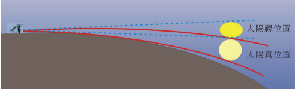
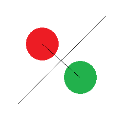
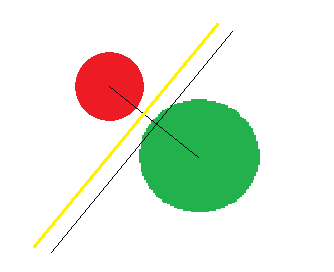

# 什么是马氏(Mahalanobis)距离

原文：https://blog.csdn.net/weixin_41770169/article/details/80759195

## 一. Mahalanobis距离的数学定义

### 1.1 马氏距离的数学定义

1. 通用的马氏距离定义：

$$
D_M(x) = \sqrt{(x - \mu)^T \sum{}^{-1} (x-\mu)}
$$

说明：

* 这里的 $\mu$ 是一系列数据的**均值**，定义为 $\mu = (\mu_1, \mu_2, \cdots, \mu_p)^T$
* 协方差矩阵为 $\sum$ 的多个变量 $x = (x_1, x_2, \cdots, x_p)^T$
* $(x_1,x_2,\cdots,x_p)^T$：表示矩阵的转置
* $T^{-1}$ ：表示矩阵T的逆，有性质 $T(T^{-1}) = (T^{-1}T) = I$ 。这里的 $\sum_{}^{-1}$ 就是协方差矩阵的逆

2. 数据点 $x$ 和 $y$ 之间的马氏距离：

$$
D_M(x,y) = \sqrt{(x - y)^T \sum{}^{-1} (x - y)}
$$

说明：

* 如果 $\sum_{}^{-1}$ 是一个单位矩阵，则马氏距离就简化成了欧式距离

### 1.2 概念解释

* **均值**：描述的是样本集合的中间点。公式可以表示为 $\bar{X} = \frac{\sum_{i=1}^{n}X_i}{n}$
* **标准差**：数据集中各个点到**均值点**距离的平均值，反应的是数据的离散程度，公式表示为 $s = \sqrt{\frac{\sum_{i=1}^{n}(X-\bar{X})^2}{n-1}}$
* **方差**：方差是**标准差**的平方。如果标准差是 $s$  ，那么方差表示为 $s^2 = \frac{\sum_{i=1}^{n}(X-\bar{X})^2}{n-1}$
* **协方差**：标准差与方差是描述**一维数据**的，当存在多维数据时，通常需要知道每个维数的***变量中间是否存在关联***。协方差就是衡量多维数据集中，变量之间相关性的统计量。比如说，一个人的身高与他的体重的关系，这就需要用协方差来衡量。
  * 如果两个变量之间的协方差为正值，则这两个变量之间存在正相关
  * 若为负值，则为负相关
  * 若结果为 $0$，则这两个变量之间没有关系，相互独立
* **协方差矩阵**：当变量多了，超过两个变量了，那就用协方差矩阵来衡量这么多变量之间的相关性。假设 $X$ 是以 $n$ 个随机变数（其中的每个随机变数是也是一个向量，当然是一个行向量）组成的列向量

### 1.3 协方差

协方差可以用如下的数学公式描述：
$$
\ \ \ \ \ \ \ \ \ \ \ \ \ \ cov(X,X) = \frac{\sum_{i=1}^{n}(X_i - \bar{X})(X_i - \bar{X})}{n -1} , \ 同维度，形成方差\\ 
cov(X,Y) = \frac{\sum_{i=1}^{n}(X_i - \bar{X})(Y_i - \bar{Y})}{n -1} , \ 不同维度
$$
而且有如下性质：
$$
\ \ \ \ \bullet cov(X,X) = cov(X) = s^2\\
\bullet cov(X,Y) = cov(Y, X)
$$

### 1.4 协方差矩阵

多个维度，就构成了**矩阵**。比如，有一个三维的协方差矩阵，可以表示如此；
$$
C = \begin{pmatrix}
  cov(x,x)& cov(x,y)& cov(x,z) \\
  cov(y,x)& cov(y,y)& cov(y,z) \\
  cov(z,x)& cov(z,y)& cov(z,z)
\end{pmatrix}
$$
可见，协方差矩阵是一个对称的矩阵，而且对角线是各个维度上的方差。

## 二. Mahalanobis距离的现实意义

那么马氏距离又能干什么？举例说明。

### 2.1 第一个例子

从下往上的一段50米长的坡道路，下面定一个A点，上面定B一个点。假设有两种情况从A到B：

1. 坐手扶电梯上去

2. 从手扶电梯旁边的楼梯爬上去

两种情况下分别会产生两种不同的主观感受，坐电梯轻松愉快，感觉很快就从A到了B——“A与B真近~”；走楼梯爬的气喘吁吁很累，感觉走了好久才走到B——“A与B真远！”。

### 2.2 第二个例子

观看落日之时，由于大气的折射效应，太阳形状产生形变并且视觉位置也比真实位置高。如下图：

### 2.3 现实意义

以上两个例子看似和模式识别没有关系，实际上都引入了“相对论”的问题。

回到问题本身，欧式距离就好比一个参照值，它表征的是当所有类别**等概率**出现的情况下，类别之间的距离。此时决策面中心点的位置就是两个类别中心的连线的中点，如下图的左图所示。

而当类别**先验概率**并**不相等**时，显然，如果仍然用中垂线作为决策线是不合理的，将出现判别错误（绿色类的点被判别为红色类），假设下图左图中绿色类别的先验概率变大，那么决策线将左移，如下图右图的黄线。左移的具体位置，就是通过马氏距离来获得的。**马氏距离中引入的协方差参数，表征的是点的稀密程度**。

 

用马氏距离处理数据时，不再把数据单纯的看作是冷冰冰的数字——那个**引入的协方差，承认了客观上的差异性**，就好像是有了人类的感情倾向，使得模式识别更加“人性化”也更加“视觉直观”。

