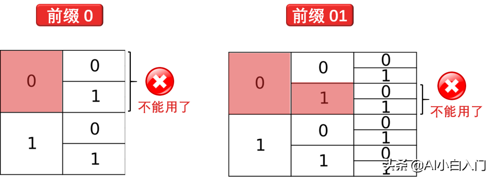

# 熵、交叉熵和 KL 散度

原文：https://www.toutiao.com/a6801117741412516365/

## 物理概念的熵

​        熵（Entropy）是物理中的一个概念。如下图，谁有三种状态：固态、液态和气态，分别以冰、水和水蒸气的形式存在：

它们具备不同的熵值：

* 冰中的分子位置固定，处于稳定状态，因此冰具有低熵值
* 水中的分子相对可以进行一些移动，因此水具有中熵值
* 水蒸气中的分子几乎可以移动到任何地方，因此水蒸汽具有高熵值

现在大致有这样的感觉：**越不稳定的东西具有的熵值越大**。

​        世界处处充满不确定性，从不确定到确定肯定是得到了额外的信息。从计算机专业术语来讲，**比特**（BIT, Binary Digit）是衡量信息的单位。 那么就先不严谨的认为，比特可用 0 或 1 代表，而**传递 1 比特信息 = 将不确定性减半**

## 等概率事件的信息量

​        从物理切换到体育，假设马赛克队的哈登每次进攻，50% 机会投篮， 50% 机会灌篮，如下图所示：

​        如果预测他会投篮，或者他会灌篮，先把两种情况减少到了一种情况，将不确定性减半，发出 **1 bit** 的信息，计算公式如下：
$$
log_2{(2)} = log_2{(\frac{1}{50\%})} = 1
$$
信息（*1 Bit*）和概率（*50%*）联系起来了。

​        类比一下：

* 2种情况，每种发生的概率是 $\frac{1}{2} = \frac{1}{2^1}$， 预测任意一种情况发出 *1 bit* 信息
* 4种情况，每种发生的概率是 $\frac{1}{4} = \frac{1}{2^2}$，预测任意一种情况发出 *2 bit* 信息
* 8种情况，每种发生的概率是 $\frac{1}{8} = \frac{1}{2 ^ 3}$，预测任意一种情况发出 *3 bit* 信息
* $N$ 种情况，每种发生的概率是 $\frac{1}{2 ^ N}$，预测任意一种情况发出 *N bit* 信息

## 不等概率事件的信息量

​        等概率发生的事件理解起来容易，那如果哈登每次进攻，75% 机会投篮，25% 的机会灌篮呢？如下图所示：

这时可以把它等价想象成有四个事件，3 个投篮事件和 1 个灌篮事件：

那么，可以得到这样的分析：

* 如果预测投篮，相当于把4个事件的不确定性变成到3个事件的确定性，放缩程度是 $\frac{4}{3}$， 也正好是 $\frac{1}{75 \%}$，这时发出的比特信息量是 $log_2{\frac{4}{3}} = 0.42$ 个bit
* 如果预测灌篮，相当于把4个事件的不确定性变成到1个事件的确定性，放缩程度是 $\frac{4}{1}$，也正好是 $\frac{1}{25 \%}$，这时发出的比特信息量是 $log_2{4} = 2$ 个bit

如果平均来看，发出的信息量应该是：
$$
75\% \times 0.42 + 25\% \times 2 = 0.81 (bit)
$$

## 熵 = 平均信息量

​        现在归纳一下，对于有 $p$ 概率发生的一个事件，预测该事件发生等价于发出 $log_2{\frac{1}{p}}$ *bit* 信息，因为 $log_2{\frac{1}{x}} = -log_2{x}$，可以将信息量写成：
$$
I_{信息量} = -log_2{p}
$$
​        考虑到所有事件，平均信息量的公式为（期望公式）：
$$
I_{平均信息量} = -\sum_i{p_i} \times log_2{p_i}
$$
​        **平均信息量就是信息论中的熵**，用符号 $H(p)$ 表示（p代表 $p_1, p_2, ..., p_n$），因此有：
$$
H(p) = -\sum_i p_i \times log_2{p_i}
$$

## 等概率事件编码

​        某天看不了 NBA 直播，只能通过在美国的朋友小明发短信直播，他会告诉我哈登每次进攻的手段：三分、上篮、灌篮、两分：

​        但是小明用二进制密码和我交流，我收到的短信是下面这样子的：

0 1 0 0 1 0 0 0

​        为了理解短信的真实含义，我需要一个解码表，如下：

​        这样，就可以把小明传的密码分段，然后将每段密码在解码表中找到对应的动作，因此 **01001000** 就解码成**上篮三分灌篮三分**。

​        假设哈登两分、三分、上篮、灌篮这四个动作是等概率发生，那面可以给**编码长度**（横轴）和**动作频率**（纵轴）做一个可视化，如下图：

​        图中彩色面积之和就表示每次短信说一个动作所需要的密码的期望长度，显然在这种情况下，期望长度为 2 比特。

## 不等概率事件编码

​        如果哈登进攻手段（两分、三分、上篮、灌篮）不是等概率发生呢？哈登最喜欢投三分（1/2 时间），再就是上篮（1/4 时间），而投两分（1/8 时间）和上篮（1/8 时间）比较少。

​        每个动作还是用长度为 2 的密码编码时，那么最后得到的期望长度还是 2 比特，如下图所示

​        要知道从小明美国从发短信很贵啊，按编码长度收钱的，他可以做的更好一点么（即编码更短一些）？先看下图：

​        现在每次短信的期望密码长度变成了 1.75 比特，好过 2 比特。

​        其实做法很简单，就

* 对于高频的动作（三分），用短编码（0）
* 对于低频的动作（两分），用长编码（111）

因此，上面**上篮三分灌篮三分**的编码为 **10 0 111 100**。

​        问题来了，当解码的时候，我怎么把这一串编码拆分为对应到每个动作的一个个编码呢？如果每个动作的编码长度都一样，我那还可以等分，但现在每个每个动作的编码长度都不一样。

## 信息论

​        正式了解一下编码：

- 长度为 1 的编码有 2 个：{0, 1}
- 长度为 2 的编码有 4 = 2 * 2 个：{00, 01, 10, 11}...
- 长度为 N 的编码有 2 * N 个：{太多了，这里写不下了……}

​        每次只要加 1 比特，编码种数就翻倍。如下图：

​        如果每个编码长度相等，那么一串编码就有**唯一**的解码方式。比如 01101110 就可以解码成 01-10-11-10，简单。

​        如果每个编码长度不相等，那么一串编码可以用同解码方法，比如 01101110 可以解码成以下两种（其实有很多种）

- 0 - 11 - 01 - 110
- 01 - 110 - 111 - 0

​        这样不就乱套了，必须采取限制，有个规则叫 prefix codes，就是**任何编码都不能是其他编码的前缀**。举例

- 如果你用了 0，你就不能再用以 0 开头的其他编码，如 01, 001, 011 ...
- 如果你用了 01，你就不能再用以 01 开头的其他编码，如 011, 011111 ...

​        从上图可知：

- 如果你用了 0，你失去了 1/2 的编码空间了
- 如果你用了 01，你失去了 1/4 的编码空间了

​        这就是代价，这需要权衡，当你对一个动作用了短编码，你就需要对其他动作用个长编码。

​        下图就是一种编码，而且是最优编码（这个就不证明了，需要用到拉格朗日算子，目测没有小孩可以懂）：

​        这样我们就给每一个进攻动作一个密码：

- 两分 - 0
- 三分 - 10
- 上篮 - 110
- 灌篮 - 111

​        用上面一串密码来编码不会有任何歧义了。

## 复习一下熵

​        现在知道**最优编码长度就是熵** （通常上面一节解释，希望现在可以秒懂熵的公式）：
$$
H(p) = -\sum_x p(x) \times log_2{p(x)}
$$
​        无论怎么修改编码，如果一个随机事件的概率定下来了，那么用于交流该事件用的平均编码长度不会**低于**基于该事件分布的熵：

* 如果很确定会发生什么事，那么就根本没有发送信息的必要
* 如果某件事情有2种可能，概率分别是 50%， 那么只要发送 *1 bit*
* 如果有64种可能，每种发生的可能性都一样，那么平均需要 *6 bit*

​        实际上，如果这些可能性中，每件事发生的概率相对集中，那么所需要的平均编码长度就更短，而如果概率相对分散，那么需要的平均编码长度就更长。均匀分布需要的平均编码长度最长。

## 交叉熵

​        小明通过研究哈登的历史进攻动作发生频率（三分 $\frac{1}{2}$，上篮 $\frac{1}{4}$，灌篮和两分 $\frac{1}{8}$ ），做了一套编码（定义为**哈登编码**），每次传递一次信息只用 *1.75 bit*。

​        现在又想让小明发送威少的下一个进攻动作，还可以用**哈登编码**来传递信息吗？威少的历史进攻动作发生频率如下：

- 三分 $\frac{1}{8}$
- 上篮 $\frac{1}{2}$
- 灌篮 $\frac{1}{4}$
- 二分 $\frac{1}{8}$

​        下图对比一下哈登和威少的进攻动作频率图：

​        

​        这样，如果用哈登编码来发送威少动作分布的信息，得到信息平均编码长度就叫做**交叉熵**。

​        反过来，如果用威少编码来发送哈登动作分布的信息，得到信息平均编码长度就也叫做**交叉熵**。

​        **正规定义：使用专门为另一个分布制作的密码表来发送某个分布中事件的信息，此时信息的平均编码长度定义为交叉熵（cross-entropy）。**

​        把哈登动作分布称为 p 分布，把威少动作分布称为 q 分布，那么 p 分布对 q 分布的交叉熵公式如下
$$
H_p(q) = \sum_x q(x) \times log_2(\frac{1}{p(x)})
$$
而 q 分布对 p 分布的交叉熵公式如下（把 p 和 q 位置反过来）：
$$
H_q(p) = \sum_x p(x) \times log_2(\frac{1}{q(x)})
$$
​        熵和交叉熵的总结在下图：

​        根据上面公式计算各种熵和交叉熵，得到

- 用哈登编码传递哈登进攻信息 $$H(p) = 1.75$$  bit
- 用哈登编码传递威少进攻信息 $$ H_p(q) = 2.25$$ bit
- 用威少编码传递威少进攻信息 $$H(q) = 1.75$$ bit
- 用威少编码传递哈登进攻信息 $$H_q(p) = 2.375$$ bit

**发现两个规律：**

1. 熵**小于**交叉熵（符合熵是最优编码的结论）

2. 1. $$ H(p) = H_p(p)< H_q(p) $$
   2. $$ H(q) = H_q(q) < H_p(q) $$

3. 交叉熵**不对称**

4. $$ H_q(p) ≠ H_p(q) $$

熵比交叉熵要小，那两者之间的差距是什么？看看LK散度。

## KL 散度

​        **Kullback-Leibler 散度**（KL 散度，***库尔贝克-莱布勒*** 散度）是熵与交叉熵之间的差值。称之为散度而不是距离是因为距离是对称的，而**散度可以是不对称的**。

​        回到之前的场景，把哈登动作分布称为 p 分布，把威少动作分布称为 q 分布，那么 p 分布对 q 分布的 KL 散度定义为：
$$
KL_p(q) = H_p(q) - H(q) = \sum_x q(x) \times log_2(\frac{q(x)}{p(x)})
$$
而q分布对p分布的LK散度定义为：
$$
KL_q(p) = H_q(p) - H(p) = \sum_x p(x) \times log_2(\frac{p(x)}{q(x)})
$$
上面 **$log_2(\frac{q(x)}{p(x)})$** 或 **$log_2(\frac{p(x)}{q(x)})$** 实际上是描述编码每个进攻动作时两种不同的编码之间的长度差异。

分布 p 和 q 差别越大，那么它们之间的 KL 散度 $KL_q(p)$ 和 $KL_p(q)$ 也就越大。

## 总结

​        最后看看湖人队的麦基，他进攻手段只有灌篮，如下图所示：

不需要做什么预测（不需要发出任何信息），因此麦基 $100\%$ 会灌篮，根据公式有：
$$
H(p) = - 0×log_20 - 1×log_21 = 0
$$
我们知道 $log_21 = 0$，而且需要定义 $log_20 = 0$。

​        如果某件事本身越不确定，而当你知道发生了什么时，你得到的信息也就越多。

**交叉熵**，即使用针对另一分布制作的密码表对某个分布内的事件进行通讯时的长度，其组成分为两部分：

1. 使用针对本分布密码表进行通讯时所需的最短平均编码长度，即**熵**
2. 因使用针对其他分布的密码表而导致的多出的部分，即 **KL 散度**

数学表达式如下：

* 交叉熵p(q) = 熵(q) + 散度p(q)

* 交叉熵q(p) = 熵(p) + 散度q(p)

最后提一下：**机器学习用的熵公式里面的对数都是以 $e$ 为底**，即 $ln()$，它和以 2 为底的对数只差一个大于零的常数项，我们有：
$$
ln(x) = \frac{log_2(x)}{log_2e} = c \times log_2(x)
$$
因此在做极值问题时，不会对结果有什么影响。

