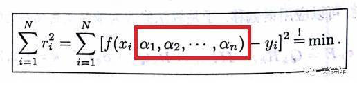
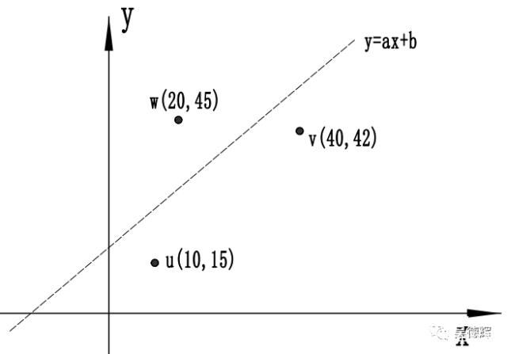
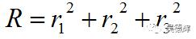
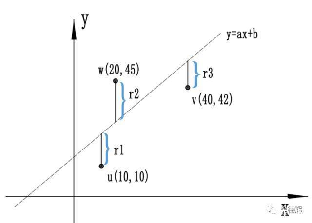
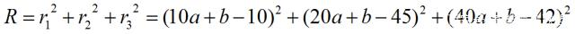

# 最小二乘法的拟合原理

原文：https://blog.csdn.net/weixin_41797870/article/details/84898594?utm_medium=distribute.pc_relevant.none-task-blog-BlogCommendFromMachineLearnPai2-2.control&depth_1-utm_source=distribute.pc_relevant.none-task-blog-BlogCommendFromMachineLearnPai2-2.control

## 最小二乘法的定义

根据《数学指南》书中的解释：

​                                                图1. 《数学指南》中对最小二乘法的解释

定义比较枯燥无趣，现在慢慢来理解定义。这句话的意思是说，拟合有两个前提：

* 要有N个不同的点 (X1, X2,.., Xn )的测量值 (Y1, Y2,..., Yn)，说得简单一点，就是要用三坐标在零件上采很多不同位置的点，如(X1, Y1), (X2, Y2)..., (Xn, Yn)
* 要有目标，就是要知道想把这些点拟合成什么样的特征，即所谓的给定函数 fx, a1, a2..., an)。比如说，用三坐标在零件上菜了很多点，想把它拟合成圆还是拟合成平面？这个需要在拟合前知道

继续，假设想把采的点拟合成一个平面，但是这个平面在空间坐标系中的位置、方向我们并不知道。也就是说，要确定这个平面在三维坐标系中的具体方程，就必须要知道那个给定函数 f(x, a1, a2, ..., an)中的参数a1, a2,..., an

明白了吧，最终目标就是求这些a1, a2, ..., an。 而求解这些参数的过程就是“神秘”的拟合。

拟合有很多种，只是你和满足的条件不同。其中有一种只要满足下面的条件：

​                                                        图2 高斯法

这种拟合方法，就是最小二乘法，也就是高斯法。

## 举例说明最小二乘

根据上面的定义，拟合需要2个前提条件：

* 条件一：假设在一个平面上采了三个点，分别是 u(10,10), v(40,42), w(20,45)
* 条件二：想把这三个点拟合成一条直线。这条直线的方程则是 y=ax + b

如果a，b的树枝不一样，那么这条直线在空间中的方向和位置也不一样。所以，所谓的拟合过程，就是求解直线方程中的a和b的值的过程（这里的a，b也就是前面方程提到的a1, a2, ..., an)。一旦a、b的值确定了，那么这条直线也就可以得到了。例如：

​                                                图3 一个拟合结果

如何确定a和b呢？根据图2的公式，条件是要求Y方向的差值的平方和**最小**。

即要求下面公式中的R最小：

关于r1，r2，r3，如下图：

​                                                                 图4 高斯拟合原理

由图4不难得出：

* r1 = 10a +b-10
* r2 = 20a + b-45
* r3 = 40a + b - 42

则有：

求解的过程就是求：当R处于最小值时，对应的a、b的值。如果真要手工计算这个过程，要用到高数中的求偏导，有兴趣的可以自行研究（恶补）。

这里给出计算结果： a=1.4009， b = -0.3482

现在就可以得到这个例子最终的最小二乘拟合计算出来的直线： f(x) = 1.4009 x - 0.3482， 在平面直角坐标系的图像为：

​                                                                 图5 例子的最小二乘法结果

实际上，我们平时遇到的问题比这个demo复杂很多，常常是变量就是一个多维度的向量，每个向量又是受多个因素制约，常常要用矩阵方式表达。

通过上面的例子，可以知道最小二乘法的特点：

* 最小二乘法拟合出来的特征是理想的

* 最小二乘法拟合出来的特征是唯一的

* 如果没有附加特别的约束（即a1, a2, ... , an 之间需要满足某种关系），最小二乘法拟合出来的理想特征，一定在拟合点之间（不是最中间）

* 最小二乘法具备“民主性”，即倾向于（大）多数。

  

  ​                                                                 图6 最小二乘法的民主性

## 应用场景

