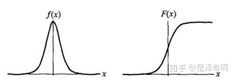
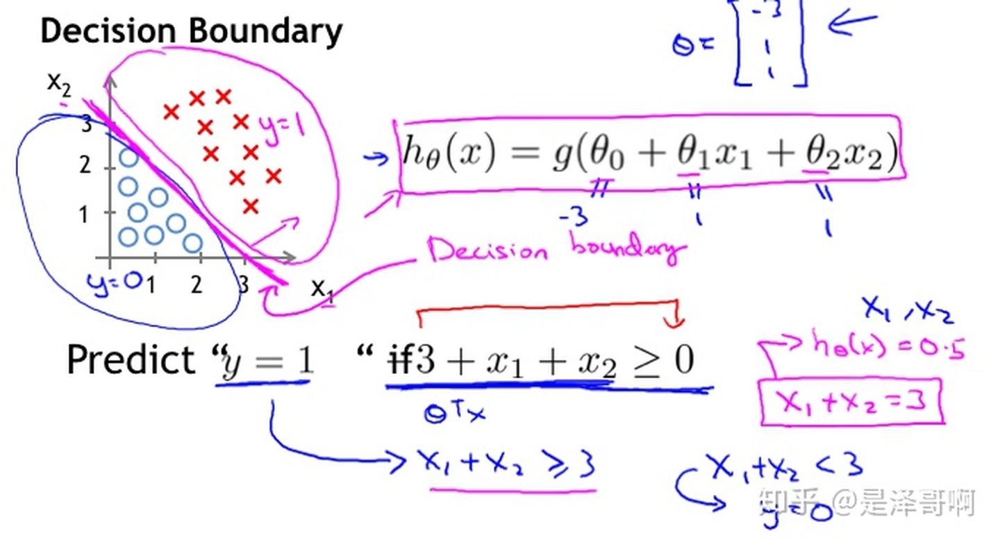

# 逻辑回归

原文： https://zhuanlan.zhihu.com/p/74874291

罗辑回归是一个非常经典的算法，其中也包含了非常多的细节。曾经看到一句话：如果面试官熟悉哪个机器学习模型，可以说SVM，千万别说LR，因为细节真的太多了。

## 模型介绍

Logistic Regression虽然被称为回归，但实际上是分类模型，并常用于二分类。Logistic Regression因其简单、可并行化、可解释性强，深受工业界喜爱。

Logistic Regression的本质是：假设数据服从这个分布，然后使用极大似然估计做参数的估计。

### Logistic分布

Logistic分布式是一种连续型的概率分布，其**分布函数**和**密度函数**分别是：

其中，![[公式]](./images/logisticRegression/u.svg)表示**位置参数**，![[公式]](./images/logisticRegression/lambda.svg)为**形状参数**。可以看下图，这两个函数的图像分布：

Logistic分布是由其**位置**和**尺度**参数定义的连续分布。Logistic分布的形状和正态分布的形状相似，但是Logicstic分布的尾部更长，所以可以使用Logistic分布来建模，比正态分布更具有更长尾部和更高波峰的数据分布。在深度学习中常用到的Sigmoid函数就是Logistic的分布函数在的特殊形式。

### Logistic回归

上面说到Logistic回归主要用于分类问题，以**二分类**为例，对于所给数据集假设存在这样的一条直线，可以将数据完成线性可分。

决策边界可以表示为，假设某个样本点那么可以判断它的类别为1，这个过程其实是感知机。

Logistic回归还需要加一层，它要找到分类概率P(Y=1)与输入向量x的直接关系，然后通过比较概率值来判断类别。

#### 考虑二分类问题

给定数据集

考虑到取值是连续的，因此它不能拟合离散变量。可以考虑用它来拟合条件概率，因为概率的取值也是连续的。

但是对于（若等于0向量，则没有什么求解的价值），取值为 R，不符合概率取值为 0 到 1 ，因此考虑采用广义线性模型。

最理想的是单位阶跃函数：

但是这个阶跃函数不可微，对数几率函数是一个常用的替代函数：

于是有：

将y视为x为正例的概率，则 1-y 为 x 为其反例的概率。两者的比值称为**几率（odds）**，指该事件发生与不发生的概率比值，若事件发生的概率为p，则对数几率：

将y视为类后验概率估计，重写公示：

也就是说，输出y=1 的对数几率是由输入x的**线性函数**表示的模型，这就是**逻辑回归模型**。当的值越接近正无穷，概率值也越接近 1。因此罗辑回归的思路是，先拟合决策边界（不局限于线性，还可以是多项式），再建立这个边界与分类的概率联系，从而得到了二分类情况下的概率。

在这我们思考个问题，我们使用对数几率的意义在哪？通过上述推导，可以看到Logistic回归实际上是使用线性回归模型的预测值逼近分类任务真实标记的对数几率，其优点是：

1. 直接对**分类的概率**建模，无需实现假设数据分布，从而避免了假设分布不准确带来的问题（区别于生成式模型）
2. 不仅可以预测出类别，还能得到该预测的概率，这对一些利用概率辅助决策的任务很有用
3. 对数几率函数是任意阶可导的凸函数，有许多数值优化算法都可以求出最优解

### 代价函数

逻辑回归模型的数学形式确定后，剩下就是如何去求解模型中的参数。在统计学中，常常使用极大似然估计法来求解，即找到一组数，使得在这组参数下，我们的数据的似然度（概率）最大。

设：

似然函数：

为了更方便求解，对等式两边同取对数，写成对数似然函数：

在机器学习中，我们有损失函数的概念，其衡量的是模型预测错误的程度。如果取整个数据集上的平均对数似然损失，可以得到：

即在逻辑回归模型中，**最大化似然函数**和**最小化损失函数**实际上是等价的。

### 求解