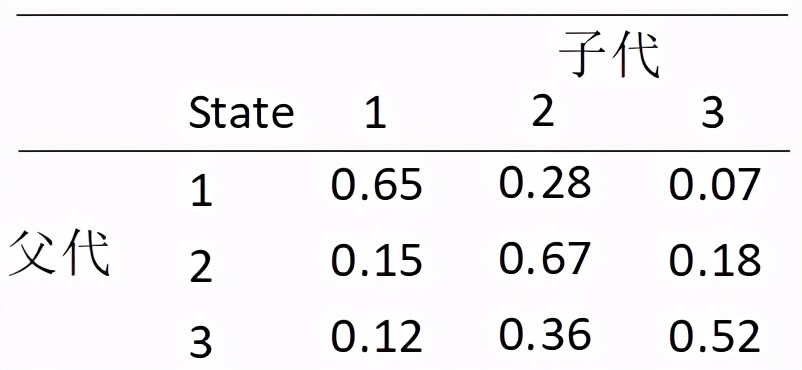
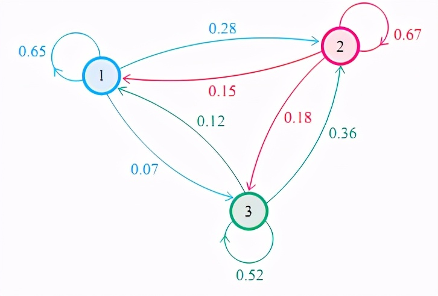
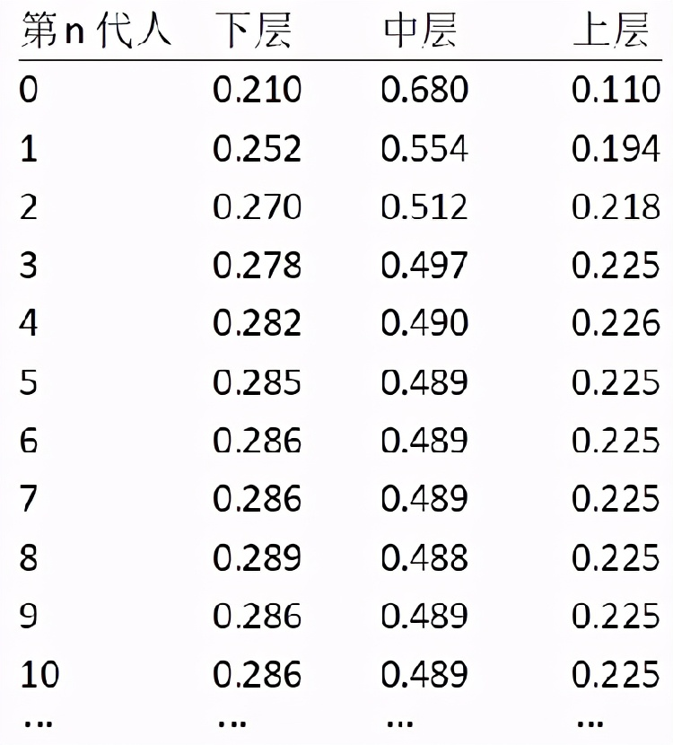
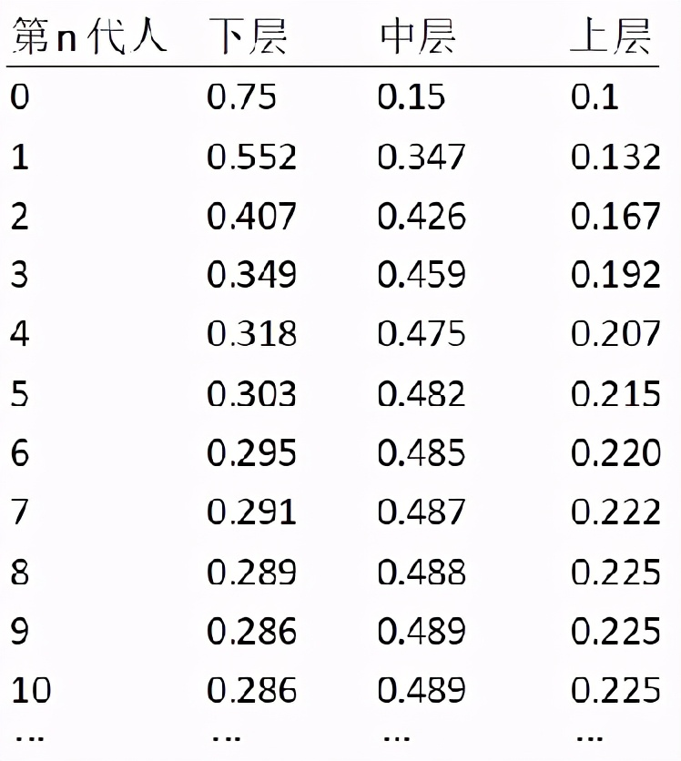

# 马尔可夫链蒙特卡洛法(MCMC)

原文：https://www.toutiao.com/i6955086840999182861/

## 一. 引言

马尔可夫链蒙特卡洛方法(Markov Chain Monte Carlo)，简称MCMC。其产生于20世纪50年代早期，是**[在贝叶斯理论框架下](./Bayes_theorem.md)，通过计算机进行模拟的蒙特卡洛方法(Monte Carlo)**。该方法将马尔可夫(Markov)过程引入到Monte Carlo模拟中，实现抽样分布随模拟的进行而改变的动态模拟，弥补了传统的蒙特卡罗积分只能静态模拟的缺陷。

Metropolis等人在1953年首次提出了基于马尔可夫链的蒙特卡罗方法，即 Metropolis 算法，并在最早的计算机上编程实现。Metropolis算法是首个普适的采样方法，并启发了一系列 MCMC 方法，所以人们把它视为随机模拟技术腾飞的起点。 Metropolis算法这篇论文[1]被收录在《统计学中的重大突破》中，《Computing in Science & Engineering》尝试列出了对20世纪科学与工程的发展和实践影响最大的十种算法：

- Metropolis Algorithm for Monte Carlo
- Simplex Method for Linear Programming
- Krylov Subspace Iteration Methods
- The Decompositional Approach to Matrix Computations
- The Fortran Optimizing Compiler
- QR Algorithm for Computing Eigenvalues
- Quicksort Algorithm for Sorting
- Fast Fourier Transform
- Integer Relation Detection
- Fast Multipole Method

Metropolis Algorithm for Monte Carlo 被列为十大算法之首。 用于蒙特卡洛的Metropolis算法定义了一个收敛的马尔可夫链，其极限就是所需的概率分布。Metropolis算法及其推广算法已被称为蒙特卡洛马尔可夫链技术(MCMC)，因为这些算法模拟了一个马尔可夫链，从极限分布中获取抽样。

搞自然科学研究的人，MCMC应该是基本装备。所谓平生不识MCMC, 便称英雄也枉然。

## 二. MCMC的两大贴身护卫

​        MCMC由两个MC组成，即**马尔可夫链**(Markov Chain ，也简称MC)和**蒙特卡洛法**（Monte Carlo Simulation，简称MC）。要弄懂MCMC的原理我们首先得搞清楚马尔科夫链的原理和蒙特卡罗法。

### 2.1 马尔可夫链及其平稳分布

#### 2.1.1 定义

​        马尔可夫链的命名来自俄国数学家安德雷.马尔可夫以纪念其首次提出马尔可夫链和对其收敛性质所做的研究。

​        马尔可夫链是一组具有马尔可夫性质的离散随机变量的集合。所谓**马尔可夫性质**是指某一时刻状态转移的概率只依赖于它的前一个状态。具体地，**马氏链的数学定义**:

​        对概率空间内的***离散随机变量***集合：$X = \{x_n : n > 0 \}$ , 若随机变量的取值都在***可数集***$S$内：$X_t = s_i, s_i \in S $, 且随机变量的条件概率满足如下关系：$P(X_{t+1}|X_t,X_{t-1},\cdots) = P(X_{t+1}|X_t)$ ， 则随机变量集合$X$被称为马尔可夫链，可数集$S$被称为***状态空间***，马尔可夫链在状态空间内的取值称为状态。

​        马氏链某一时刻状态转移的概率只依赖于它的前一个状态，这样定义，可以大大简化模型的复杂度，因此马氏链在很多时间序列模型中得到广泛的应用，比如循环神经网络RNN，隐式马尔科夫模型HMM等，当然MCMC也需要它。

​        马尔可夫过程通常分为3类：

- 时间、状态都是离散的，称为马尔可夫链。
- 时间连续、状态离散的，称为连续时间的马尔可夫链。
- 时间连续、状态连续的，称为马尔可夫过程。

可见马氏链是时间、状态都是离散的马尔可夫过程。

#### 2.1.2 马氏链转移概率矩阵和收敛现象

​        先来看马氏链的一个具体的例子。社会学家经常把人按其经济状况分成3类：下层(lower-class)、中层(middle-class)、上层(upper-class)，我们用1、2、3分别代表这三个阶层。社会学家们发现决定一个人的收入阶层的最重要的因素就是其父母的收入阶层。如果一个人的收入属于下层类别，那么他的孩子属于下层收入的概率是0.65，属于中层收入的概率是0.28，属于上层收入的概率是0.07。事实上，从父代到子代，收入阶层的变化的转移概率如图2-1和图2-2：

​                                                                                                图2-1

​                                                                                                图2-2

设状态空间S={1,2,3} (1、2、3分别代表人的收入阶层：下层、中层、上层), 使用矩阵的表示方式，**转移概率矩阵**记为:
$$
p = \begin{bmatrix}
  0.65&  0.28& 0.07\\
  0.15&  0.67& 0.18\\
  0.12&  0.36& 0.52
\end{bmatrix}
$$
假设当前这一代人处在下层、中层、上层的人的比例是概率分布向量：
$$
\pi_0 = \begin{bmatrix} \pi_0(1) \\ \pi_0(2)\\ \pi_0(3) \end{bmatrix}
$$
那么他们的子女的分布比例将是：
$$
\pi_1= \pi_0P
$$
他们的孙子代的分布比例将是：
$$
\pi_2= \pi_1P = \pi_0P^2
$$
第n代子孙的收入分布比例将是：
$$
\pi_n= \pi_{n-1}P = \pi_0P^n
$$
假设初始概率分布为$\pi_0=[0.21,0.68,0.11]$ (*出于形式，写成横式*)，则我们可以计算前n代人的分布状况如下：

发现从第7代人开始，这个分布就稳定不变了，这个是偶然的吗？换一个初始概率分布$\pi_0=[0.75,0.15,0.1]$试试看，继续计算前n代人的分布状况如下：

发现，到第9代人的时候, 分布又收敛了。最为奇特的是，两次给定不同的初始概率分布，最终都收敛到概率分布 $\pi =[0.286,0.489,0.225]$，也就是说收敛的行为和初始概率分布 $\pi_0$无关。这说明这个收敛行为主要是由概率转移矩阵 $P$ 决定的。计算一下 $P$ 的 $n$ 阶矩阵为：
$$
P^20 = P^{21} = \cdots = P^{100} = \cdots = 
     \begin{bmatrix} 
     0.286& 0.489& 0.225 \\ 
     0.286& 0.489& 0.225 \\
     0.286& 0.489& 0.225
     \end{bmatrix}
$$
可以发现，当 $n$ 足够大的时候，这个 $P$ 的 $n$ 阶矩阵的每一行都是稳定地收敛到$ \pi=[0.286,0.489,0.225]$ 这个概率分布。这个收敛现象并非是这个马氏链独有的，而是绝大多数马氏链的共同行为。这个性质同样不光是离散状态，连续状态时也成立。

#### 2.1.3 马氏链定理

​        马氏链定理： 如果一个非周期马氏链具有转移概率矩阵P, 状态空间S, i,j∈S且它的任何两个状态是连通的，那么
$$
\lim_{x \to \infty} P_{ij}^n 存在，且与i无关，记为： \lim_{x \to \infty}P_{ij}^n = \pi(j)
$$

这就是马氏链的收敛定理。

​        由该定理可以得出如下结论：

* 结论一：

$$
\lim_{x \to \infty}P^n = 
    \begin{bmatrix} 
    \pi(1)& \pi(2)& \cdots& \pi(j)& \cdots \\
    \pi(1)& \pi(2)& \cdots& \pi(j)& \cdots \\
    \cdots& \cdots& \cdots& \cdots& \cdots \\
    \pi(1)& \pi(2)& \cdots& \pi(j)& \cdots \\
    \cdots& \cdots& \cdots& \cdots& \cdots \\
    \end{bmatrix}
$$

* 结论二：
  $$
  \pi(j) = \sum_{i=0}^{\infty} \pi(i)P_{ij}
  $$
  
* 结论三，$\pi$ 是方程 $\pi P=\pi $ 的唯一非负解。其中：
  $$
  \pi = [\pi(1), \pi(2), \cdots, \pi(j), \cdots ], \sum_{i=0}^{\infty} \pi(i) = 1
  $$
  $\pi$ 称为马氏链的平稳分布。

请注意两种表示方式的不同：

* 表示状态空间 $S$ 中的各个状态 $1,2,\cdots, j, \cdots$ 的概率： $\pi(1), \pi(2), \cdots, \pi(j), \cdots$

* 表示不同时刻的概率分布
  $$
  \pi_0 = [\pi_0(1), \pi_0(2), \cdots , \pi_0(j), \cdots] \\
  \pi_1 = [\pi_1(1), \pi_1(2), \cdots , \pi_1(j), \cdots] \\
  \cdots \  \  \ \ \ \ \cdots\\
  \pi_j = [\pi_j(1), \pi_j(2), \cdots , \pi_j(j), \cdots] \\
  $$

这个马氏链的收敛定理非常重要，所有的 MCMC方法都是以这个定理作为理论基础的。定理的证明相对复杂，一般的随机过程课本中也不给证明，所以就不用纠结它的证明了，直接用这个定理的结论就好了。

​        再对这个定理的内容做一些解释说明：

- 非周期的马尔科夫链：这个主要是指马尔科夫链的状态转化不是循环的，如果是循环的则永远不会收敛。幸运的是我们遇到的马尔科夫链一般都是非周期性的
- 任何两个状态是连通的：这个指的是从任意一个状态可以通过有限步到达其他的任意一个状态，不会出现条件概率一直为0导致**不可达**的情况
- 马尔科夫链的状态数可以是有限的，也可以是无限的。因此可以用于连续概率分布和离散概率分布
- $\pi$ 通常称为马尔科夫链的平稳分布

**现在证明结论二**： $\pi(j) = \sum_{i=0}^{\infty} \pi(i)P_{ij}$：

证明：
$$
P(X_{n+1} = j) = \sum_{i=0}^{\infty} P(X_n = i)P(X_{n+1} = j|X_n = i) \\
= \sum_{i=0}^{\infty}P(X_n = i)P_{ij}
$$
上式两边取极限就得到：
$$
\pi(j) = \sum_{i=0}^{\infty} \pi(i)P_{ij}
$$
证明完毕。

#### 2.1.4 马氏链的平稳分布与细致平衡条件

​        给定一个马尔可夫链，若在其状态空间S存在概率分布
$$
\forall s_j \in s:\pi(s_j) = \sum_{s_j in s} \pi(s_i)P_{i,j} \Longleftrightarrow \pi = \pi P \\
其中： 0 < \pi(s_i) < 1, \ \parallel \pi \parallel = 1
$$
则 $\pi$ 是该马尔可夫链的平稳分布。

**细致平衡条件（Detailed Balance Condition）：**给定一个马尔科夫链，概率分布π和概率转移矩阵 $P$，∀i，j∈S, (S是状态空间)，如果下面等式成立:
$$
\pi_iP_{ij}= \pi_jP_{ji}
$$
则此马尔科夫链具有一个**平稳分布**（Stationary Distribution)。

需要注意，这个细致平衡条件仅是一个**充分条件**，而不是必要条件，也就是说存在具有平稳分布的马尔科夫链不一定满足此细致平衡条件。