# 机器学习核心概念

原文：https://www.toutiao.com/a6901217178578878979/

刚接触机器学习框架 TensorFlow 的新手们，这篇由 Google 官方出品的常用术语词汇表，一定是你必不可少的入门资料！本术语表列出了基本的机器学习术语和 TensorFlow 专用术语的定义，希望能帮助您快速熟悉 TensorFlow 入门内容，轻松打开机器学习世界的大门。

本文来源：

https://developers.google.cn/machine-learning/glossary?hl=zh-CN

## A

### A/B测试 (A/B Testing)

​        一种统计方法，用于将两种或多种技术进行比较，通常是将当前采用的技术与新技术进行比较。A/B 测试不仅旨在确定哪种技术的效果更好，而且还有助于了解相应差异是否具有显著的统计意义。A/B 测试通常是采用一种衡量方法对两种技术进行比较，但也适用于任意有限数量的技术和衡量方式。

### 准确率 (Accuracy)

​        分类模型的正确预测所占的比例。在多类别分类中，准确率的定义如下：
$$
准确率 = \frac{正确的预测数}{样本总数}
$$
​        在二元分类中，准确率的定义如下：
$$
准确率 = \frac{正例数 + 负例数}{样本总数}
$$
请参阅[正例]()与[负例]()

### 激活函数 (Activation Function)

​        一种函数（例如ReLU或S型函数），用于对上一层的所有输入求加权和，然后生成一个输出值（通常为非线性值）并将其传递给下一层。

### AdaGrad

​        一种先进的梯度下降法，用于重新调整每个参数的梯度，以便有效的为每个参数指定独立的学习速率。如需查看完整的解释，请参阅[论文]()。

### ROC曲线下面积 (AUC，Area Under the ROC Curve)

​        一种会考虑所有可能分类阈值的评估指标。

​        ROC曲线下面积是，对于随机选择的正类别样本确实为正类别，以及随机选择负类别样本为正类别，分类器确信前者的概率。

## B

### 反向传播算法 (Back Progpagation)

​        在神经网络上执行梯度下降法的主要算法。该算法会先按前向传播方式计算（并缓存）每个节点的输出值，然后再按反向传播遍历图的方式计算损失函数值相对于每个参数的偏导数。

### 基准 (baseline)

​        一种简单的模型或启发法，用做比较模型效果时的参考点。基准有助于模型开发者针对特定问题量化最低预期效果。

### 批次 (batch)

​        模型训练一次迭代（即一次梯度更新）中使用的样本集。

### 批次大小 (batch size)

​        一个批次中的样本数。例如：SGD的批次大小为1，而小批次的大小通常介于10到1000之间。批次大小在训练和推断期间通常是固定的。不过，TensorFlow允许使用动态批次大小。

### 偏差 (bias)

​        距离原点的截距或偏移。偏差（也称为**偏差项**）在机器学习模型中用 $b$ 或 $w_0$ 表示。例如，在下面的公式中，偏差为 $b$：

$$
y' = b + w_1x_1 + w_2x_2 + \ldots + w_nx_n
$$

注意：不能和“预偏差”混淆。

### 二元分类 (Binary Classification)

​        一种分类任务，可输出两种互斥类别之一。例如：对电子邮件进行评估并输出“垃圾邮件”或“非垃圾邮件”的机器学习模型就是一个二元分类器。

### 分箱 (binning)

​        参阅“分桶”

### 分桶 (bucketing)

​        将一个特征（通常是连续特征）转换为多个二元特征（称为桶或箱），通常根据值区间进行转换。例如，可以将温度区间分割为离散分箱，而不是将温度表示成单个连续的浮点特征。假设温度数据可精确到小数点后一位，则可以将介于 0.0 到 15.0 度之间的所有温度都归入一个分箱，将介于 15.1 到 30.0 度之间的所有温度归入第二个分箱，并将介于30.1 到 50.0 度之间的所有温度归入第三个分箱。

## C

### 校准层 (Calibration Layer)

​        一种预测后调整，通常是为了降低预测偏差的影响。调整后的预测和概率应与观察到的标签集的分不一致。

### 候选采样 (Candidate Sampling)

​        一种训练时进行的优化，会使用某种函数（例如softmax）针对所有正类别标签计算概率，但对于负类别标签，则仅针对其随机样本计算概率。例如，如果某个样本的标签为“小猎犬”和“狗”，则候选采用将针对“小猎犬”和“狗”类别输出以及其他类别（猫、棒棒糖、栅栏）的随机子集计算预测概率和相应的损失项。这种采样基于的想法是，只要正类别始终得到适当的正增强，负类别就可以从频率较低的负增强中进行学习，这确实是在实际中观察到的情况。候选采样的目的是，通过不针对所有负类别计算预测结果来提高计算效率。

### 分类数据 (Categorical Data)

​        一种特征，拥有一组离散的可能值。以某个名为 house style 的分类特征为例，该特征拥有一组离散的可能值（共三个），即 Tudor，ranch，coloinal。通过将 house style 表示成分类数据，相应模型可以学习 Tudor，ranch 和 colonial 分别对房价的影响。

​        有时，离散集中的值是互斥的，只能将其中一个值应用于制定样本。例如，car maker 分类特征可能只允许一个样本有一个值（Toyota）。在其它情况下，则可以应用多个值。一辆车可能会被喷多种不同颜色，因此，car color 分类特征可能允许单个样本具有多个值（例如 red 和 white ）。

​        **分类特正有时称为离散特征**。与数值数据相对。

### 形心 (Centroid)

​        聚类的中心，由 K-menas 或 K-median 算法决定。例如，如果 k 为 3，则 K-means 或 K-media 算法会找出 3 个形心。

### 检查点 (Check Point)

​        一种数据，用于捕捉模型变量在特定时间的状态。借助检查点，可以导出模型权重，跨多个会话执行训练，以及使训练在发生错误之后得以继续（例如作业抢占）。请注意，图本身不包含在检查点中。

### 类别 (Class)

​        为标签枚举的一组目标之中的一个。例如，在检测垃圾邮件的二元分类模型中，两种类别分别是“垃圾邮件”和“非垃圾邮件”。在识别狗品种的多类别分类模型中，类别可以是“贵宾犬”、“小猎犬”、“哈巴犬”等等。

### 分类不平衡的数据集 (Class-imbalanced Data Set)

​        一种二元分类问题。在此类问题中，两种类别的标签再出现频率方面具有很大的差距。例如，在某个疾病数据集中，0.0001的样本具有正类别标签，0.9999的样本具有负类别标签，这就属于分类不平衡问题；但在某个足球比赛预测器中， 0.51 的样本的标签为其中一个球队赢，0.49 的样本的标签为另一个球队赢，这就不属于分类不平衡问题。

### 分类模型 (Classisfication Model)

​        一种机器学习模型，用于区分两种或多种离散类别。例如，某个自然语言处理分类模型可以确定输入的句子是法语、西班牙语还是意大利语。请与回归模型进行比较。

###  分类阈值 (Classfication Threshold)

​        一种标量条件，应用于模型预测的得分，旨在将正类别与负类别区分开。将逻辑回归结果映射到二元分类时使用。以某个逻辑回归模型为例，该模型用于确定指定电子邮件是垃圾邮件的概率。如果分类阈值为 0.9， 那么逻辑回归值高于 0.9 的电子邮件被归类为“垃圾邮件”，低于 0.9 的被归为“非垃圾邮件”。

### 聚类 (Clustering)

​         将关联的样本分成一组，一般用于非监督式学习。在所有样本均分组完毕后，相关人员便可选择性地为每个聚类赋予含义。

​         聚类算法很多。例如，K-means算法会基于样本与形心的接近程度聚类样本，如下图所示：

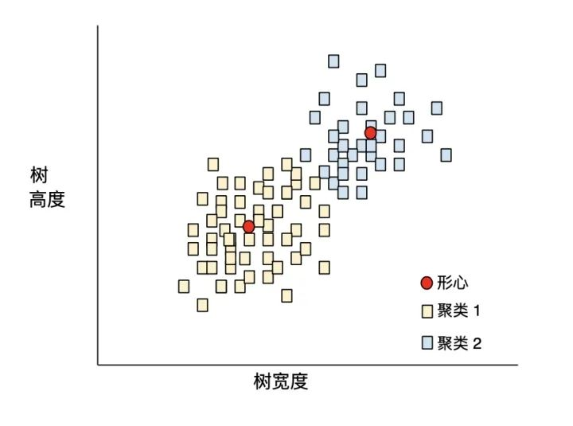

之后，研究人员便可查看这些聚类并进行其他操作，例如，将聚类1标记为“矮型树”，将聚类2标记为“全尺寸树”。再举一个例子，例如基于样本与中心点距离的聚类算法，如下图：

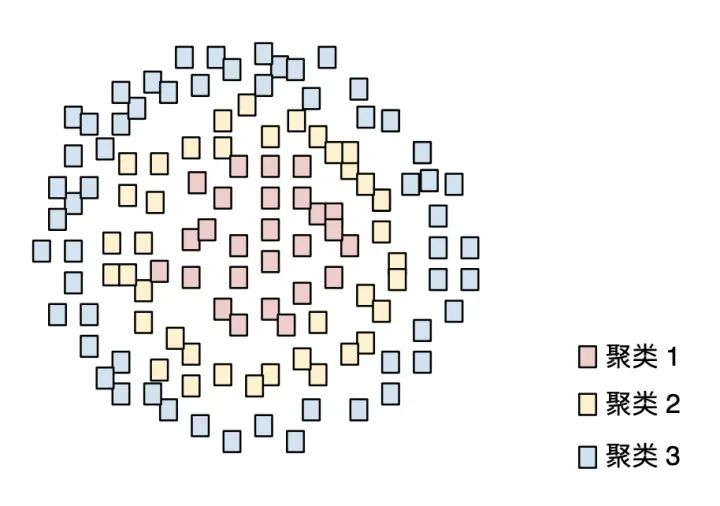

### 协同过滤 (Collaborative Filtering)

​         根据很多其他用户的兴趣来预测某位用户的兴趣。协同过滤通常用在推荐系统中。

### 混淆矩阵 (Confusion Matrix)

​         一种 $N \times N$ 表格，用于总结**分类模型**的预测效果。即标签和模型预测的分类之间的关联。在混淆矩阵中，一个轴表示模型预测的标签，另一个轴表示实际标签， $N$ 表示类别个数。在**二元分类**问题中，$N=2$ 。 例如，下面显示了一个二元分类问题的混淆矩阵示例：

<table>
  <tr>
    <th></th>
    <th>肿瘤(预测的标签)</th>
    <th>非肿瘤(预测的标签)</th>
  </tr>
  <tr>
    <td>肿瘤(实际标签)</td>
    <td>18</td>
    <td>1</td>
  </tr>
  <tr>
    <td>非肿瘤(实际标签)</td>
    <td>6</td>
    <td>452</td>
  </tr>
</table>

上面的混淆矩阵显示，在19个实际有肿瘤的样本中，该模型正确地将18个归类为有肿瘤（18个正例），错误地将1个归类为没有肿瘤（1个为假负例）。同样，在458个实际没有肿瘤的样本中，模型归类正确的有452个（452个负例），归类错误的有6个（6个假正例）。

​         多类别分类问题的混淆矩阵有助于确定出错模式。例如，某个混淆矩阵可以揭示，某个经过训练以识别手写数字的模型往往会将4错误的预测为9，将7错误的预测为1。

​         混淆矩阵包含计算各种效果指标（包括**精确率**和**召回率**）所需的重组信息。

### 连续特征 (Continous feature)

​       一种浮点特征，可能值的区间不受限制。与离散特征相对。

### 收敛 (Convergence)

​        通俗来说，收敛通常是指在训练期间达到的一种状态，即经过一定次数的迭代之后，训练损失和验证损失在每次迭代中的变化都非常小或根本没有变化。也就是说，如果采用当前数据进行额外的训练将无法改进模型，模型达到收敛状态。在深度学习中，损失值有时会在最终下降之前的多次迭代中保持不变或几乎保持不变，暂时形成收敛的假象。

### 凸函数 (Convex Function)

​        一种函数，函数图像以上的区域为凸集。典型凸函数的形状类似于字母U。例如，以下都是凸函数：

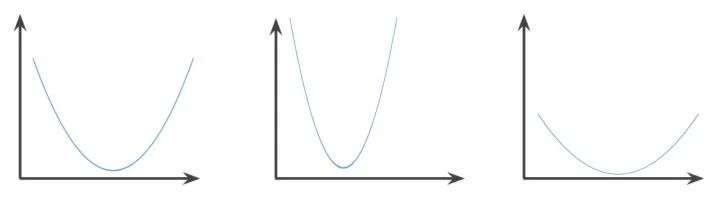

相反，以下函数则不是凸函数。请注意，图像上方的区域如何不是凸集：

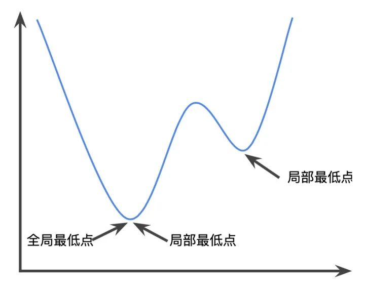

严格凸函数只有一个局部最低点，该点也是全局最低点。经典的U型函数都是严格凸函数。不过，有些凸函数（例如直线）则不是这样。

很多常见的损失函数（包括下列函数）都是凸函数：

* L2损失函数
* 对数损失函数
* L1正则化
* L2正则化

​        梯度下降法的很多变体都一定能找到一个接近严格凸函数最小值的点。同样，随机梯度下降法的很多变体都有很高的可能性能够找到接近严格凸函数最小值的点（但非一定能找到）。

​        两个凸函数的和（例如：L2 损失函数 + L1 正则化）也是凸函数。

​        **深度模型绝不会是凸函数**。值得注意的是，专门针对凸优化设计的算法往往总能在深度网络上找到非常好的解决方案，虽然这些解决方案并不一定对应于全局最小值。

### 凸优化 (Convex Optimization)

​        使用数学方法（例如梯度下降法）寻找凸函数最小值的过程。机器学习方面的大量研究都是专注于如何通过公式将各种问题表示成凸优化问题，以及如何更高效地解决这些问题。

### 凸集 (Convex Set)

​        欧几里得空间的一个子集，其中任意两点之间的连线仍完全落在该子集內。例如，下面的两个图形都是凸集：

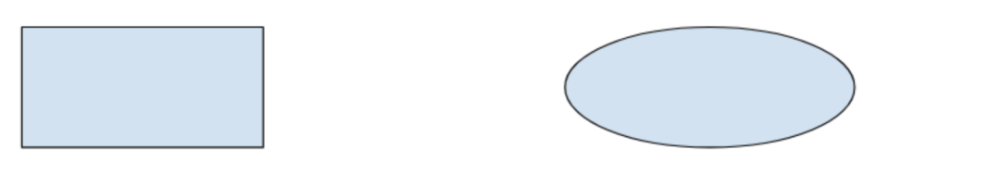

相反，这两个不是凸集：

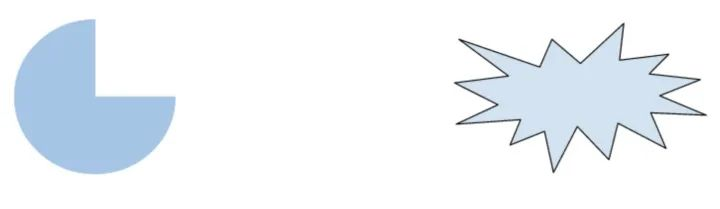

### 卷积 (Convolution)

​        简单来说，**卷积在数学中指两个函数的组合**。在机器学习中，卷积结合使用卷积过滤器和输入矩阵来训练权重。

​        **机器学习中的“卷积”一词，通常是卷积运算或卷积层的简称**。

​        如果没有卷积，机器学习算法就需要学习大张量中每个单元格各自的权重。例如，用 $2K \times 2K$ 图像训练的机器学习算法将被迫找出 400 万个单独的权重。而使用卷积，机器学习算法只需在卷积过滤器中找出每个党员哥的权重，大大减少了训练模型所需的内存。在应用卷积过滤器后，它需要跨单元格进行复制，每个单元格都会与过滤器相乘。

### 卷积过滤器 (Convolution Filter)

​        卷积运算中的两个参与方之一（另一个参与方是输入矩阵切片）。**卷积过滤器是一种矩阵**，其等级与输入矩阵相同，但形状小一些。以 28×28 的输入矩阵为例，过滤器可以是小于 28×28 的任何二维矩阵。

​        在图形操作中，卷积过滤器中的所有单元格通常按照固定模式设置为 1 和 0。在机器学习中，卷积过滤器通常先选择随机数字，然后由网络训练出理想值。

### 卷积层 (Convolution Layer)

​        深度神经网络的一个层，卷积过滤器会在其中传递输入矩阵。以下面的 3x3卷积过滤器为例：

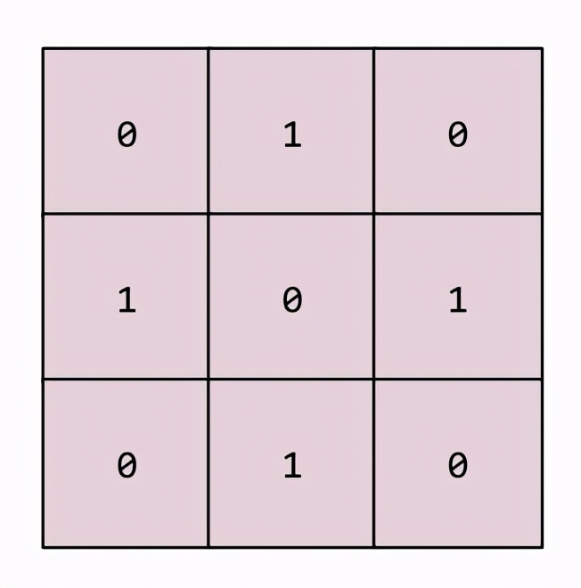

下面的动画显示了一个由 9 个卷积运算（涉及 5x5 输入矩阵）组成的卷积层。请注意，每个卷积运算都涉及一个不同的 3x3 输入矩阵切片。由此产生的 3×3 矩阵（右侧）就包含 9 个卷积运算的结果：

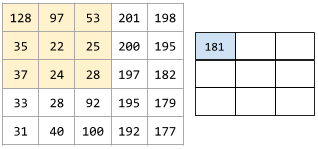

### 卷积神经网络 (Convolutional neural network)

​        一种神经网络，其中至少有一层为卷积层。典型的卷积神经网络包含以下几层的组合：

- 卷积层
- 池化层
- 密集层

​        卷积神经网络在解决某些类型的问题（如图像识别）上取得了巨大成功。

### 卷积运算 (Convolutional Operation)

​        如下所示的两步数学运算：

1. 对卷积过滤器和输入矩阵切片执行元素级乘法（输入矩阵切片与卷积过滤器具有相同的等级和大小。）
2. 对生成的积矩阵中的所有值求和

​        以下面的 5x5 输入矩阵为例：

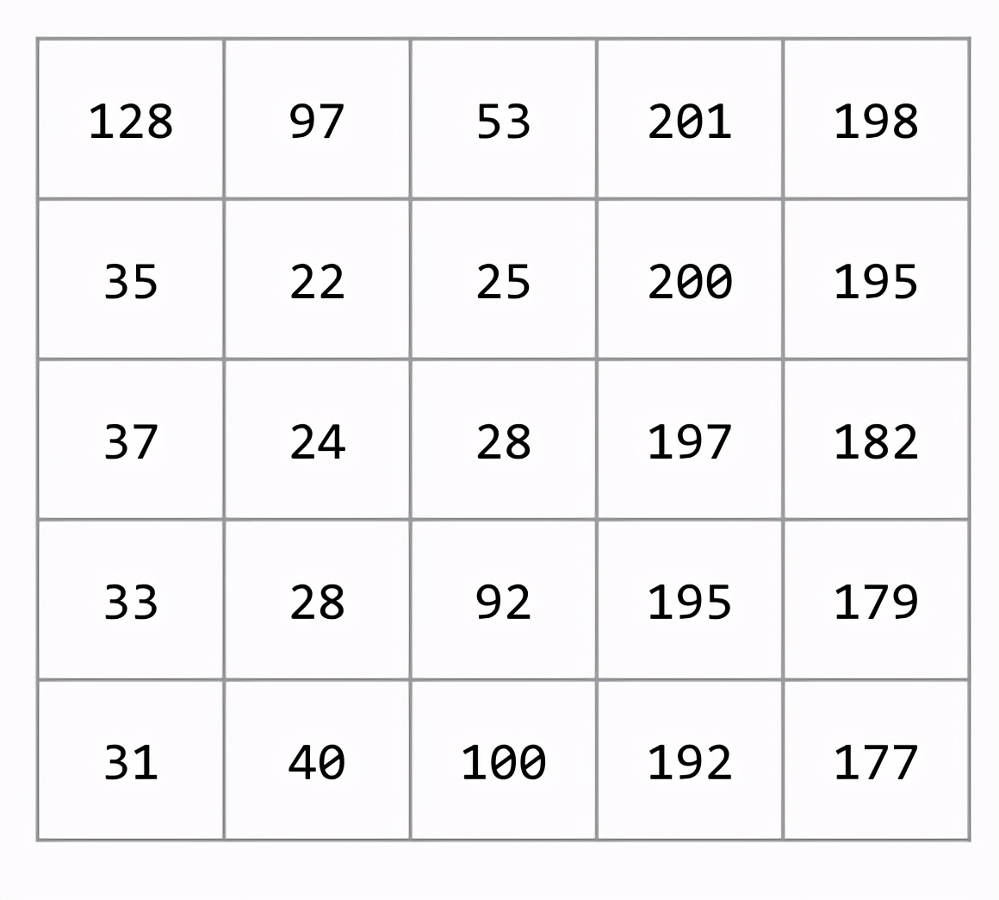

现在，以下面这个 2x2 卷积过滤器为例：

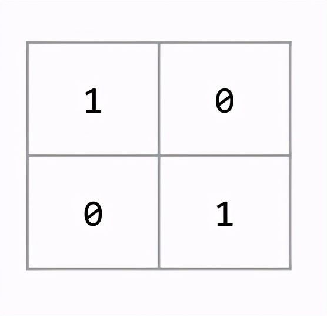

​        每个卷积运算都涉及一个 2x2 输入矩阵切片。例如，假设我们使用输入矩阵左上角的 2x2 切片。这样一来，对此切片进行卷积运算将如下所示：

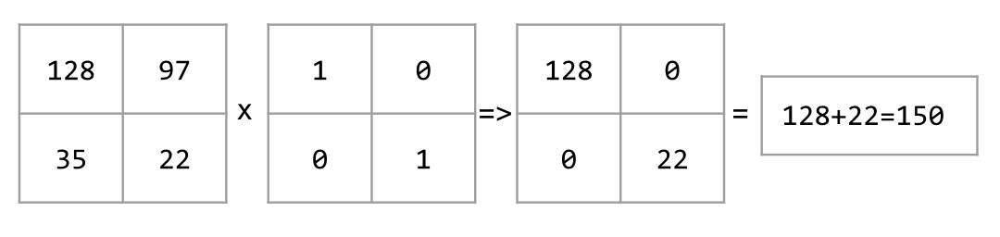

​        卷积层由一系列卷积运算组成，每个卷积运算都针对不同的输入矩阵切片。

### 成本 (cost)

​        与损失的含义相同。

### 交叉熵 (cross-entropy)

​        对数损失函数向多类别分类问题的一种泛化。交叉熵可以量化两种概率分布之间的差异。另请参阅困惑度。

### 自定义 Estimator (custom Estimator)

​        您按照这些说明自行编写的 Estimator。与预创建的 Estimator 相对。

## D

### 数据分析 (data analysis)

​        根据样本、测量结果和可视化内容来理解数据。数据分析在首次收到数据集、构建第一个模型之前特别有用。此外，数据分析在理解实验和调试系统问题方面也至关重要。

### DataFrame

​        **一种热门的数据类型**，用于表示 Pandas 中的数据集。DataFrame 类似于表格。DataFrame 的每一列都有一个名称（标题），每一行都由一个数字标识。

### 数据集 (data set)

​        一组样本的集合。

### Dataset API (tf.data)

​        一种高级别的 TensorFlow API，用于读取数据并将其转换为机器学习算法所需的格式。tf.data.Dataset 对象表示一系列元素，其中每个元素都包含一个或多个张量。tf.data.Iterator对象可获取 Dataset 中的元素。

###  决策边界 (Decision Boundary)

​        在二元分类或多类别分类问题中，模型学到的类别之间的分界线。例如，在以下表示某个二元分类问题的图片中，决策边界是橙色类别和蓝色类别之间的分界线：

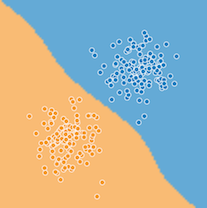

### 密集层 (Dense Layer)

​        与**全连阶层**的含义相同。

### 深度模型 (Deep Model)

​        一种神经网络，其中包含多个隐藏层。深度模型依赖于可训练的非线性关系。

​        与“宽度模型”相对。

### 密集特征 (Dense Feature)

​        一种大部分值是非零值的特征，通常是浮点值张量。与**稀疏特征**相对。

### 设备 (Device)

​        一类可运行 TensorFlow 会话的硬件，包括CPU、GPU和TPU

### 离散特征 (Discrete Feature)

​        一种特种，包含有限个可能值。例如，某个值只能是“动物”、“蔬菜”或者“矿物”的特征便是一个离散特征（或分类特征）。与**连续特征**相对。

### 丢弃正则化 (Dropouit Regularization)

​         正则化的一种形式，在训练神经网络方面非常有用。丢弃正则化的运作机制是，在一个梯度步长中移除从神经网络层中随机选择的固定数量的单元。**丢弃的单元越多，正则化效果越强**。这类似于训练神经网络以模拟较小网络的指数级规模集成学习。

### 动态模型 (Dynamic Model)

​         一种模型，以持续更新的方式在线接受训练。也就是说，数据会源源不断地进入这种模型。

## E

#### 早停法 (Early Stopping)

​         一种正则化方法，是指在训练损失仍可以继续降低之前结束模型训练。使用早停法时，会在验证数据集的损失开始增大（也就是泛化效果变差）时结束模型训练。

#### 嵌套 (Embeddings)

​         一种分类特征，以连续值特征表示。通常，嵌套是指将高维度向量映射到低维度的空间。例如，可以采用以下两种方式之一来表示英文句子中的单词：

* 表示成包含百万个元素（高维度）的稀疏向量，其中所有元素都是整数。向量中的每个单元格都表示一个单独的英文单词，单元格中的值表示相应单词在句子中出现的次数。由于单个英文句子包含的单词不太可能超过50个，因此向量中几乎每个单元格都包含0.少数非0的单元格中将包含一个非常小的整数（通常为1），该整数表示相应单词在句子中出现的次数。
* 表示成包含数百个元素（低纬度）的密集向量，其中每个元素都存储一个介于0到 1 之间的浮点值。这就是一种嵌套。

### F

### G

#### 泛化 (Generalization)

​        指的是模型依据训练时采用的数据，针对以前未见过的新数据做出正确预测的能力。

#### 广义线性模型 (Generalized Linear Model)

​        最小二乘回归模型（基于高斯噪声）向其他类型的模型（基于其他类型的噪声，例如泊松噪声或分类噪声）进行的一种泛化。广义线性模型的示例包括：

- 逻辑回归
- 多类别回归
- 最小二乘回归

​        可以通过凸优化找到广义线性模型的参数。

​        广义线性模型具有以下特性：

- 最优的最小二乘回归模型的平均预测结果等于训练数据的平均标签。
- 最优的逻辑回归模型预测的平均概率等于训练数据的平均标签。

​        广义线性模型的功能受其特征的限制。与深度模型不同，广义线性模型无法“学习新特征”。

#### 梯度 (Gradient)

​        **偏导数相对于所有自变量的向量**。在机器学习中，梯度是模型函数偏导数的向量。梯度指向量高速上升的方向。