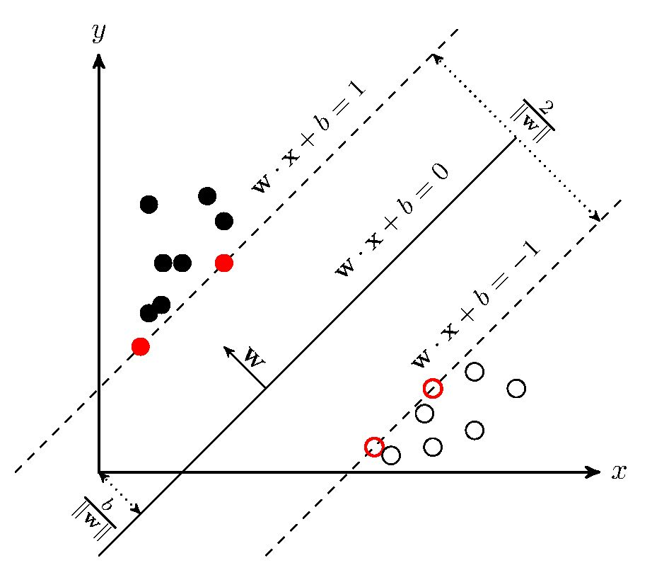

# 支持向量机（SVM）——原理篇

原文：https://zhuanlan.zhihu.com/p/31886934

一. SVM介绍

二. 线性SVM算法原理

三. 非线形SVM算法原理

## 一. SVM介绍

​        支持向量机（Support Vector Machines, SVM）是一种**二分类模型**，它的基本模型是定义在特征空间上的**间隔最大的线性分类器**，间隔最大使它有别于**感知机**。SVM好包括**核技巧**，这使它成为实质上的非线性分类器。SVM的学习策略就是间隔最大化，可形式化为一个求解凸二次规划的问题，也等价于正则化的合页损失函数的最小化问题。SVM的学习算法就是求解凸二次规划的最优化算法。

## 二. 线性SVM算法原理

​        SVM学习的基本想法是求解能够正确划分训练数据集并且几何间隔最大的分离超平面。如下图所示， $w \cdot x + b = 0$ 即为分离超平面，对于线性可分的数据集来说，这样的超平面有无穷多个（即感知机），但是几何间隔最大的分离超平面却是唯一的。

​        在推导之前，先给出一些定义。假设给定一个特征空间上的训练数据集：
$$
T = {(x_1, y_1), (x_2,y_2), \cdots, (x_N,y_N)}
$$
其中，$x \in \mathbb{R}^n, y_i \in {+1,-1}, i = 1,2,\cdots, N, x_i$ 为第 $i$ 个特征向量， $y_i$ 为类标记，当它等于 $+1$ 时为正例，为 $-1$ 时为负例。再假设训练数据集是**线性可分**的。

**几何间隔**： 对于给定的数据集$T$ 和超平面 $w \cdot x + b = 0$ ，定义超平面关于样本点 $(x_i, y_i)$ 的几何间隔为：
$$
\gamma_i = y_i(\frac{w}{\|w\|} \cdot x_i + \frac{b}{\|w\|})
$$
超平面关于所有样本点的几何间隔的最小值为：
$$
\gamma = \min_{i=1,2,\cdots,N} \gamma_i 
$$
实际上这个距离，就是所谓的**支持向量**到超平面的距离。

根据以上定义，SVM模型的求解最大分割超平面问题可以表示为以下约束最优化问题：
$$
\max_{w,b} \gamma \\
s.t. \ \ y_i(\frac{w}{\|w\|} \cdot x_i + \frac{b}{\|w\|}) \geq \gamma, i=1,2,\cdots,N
$$
将约束条件两边同时除以 $\gamma$，得到：
$$
y_i(\frac{w}{\|w\|\gamma} \cdot x_i + \frac{b}{\|w\|\gamma}) \geq 1
$$
因为 $\|w\|, \gamma$ 都是标量，所以为了表达简洁，令：
$$
w = \frac{w}{\|w\| \gamma} \\
b = \frac{b}{\|w\| \gamma}
$$
 得到：
$$
y_i (w \cdot x_i + b) \geq 1, i = 1,2,\cdots,N
$$
又因为最大化 $\gamma$，等价于最大化 $\frac{1}{\|w\|}$，也等价于最小化 $\frac{1}{2}\|w\|^2$ （$\frac{1}{2}$ 是为了后面求导以后形式简洁，不影响结果），因此SVM模型的求解最大分割超平面问题又可以表示为一下约束最优化问题：
$$
\min_{w,b} \frac{1}{2}\|w\|^2 \\
s.t. \ \ \ y_i(w \cdot x_i + b) \geq, i = 1,2, \cdots,N
$$
这是一个含有不等式约束的凸二次规划问题，可以对其使用拉格兰日乘子法得到其对偶问题(dual problem)。

## 三. 非线形SVM算法原理

