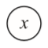
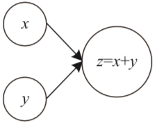
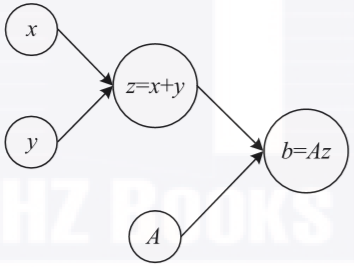
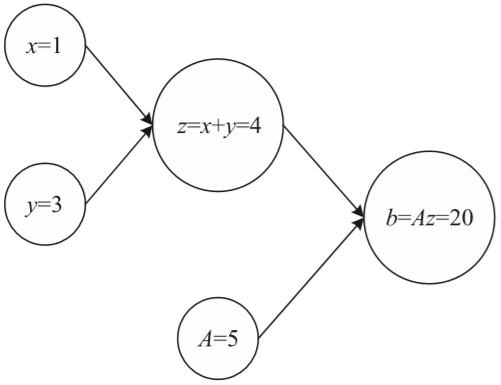
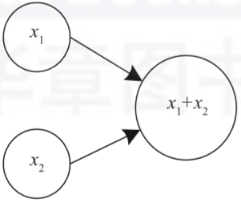
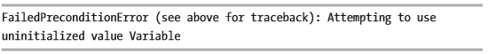
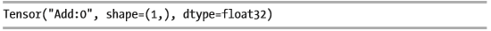
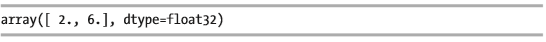
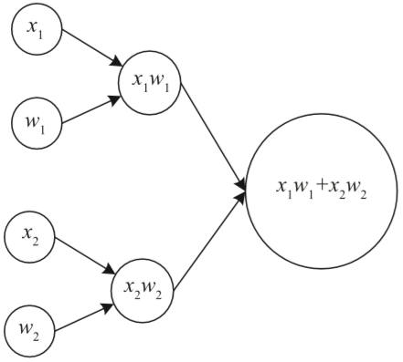
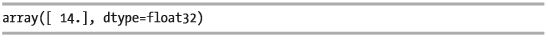

## 什么是TensorFlow

原文：https://blog.csdn.net/zw0Pi8G5C1x/article/details/103115865?spm=1001.2101.3001.6661.1&utm_medium=distribute.pc_relevant_t0.none-task-blog-2%7Edefault%7ECTRLIST%7ETopBlog-1.topblog&depth_1-utm_source=distribute.pc_relevant_t0.none-task-blog-2%7Edefault%7ECTRLIST%7ETopBlog-1.topblog&utm_relevant_index=1


在开始使用TensorFlow之前，必须了解其背后的理念。该库很大程度上基于**计算图**的概念，除非了解它们是如何工作的，否则无法理解如何使用该库。现在介绍**计算图**，并展示如何使用TensorFlow实现简单计算。

### 一. 计算图

要了解TensorFlow的工作原理，必须了解**计算图是什么**。计算图，是一幅图，其中每个节点对应于一个操作或一个变量。变量可以将其值输入操作，操作可以将其结果输入其他操作。

通常，节点被绘制为圆圈，其内部包含变量名或者操作。当一个节点的值是另一个节点的输入时，箭头从一个节点指向另一个节点。可以存在的最简单的图是只有单个节点的图，节点中只有一个变量（切记：节点可以是变量或操作）。下图是只计算变量 $x$ 的值的计算图：



上图是一个最简单的图，表示一个简单的变量。

现在考虑稍微复杂的图，例如，两个变量 $x$ 和 $y$ 之和( $z = x + y$ )，用下图表示：



上图左侧的节点（圈里有$x$ 和 $y$ 的节点）是变量，而较大的节点表示两个变量之和。箭头表示两个变量 $x$ 和 $y$ 是第三个节点的输入。应该以拓扑顺序读取（和计算）图，这意味着应该按照箭头指示的顺序来计算不同的节点。箭头还表明了节点之间的依赖关系。要计算$z$，首先必须计算$x$和$y$ 。也可以说执行求和的节点依赖于输入节点。

要理解的一个重要方面是，这样的图仅定义了对两个值（在这里是$x$和$y$）执行什么操作（这里是求和）以获得结果（这里是$z$）。它基本上定义了“如何”。必须为$x$和$y$这两个输入都赋值，才能执行求和以获得$z$。**只有在计算了所有的节点后，图才会显示结果**。

> 注：图的“构造”阶段是指在定义每个节点正在做什么时，“计算”阶段是指当实际计算相关操作时

这里需要了解的一个非常重要的方面。请注意，输入变量不一定是实数，它们可以是矩阵、向量等（一般用矩阵）。下图是一个稍微更复杂的示例，即给定三个输入变量$x、y$和$
A$，使用图计算$A(x+y)$的值：



可以通过为输入节点（本例中为 $x、y$和$A$）赋值来计算此图，并通过图计算节点。例如，如果采用上图中的图并赋值$x=1,y=3$和$A=5$，将得到结果$b=20$：



**神经网络基本上是一个非常复杂的计算图**，其中每个神经元由图中的几个节点组成，这些节点将它们的输出馈送到一定数量的其他神经元，直到到达某个输出。

**TensorFlow可以帮助开发人员非常轻松地构建非常复杂的计算图。**通过构造，可以将评估计算和构造进行分离（记住，要计算结果，必须赋值并计算所有节点）。

> 注：TensorFlow 首先构建一个计算图（在所谓的构造阶段），但不会自动计算它。该库将两个步骤分开，以便使用不同的输入多次计算图形。


### 二. 张量

TensorFlow 处理的基本数据单元时张量（Tensor），它包含在 TensorFlow 这个单词中。张量仅仅是一个形为 $n$ 维数组的基本类型（例如：浮点数）的集合。以下是张量的一些示例（包括香港的Python定义）：

* 1 -> 一个纯量
* [1,2,3] -> 一个向量
* [[1,2,3] , [4,5,6] ] -> 一个矩阵或者二维数组

张量具有静态类型和动态维度。**在计算它时，不能更改其类型，但可以在计算之前动态更改维度**（基本上，声明张量时可以不指定维度，TensorFlow将根据输入值推断维度。）。通畅，用张量的阶（rank）来表示张量的维度数（纯量的阶可以认为是$0$）。下表可以帮助理解张量的不同阶：

| 阶   | 数学实体                           | Python例子                               |
| ---- | ---------------------------------- | ---------------------------------------- |
| 0    | 纯量（例如：长度或者重量）         | L = 30                                   |
| 1    | 张量（例如：二维平面中物体的速度） | S=[ 10.2, 12.6 ]                         |
| 2    | 矩阵                               | M=[[23.2, 24.2], [12.2, 34.6]]           |
| 3    | 3D矩阵（带有三个维度）             | C=[[[1],[2]] , [[3], [4]] , [[5] , [6]]] |

假设使用语句 import TensorFlow as tf 导入 TensorFlow，则基本对象（张量）是类 tf.tensor。 tf.tensor 有两个属性：

* 数据类型（例如：float32）
* 形状（例如，[2, 3] 表示这是一个 2 行 3 列的张量）

一个重要的方面是张量的每个元素总是具有相同的数据类型，而形状不需要再声明时定义。主要张量类型（还有更多）有：

* tf.Variable
* tf.constant
* tf.placeholder

tf.constant 和 tf.placeholder 值在单个会话运行期间是不可变的。**一旦它们有了值，就不会改变。**例如，tf.placeholder 可以包含要用于训练神经网络的数据集，一旦赋值，它就不会在计算阶段发生变化。

**tf.variable 可以包含神经网络的权重，它们会在训练期间改变，以便为特定问题找到最佳值。**

最后，**tf.constant 永远不会改变。**

### 三. 创建和运行计算图

下面开始使用 TensorFlow 来创建计算图。

> 注：请记住，始终将构建阶段（定义图应该做什么）与它的计算阶段（执行计算）分开。TensorFlow 遵循相同的理念：首先构建一个图形，然后进行计算。

考虑非常简单的事情：对两个张量求和，即：
$$
x_1 + x_2
$$
可以使用下面的计算图来执行计算：



[^]: 图3.1 求两个张量之和的计算图

### 四. 包含 tf.constant 的计算图

如前所述，首先必须使用 TensorFlow 创建这个计算图（从构建阶段开始）。这里使用 tf.constant 张量类型。**需要三个节点：两个用于输入变量，一个用于求和**。可以通过以下代买实现：

```python
x1 = tf.constant(1)
x2 = tf.constant(2)
z = tf.add(x1, x2)
```

以上代码创建上面的图3.1的计算图。同时，它告诉TensorFlow，$x_1$ 的值是 $1$（声明中括号内的值），而 $x_2$ 的值为 $2$。现在，要执行代码，必须创建被 TensorFlow 称为会话的过程（实际的计算过程就在其中执行），然后可以请求会话类通过以下代码运行上面的图：

```python
ress = tf.Session()
print(ress.run(z))
```

这将简单的提供 $z$ 的计算结果。正如所料，结果是 $3$。这部分代码相当简单并且不需要太多，但不是很灵活。例如，$x_1$ 和 $x_2$ 是固定的，并且在计算期间不能改变。

> 注：在 TensorFlow 中，首先必须创建计算图，然后创建会话，最后运行图。必须始终遵循这三个步骤来计算你的图。

请记住，也**可以要求 TensorFlow 仅计算中间步骤。**例如：可以想要计算 $x_1$，比如 sess.run(x1)，虽然在这个例子中没有什么意义，但是**在很多情况下它很有用。例如，如果想要在评估图的同时评估模型的准确性和损失函数。**

显然得到 $x_1$ 的中间结果是 $1$，正如预期的那样。最后，记住使用 sess.close() 关闭会话以释放所用的资源。

### 五. 包含 tf.Variable 的计算图

可以使用相同的计算图（图3.1）来创建变量，但这样做有点儿麻烦，不如重新创建计算图：

```python
x1 = tf.Variable(1)
x2 = tf.Variable(2)
z = tf.add(x1, x2)
```

像之前一样用值$1$ 和 $2$ 进行变量初始化。问题在于，当使用以下代码运行此图时，将收到一条错误的信息。

```python
sess = tf.Session()
print(sess.run(z))
```

这是一条非常长的信息，但信息的结尾包含以下的内容：



发生这种情况是因为 TensorFlow 不会自动初始化变量。为此，可以使用此方法：

```python
sess = tf.Session()
sess.run(x1.initializer)
sess.run(x2.initializer)
print(sess.run(z))
```

以上代码很有效，如预期的，输出正确的结果 $3$。

> 注：使用变量时，请记住一定要添加全局初始化器（tf.gloabl_variable_initializer()），并在一开始就在会话中运行该节点，然后再进行任何其他计算。

### 六. 包含 tf.placeholder 的计算图

现在将 $x_1$和 $x_2$ 声明为占位符：

```python
x1 = tf.placeholder(tf.float32, 1)
x2 = tf.placeholder(tf.float32, 1)
```

请注意，这里没有在申明提供任何值，因此需要在计算时为 $x_1$ 和 $x_2$ 赋值。**这是占位符与其他两种张量类型的主要区别**。然后，再次用以下代码执行求和：

```python
z = tf.add(x1, x2)
```

请注意，如果尝试查看 $z$ 的内容，例如 print(z)，会得到如下信息：



为何得到这个奇怪的结果呢？首先，没有给 TensorFlow 提供 $x_1$ $x_2$  的值；其次，TensorFlow 还没有运行任何计算。请记住，图的构造和计算是相互独立的步骤。现在和之前一样在 TensorFlow 中创建一个会话：

```python
sess = tf.Session()
```

现在可以运行实际的计算了。但是要做到这一点，必须先为 $x_1$ $x_2$ 两个输入赋值。这可以通过一个包含所有占位符的名称为键的Python字典来实现，并为这些键赋值。在此示例中，将值 $1$ 、$2$ 分别赋给$x_1$ 、$x_2$ 。

```python
feed_dict = {x1:[1], x2:[2]}
```

然后通过使用以下命令将上面的代码提供给 TensorFlow 会话：

```python
print(sess.run(z, feed_dict))
```

最终得到了期望的结果：$3$。 注意，TensorFlow 相当聪明，可以处理更复杂的输入。现在重新定义占位符，以便使用包含两个元素的数组。以下是完整代码：

```python
x1 = tf.placeholder(tf.float32, [2])
x2 = tf.placeholder(tf.float32, [2])
z = tf.add(x1, x2)
feed_dict = {x1:[1,5], x2:[1,1]}
sess = tf.Session()
sess.run(z, feed_dict)
```

这次，将得到一个包含两个元素的数组作为输出：



注，x1 = [1,5] 和 x2 = [1,1] 意味着 z = x1 + x2 = [1 , 5] + [1, 1] = [2, 6]。因为求和（sum）是对数组中逐个元素求和得到的。

总结一下，下面是一些关于何时使用哪种张量类型的指南：

* 对于在计算阶段不发生更改的实体，请使用 tf.placeholder。通常，它们是在计算期间保持固定不变的输入值或参数，但可能随每次运行而变化。示例：如输入数据集、学习率等
* 对于在计算过程中会发生变化的实体，请使用 tf.Variable。例如，神经网络的权重
* tf.constant 用于永不更改的实体。例如：那些在模型中不再更改的固定值

下图描绘了一个稍微复杂的例子：计算 $x_1 w_1 + x_2 w_2$的计算图：



在这个例子中，将 $x_1, x_2, w_1, w_2$ 定义为包含纯量的占位符（它们将是输入）。在定义占位符时，**必须始终将维度作为第二个输入参数传入**。本例中是 $1$：

```python
x1 = tf.placeholder(tf.float32,1)
w1 = tf.placeholder(tf.float32,1)
x2 = tf.placeholder(tf.float32,1)
w2 = tf.placeholder(tf.float32,1)
z1 = tf.multiply(x1,w1)
z2 = tf.multiply(x2,w2)
z3 = tf.add(z1, z2)
```

运行该计算也就意味着：定义包含输入值的字典，之后创建会话，然后运行它：

```python
feed_dict = {x1: [1], w1:[2], x2:[3], w2:[4]}
sess = tf.Session()
sess.run(z3, feed_dict)
```

不出所料，会得到如下的结果：



这很简单，即 $1 \times 2 + 3 \times 4 = 14$ 。最后，记得在完成后使用 sess.close() 关闭会话。

注意：在 TensorFlow中，可能会发生同一段代码运行多次，并且最终会得到一个包含同一个节点的多个副本的计算图。避免此类问题的一种非常常见的方法是运行构造改图的代码之前运行代码 tf.reset_default_graph() 。

请记住，如果将构造代码与计算代码恰当的分开，则应该能够避免此类问题。