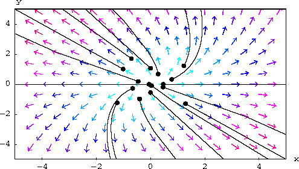

# 深入理解特征向量和特征值

原文：https://www.toutiao.com/i6936548513606091295/

任何具有特征向量的矩阵，其所有坐标最终都将遵循一个尽可能接近特征向量的关系。

## 斐波那契数列

斐波那契数列就是前两项的和作为第三项，如果从0和1开始，这个数列就是：
$$
0, 1, 1, 2, 3, 5, 8, 13, \cdots
$$
直到无穷大。如果在笛卡尔坐标系中绘制它，可以用一个向量和一个方阵来给出斐波那契数列的下一个值：
$$
\begin{bmatrix}
 F_n\\
 F_{n-1}
\end{bmatrix}
 = \begin{bmatrix}
  1 & 1\\
  1 & 0
\end{bmatrix} 
\begin{bmatrix}
  F_{n-1}\\
  F_{n-2}
\end{bmatrix}  
$$
第一行表示斐波那契数列中的下一个值，而第二行表示数中的当前值。如果画出这个图，可以看到每个值大约是之前值的1.618倍。如果从0和1开始，第10个值是55，第11个值是89.还可以看到55乘以1.618大约等于89。如果计算这个向量的特征值，它们是-0.618和1.618.特征值所对应的特征向量分别是：
$$
\bullet  特征值为 -0.618的特征向量是：
\begin{bmatrix}
 \frac{1}{2} - \frac{\sqrt[2]{5} }{2} \\
 1
\end{bmatrix}
\\
\bullet  特征值为 1.618的特征向量是：
\begin{bmatrix}
 \frac{1}{2} + \frac{\sqrt[2]{5} }{2} \\
 1
\end{bmatrix}
$$
这一数列不仅将遵循这一趋势（其中一项是前一项的1.618倍），而且它也会在这样一条直线上，这条直线沿着一个向量，这个向量具有特征值1.618。通过这个，可以理解这里的特征的重要性。如果用矩阵的形式写，最终会遵循由其特征值和特征向量定义的特征。根据这一点，可以很容易地推到出下一项的值，随着项数的增加，这个值越来越精确。

这不仅可以通过初试值0和1实现，对于任何初始值都可以。可以看到，与下一项增加的因子相同的特征值的数列。当它们增加时，这些值也将接近表示系统中特征向量的直线。

## 人口增长模型

在20世纪40年代，莱斯利找到了一种为人口增长建模的方法，通过这种方法，可以相对准确地找到人口增长的情况。莱斯利矩阵是关于特定物种的繁殖率概率和生存机会的函数。莱斯利矩阵是通过将各自的值放入矩阵中形成的：
$$
L = \begin{bmatrix}
F_1 & F_2 & F_3 & \cdots & F_n & \\
P_1 & 0 & 0 & \cdots & 0 & 0 \\
0 & P_2 & 0 & \cdots & 0 & 0 \\
& & \cdots & \cdots & \\
0 & 0 & 0 & \cdots & P_n & 0
\end{bmatrix}
$$
其中，n是总人口的阶段数，F是总体中女性的数量，P是属于第一阶段的成员进入下一个阶段的概率。只选取女性群体，因为她们是特定群体中负责繁殖的群体。 把这个矩阵代入矩阵方程：
$$
X_{K + 1} = L \cdot X_K
$$
其中 $X^k$是矩阵：
$$
x^k = \begin{bmatrix}
x_1^k \\
x_2^k \\
\cdots \\
x_n^k \\
\end{bmatrix}
$$
这个矩阵中的 $k$ 值表示处理初始总体的年份，$n$ 是总体被分割的阶段数。这个方程是用以下逻辑推导出来的：
$$
\begin{align}
x_1 =& L \cdot x_0 \\
x_2 =& L \cdot x_1 = L \cdot ( L \cdot x_0) = L^2 \cdot x_0
\end{align}
$$
虽然用这个矩阵方程可以很容易地计算出人口增长，但对于 $k$ 值较大的情况，需要进行大量的计算，因此可以找到系统的特征向量和相应的特征值。通过这样得到了系统增长的总体趋势，最终可以很容易地计算出 $k$ 值较大时 $x_k$ 的值。

## 解微分方程组

通过在增广矩阵中放入适当的值，可以利用特征值及其特征向量来求解微分方程组。

首先找到增广矩阵的特征值后，将它们排列成对角矩阵 $(D)$ 的形式，其对角项就是特征值。然后我们找到相应的特征向量，并将其排列在一个矩阵 $(P)$ 中。

将对角矩阵代入方程 $u = Du$ 中，$u$ 是方程组的解。还需要注意的是，$D$ 向量是通过系统在每次迭代中发生的变化来表示的，因此它也表示了系统的变化率。一旦找到 $u$，把它放入方程 $y = Pu$ ，其中 $P$ 是包含特征向量的矩阵。矩阵 $P$ 会反映在每次迭代中值是如何变化的一般方向，当将这些值相乘时，就能得到方程组 $(y)$ 的解。

​        特别是通过看最后一个微分方程组的例子，可以看到特征向量和特征值是如何展示一个系统如何变化的一般趋势的。 

* 特征值展示了系统变化率的大小
* 特征向量展示了变化发生的方向