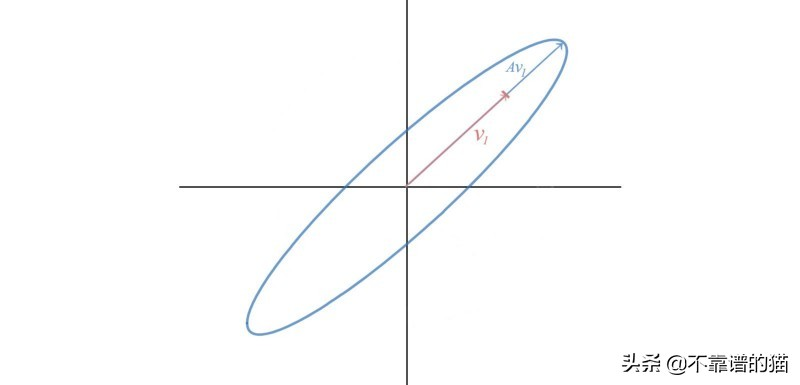

# 特征值和特征向量在机器学习中的应用

原文：https://www.toutiao.com/i6660026803211469315/

​        特征值和特征向量可能是线性代数中最重要的概念之一。从机器学习、量子计算、物理到许多数学和工程的问题，都可以通过找到一个矩阵的特征值和特征向量来解决。

​        根据定义（标量λ、向量v是特征值、特征向量A）：
$$
Av = \lambda v
$$
几何图形上，$Av$ 与特征向量 $v$ 位于同一直线上：

​        举一些例子：
$$
\begin{align}
\begin{bmatrix}
1 & -3 & 3 \\
3 & -5 & 3 \\
6 & -6 & 4
\end{bmatrix}
\begin{bmatrix}
1/2 \\
1/2 \\
1
\end{bmatrix} =& 4
\begin{bmatrix}
1/2 \\
1/2 \\
1
\end{bmatrix} 
\\
\begin{bmatrix}
1 & -3 & 3 \\
3 & -5 & 3 \\
6 & -6 & 4
\end{bmatrix}
\begin{bmatrix}
1 \\
1 \\
0
\end{bmatrix} =& -2
\begin{bmatrix}
1 \\
1 \\
0
\end{bmatrix}
\\
\begin{bmatrix}
1 & -3 & 3 \\
3 & -5 & 3 \\
6 & -6 & 4
\end{bmatrix}
\begin{bmatrix}
-1 \\
0 \\
1
\end{bmatrix} =& -2
\begin{bmatrix}
-1 \\
0 \\
1
\end{bmatrix}
\end{align}
$$
然而，$Av$ 通常不会等于 $\lambda v$ ，只有一些特殊的向量满足条件。

## 应用

​        许多问题可以用线性变换建模，其中解决方案来自特征值和特征向量。先用一个抽象的例子来详细说明这个问题。在许多系统中，可以在向量中表达属性，其变化率线性地取决于当前的属性（例如，人口增长率线性地取决于当前认可和GDP）。一般等式如下：
$$
\frac{du}{dt} = Au
$$

$$
\begin{bmatrix}
\frac{du_1}{dt} \\
\frac{du_2}{dt} \\
\vdots \\
\frac{du_n}{dt}
\end{bmatrix} = A 
\begin{bmatrix}
u_1 \\
u_2 \\
\vdots \\
v_n
\end{bmatrix}
$$

猜测一下上面方程的 $u(t)$ ，因为一个指数函数的导数等于它本身，从一个 $t$ 的指数函数开始，然后乘以一个向量 $x$ ，输出就是一个向量：
$$
\begin{align}
u(t) &= e^{\lambda t} x \\
\because \frac{du}{dt} &= Au \\
\therefore \frac{du}{dt} &= \lambda e^{\lambda t}x \\
&= \lambda u \\
\\
i.e.: \\
Au &= \lambda u \\
Ae^{\lambda t}x &= \lambda e^{\lambda t}x \\
Ax &= \lambda x
\end{align}
$$
根据上面的计算，$u(t)$ 的解是：
$$
\begin{align}
u(t) &= e^{\lambda t} x \\
\frac{du}{dt} &= Au
\end{align}
$$
接下来，找到它的完全解。一阶导数方程是一个线性函数：
$$
\begin{align}
\frac{du}{dt} &= Au & - is \  a \ linear \  function. \  i.e. f(u+v) = f(u) + f(v) \\
\frac{du + v}{dt} &= \frac{du}{dt} + \frac{dv}{dt}
\end{align}
$$
​        对于线性函数，完全解是特定解的线性组合。如果 $u$ 和 $v$ 是解，则 $C_₁u + C_₂v$ 也是解。从特征值 $λ= 4，-2, -2$ 的例子中，完全解将是：
$$
u(t) = c_1 e^{4t} \begin{bmatrix} 1/2 \\ 1/2 \\ 1 \end{bmatrix} + c_2 e^{-2t} \begin{bmatrix} 1 \\ 1 \\ 0 \end{bmatrix} + c_3 e^{-2t}\begin{bmatrix} -1 \\ 0 \\ 1 \end{bmatrix}
$$
当 $t = 0$ 时，可以测量初始状态 $u(0)$ ，比如说 $[u_{01}, u_{02}, u_{03}]^T$ ， 并求解常数 $C_1, C_2, C_3$：
$$
u(0) = \begin{bmatrix} u_{01} \\ u_{02} \\ u_{03} \end{bmatrix} = c_1 \begin{bmatrix} 1/2 \\ 1/2 \\ 1 \end{bmatrix} + c_2 \begin{bmatrix} 1 \\ 1 \\ 0 \end{bmatrix} + c_3 \begin{bmatrix} -1 \\ 0 \\ 1 \end{bmatrix}
$$
​        用谐振子来说明这个想法。选择这个例子是因为谐波振荡器及其近亲（量子谐振子）在研究粒子物理学，量子力学或物理学方面几乎无处不在。从著名的 $F=ma$ 方程开始用特征值和特征向量来解二阶导数。由于可以自由选择质量单位，物理学家通常设m = 1来简化讨论，即：
$$
\begin{align}
F =& ma \\
=& my'' \\
F =& y''
\end{align}
$$
可以把谐振子问题重新写成矩阵的形式：
$$

$$
