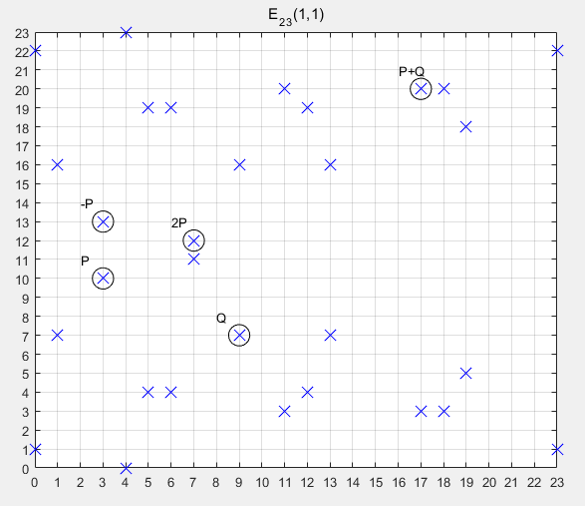

# Elliptic curves in finite fields

原文：https://blog.csdn.net/zhuiyunzhugang/article/details/107589223?utm_term=有限域的阶&utm_medium=distribute.pc_aggpage_search_result.none-task-blog-2~all~sobaiduweb~default-4-107589223&spm=3001.4430

## 有限域椭圆曲线

​        椭圆曲线是连续的，并不适合用于加密。所以，必须把椭圆曲线变成离散的点，要把椭圆曲线定义在有限域上。

​        给出一个有限域$Fp$，则有：

* $Fp$ 中有$p$ （$p为质数$）个元素 $0, 1, 2, \cdots，p-2, p-1 $
* $Fp$ 的加法是 $a + b \equiv c (mod p)$
* $Fp$的乘法是 $a \times b \equiv c (mod p)$
* $Fp$的除法是 $a {\div} b \equiv c (mod p)$，即 $a \times b^{-1} \equiv c (mod p)$， $b^{-1}$ 也是一个$0$到$-1$之间的整数，但满足 $b \times b^{-1} \equiv 1 (mod p)$
* $Fp$的单位元是 $1$，零元是 $0$
* $Fp$域内运算满足***交换律、结合律、分配律***

​        椭圆曲线$Ep(a,b)$，$p$为质数， $x,y \in [0, p-1]$， 且 $y^2 = x^3 + ax + b(mod p)$， 且选择两个满足下列约束条件的小于$p$的***非负***整数 $a, b$：
$$
\Delta ^= 4a^3 + 27b^2 \ne 0 (\Delta mod p)
$$
​         有了有限域和椭圆曲线，可以定义$Fp$上的椭圆曲线的加法：

* 无穷远点 $O\infty$ 是**零元**，有 $O\infty + O\infty = O \infty; O\infty  + P = P $
* $P(x,y)$ 的负元是 $(x, -y mod p) = (x, p-y)$，有 $P + (-P) = O \infty $
* $P(x1,y1), Q(x2,y2)$ 的和$R(x3,y3)$ 有如下关系：
  * $x3 \equiv k2 - x1 - x2(mod p)$
  * $y3 \equiv k(x1 - x3) - y1 (mod p)$
  * 若 $P = Q$， 则 $k = (3 \times 2 + a) / 2y1(mod p) $
  * 若 $P\ne Q$，则 $k = (y2 - y1)/(x2 - x1) mod p$

​        例题，椭圆曲线已知$E23(1,1)$上两点$P(3,10), Q(9,7)$，求:

* $-P$
* $P + Q$
* $2P$

​        解：

* $-P = (3, -10mod23) = (3, 13)$
* $k = 7 - 109 -3 = -2 - 1 mod 23u$

​        补充：

​        $-2^{-1} mod 23$ 进行两部分计算：

* 先计算 $2^{-1}$ 对应的数 $A$，在这里 $2^{-1}$ 不是 $2$ 的 $-1$ 次方，而是 $2$ 的逆元
* 再计算 $-A mod 23$

## 有限域椭圆曲线点的阶

