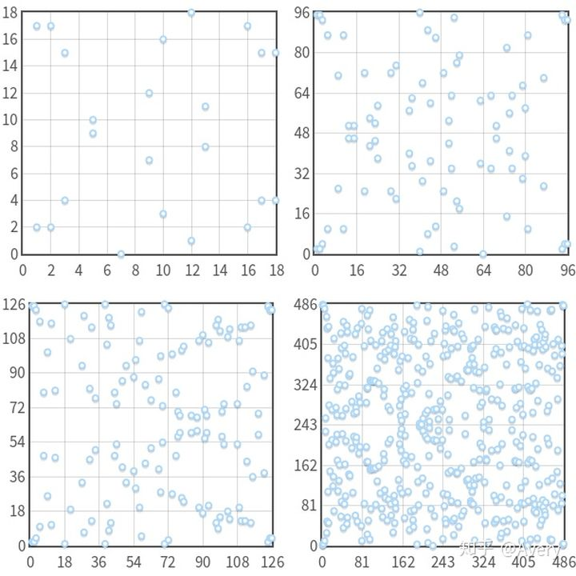
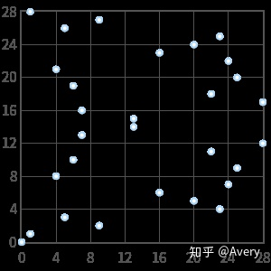
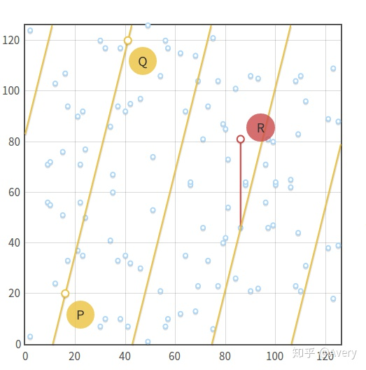
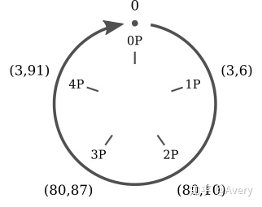

# ECC椭圆曲线加密算法：有限域和离散对数

原文：https://zhuanlan.zhihu.com/p/44743146


## 整数域模P

​        首先，有限域是一个带有有限元素的集合。比如，有一个有限域是整数模$p$ 的集合（integeres mod p，p是素数），可以表示为 $\mathbb{Z}/p, GF(p)$ 或者 $\mathbb{F}_p$，一般用后者。 

​        在有限域中，有两个二元操作：加（+）和乘（$\times$）。这两种操作都是封闭的，**满足结合律和交换律**，[*这块的封闭应当这样理解：在有限域中，两个数的加和乘的结果仍然在这个有限域中*] 且含有一个独一无二的单位元，对于所有的有限域里的元素，都有一个独一无二的相反数。最后，**乘法还满足分配律**：$x \times (y + z) = x \times y + x \times z$

​        整数模$p$ 的集合包含所有从 $0$ 到 $p - 1$ 的整数。加法和乘法都按模运算规则去计算。举一个有限域 $F_{23}$ 的例子：

* **加法**：$(18 + 9) mod 23 = 27 mod 23 = 4$
* **减法**：$(7 - 14) mod 23 = -7 mod 23 = 16$
* **乘法**：$4 * 7 mod 23 = 28 mod 23 = 5$
* **加法逆元**：$-5 mod 23 = 18$ 的逆 ： $(5 + (-5)) mod 23 = (5 + 18) mod 23 = 0$
* **乘法逆元**：$9^{-1} mod 23 = 18$ 的逆：$9 * 9^{-1} mod 23 = 9 * 18 mod 23 = 1$

​        整数模$p$ 是一个域，因此上面列的所有属性都是满足的。请注意 $p$ 是**素数**这个条件很重要！比如 整数模$4$ 的集合就不是域：2没有乘法逆元（ $2 * x mod 4 = 1$ ）无解。

### 模$p$ 的除法

​        在定义一个在 $\mathbb{F}_p$ 上的椭圆曲线之前，需要弄清楚在 $\mathbb{F}_p$ 上 $x/y$ 代表什么？可以简单表示为: $ x/y = x * y^{-1}$，$x/y$ 等于 $x$ 乘上 $y$ 的逆元。这个解释给了基本做除法的方法：

1. 求逆元
2. 做乘法

​        用欧几里得拓展算法来计算乘法逆元非常的“简单易做”，它的时间复杂度是 $O(log p)$ （或者是 $O(k)$ 如果考虑bit长度的话）在最坏的情况下。这里不给出欧几里得拓展算术的细节，用Python代码来展示：

```python
def extended_euclidean_algorithm(a, b):
    """
    Returns a three-tuple (gcd, x, y) such that
    a * x + b * y == gcd, where gcd is the greatest
    common divisor of a and b.

    This function implements the extended Euclidean
    algorithm and runs in O(log b) in the worst case.

    """
    s, old_s = 0, 1
    t, old_t = 1, 0
    r, old_r = b, a

    while r != 0:
        quotient = old_r // r
        old_r, r = r, old_r - quotient * r
        old_s, s = s, old_s - quotient * s
        old_t, t = t, old_t - quotient * t

    return old_r, old_s, old_t


def inverse_of(n, p):
    """
    Returns the multiplicative inverse of
    n modulo p.

    This function returns an integer m such that
    (n * m) % p == 1.
    """
    gcd, x, y = extended_euclidean_algorithm(n, p)
    assert (n * x + p * y) % p == gcd

    if gcd != 1:
        # Either n is 0, or p is not a prime number.
        raise ValueError(
            '{} has no multiplicative inverse '
            'modulo {}'.format(n, p))
    else:
        return x % p
```

## 在 $F_p$ 上的椭圆曲线

​        现在，所有的必要元素都已经就位，用来在 $\mathbb{F}_p$ 上定义椭圆曲线，它的形式就是**点集**，可用这个式子表示：
$$
\{(x,y) \in \mathbb{R}_2 | y^2 = x^3 + ax + b, 4a^3 + 27b^2 \neq 0 \} \cup \{0\}
$$
现在可以写成如下的式子：
$$
\{(x,y) \in (\mathbb{F}_p)^2 | y^2 \equiv  x^3 + ax + b (mod p), 4a^3 + 27b^2 \neq 0 (mod p) \} \cup \{0\}
$$
这里的 $0$ 仍然是无限远的点，$a$ 和 $b$ 是 $\mathbb{F}_p$ 上的两个整数。



​                                                                                                                图1

​        上图1，是曲线 $y^2 = x^3 -yx + 10 (mod p)$ 且 $p = 19, 97, 127, 487$ 。请注意：对于每一个 $x$ ，至多有两个堆成的点满足： $y = p / 2$ 。



​                                                                                                               图2

​        上图2，曲线 $y^2 = x^3(mod 23)$ 是一个奇点，并且在 $(0,0)$ 处有三个点，这是一个无效的椭圆曲线。

图1是连续的椭圆曲线在 $xy$ 轴平面上表现为不想交的点集。**在 $\mathbb{F}_p$ 上的椭圆曲线仍然可以形成阿贝尔群**。

### 点加

​        为了能在有限域 $\mathbb{F}_p$ 上更好的工作，需要改变一点点关于**加法**的定义。在实数域上，约定俗成三个**对齐**的点的和是 $0$ ($P + Q + R = 0$）。在实数域上，这个定义没有问题，就是**共线**。但是在 $\mathbb{F}_p$ 上，如何定义三个点对齐呢？

​        如果一条直线连接了三个点，这三个点就是对齐的。当然，$\mathbb{F}_p$ 上的直线不同于 $\mathbb{R}$ 上的直线。也就是说，$\mathbb{F}_p$ 上的直线就是点集 $(x,y)$ ，这个点集满足：$ax + by + c \equiv 0 (mod p)$ （这里带有 $(mod p)$ 的标准的线性方程式）



​                                                                                                               图3

​        说明：图3的所有点都在 $y^2 \equiv x^3 -x + 3 (mod 127)$ ，$P = (16,20) and Q = (41,120)$。请注意，连接某些点的一次方程 $y \equiv 4x + 83 (mod 127)$ 在图中不停的“重复（因为有mod 127）”自己。

​        鉴于这已经是一个群，所以**点加**具有一些通用的属性：

* $Q + 0 = 0 + Q$ （单位元的定义）
* 给定一个非零点$Q$，逆元 $-Q$ 和它具有**相同**的横坐标，但是纵坐标**相反**。或者还有一种方式，$-Q = (x_Q, -y_Q mod p)$。举个例子，如果曲线在 $\mathbb{F}_{29}$ 上有一个点 $Q = (2,5)$，逆元式 $-Q = (2, -5 mod 29) = (2, 24)$
* $P + (-P) = 0$ （相反数的定义）

### 代数和

​        点加的计算，要在每个等式后面加上“$mod p$”。因此，鉴于 $P = (x_P, y_p), Q = (x_Q, y_Q)$ 和 $R = (x_R, y_R)$ ，可以计算 $P + Q = -R$，如下：
$$
\begin{align}
x_R &= (m^2 -x_P -x_Q) mod p \\
y_R & = [y_P + m(x_R -x_P)] mod p \\
 &= [y_Q + m(x_R -x_Q)] mod p
\end{align}
$$

* 如果 $P \neq Q$，斜率是： $m = (y_P -y_Q)(x_P - x_Q)^{-1} mod p$

* 如果$P = Q$，斜率是：$m = (3x^2_P + a)(2y_P)^{-1} mod p$

​        这个式子适用于任一域，无论是有限域还是无限域（除了 $\mathbb{F}_2$ 和 $\mathbb{F}_3$）。

​        由于在几何方法上有一些问题，所以不会定义一个几何方法。比如，要计算 $P + P$ ，需要在曲线的点$P$做切线（正切），但是如果不是一条线的话（没有连续性），“正切”没有任何意义。

## 椭圆曲线的阶

​        每个在有限域上的椭圆曲线，都由有限个点组成。那么，到底多少个点呢？

​        首先，要定一下，在一个群有多少个点就叫做这个群的“阶”（order）。群举从 $x$ 到 $p-1$ 所有可能的值去数有多少个点不太可行，因为它的时间复杂度是 $O(p)$ ，当 $p$ 很大的时候，算下来就很慢很慢。

​        还有另一个更快的算法来计算阶：Schoof算法。

## 数乘和循环子群

​        在实数域，乘法的定义是： $nP = \underbrace{P + P + \cdots + P}_{n \  times}$

​        可以用倍加算法去做乘法，时间复杂度是 $O(log(n))$ （或者 $O(k)$， 这里的 $k$ 是 $n$ 的二进制倍数）。

​        在 $\mathbb{F}_p$ 上的椭圆曲线的乘法有个很有意思的属性。取一个曲线：$y^2 = x^3 + 2x + 3 (mod 97)$ 和点 $P=(3,6)$ ，现在来计算 $P$ 的所有倍数：



​               *$p=(3,6)$ 的所有倍乘的取值只有5个点 $(0, P, 2P, 3P, 4P )$ 然后不停的循环重复。能很容易的发现椭圆曲线上的数乘和模运算的加法非常相似。*

* $0P = 0$
* $1P = (3,6)$
* $2P = (80,10)$
* $3P = (80,87)$
* $4P = (3, 91)$
* $P = 0$
* $6P = (3,6)$
* $7P = (80, 10)$
* $\cdots$

到此，可以发现两个事情：

1. $P$ 的倍乘只有5个取值，永远不会出现第6个
2. 它们是循环重复的

于是，可以这样写：（$k$ 取任意整数倍）

* $5kP = 0$
* $(5k + 1)P = P = (3,6)$
* $(5k + 2)P = 2P = (80,10)$
* $(5k + 3)P = 3P = (80,87)$
* $(5k + 4)P = 4P = (3,91)$

所以，这5个式子被“压缩” 成一个（模运算）： $kP = (k \ mod \ 5) P$

​        不仅如此，可以立即验证：$P$ 的加法是闭环。这意味着：不论加的是 $0,P,2P,3P$ 还是 $4P$，结果永远都是这五个点重的一个，其他点永远不会出现在这根椭圆曲线的结果里。

​        这个规则同样适用于所有的点，不仅仅是对 $P = (3,6)$ 。事实上，对于任意的 $P$， 有：
$$
nP + mP = \underbrace{P + \cdots +P}_{n \ times} + \underbrace{P + \cdots + P}_{m \ times} = (n + m ) P
$$
这就意味着，如果将 $n$ 倍的 $P$ 进行相加，获得的仍然是 $P$ 的倍数。（比如：$nP$ 的相加是个闭环）这足够来证明：**$nP$ 的集合是椭圆曲线形成的群里的一个具有循环性质的子群（the set of the multiples of $P$ is a cyclic subgroup of the group formed by the elliptic curve.）**。这里的点 $P$ 叫做循环子群的 **生成器** 或者 **基点**。

### 子群的阶

​        由 $P$ 生成子群的阶到底是什么（或者，$P$ 的阶是什么）？为了回答这个问题，不能使用School算法，因为这个算法只能在整个的椭圆曲线上生效，在子群上无效。在解决这个问题之前，需要做一些基础工作：

* 到目前为止，已经定义了：**阶**。*阶，就是一个群的点的数量*。这个定义仍然是有效的。但是在循环的子群里可以定一个新的、与之相等的定义：**$P$ 的阶是最小的正整数 $n$，$n$ 满足条件 $nP = 0$。** 例如，上面的例子： $5P = 0$
* $P$ 的阶和椭圆曲线是有联系的。拉格朗日定理得知，子群的阶是父群的阶的因子。换句话说，如果一个椭圆曲线包含 $N$ 个点，它的一个子群包含 $n$ 个点，那么 $n$ 是 $N$ 的因子。

以上两个规则结合起来，可以根据基点 $P$ 找到子群的阶：

1. 使用School的算法去计算椭圆曲线的阶 $N$
2. 找到 $N$ 所有的因子
3. 对于 $N$ 的每一个因子 $n$, 计算 $nP$
4. 找到最小的且满足 $np = 0$ 的 $n$，$n$ 就是子群的阶

​        举个例子，在 $\mathbb{F}_{37}$ 上的曲线 $y^2 = x^3 - x + 3$ d的阶是 $N = 42 $ 。它的子群的阶可能是 $n = 1,2,3,6,7,14,21\  or \ 42$。如果代入曲线上的点 $P=(2,3)$， 可以发现 $P \neq 0,\ 2P \neq 0, \cdots,\ 7P = 0$。因此，$P$ 的阶是 $7$。

​        请注意，很重要的一点是，**一定一定要是最小的因子**，而不是随机的一个因子。如果随机处理一下，可能取 $n = 14$ ，但它不是子群的阶，仅仅是一个倍数。

​        另一个例子：定义在 $\mathbb{F}_{29}$ 內的椭圆曲线上的方程式 $y^2 = x^3 - x + 1$ 的阶是 $N = 37$，这是一个素数，所以它的子群的阶可能只含有 $1$ 和 $37$ 。很容易猜出： 当 $n = 1$ 时，子群仅包含一个点，就是 $0$；当 $n = N$ 时，子群包含椭圆曲线的所有的点。

### 找基点

​        在ECC算法中，大家都想找到一个阶数比较大的子群。所以通常的，会选择一条椭圆曲线，然后去计算它的阶（$N$），选择一个比较大的因子作为子群的阶（$n$），最终，依次找到一个合适的基点。也就是说，大家不会选择一个基点然后去计算它的阶，而是反过来操作。

​        首先，要介绍一下术语。拉格朗日定理说：$ h = \frac{N}{n}$ 里的 $h$ 永远是一个整数（因为 $n$ 是 $N$ 的因子）。这里的 $h$ 有个名字：辅因子（Cofactor of the subgroup）。

​        现在，思考一下对于椭圆曲线中的每一个点，有 $NP = 0$， 且 $N$ 是任意一个$n$ 的倍数。借助辅因子的概念，可以写成：$n(hP) = 0$

​        假设 $n$ 是素数，这个方程式可以表达：点 $G = hP$ 生成了一个阶为 $n$ 的子群（除了当 $G = hP = 0$ ，在这个例子中，子群的阶是 1 ）

​        总结算法如下：

1. 计算椭圆曲线的阶 $N$
2. 选择一个阶为 $n$ 的子群。$n$ 必须是素数且必须是 $N$ 的因子
3. 计算辅因子 $h = \frac{N}{n}$
4. 在曲线上选择一个随机点 $P$
5. 计算 $G = hP$
6. 如果 $G$ 是 $0$， 那么回到步骤 4； 否则就已经找到了阶为 $n$ 和辅因子是 $h$ 的子群的生成器/基点

​        注意：上面这个算法仅仅适用于 $n$ 是**素数**的情况下。如果$n$ 不是素数，那么 $G$ 的阶可以是 $n$ 的任意一个因子。

## 离散对数

​        当有一条连续的椭圆曲线，现在讨论的问题是：如果已知 $P$ 和 $Q$， 要想得到 $G = hP$，应该如何计算这个 $k$?

​        这个问题，就是椭圆曲线中大名鼎鼎的**离散对数问题**。它被认为是很难很难的问题（这是ECC的核心的核心，也是为什么ECC安全的原因）！到目前为止，没有找到一个能在多项式时间内解出来的算法。因此，也没有数学证明。

​        这个难题同样也是其他涉及离散对数问题的加密算法的难题。比如DSA算法，D-H密钥交换算法，ElGamal算法。不同点在于，上述算法使用了摸幂等算法而不是数乘。摸幂等算法的离散对数问题可以简述为： 当知道 $a$ 和 $b$，$b = a^k \ mod  \ p$，那么如何求 $k$ ?

​        这两个问题中，值都是“离散”的。因为它们都取自于有限的集合（循环的子群），而且都是“对数”，就是普通意义上的对数运算。

​        ECC有趣的地方在于，到今天为止，它的离散问题看上去比其他密码学中的离散问题难多了。这就说明我们可以用更少的位数的整数 $k$ 做到和其他加密算法一样安全级别的加密效果。


