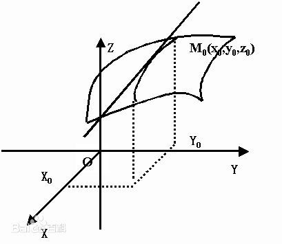
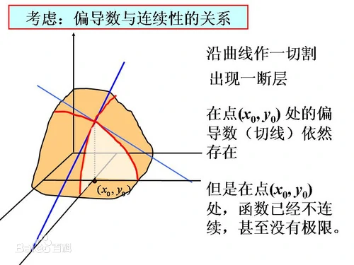

# 偏导数

原文： https://baike.baidu.com/item/偏导数

## 目录

一. 引入

二. 定义

三. 求法

四. 几何意义

## 一. 引入

​        在一元函数中，导数就是函数的变化率。对于二元函数的变化率，由于自变量多了一个，情况就要复杂很多。

​        在 $x \bigcirc y$ 平面内，当动点由 $P(x_0,y_0)$ 沿着不同方向变化时，函数 $f(x,y)$ 的变化快慢一般来说是不同的，因此需要研究 $f(x,y)$ 在点 $(x_0,y_0)$ 处沿不同方向的变化率。

​        在这里只学习函数 $f(x,y)$ 沿着平行于 $X$ 轴和平行于 $Y$ 轴两个特殊方位变动时， $f(x,y)$ 的变化率。

​        偏导数的标识符号是：$\partial$

​        偏导数反映的是函数沿**坐标轴**正方向的变化率。

## 二. 定义

### 2.1 $X$ 方向的偏导数

​        设有二元函数 $z = f(x,y)$ ，点 $(x_0,y_0)$ 是其定义域$D$内的一个点。把 $y$ 固定在 $y_0$ ，而让 $x$ 在 $x_0$ 处有增量 $\Delta{x}$ ，相应的函数 $z = f(x,y)$ 有增量（称为对 $x$ 的偏增量）$\Delta{z} = f(x_0 + \Delta{x}, y_0) - f(x_0, y_0)$ 。

​        如果 $\Delta{z}$ 与 $\Delta{x}$ 之比，当 $\Delta{x} \rightarrow 0$ 时的极限存在，那么此**极限值**称为函数 $z = f(x,y)$ 在 $(x_0,y_0)$ 处对 $x$ 的偏导数，记作 $f'_x(x_0,y_0)$ 或函数 $z = f(x,y)$ 在 $(x_0,y_0)$ 处对 $x$ 的偏导数。实际上，就是把 $y$ 固定在 $y_0$ 处，看成**常数**后，一元函数 $z=f(x, y_0)$ 在 $x_0$ 处的导数。

### 2.2 $Y$ 方向的偏导数

​        同样，把 $x$ 固定在 $x_0$，让 $y$ 有增量 $\Delta{y}$ ，如果极限存在那么此极限称为函数 $z=(x,y)$ 在 $(x_0,y_0)$处对 $y$ 的偏导数。记作 $f'y(x_0,y_0)$。

## 三. 求法

​        当函数 $z=f(x,y)$ 在 $(x_0,y_0)$的两个偏导数 $f'_x(x_0,y_0)$ 与 $f'_y(x_0,y_0)$ 都存在时，称 $f(x,y)$ 在 $(x_0,y_0)$ 处可导。如果函数 $f(x,y)$ 在域 $D$ 的每一点均可导，那么称函数 $f(x,y)$ 在域 $D$ 可导。

​        此时，对应于域 $D$ 的每一点 $(x,y)$ ，必有一个对 $x$ (对 $y$ )的偏导数，因而在域 $D$ 确定了一个新的二元函数，称为 $f(x,y)$ 对 $x$ (对 $y$ )的偏导函数。简称偏导数。

​        按偏导数的定义，将多元函数关于一个自变量求偏导数时，就将其余的自变量看成常数，此时他的求导方法与一元函数导数的求法是一样的。

## 四. 几何意义

​        表示固定面上一点的**切线斜率**。

​        偏导数 $f'_x(x_0,y_0)$ 表示固定面上一点对 $x$ 轴的切线斜率；偏导数 $f'_y(x_0,y_0)$ 表示固定面上一点对 $y$ 轴的切线斜率。

​        高阶偏导数：如果二元函数 $z=f(x,y)$ 的偏导数 $f'_x(x,y)$ 与 $f'_y(x,y)$ 仍然可导，那么这两个偏导函数的偏导数称为 $z=f(x,y)$ 的二阶偏导数。二元函数的二阶偏导数有四个：$f''_{xx}，f''_{xy}，f''_{yx}，f''_{yy} $。

​        注意：

​        $f''_{xy}$ 与 $f''_{yx}$ 的区别在于：前者是先对 $x$ 求偏导，然后将所得的偏导函数再对 $y$求偏导；后者是先对 $y$ 求偏导再对 $x$ 求偏导。当 $f''_{xy}$ 与 $f''_{yx}$ 都连续时，求导的结果与先后次序无关。 

## Sample：

