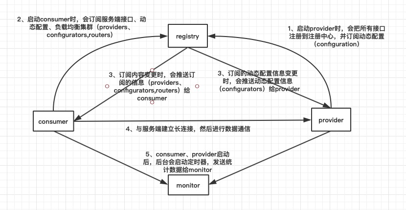
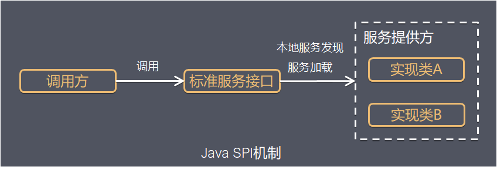
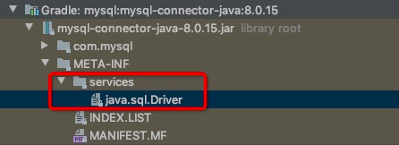

## Dubbo(1)：SPI 机制与实现路径

原文：https://cloud.tencent.com/developer/article/1700285


## 一. Dubbo启动流程

了解dubbo内核之前，先来了解dubbo的启动流程。参考本地启动时日志打印的 dubbo 启动整理出来的流程图如下：



1. 启动 provider 时，会把所有暴露的接口注册到注册中心，并会订阅动态配置 - configuration

2. 启动 consumer 时，会订阅服务端接口、动态配置、负载均衡集群（providers、configuration、routers）

3. provider：订阅的动态配置信息变更时，注册中心会推送动态配置信息（configuration）给 provider

   consumer：订阅内容变更时，会推送订阅的信息（providers、configuration、routers）给consumer

4. 客户端与服务端建立长连接，进行数据通讯

5. 客户端与服务端启动后，后台会启动定时器，每隔一段时间发送统计数据给 monitor

## 二. JDK标准的 SPI

在面向对象中，模块之间都是基于接口的。模块之间如果其中一个模块或接口实现需要进行更改，就需要修改代码。为了实现不对模块或者实现类之间不进行硬编码，即不在模块里写死代码，就可以使用 **SPI 这种服务发现机制**。JDK 中就提供了这种标准的 SPI 机制，将模块实现转移到代码之外。

SPI，Service Provider Interface，是Java提供的一套用来被第三方实现或者扩展的API，它可以用来启用框架扩展和替换组件。

整体机制图如下：



Java SPI 实际上是“**基于接口的编程＋策略模式＋配置文件**”组合实现的动态加载机制。

### 2.1 JDK-SPI 的具体约定

当服务的提供者提供了一个接口多种实现时，一般在 jar 包的 META-INF/services/ 目录下，创建该接口的同名文件，该文件里的内容就是该服务接口的具体实现类的名称。

当外部加载这个模块的时候，就能通过 jar 包的 META-INF/services 里的配置文件得到具体的实现类名，并加载与实例化，完成模块之间的装配。

### 2.2 JDK 中使用 SPI 的例子

MySQL 的 Driver 驱动的加载就是使用了 SPI 机制。如下图，在 META-INF 中配置了 Driver 的实现类，名为： com.mysql.cj.jdbc.Driver :



这个文件里的内容如下：

```properties
com.mysql.cj.jdbc.Driver
```

JDK 的 SPI 通过 ServiceLoader.load 进行加载。虽然 Driver 的接口很多，但是 META-INF 中国配置的类名只有一个，因此只会对 com.mysql.cj.jdbc.Driver 实现类进行加载：

```java
ServiceLoader<Driver> loadedDrivers = ServiceLoader.load(Driver.class);
```

### 2.3 JDK的 SPI 机制的缺点

JDK 标准的 SPI 会一次性实例化扩展点所有实现，因此不管是否用到这些实现类都会加载 META-INF 中配置的所有实现类，比较耗时。

Dubbo 内核中，也使用了 SPI 机制，但是内部对SPI 的实现进行了修改来保证性能。

## 三. Dubbo 内核 SPI

### 3.1 dubbo-spi 的具体约定

SPI 文件的存储路径在 META-INF/duboo/internal 目录下

SPI 文件内容定义为：扩展名=具体的类型。 如下代码所示：

```properties
dubbo=org.apache.dubbo.registry.dubbo.DubboRegistryFactory
```

dubbo-spi 比 jdk-spi 的内容定义中多了扩展名，即 dubbo 对 spi 的实现类进行加载时，会根据 key （即扩展名）对需要用到的 SPI 实现类进行加载。

spi 实现类则是通过 ExtensionLoader 进行加载。

### 3.2 SPI 实现路径

#### 3.2.1 getExtensionLoader 获取 ExtensionLoader

可以通过 ExtensionLoader.getExtensionLoader(Class<T> type) 来为 type 接口 new 一个 ExtensionLoader，并缓存起来。

可以看到 dubbo 容器 container 启动时的 main 方法中的关键一行代码：

```java
public class Main {
    private static final ExtensionLoader<Container> loader   
        = ExtensionLoader.getExtensionLoader(Container.class);
```

```java
public static <T> ExtensionLoader<T> getExtensionLoader(Class<T> type) {
    //...    
    //判断缓存中是否存在 loader    
    ExtensionLoader<T> loader = (ExtensionLoader<T>) 
        EXTENSION_LOADERS.get(type);
    if (loader == null) {        
        //new出一个loader，到缓存中     
        // EXTENSION_LOADERS
        //       .putIfAbsent(type, new ExtensionLoader<T>(type));
        loader = (ExtensionLoader<T>) EXTENSION_LOADERS.get(type);
    }
    return loader;
}
```

**ExtensionLoader 构造函数：**

```java
private ExtensionLoader(Class<?> type) {
    this.type = type;
    objectFactory = (type == ExtensionFactory.class ? 
                     null:                   
                    ExtensionLoader
                     .getExtensionLoader(ExtensionFactory.class)
                     .getAdaptiveExtension());
}
```

ExtensionLoader内部存放了type，即Container接口名字，与objectFactory即在ExtensionFactory，后续可以通过extensionFactory获取Container接口的实现。

ExtensionLoader.getExtensionLoader(Class<T> type) 执行完毕，就表示Container接口的ExtensionLoader被创建了出来并被放置在了缓存中，并且ExtensionLoader内部完成了type和extensionFactory属性的初始化。

**ExtensionFactory的作用**

可以通过getExtension为doubbo的IoC提供所有对象，并且ExtensionFactory的objectFactory为null。

#### 3.2.2 getAdaptiveExtension获取扩展装饰类对象 ####

被 @Adaptive注释修饰的类就是扩展装饰类，点开注释后可以看到 @Adaptive注释只能修饰类和方法。

```java
@Documented
@Retention(RetentionPolicy.RUNTIME)
@Target({ElementType.TYPE, ElementType.METHOD})
public @interface Adaptive {}
```

阅读getAdaptiveExtension源码：

```java
public T getAdaptiveExtension() {
    Object instance = cacheAdaptiveInstance.get();
    if (instance == null) {
        if (createAdaptiveInstanceError == null) {
            synchronized(cacheAdaptiveInstance) {
                instance = cachedAdaptiveInstance.get();
                if (instance == null) {
                    try {
                    }catch(Throwable t) {
                        createAdaptiveInstanceError = t;
                        throw new IllegalStateException("fail to create adaptive instance:" + t.toString(), t);
                    }
                }
            }
        } else {
            throw new IllegalStateException("fail to create adaptive instance:" + createAdaptiveInstanceError.toString(), createAdaptiveInstanceError);
        }
    }
    return (T)instance;
}
```

上面代码主要为从缓存中获取adaptiveextension，如果不存在则创建，创建成功后再放到缓存中。

**createAdaptiveExtension：**

```java
private T createAdaptiveExtension() {
    try {
        return injectExtension((T)getAdaptiveExtensionClass().newInstance());
    }catch(Exception e) {
        throw new IllegalStateException("Can not create adaptive extension");
    }
}
```

**getAdaptiveExtensionClass**

```
private Class<?> getAdaptiveExtensionClass() {
	getExtensionClasses();
	if (cachedAdaptiveClass != null) {
		return cachedAdaptiveClass;
	}
	return cachedAdaptiveClass = createAdativeExtensionClass();
}
```

第一步：getExtensionClasses中会加载SPI中的实现类：

```java
private Map<String, Class<?>> loadExtensionClasses() {
    // ...
    // 加载META-INF/double/insternal/接口名， SPI文件中的实现类
    // loadDirectory(extensionClasses, DUBBO_INTERNAL_DIRECTORY, type.getName());
    return extensionClasses;
}
```

```java
private void loadClass(Map<String, Class<?>> extensionClasses, java.net.URL resourceURL, Class<?> clazz, String name) throws NoSuchMethodException {
    
}
```

