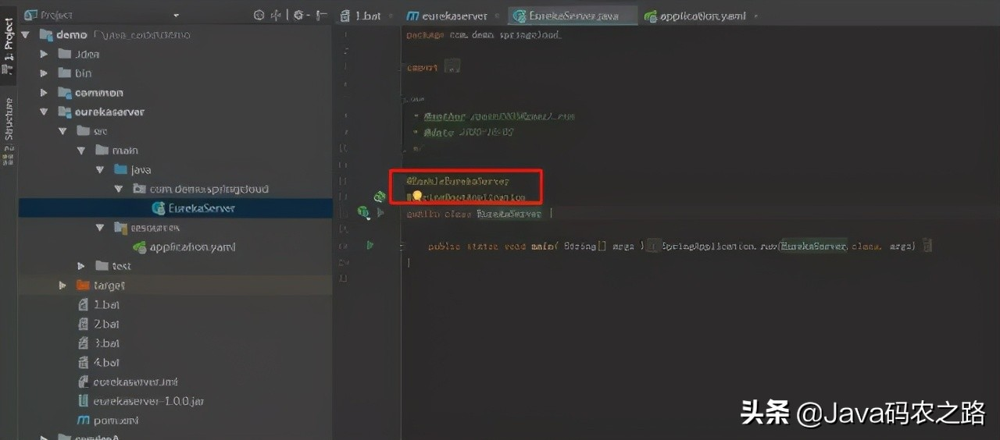
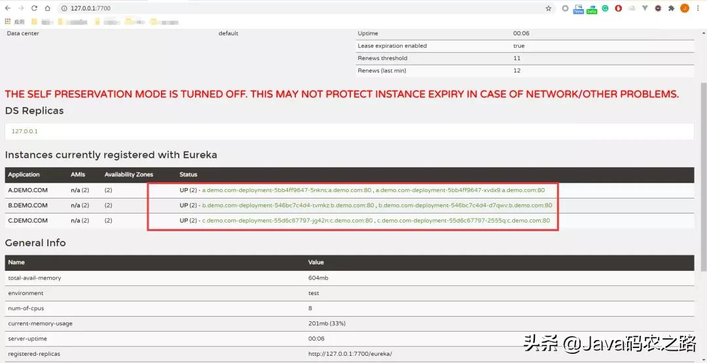
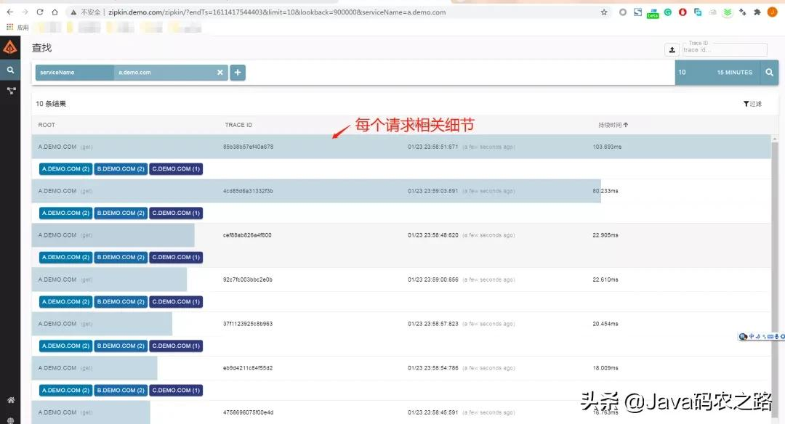
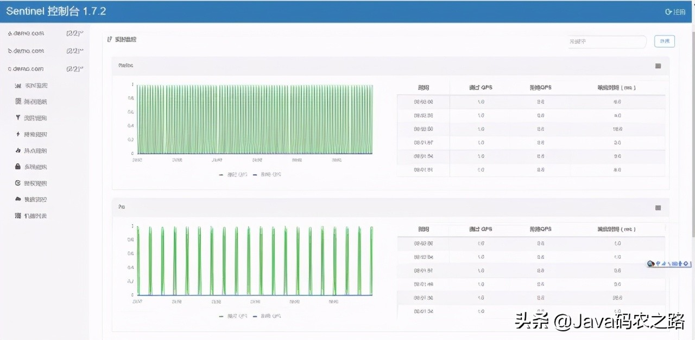
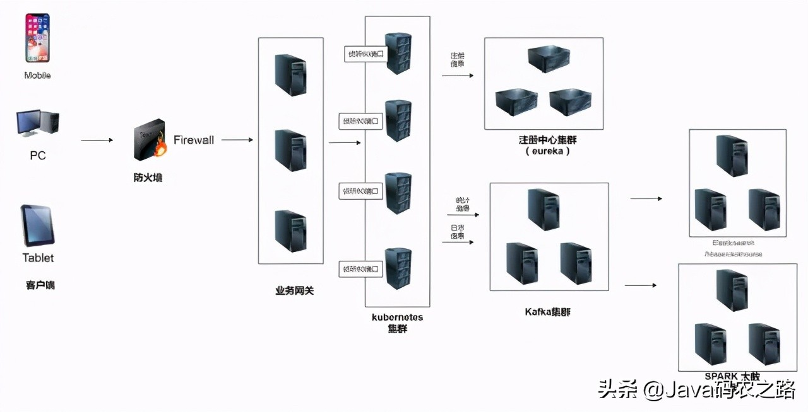

# 基于 Kubernetes 微服务项目设计与实现

原文：https://www.toutiao.com/i6948232119294411300/?tt_from=weixin&utm_campaign=client_share&wxshare_count=1&timestamp=1637317815&app=news_article&utm_source=weixin&utm_medium=toutiao_ios&use_new_style=1&req_id=2021111918301501013102815414109EC6&share_token=92063078-7B5D-4632-9915-A071C39E27D4&group_id=6948232119294411300

本文从设计开始，设计一个简单的前后端分离的项目，并将它部署在K8s集群上，期间将关注微服务和K8s配合的各个方面，并且从系统的可用性、可靠性、强壮性、可扩展性进行讨论，最终设计一个可以真正使用的系统。

从4个章节描述这个目标，分别是：

第一章：微服务项目的设计

第二章：微服务项目的具体实现

第三章：Kubernetes 的部署

第四章：微服务高可用部署及验证

> 微服务是一种设计思想，它并不局限于任何开发语言，在本例中选择 Java 的 SpringBoot 框架来实现微服务。微服务之间的 RPC 方案也很多，这里选择 RESTful 这种最常见的方案。为了项目的简洁，项目也没有涉及数据库和缓存、配置中心相关的内容。主要注重项目的设计思想实践和项目改进。

## 第一章：微服务项目的设计

### 1.1 微服务设计的思想

首先回顾一下微服务，微服务的定义来自 Martin Flower的文章，他描绘了一下微服务最本质的东西：

微服务把各个功能拆开了，每个模块的功能更加独立，也更加单一。每个模块都独立发展，可以说做到了功能的高内聚，低耦合。

再借一张图，这样数据库也被彻底拆分开了。一个巨大复制的单体数据库也按照功能拆成了小的独立的数据库了。

微服务就这么简单吗？当然不是，里面有很多细节需要考虑，纸上得来终觉浅，绝知此事要躬行。现在就开始真正的设计整套系统吧。

### 1.2 事件设计和改进

现在要设计的一个最简单的微服务架构，为了更贴近真实业务，假设这个系统是这样的：

整个系统的前端是一个有着前后端分离的站点，用户访问了 www.demo.com 这个前端站点，通过前端页面发起请求，www.demo.com 服务器将请求发往 a.demo.com，然后 a.demo.com 再请求 b.demo.com，b.demo.com 再请求 c.demo.com。c.demo.com 将结果返回，不断返回，最终显示在前端站点，完成一个微服务的全套调用流程。[ *一般业务系统在前端和微服务之间还存在一个网关部分，网关一般用于鉴权，请求分类，监控等功能，这里为了简单，省略了这部分*]

最终，将这套架构部署在 K8s 上，开始真正的服务用户。

### 1.3 改进项目

从上图可知，这是一个非常简单而且非常单薄的架构，存在很多问题，需要不断的解决它们。下面开始改进项目。

首先，要解决节点的可靠性，在上图中，所有的节点都只有一个实例，任何节点的崩溃都将造成项目无法运行，在真正的项目中这是不可接受的。怎么解决呢？就是每个节点增加多节点支持。

#### 1.3.1 加入多实例及注册中心

将各个模块的实例数目增加，多个实例才能保证整个系统的可靠性。如果一个实例有问题，还有其他相同的实例提供服务。如上图所示。

但是，多个实例又带来了一个问题：各个组件之间如何定位呢？如果有 10 个 b.demo.com 实例，它的上下游又该如何找到它们呢？解决方案之一，就是注册中心。注册中心解决的是应用之间寻址问题。有了它，上下游之间的应用可以相互寻址，并且获知哪些实例是可用的，应用挑选可用的实例进行工作。注册中心的方案很多，有 eureka、zookeeper、console、Nacos 等，这里选取 Spring Cloud 内置的 eureka 作为演示。

> 注：在 k8s 中部署微服务，对注册中心是没有任何限制的。所以不要被某些文章误导，按照这篇文章做，完全可以做到代码零修改，直接在 k8s 上运行。

#### 1.3.2 监控系统 Metris

在完成了注册中心的功能后，虽然整个系统可以运行了，但是会发现没有应用监控的情况下，对系统的运转状态是完全摸黑的，这样相当于盲人骑马，非常危险。运维人员需要知道所有微服务的运行状态，必须将各个微服务的状态监控起来，只有这样才能做到运筹帷幄。

这里选择使用 Prometheus 和 Grafana 这套监控组合。

在 K8s 上，需要每个微服务的实例里开启监控数据的导出功能，同时利用 Prometheus 的自动发现功能，这样 Prometheus 可以将数据收集存储起来。这里的数据包括每个应用的各项指标，比如内存大小、200错误数目、500的错误数目、JVM 线程数量，GC时间大小。配合 Grafana 的聚合显示能力，可以直观的对整个系统有完整的把控。在应用开发过程中，只需要在代码里加入一个类库就可以实现信息的导出，不需要专门的写代码。

#### 1.3.3 日志系统 Logging

目前已经有了监控，日志还有必要吗？当然，下面这个图就是反应监控的3个维度：

这三个维度分别是： Metrics、Tracing 和 Logging

**Metrics**：主要是指刚才说的监控，它主要反映的就是一个聚合的数据，比如今天200错误是多少，QPS是多少，它指的是一段时间内的数据聚合。

**Logging**：就是平时讨论的日志。它描述一些离散的事件。比如各个系统里的错误、告警等。所以需要将日志收集起来。

**Tracing**：关注单次请求中信息。关注请求的质量和服务可行性，是优化系统，排查问题的工具

说到了日志，在一个分布式系统，日志是非常重要的一环。因为微服务和容器的缘故，导致日志收集不是这么简单了。因为在 K8s 里，容器的销毁和重启都是经常出现的，需要在第一时间就把日志收集起来。

日志收集的方案有很多，有些方案是在本地启动一个收集进程，将落地的日志转发到 Kafka 组件再转发到日志中心；也有的方案是直接写到 Kafka 组件直接进入日志中心。两者各有优势。

在这里，采用后者这个方案。简单地利用一个组件将日志直接打入 Kafka 组件。这种方案的好处是日志不用再落地，日志 I/O 被消除了，日志的存储也和容器做到了分离。再也不用担心日志 I/O 会对宿主机造成的系统压力了。

#### 1.3.4 追踪系统 Tracing

刚才讨论了监控（Metrics）和日志（Logging），还有一个维度就是追踪（Tracing）。

随着微服务的实例越来越多，有一个很现实的问题出现了。当大规模分布式集群出现了，应用构建在不同的容器集群里，有可能布在了几千台容器里，横跨多个不同的数据中心。因此，就需要一些可以帮助理解系统行为、用于分析性能问题的工具。这该如何解决呢？可以看看google的论文 google dapper

Google 的论文描述一种解决办法，一般称为 APM （Application Performance Monitor）。它把一次调用加入一个独一无二的标记，并且在各个系统里透传标记，从而达到追踪整个消息处理过程的能力。市面上大多数实现都是基于这一思想，可选方案有很多，比如 cat pip、zipkin、skywalking。它们有需要代码注入的，有无注入的。这里挑选 zipkin。zipkin 需要在项目中加入一个库，并不需要写代码，这对业务的入侵做到了很少，非常方便。

#### 1.3.5 流量控制

到此，微服务就做完了吗？当然不是，微服务里还有一项非常重要的功能：流量控制。

当海量的请求来临时，可以用增加容量数量的办法来提高服务能力，但是简单的添加实例是很危险的，因为整个系统的服务能力是被系统短板所限制的，简单地添加实例，并不是总能起到提高服务能力的作用。反而可能引起反作用，最终导致整个系统的奔溃。

系统设计时，对整个系统的负载容量是有一个设计的。当超出设计能力的时候，需要对多余的请求说 No。相应的方案分别是**熔断、限流和降级**。目前 Java 领域在这方面使用的是 hystrix、sentinel。Sentinel 在这方面做的很好，在阿里接受了考验，并且使用起来也很简单，所以选它。

现在，整个系统里加上一个流量控制中心，这样一个基本完整的、可靠的、高可用的系统就基本完成了。

> 在实际开发中，其实还有最关键的配置中心（apollo）、数据库（DB），缓存（redis）等组件，服务化网格，可以把这些组件暂时放在 K8s 之外，仍然是可以起到同样效果的

## 第二章：微服务项目的具体实现

从前端向后端开始实现。

### 2.1 前端站点

前端站点的逻辑很简单，就是显示一个页面，页面有一个按钮。当点击按钮时，前端页面发起ajax请求，访问前端站点本身的一个接口，这个接口被nginx代理，转发到 a.demo.com 微服务上，a.demo.com 微服务再将请求转发到 b.demo.com，b.demo.com 再次转到 c.demo.com ，最终将结果返回给前端。前端站点再将结果显示在页面上。

通过结果显示，就能知道这次请求通过了哪些服务器，每台服务器的服务运行时间大概是多少。

前端站点代码大致如下：

然后看 a、b、c 应用部分的 Java 代码，这就是一个普通的多模块 Maven 项目：

项目很简单，分成3个部分，一个是注册中心，也就是利用 eureka 实现注册中心服务，另一个则是基础库项目，大部分功能都在这里实现，最后则是各个微服务项目，微服务项目只需要简单调用基础库就能完成。

### 2.2 注册中心

注册中心i的代码非常简单，只需要加一个简单的声明

这是注册中心的配置文件，在 K8s 集群里运行时，会运行 3 个节点组成高可用的注册中心集群。这时，这个配置项需要相应的修改。

### 2.3 基础库

在基础库项目里，将很多的依赖都放在里面，这样应用项目只需要简单依赖基础库就可以，能够做到统一修改。

同时也可以看到大部分依赖库只需要加入就可以，并不需要写代码就可以工作，这让开发工作变得轻松。

对于微服务的返回结果，这里做了一些美化格式。这样可以在检查结果时，比较容易。

简单的定义了一些返回的结构，通过这些结构，微服务可以把处理时的时间戳，线程号，实例 IP 等信息返回出来。

基础模块的日志实现，从 github 找的例子并简单的做了修改。（简单实现，不要用于生产）这时可以利用 logback.xml 的配置，选择把日志写入本地磁盘还是直接写入 Kafka。

### 2.4 应用实现

实现很简单，只是简单的调用基础库几句可以了。注意，每个应用需要实现一个探索接口 /hs，这样 k8s 系统可以通过这个接口来探索，获知这个应用是不是准备好了，能不能接入流量。否则，这个应用可能还在启动过程中，但是流量已经接入了，造成调用失败等问题。

在每个应用的配置里，都预置了各个配置的项目，在本地运行的时候，可以填入本地的配置，在 K8s 里，以容器形式运行，可以利用 yaml 来动态修改它们，做到 2 种情况下的完全兼容。

## 第三章：Kubernetes 的部署

在完成应用的编写后，需要安装 K8s 了。如果已经有 K8s 集群的，就可以直接跳过这章节。除了 K8s 集群以外，还需要 Prometheus 和 Grafana 这样的监控组件。所以这里推荐一个牛X的安装工具，和所有现有的 K8s 安装工具比，它是最好的，没有之一。

它的名字叫 K8seasy，它的优点在于：

1. 可以一键安装完整的 K8s 系统，无需了解任何背景知识
2. 所有的镜像都已经内置，不会因为下载了镜像失败而导致安装失败
3. 安装支持各种不同版本的 K8s
4. 安装的服务是二进制版本的，非容器版本，稳定高效
5. 支持安装 3 节点，高可用的生产环境集群

### 3.1 安装过程

下载 K8seasy，官方主页：https://github.com/xiaojiaqi/K8seasy_release_page

安装下载页： http://dl.K8seasy.com/

将 3 个安装文件都下载下来，其中 pack.2020.10.02.bin 和 installer 都是安装文件，kubernetes-server-linux-amd64.tar.gz 是 K8s 的官方软件包，可以选择一个最新的版本。

如果要选择一个其他的版本 K8s，这样操作：

安装的过程很简单，2 条命令就可以。这里假设需要安装 K8s 的网络为 192.168.2.0， master 主机为 192.168.2.50

### 3.2 创建密钥

sudo ./install --genkey -hostlist=192.168.2.1

### 3.3 创建集群

sudo ./installer -kubernetestarfile kubernetes-server-linux-amd64v1.18.2.tar.gz -masterip 192.168.2.50

稍等一会儿，就能看到如下的输出：

就这么简单，一个 K8s 已经安装好了。此时相关的所有监控已经被完全安装好了。

### 3.4 各项监控

以 master 节点为 192.168.2.50 为例， 在浏览器中输入 http:// 192.168.2.50:10000 可以直接打开 Dashboard，对整个集群有一个全面的了解：

打开 http://192.168.2.50:8080 可以直接访问alertmanager

打开 http://192.168.2.50:8081 你可以直接使用 Grafana (用户 admin, 密码admin)：

打开 http://192.168.2.50:8082 你可以访问 Prometheus.

### 3.5 多套环境监控

这一切就完成了吗？没有。为了支持多集群管理，再推荐一个工具。刚才说到，直接使用 http://192.168.2.50:1000 这个页面可以直接管理整个集群，但是在公司里，如果有多个集群，该如何管理呢？别担心，K8seasy 已经有了对应的解决方案：

仔细看刚才的安装好的日志，里面提示，专门生产了一个 lens.kubeconfig 的配置文件，并且有一个 域名 和 IP 的对应表。这个时候，只需要首先在本地 HOST 文件里加入这个对应：

然后去 https://Kuberneteslens.dev/

下载一个 lens 的安装包。安装 lens 以后，只需要将 lens.kubeconfig 导入到 lens 里：

导入完成后，就可以远程管理这个集群了。这样，即使有多个集群，也可以只用一套 lens 进行管理了。

Lens 的界面优美，使用方便：

到此，Kubenetes 的安装完成了。当然，K8seasy 的功能非常强大，可以用 sudo ./installer -h 查看帮助，也可以用 sudo ./installer -demo 查看各种场景的安装帮助。

## 第四章：微服务高可用部署及验证

Kubernetes 装好后，现在开始将微服务部署上去。刚才的代码只是 Java 源码，还需要将它们编译成 Jar 包，然后再打成 docker 镜像才能部署。这部分比较简单，所以不演示如何完成，会把相关的 dockerfile 和最终的 yaml 都放在 Github 里。在开始开发时，提到将日志i写入Kafka，所以有 2 套配置，一套使用了 Kafka，一套没有使用 Kafka，要注意区别。因为没有 Kafka 比较容易实施，这里使用没有 Kafka 的版本。这样，只要一台 Linux 就可以保证将整个流程实施成功。

### 4.1 服务部署

依次运行每条部署 Yaml 的命令即可，不需要做其他的操作。

注意，镜像在 Docker-Hub ，可能需要一定时间下载。

运行后在Dashboard 查看，可以看到类似的信息，所有的服务都已经成功运行。

### 4.2 查看Dashboard

此时，修改本地的Hosts：

这样的话，因为 K8s 是支持 nginx-ingress 的，所以可以直接访问 master 的物理 IP 来访问这些服务，不需要做任何的转换。

首先，可以打开 dashboard 从中查到 Eureka 服务器的具体IP，然后访问 eureka 服务。

### 4.3 查看注册中心

在页面中可以发现，在 K8s 集群里，启动了 3 个 eureka 服务，它们相互注册，组成了一个高可用集群：

其次，在 Grafana 中导入 JVM 的监控项目：

这样，Grafana 可以帮助把各个 Java 服务的具体状态做一个收集，完成所需的监控。

### 4.4 前端验证

此时，打开 http://www.demo.com 的网页。

可以点击页面上的 get 请求按钮，模拟发出请求，随后就会发现页面里显示了信息在不断变化：

页面显示的内容，可以清楚的看到，消息在不同的实例里处理。如果有一个实例出现了故障，是不会影响现有的业务的。

下面开始验证整个系统。

### 4.5 模拟验证

使用一个简单的脚本，模拟每 3 秒从前端访问一次后端：

### 4.6 调用关系验证

首先，打开 zipkin： http://zipkin.demo.com

点击具体的请求，可以查看到每次请求的内部细节：

### 4.7 限流熔断验证

其次，打开 sentinel 站点，这个站点可以监控，也可以对微服务进行限流，限速，熔断等操作。（用户名、秘密都是 sentinel）：

进入控制台后，可以发现，所有的服务已经自动被发现，并存在于左边的菜单：

分别点开 a、b、c 这 3 个服务，可以看到规律的周期访问，和脚本的测试速度是一致的：

Sentinel 里面内含强大的监控、流控、降级等功能，具体的使用，可以慢慢学。

### 4.8 应用状态验证

打开 Grafana 的监控页，可以查看到所有应用的状态，包括 heap 大小，启动时间，错误数目等等信息。

通过这张图可以了解每个应用本身的状态，使用了多少内存，响应的代码是多少，JVM 的使用情况。对各个组件的运行情况都有了一个全面的了解。一个基于 K8s 的微服务架构已经开始工作了。

上图，是一张常用的系统架构图，希望通过本文对高可用微服务如何架设 K8s 上有一个基本的了解。