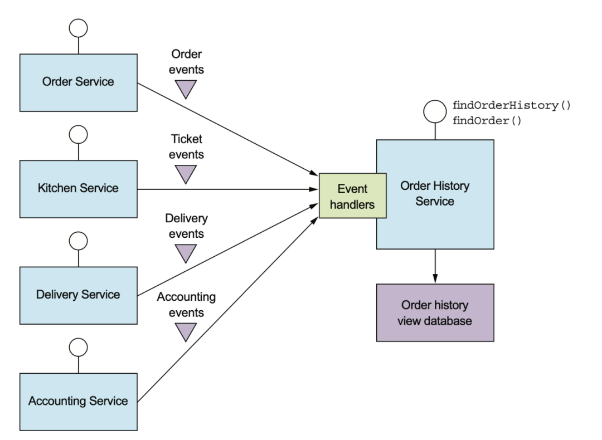
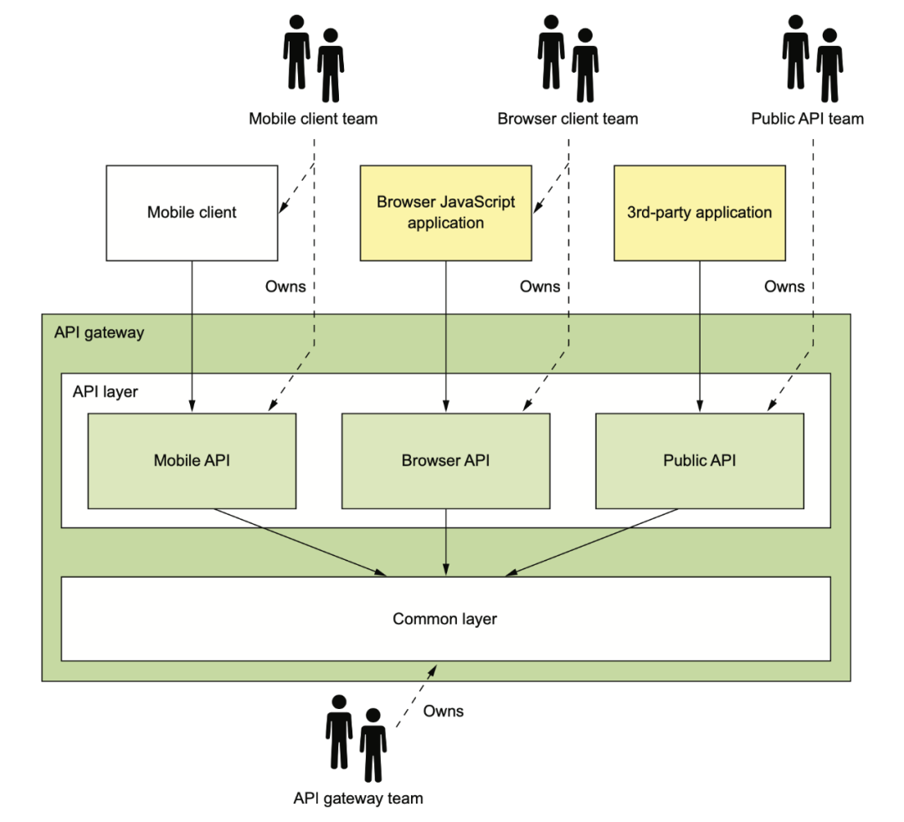

# 《微服务架构设计模式》的一点总结

原文：https://www.toutiao.com/a6990543830961357326/?log_from=4be492e809ace8_1627778723530

​        经常阅读微服务材料的话，总会碰到 [microservices.io](https://microservices.io) 这个网站，总结了微服务方方面面的设计模式。网站的作者是 Chris Richardson。

​        这些经验在2018年成为了《微服务架构设计模式》一书，并在2019年引进国内。这本书应该是目前微服务领域最好的一本书了。

​         这本书提供了宏观上俯瞰微服务整个生态的大图，如：

​        当然，2018年的时候， Service Mesh 之类的东西还没有太火，所以后来网站上有了新的更新版本：

​        个人喜欢这种大图，不管什么领域，只要照着图去一点一点填坑就行了。没有这个样的图，总觉得是在望不见头的技术森林里兜兜转转，找不到北。

​        下面简单写写这本书的总结，里面Saga和测试部分就先省略。

## 单体服务的困境

​        在单体时代，大家在一个仓库里开发，代码冲突解决起来很麻烦，上线的CI/CD pipeline 也是等待到死。

​        拆分了以后，至少大家有各自的代码库，各自的上线流程，各自的线上服务。这样上线不打架了，上线以后也可以玩自己的灰度流程，一般不会相互影响。

## 服务拆分

​        虽然说是拆了，不过拆分也要讲究方法的。

​        书里提供了两种思路：一种是按照业务/商业能力拆分，一种是按照DDD中的sub domain拆分。

​        例如，下面的业务：

> * 供应商管理
>   * 送餐员信息管理
>   * 餐馆信息管理：管理餐馆的订单、营业时间、营业地点
> * 消费者管理
>   * 管理消费者信息
> * 订单获取和履行
>   * 消费者订单管理：让消费者可以创建、管理订单
>   * 餐馆订单管理：让餐馆可以管理订单的准备过程
> * 送餐管理
>   * 送餐员状态管理：管理可以进行接单操作的送餐员的实时状态
>   * 配送管理：订单配送追踪
> * 会计
>   * 消费者记账：管理消费者的订单记录
>   * 餐馆记账：管理餐馆的支付记录
>   * 配送员记账：管理配送员的收入信息

最终大概会形成上面的这些服务。

​        用DDD来做分析，其实得到的结果也差不多：

​        在拆分时，还应用SOLID中的SRP原则和另一个闭包原则 CCP（Common Closure Principle）来进行指导。

​        在拆分后，也要注意微服务的拆分会额外带来的问题：

* 网络延迟
* 服务间同步通信导致可用性降低
* 在服务间维持数据一致性
* 获取一致的数据视图
* 阻塞拆分的上帝类

## 服务集成

​        分布式服务通信大概可以分为 one-to-one 和 one-to-many：

​        RPC很好理解，同步的 request/response。异步通信，一种是回调式的request/response，一种是一对多的pub/sub。

​        具体到RPC的话，可以使用多种协议和框架：

​        不过当API更新时，应该遵循 semver 的规范进行更新。社区里 gRPC 很多次更新都**没有**遵守 semver，给它的依赖方造成了不小的麻烦。

​        不得不说，Google 程序员也并不是事事靠谱。

​        PRC 进行服务集成的时候，更注意不要被某些不稳定的服务慢响应拖死，要注意设置超时，熔断。

​        服务于服务之间要能找得到彼此，有两种方式，一种是基于服务注册中心的服务发现：

​        一种是基于dns的服务发现。现在基于dns的应该不多了：

​        除了 RPC 以外，还可以使用消息来进行服务间的继承：

​        使用 MQ 也可以模拟 RPC 的 request/response，不过这样会使服务强依赖于 MQ， 如果 MQ 故障，整个系统随之崩溃。下图是模式RPC的模式：

​        一般的，使用的是 broker-based MQ 通信，但也有无 Broker 的异步通信。书中这里举了 ZeroMQ 的例子：

## Event Sourcing

​        Event Sourcing 是一种特殊的设计模式，不记录实体的终态，而是记录所有状态修改的事件。然后通过对事件进行计算来得到实体最终的状态。

​        但这样，事件累积过多，会有性能问题，所以可以对一部分历史数据进行计算，得到一个中间的快照，之后的计算在快照的基础上再叠加。

​       看起来很酷，在实际工作中也确实在一些**下游的计算逻辑中**使用过这种设计模式，不过这种模式也有它的缺陷：

* 事件本身结构变化时，新老板本兼容比较难做
* 如果代码中要同时处理新老版本数据，那么升级几次后会非常难维护
* 因为容易追溯，所以删除数据变得非常麻烦，GDRP 类的法规要求用户注销时必须将历史数据删除干净，这对 Event Sourcing 是一个巨大的挑战

​        在使用异步消息来做解耦的时候，也会遇到一些实际的业务问题：

* 这个数据“我”需要，“你”能否帮忙在消息里透传一下
* 重构的时候怎么把这个字段删除了？“我”还需要呢
* 原来的状态机变更都有Event，本来有三个，现在怎么变成两个了
* API故障了，怎么消息顺序乱了
* ……

​        这要求能有对上游的领域事件进行校验的系统，可以参考 Google的 schema validation 这个项目。

## 查询模式

​        很多查询逻辑其实就是进行 API 的数据组合，这个涉及到需要组合数据的 API 组合器，和数据提供方：

* API 组合器：通过查询数据提供方的服务实现查询操作
* 数据提供方：提供数据

​        虽然看起来挺简单，写代码的时候，下面这些问题还是很难处理：

* 谁来负责拼装这些数据？有时是应用，有时是外部 API Gateway，难以订立统一的标准，在公司经常扯皮
* 额外增加的开销 - 一个请求要查询很多接口
* 可用性降低 - 每个服务可用性如果是 99.5%，实际接口可能是 $99.5^5 = 97.5$
* 事务数据一致性难以保证 - 需要使用分布式事务框架/使用事物消息和幂等消费

## CQRS

​        业务开发经常自嘲是 CRUD 工程师，在架构设计里， CRUD 的 R 可以单独拆出来，像这样：

​        拆出来的好处是啥？互联网大多是写少读多，将关注点分离之后，读服务和写服务的存储可以做异构。

​        比如写可以是MySQL，而读则可以是各种非常容易做横向扩展的NoSQL。碰到检索需求，读还可以是 ElasticSearch。

​        读服务可以订阅写服务的 Domain Event，也可以是 MySQL 的 binlog。

​       在消费上游数据时，需要根据业务逻辑去判断有些状态机要怎么做处理。这里其实数据上是有耦合的，并不是放个 MQ 和 Domain Event 就能解耦干净了。

​        CQRS的缺点也很明显：

* 架构复杂
* 数据复制延迟问题
* 查询一致性问题
* 并发更新问题处理
* 幂等问题需要处理

## 外部API模式

​        现在的互联网公司一般客户的都是多端，web、移动、向第三方开放的open API。

​        如果直接把之前用拆分方法拆出来的这些内部 API 开放出去，那么内部的 API 想升级就会非常非常的麻烦。

​        在单体时代，客户端弱网 internet，只需要一次调用。微服务化后，如果不做任何优化，那么internet这种慢速网络上就需要多次调用。

​        这就是为什么需要中间有一个 API Gateway 的原因。

​        有了 Gateway 之后，在 internet 依然还是一次调用，在内部 IDC 强网络的状态下，多次网路调用相对没有那么糟糕。

​        API Gateway 涉及到这些不同端的 API Gateway 应该要谁来维护的问题。下面是一种理想的情况：Mobile 端团队负责维护他们在 Gateway 里的 API （也可能是单独的 Gateway），web 端团队维护 web 的 Gateway， Open API 团队负责维护第三方应用的 Gateway API。

​        网关基础设施团队负责提供这三方都需要的基础库。

​        在研发 API Gateway 时，有多种选项：

* 直接使用开源产品
  * Kong
  * APISix
  * Traefik
* 自研
  * zuul
  * Spring Cloud Gateway
  * RESTful 自己做一个
  * GraphQL 自己做一个

​        开源的 API Gateway 大多不支持 API 数据组合的功能，所以公司内的API Gateway 有时候有两层：一层时 nginx 之类的负责简单路由和鉴权的gateway，后面还有一个业务的 BFF 来负责拼装端上需要的数据。

​        如果是自研，那就可以在一个模块上把 API Gatewayt 需要的功能都实现。那么，这又涉及到，使用 RESTful 还是 GraphQL 呢？

​        但是，RESTful 风格的API会忽略终端设备的特性。比如，有些设备内存小，有些设备屏幕小。这些设备上获取统一的返回结果，很多内容（字段）对它们来说根本用不上，纯粹是浪费网络带宽。

​        所以，如果使用JSON Graph 来描述内部 API 提供的数据，然后用 JS 来定制涂上的查询，就能解决RESTful的缺点。这就是大家比较熟悉的 GraphQL：

