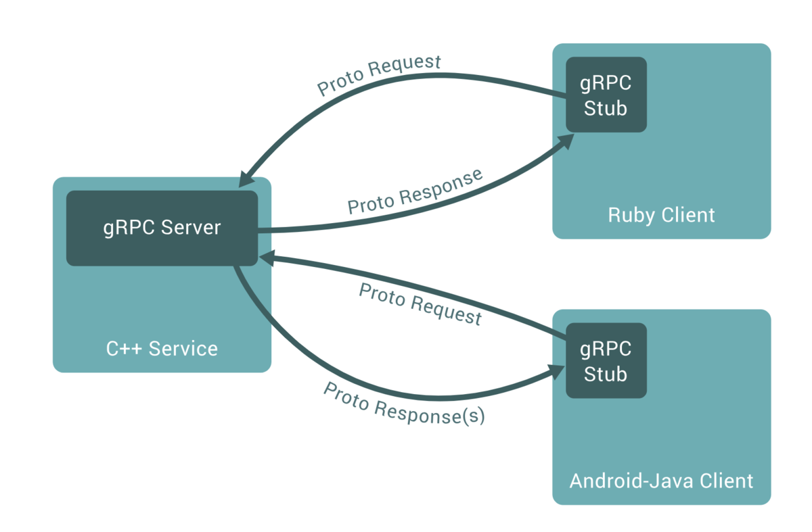
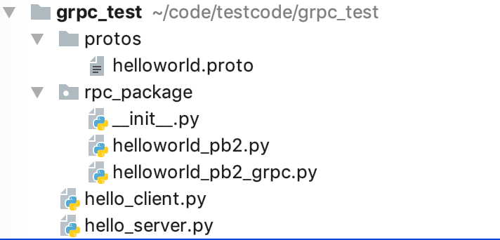

# gRPC详解

原文：https://www.jianshu.com/p/9c947d98e192


### 1. gRPC是什么？

gRPC是什么可以使用官网的一句话来概括：

> A high performance, open-source universal RPC framework

所谓RPC框架实际是提供了一套机制，使得应用程序之间可以进行通信，而且也遵从 server / client 模型。使用的时候，客户端调用 server 端提供的接口就像是调用本地的函数一样。如下图所示，就是一个典型的 RPC 结构：



### 2. gRPC 有什么好处，以及在什么场景下需要用 gRPC

既然是 server / client 模型，那么直接用 restful API 不是也可以满足吗？为什么需要RPC呢？下面就来看看 RPC 到底有什么优势。

#### 2.1 gRCP vs RESTful API

gRPC 和 RESTful API 都是提供了一套通信机制，用于 server / client 模型通信，而且它们都是用 **HTTP** 作为底层的传输协议（严格的说，**gRCP使用的是 http2.0**， 而RESTful API 则不一定）。不过 gRPC 还是有些特有的优势：

* gRPC 可以通过 protobuf 来定义接口，从而可以有更加严格的接口约束条件
* 通过 protobuf 可以将数据序列化为二进制编码，可以大幅减少传输的数据，提供性能
* gRPC 可以方便地支持流式通信（理论上通过HTT2.0就可以使用 Streaming 模式，但是通常web服务器的 RESTful API 很少这么用，通常的流式数据应用，如视频流，一般都会使用专门的协议，如 HLS，RTMP等，这些就不是我们通常 web 服务了，而是专门的服务器应用）

#### 2.2 使用场景

* **需要对接口进行严格约束的情况**。比如提供一个公共服务，如果访问的客户有公司外部的客户，这时对于接口就要严格的约束，不希望客户端传入任意的数据，尤其是考虑到安全性的因素。这时使用 gRPC iu可以通过 protobuf 来提供严格的接口约束
* **对性能有更高要求时**。有时服务需要传递大量的数据，而又希望不影响性能，这个时候也可以考虑gPRC服务，因为通过protobuf可以将数据压缩编码转化为二进制格式，通常传递的数据量要小很多，而且通过 http2 可以实现异步的请求，从而大大提高通信效率

但是，通常不会单独使用gPRC，而是将gRPC作为一个部件进行使用，这是因为在生产环节，面对大并发的情况下，需要使用分布式系统来处理，而gRPC并没有提供分布式系统相关的一些必要组件。而且，真正的线上服务还需要提供包括负载均衡、限流熔断、监控报警、服务注册和发现等必要组件。

### 3. gRPC HelloWorld实例详解

 gRPC的使用通常包含如下几个步骤：

1. 编写 protobuf 来定义接口和数据类型
2. 编写 gRPC server 端代码
3. 编写 gRPC Client 端代码

下面通过一个实例来详细讲解上述的三个步骤。下图是 hello world 例子完成后的目录：



#### 3.1定义接口和数据类型

* 通过protobuf 定义接口和数据类型

  ```python
  syntax = "proto3";
  
  package rpc_package;
  
  // define a service
  service HelloWorldService {
      // define the interface and data type
      rpc SayHello (HelloRequest) returns (HelloReply) {}
  }
  
  // define the data type of request
  message HelloRequest {
      string name = 1;
  }
  
  // define the data type of response
  message HelloReply {
      string message = 1;
  }
  ```

* 使用gRPC protobuf 生成工具生成对应语言的库函数

  ```shell
  python -m grpc_tools.protoc -I=./protos --python_out=./rpc_package --grpc_python_out=./rpc_package ./protos/user_info.proto
  ```

  这个指令会自动生成 rpc_package 文件夹中的 helloworld_pb2.py 和 helloworld_pb2_grpc.py，但是不会自动生成 \__init__.py 文件，需要手动添加

#### 3.2 gRPC Server 端代码


