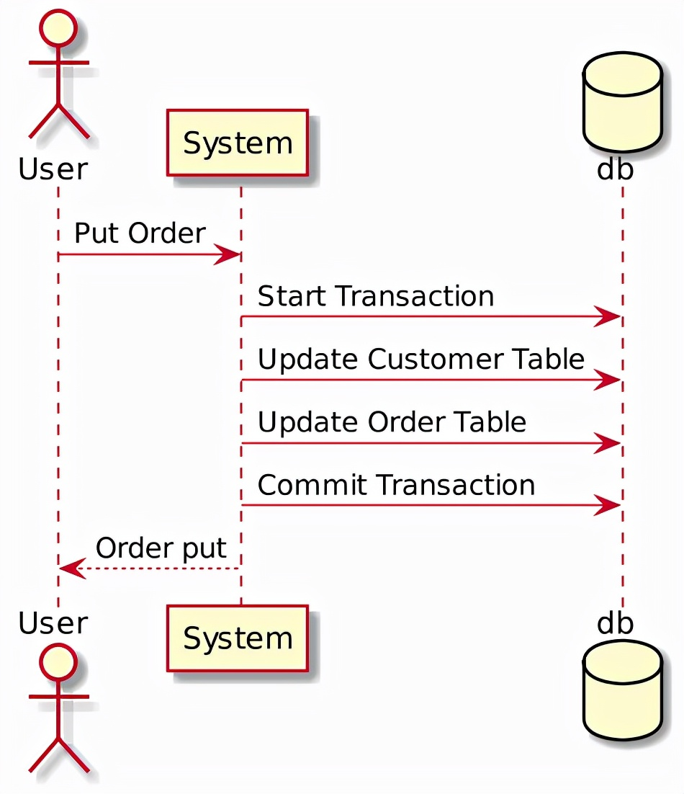
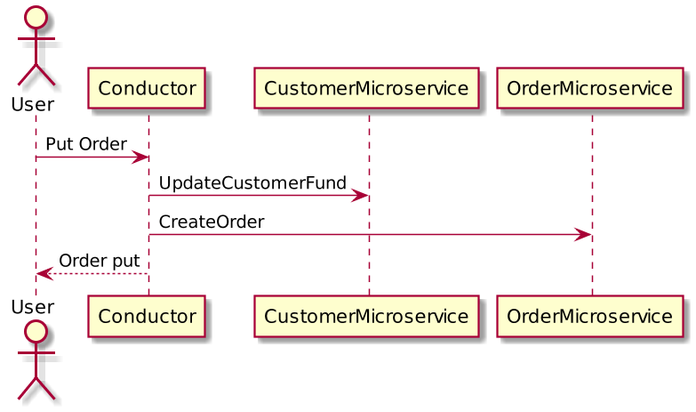
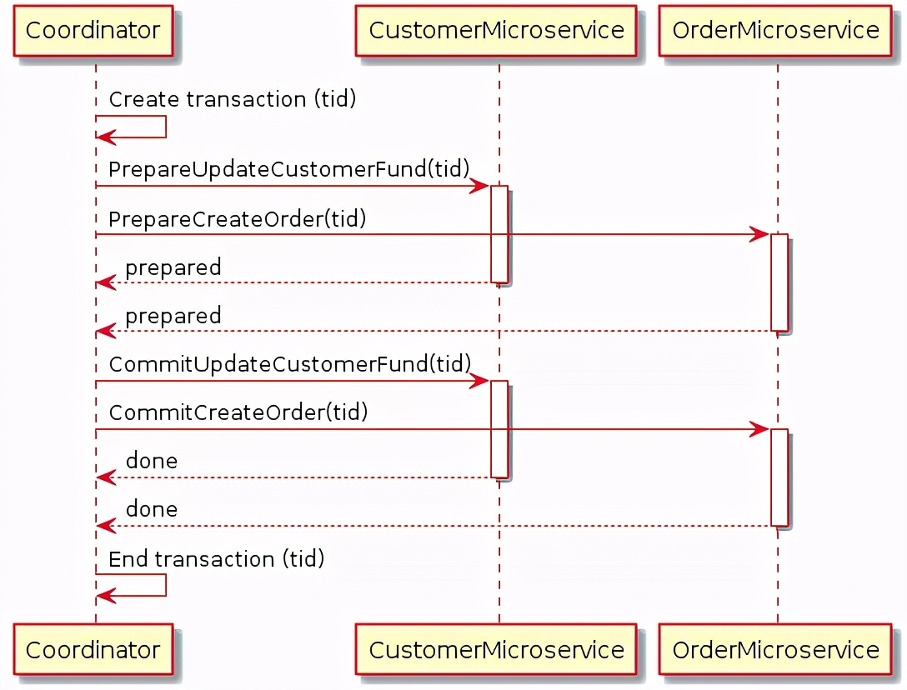
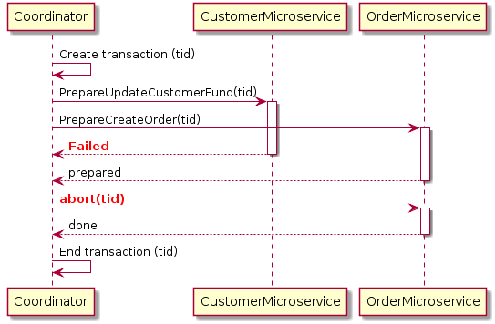
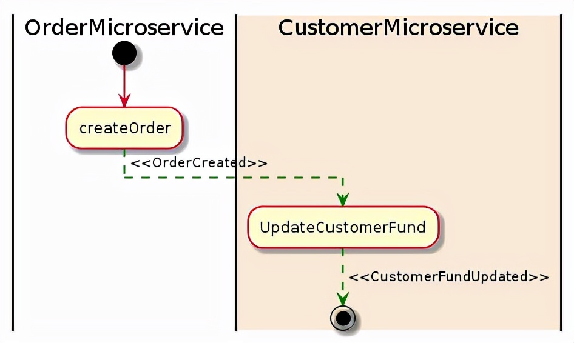
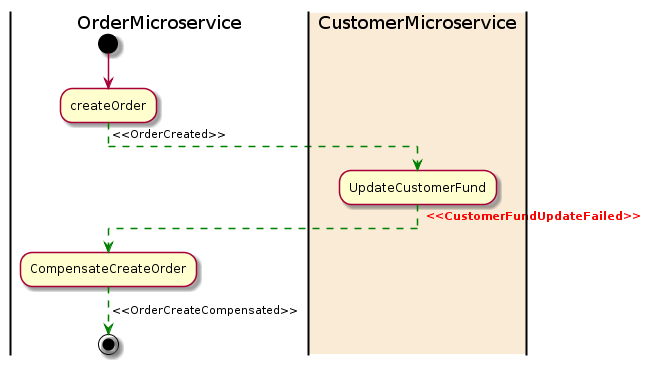

# 微服务架构中的分布式事务

原文：https://www.toutiao.com/a7004327735988634116/?log_from=f2e21e19b3c0d_1630896087017

​        微服务架构越来越流行，然而，微服务中一个普遍的问题是如何跨多个微服务管理分布式事务。

## 一. 分布式事务的概念

### 1.1 什么是分布式事务

​        当微服务架构将单体系统分解为多个服务时，它可能会打破之前的事务。微服务架构意味着单体系统的本地事务被分配到多个服务中，这些服务将按顺序调用。

​        首先来看一个单体系统当中使用 Local Transaction 的客户订单示例：

​        上面的客户订单示例中，如果用户向一个单体系统执行“下订单 Put Order”操作，则系统将创建一个在多个数据库表上工作的**本地**数据库事务。如果任何步骤失败，则事物可以回滚。这称为 ACID，由数据库系统保证。

​        现在分解系统为微服务，然后创建了 CustomerMicroservice 和 OrderMicroservice 两个微服务，它们具有单独的数据库。拆分之后，下图是客户使用微服务的客户订单示例：

​        当用户发送 “Put Order” 请求时，两个微服务都将被调用，将更改应用到它们自己的数据库中。由于该事物现在跨多个数据库，因此被视为分布式事务。

### 1.2 分布式事务的问题是什么

​        在单体系统中，有一个数据库系统来保证ACIDity。针对分布式环境，需要澄清以下关键问题：

​        在数据库系统中，原子性意味着在事务中所有步骤**都已经完成**或者**都没有完成**。默认情况下，基于微服务的系统没有全局事务协调器。上面的示例中，如果 CreateOrder 方法失败，如何回滚 CustomerMicroservice 应用的更改呢？

​        如果对象是由事务写入的，并且同时（在事务结束之前），则该对象被另一个请求读取，则该对象应该返回旧数据还是更新后的数据呢？在上面的示例中，一旦 UpdateCustomerFund 成功，但仍在等待 CreateOrder 的相应，对当前客户资金的请求是否应该返回更新后的金额呢？

​        上述问题对于基于微服务的系统很重要。否则，无法判断交易是否成功完成。

​        以下两种模式可以解决此问题：

* 2PC （Two-Phase Commit）
* Saga模式

## 二. 分布式事务问题的方案

### 2.1 两段提交

​        两段提交（2PC）被广泛应用于数据库系统。在某些情况下，可以将 **2PC** 用于微服务。*注意：并非所有情况都适合 2PC*。事实上，在微服务架构中，2PC 被认为是不切实际的。

​        那么什么是两阶段提交呢？

​        顾名思义，2PC 具备两个阶段：“**准备阶段**”和“**提交阶段**”。

* 准备阶段：将要求所有微服务准备一些可以原子完成的数据更改
* 提交阶段：准备阶段完成后，提交阶段将要求所有微服务进行**实际更改**

​        通常，需要有一个全局协调器来维护事务的生命周期，并且该协调器将需要在准备和提交阶段调用微服务。

​        这是客户订单示例的2PC实现：

​        上图示例中，当用户发送订单请求时，协调器将首先使用所有上下文信息创建全局事务。然后，它将告诉 CustomerMicroservice 准备用创建的交易更新客户资金；然后，CustomerMicroservice 将检查例如用户是否有足够的资金来进行交易等更新操作的前提条件。一旦 CustomerMicroservice 可以执行更新，它将锁定该对象，使其免受进一步的更改，并告诉协调器已经准备好。在 OrderMicroservice 中创建订单时会发生相同的事情。一旦协调器确认所有微服务都准备好应用其更改，它将通过请求事务提交来要求它们应用更改。此时，所有对象将被解锁。

​        如果任何单个微服务在任何时候都无法准备，则协调器将终止事务并开始回滚过程。这是客户订单示例的2PC的回滚图：

​        在上面示例中，CustomerMicroservice 由于某种原因未能准备，但是 OrderMicroservice 答复说它已经准备好创建订单了。由于存在一个未能准备的服务，协调器将请求 OrderMicroservice 上的事务终止，然后 OrderMicroservice 将回滚所做的所有更改并解锁数据库对象。

#### 2.1.1 2PC的优点

​        2PC 是一个非常强大的一致性协议。

​        首先，**准备**和**提交**阶段确保事务是原子的。事务将以所有微服务成功返回或所有微服务没有任何更改的方式结束。

​        其次，2PC 允许读写分离。这意味着在协调员提交更改之前，对字段的更改是不可兼得。

#### 2.1.2 2PC的缺点

​        尽管 2PC 解决了事务问题，但实际上并不建议将其用于许多基于微服务的系统，因为 **2PC 是同步**的（阻塞）。该协议将需要在事务完成之前锁定将要更改的对象。在上面的示例中，如果客户下订单，则该客户的“资金”字段将被锁定。这样可以防止客户应用新订单。这是有道理的，因为如果“准备好的”对象在声明它是“准备好的”之后发生了更改，则提交阶段可能无法正常工作。

​        在数据库系统中，事务往往会很快（通常是50毫秒以内）。但是，微服务在 RPC 调用上有很长的延迟，尤其是在与外部服务（如支付服务）集成时。该锁可能成为系统的瓶颈。同样，当每个事务请求对另一个请求的资源进行锁定时，两个事务可能会相互锁定（死锁）。

### 2.2 Saga模式

​        Saga模式是另一个广泛用于分布式事务的模式。它不同于2PC，后者时同步的。**Saga模式时异步的和反应式的**。在Saga模式中，分布式事务由所有相关微服务上的异步本地事务完成。**微服务通过事件总线（Event Bus）相互通信**。

​        这是客户订单示例的Saga模式：

​        在上面的示例中，OrderMicroservice 收到下订单的请求。它首先启动本地事务以创建订单，然后发出 **OrderCreated事件**。CustomerMicroservice 会监听此事件，并在收到事件后更新客户资金。如果从资金中成功扣除，则发出 **CustomerFundUpdated事件**。在这个示例中，所有的任务都成功执行完成，表示交易成功结束。

​        如果任何微服务无法完成其本地交易，则其他微服务将**运行补偿交易以回滚更改**。这是补偿交易的Saga模式图：

​        上图示例中，UpdateCustomerFund 由于某种原因失败了，然后发出了 **CustomerFundUpdateFailed事件**。OrderMicroservice 侦听事件并开始其补偿事务以还原已创建的订单。

#### 2.2.1 Saga模式的优点 

​        Saga模式的一大优势，是它**支持长期交易**。因为每个微服务仅专注于其自己的本地原子事务，所以如果微服务长时间运行，则不会阻止其他微服务。这也允许事务继续等待用户输入。另外，由于所有本地事务都是并行发生的，因此任何对象都没有锁定。

#### 2.2.2 Saga模式的缺点

​        Saga模式很难调试，尤其是涉及许多微服务时。而且，如果系统变得复杂，事件消息可能变得难以维护。Saga模式的另一个缺点，就是它没有读写分离。例如，客户可能看到正在创建的订单，但是在下一秒，由于补偿交易，订单被删除了。

## 三. 结论

​        **Saga模式是解决基于微服务的体系结构中的分布式事务问题的首选方法**。 虽然它也引入了一系列新问题，例如如何自动更新数据库并发出事件。 采用Saga模式需要在开发和测试方面改变观念。 对于不熟悉这种模式的团队来说，这可能是一个挑战。 有许多变体可以简化其实现。 因此，选择正确的方法来为项目实施它很重要。