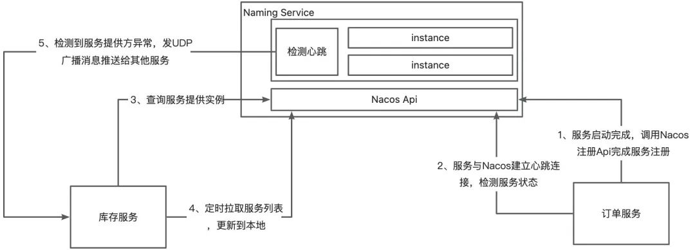
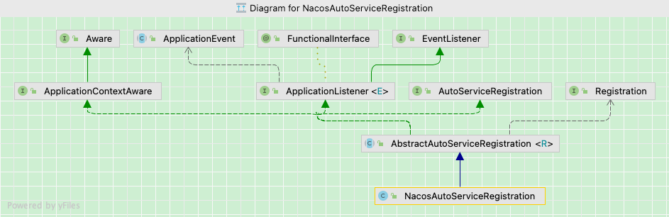
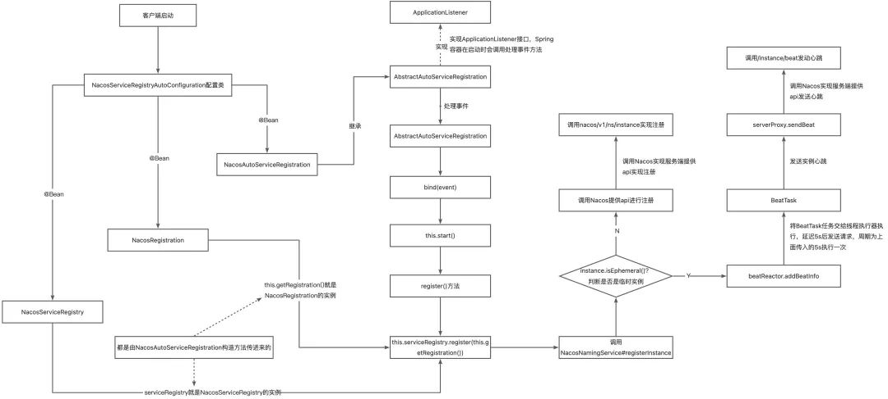
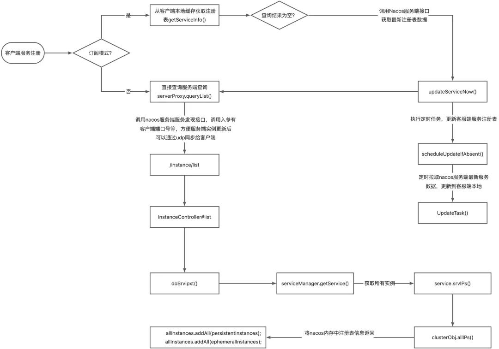

## 深入理解Nacos注册原理 ##

原文：https://www.toutiao.com/article/7189406105192120893/


### Nacos简介 ###

Nacos是一款阿里巴巴开源用于管理分布式微服务的中间件，能够帮助开发人员快速实现动态服务发现、服务配置、服务元数据及流量管理等。这篇文章用来介绍Nacos作为注册中心时其服务注册与发现的原理。

### 为什么需要Nacos ###

Nacos作为注册中心是为了更好更方便的管理应用中的每一个服务，是各个分布式节点之间的纽带。其作为注册中心主要提供以下核心功能：

1. 服务注册与发现：动态的增减服务节点，服务节点增减后动态的通知服务消费者，不需要由消费者来更新配置
2. 服务配置：动态修改服务配置，并将其推送到服务提供者和服务消费者而不需要重启服务
3. 健康检查和服务摘除：主动的检查服务健康情况，对于宕机的服务将其摘除服务列表

### 分布式架构CAP理论 ###

略

### 几种注册中心的区别 ###

注册中心在分布式应用中是经常用到的，也是必不可少的。那些注册中心，又分为以下几种：Eureka、ZooKeeper、Nacos等。这些注册中心最大的区别就是其基于AP架构还是CP架构。简单介绍一下：

1. ZooKeeper：

   用过或者了解过ZK做注册中心的人都知道，ZK集群下一旦Leader节点宕机了，在短时间内服务都不可通讯，因为它们在一定时间内 follower 进行选举来推出新的 Leader 节点。这段时间内，所有的服务通信将受到影响，而且 Leader 选取时间比较长，需要花费几十秒甚至上百秒的时间。因此，**可以理解为ZK是以CP为主的**。

2. Eureka：

   **Eureka集群**下每个节点之间都会定时发送心跳，定时同步数据，没有master/slave之分，**是一个完全去中心化的架构**。因此每个注册到 Eureka 下的实例都会定时同步IP，服务之间的调用也是根据 Eureka 拿到的缓存服务数据进行调用。若一台 Eureka 服务宕机，其他 Eureka 在一定时间内未感知到这台 Eureka 服务宕机，各个服务之间还是可以正常调用。Eureka 的集群中，只要有一台 Eureka 还在，就能保证注册服务可用（保证可用性），只不过查到的信息可能不是最新的（不保证强一致性）。当数据出现不一致时，虽然A、B上的注册信息不完全相同，但是每个Eureka节点依然能够正常对外提供服务，这会出现查询服务信息时如果请求A查不到，但是请求B可以查到的情况。如此保证了可用性但是牺牲了一致性。

3. Nacos：

   **同时支持CP和AP架构**。根据服务注册选择临时和永久决定采用AP模式还是CP模式。如果注册Nacos的Client节点注册时**ephemeral=true**，那么Nacos集群对这个Client节点的效果就是AP，**采用distro协议实现**；而注册Nacos的Client节点注册时**ephemeral=false**，那么Nacos集群对这个节点的效果是CP模式，**采用raft协议实现**。

这篇文章深入研究一下Nacos基于AP架构微服务注册原理。

### Nacos 服务注册与发现的原理 ###

1. 微服务在启动时将自己的服务注册到Nacos注册中心，同时发布http接口供其他系统调用，一般都是基于 SpringMVC

2. 服务消费者基于Feign调用服务提供者对外发布的接口，先对调用的本地接口加上注释 @FeignClient，**Feign会针对加了该注释的接口生成动态代理**，服务消费者针对Feign生成的动态代理去调用方法时，会在底层生成HTTP协议格式的请求，类似 /stock/deduclt?productId=100

3. **Feign最终会调用Ribbon从本地的Nacos注册表的缓存里根据服务名取出服务提供者机器的列表**，然后进行负载均衡并选择一台机器出来，对选出来的机器IP和端口拼接之前生成的URL请求，生成调用的HTTP接口地址。

   


### Nacos核心功能点 ###

1. **服务注册：**

   Nacos Client 会通过发送**REST请求**的方式向Nacos Server注册自己的服务，提供自身的元数据，比如IP地址、端口号等信息。Nacos Server接收到注册请求后，就会把这些元数据信息存储在一个双层的内存Map中

2. **服务心跳：**

   在服务注册后，Nacos Client会维护一个定时心跳来持续通知Nacos Server，说明服务一直处于可用状态，防止被剔除。默认5s发送一次心跳。

3. **服务健康检查：**

   Nacos Server会开启一个定时任务来检查注册服务实例的健康情况，对于超过15s没有收到客户端心跳的实例会将它的 Healthy 属性置为 false（客户端服务发现时不会发现），如果某个实例超过30秒没有收到心跳，直接剔除该实例（被剔除的实例如果恢复，发送心跳则会重新注册）

4. **服务发现：**

   服务消费者（Nacos Client）在调用服务提供者的服务时，会发送一个REST请求给Nacos Server，获取上面注册的服务清单，并且缓存在Nacos Client本地，同时会在**Nacos Client本地开启一个定时任务定时拉取服务端最新的注册表信息更新到本地缓存**

5. **服务同步：**

   Nacos Server集群之间会互相同步服务失信，用来保证服务信息的一致性

### Nacos源码分析 ###

看Nacos源码不难发现，**Nacos实际上就是一个基于Sprig Boot的Web应用**，不管是服务注册还是发送心跳都是通过给Nacos服务端发送Http请求实现的。

#### Nacos客户段注册 ####

Nacos客户端也是一个Spring Boot项目，当客户端服务启动时Spring Boot项目启动自动加载spring-cloud-starter-alibaba-nacos-discovery包的META-INF/spring.factories中包含自动装配的配置信息，并将文件中的类加载成bean放入Spring容器中，可以先看一下spring.factories文件：

```properties
org.springframework.boot.autoconfigure.EnableAutoConfiguration=\
  com.alibaba.cloud.nacos.discovery.NacosDiscoveryAutoConfiguration,\
  com.alibaba.cloud.nacos.endpoint.NacosDiscoveryEndpointAutoConfiguration,\
  com.alibaba.cloud.nacos.registry.NacosServiceRegistryAutoConfiguration,\
  com.alibaba.cloud.nacos.discovery.NacosDiscoveryClientConfiguration,\
  com.alibaba.cloud.nacos.discovery.reactive.NacosReactiveDiscoveryClientConfiguration,\
  com.alibaba.cloud.nacos.discovery.configclient.NacosConfigServerAutoConfiguration,\
  com.alibaba.cloud.nacos.NacosServiceAutoConfiguration
org.springframework.cloud.bootstrap.BootstrapConfiguration=\
  com.alibaba.cloud.nacos.discovery.configclient.NacosDiscoveryClientConfigServiceBootstrapConfiguration
```

找到Nacos注册中心的自动配置累：NacosServiceRegistryAutoConfiguration

NacosServiceRegistryAutoConfiguration这个类是Nacos客户段启动时的一个入口类，代码如下：

```java
@Configuration(
    proxyBeanMethods = false
)
@EnableConfigurationProperties
@ConditionalOnNacosDiscoveryEnabled
@ConditionalOnProperty(
    value = {"spring.cloud.service-registry.auto-registration.enabled"},
    matchIfMissing = true
)
@AutoConfigureAfter({AutoServiceRegistrationConfiguration.class,
                     AutoServiceRegistrationAutoConfiguration.class, 
                     NacosDiscoveryAutoConfiguration.class})
public class NacosServiceRegistryAutoConfiguration {
    public NacosServiceRegistryAutoConfiguration() {
    }

    @Bean
    public NacosServiceRegistry nacosServiceRegistry(NacosDiscoveryProperties nacosDiscoveryProperties) {
        return new NacosServiceRegistry(nacosDiscoveryProperties);
    }

    @Bean
    @ConditionalOnBean({AutoServiceRegistrationProperties.class})
    public NacosRegistration nacosRegistration(ObjectProvider<List<NacosRegistrationCustomizer>> registrationCustomizers, NacosDiscoveryProperties nacosDiscoveryProperties, ApplicationContext context) {
        return new NacosRegistration((List)registrationCustomizers.getIfAvailable(), nacosDiscoveryProperties, context);
    }

    @Bean
    @ConditionalOnBean({AutoServiceRegistrationProperties.class})
    public NacosAutoServiceRegistration nacosAutoServiceRegistration(NacosServiceRegistry registry, AutoServiceRegistrationProperties autoServiceRegistrationProperties, NacosRegistration registration) {
        return new NacosAutoServiceRegistration(registry, autoServiceRegistrationProperties, registration);
    }
}
```

这个配置类有3个@Bean注解：

1. nacosServiceRegistry()方法：定义NacosServiceRegistry的bean，并且为其属性nacosDiscoveryProperites赋值，即将从配置文件中读取到的配置信息赋值进去待用；
2. nacosRegistration()方法主要就是定义了NacosRegistration的bean，后面会用到这个bean；
3. nacosAutoServiceRegistration：该方法比较核心，它的参数中有2个就是前面定义的两个bean，其实就是为了这个方法服务的，由NacosAutoServiceRegistration类的构造器传入NacosAutoServiceRegistration类中：NacosAutoServiceRegistration(registry, autoServiceRegistrationProperties, registration)，后面的流程都是以这句代码作为入口

这个类的结构图如下所示：



NacosAutoServiceRegistration继承AbstractAutoServiceRegistration类，而AbstractAutoServiceRegistration类又实现了AutoServiceRegistration和ApplicationListener接口。

ApplicationListener接口是Spring提供的事件监听接口，Spring会在所有bean都初始化完成之后发布一个事件，ApplicationListener会监听所发布的事件，这里的事件是Spring Boot自定义的WebServerInitializedEvent事件，主要是项目启动时就会发布WebServerInitializedEvent事件，然后被
AbstractAutoServiceRegistration监听到，从而就会执行onApplicationEvent方法，在这个方法里就会进行服务注册。

这里
AbstractAutoServiceRegistration类实现了Spring监听器接口ApplicationListener，并重写了该接口的onApplicationEvent方法：

```java
public void onApplicationEvent(WebServerInitializedEvent event) {
     this.bind(event);
}
```

继续点下去看bind方法

```java
public void bind(WebServerInitializedEvent event) {
        ApplicationContext context = event.getApplicationContext();
        if (!(context instanceof ConfigurableWebServerApplicationContext) || !"management".equals(((ConfigurableWebServerApplicationContext)context).getServerNamespace())) {
            this.port.compareAndSet(0, event.getWebServer().getPort());
            //start方法
            this.start();
        }
    }
```

看到这里发现了bind方法里有个非常重要的start()方法，继续看该方法的register()就是真正的客户段注册方法：

```java
public void start() {
        if (!this.isEnabled()) {
            if (logger.isDebugEnabled()) {
                logger.debug("Discovery Lifecycle disabled. Not starting");
            }

        } else {
            if (!this.running.get()) {
                this.context.publishEvent(new InstancePreRegisteredEvent(this, this.getRegistration()));
                //真正的客户端注册方法
                this.register();
                if (this.shouldRegisterManagement()) {
                    this.registerManagement();
                }
                this.context.publishEvent(new InstanceRegisteredEvent(this, this.getConfiguration()));
                this.running.compareAndSet(false, true);
            }

        }
    }
```

跳过一些中间非关键性的代码，可以直接看该注册方法：

```java
protected void register() {
   this.serviceRegistry.register(getRegistration());
}
```

这里的serviceRegistry就是
NacosServiceRegistryAutoConfiguration类中第一个@Bean定义的bean，第一个@Bean就是这里的serviceRegistry对象的实现；其中getRegistration()获取的就是第二个@Bean定义的NacosRegistration的实例，这两个bean实例都是通过第3个@Bean传进来的，所以这里就可以把NacosServiceRegistryAutoConfiguration类中那3个@Bean给串起来了。

```java
public void register(Registration registration) {        if (StringUtils.isEmpty(registration.getServiceId())) {
            log.warn("No service to register for nacos client...");
        } else {
            NamingService namingService = this.namingService();
            String serviceId = registration.getServiceId();
            String group = this.nacosDiscoveryProperties.getGroup();
            //构建客户端参数ip，端口号等
            Instance instance = this.getNacosInstanceFromRegistration(registration);

            try {
                //调用注册方法
                namingService.registerInstance(serviceId, group, instance);
                log.info("nacos registry, {} {} {}:{} register finished", new Object[]{group, serviceId, instance.getIp(), instance.getPort()});
            } catch (Exception var7) {
                log.error("nacos registry, {} register failed...{},", new Object[]{serviceId, registration.toString(), var7});
                ReflectionUtils.rethrowRuntimeException(var7);
            }

        }
    }

        //构建客户端注册参数
    private Instance getNacosInstanceFromRegistration(Registration registration) {
        Instance instance = new Instance();
        instance.setIp(registration.getHost());
        instance.setPort(registration.getPort());
        instance.setWeight((double)this.nacosDiscoveryProperties.getWeight());
        instance.setClusterName(this.nacosDiscoveryProperties.getClusterName());
        instance.setEnabled(this.nacosDiscoveryProperties.isInstanceEnabled());
        instance.setMetadata(registration.getMetadata());
        instance.setEphemeral(this.nacosDiscoveryProperties.isEphemeral());
        return instance;
    }
```

不得不说，阿里巴巴开发的中间件，其底层源码的命名还是很规范的，register()方法从命名上来看就可以知道这是注册的方法，事实也确实是注册的方法，这个方法中会通过nacos-client包来调用nacos-server的服务注册接口来实现服务的注册功能。下面我看一下调用Nacos注册接口方法：

```java
public void registerInstance(String serviceName, String groupName, Instance instance) throws NacosException {
        NamingUtils.checkInstanceIsLegal(instance);
        String groupedServiceName = NamingUtils.getGroupedName(serviceName, groupName);
        if (instance.isEphemeral()) {
            //开启一个异步线程向服务端发送心跳
            BeatInfo beatInfo = this.beatReactor.buildBeatInfo(groupedServiceName, instance);
            this.beatReactor.addBeatInfo(groupedServiceName, beatInfo);
        }
            //调用服务端提供的注册api实现注册
        this.serverProxy.registerService(groupedServiceName, groupName, instance);
    }
    
     public void registerService(String serviceName, String groupName, Instance instance) throws NacosException {
        LogUtils.NAMING_LOGGER.info("[REGISTER-SERVICE] {} registering service {} with instance: {}", new Object[]{this.namespaceId, serviceName, instance});
        //构建客户端参数
        Map<String, String> params = new HashMap(16);
        params.put("namespaceId", this.namespaceId);
        params.put("serviceName", serviceName);
        params.put("groupName", groupName);
        params.put("clusterName", instance.getClusterName());
        params.put("ip", instance.getIp());
        params.put("port", String.valueOf(instance.getPort()));
        params.put("weight", String.valueOf(instance.getWeight()));
        params.put("enable", String.valueOf(instance.isEnabled()));
        params.put("healthy", String.valueOf(instance.isHealthy()));
        params.put("ephemeral", String.valueOf(instance.isEphemeral()));
        params.put("metadata", JacksonUtils.toJson(instance.getMetadata()));
        //调用Nacos提供的api实现注册
        this.reqApi(UtilAndComs.nacosUrlInstance, params, "POST");
    }
```

根据源码可以知道beatReactor.addBeatInfo()方法作用在于创建心跳信息实现健康检测，Nacos 服务端必须要确保注册的服务实例是健康的,而心跳检测就是服务健康检测的手段。而
serverProxy.registerService()实现服务注册，综上可以分析出Nacos客户端注册流程：



到此为止还没有真正的实现服务的注册，但是至少已经知道了Nacos客户端的自动注册原理是借助了Spring Boot的自动配置功能，在项目启动时通过自动配置类。
NacosServiceRegistryAutoConfiguration将NacosServiceRegistry注入进来，通过Spring的事件监听机制，调用该类的注册方法register(registration)实现服务的自动注册。

### Nacos 服务发现 ###

#### 1. Nacos客户端服务发现 ####

当Nacos服务端启动后，会先从本地缓存的 serviceInfoMap中获取服务实例信息，获取不到则通过NamingProxy调用Nacos服务端获取服务实例信息，最后开启定时任务每秒请求服务端获取实例信息列表进而更新本地缓存serviceInfoMap，服务发现拉取实例信息流程如下：



服务发现源码如下：

```java
    /**
     * 客户端服务发现
     *
     * @param serviceName name of service
     * @param groupName   group of service
     * @param clusters    list of cluster
     * @param subscribe   if subscribe the service
     * @return
     * @throws NacosException
     */
    @Override
    public List<Instance> getAllInstances(String serviceName, String groupName, List<String> clusters,
            boolean subscribe) throws NacosException {
        
        ServiceInfo serviceInfo;
        if (subscribe) {
            // 如果本地缓存不存在服务信息，则进行订阅
            serviceInfo = hostReactor.getServiceInfo(NamingUtils.getGroupedName(serviceName, groupName),
                    StringUtils.join(clusters, ","));
        } else {
            // 如果非订阅模式就直接拉取服务端的注册表
            serviceInfo = hostReactor
                    .getServiceInfoDirectlyFromServer(NamingUtils.getGroupedName(serviceName, groupName),
                            StringUtils.join(clusters, ","));
        }
        List<Instance> list;
        if (serviceInfo == null || CollectionUtils.isEmpty(list = serviceInfo.getHosts())) {
            return new ArrayList<Instance>();
        }
        return list;
    }
```

```java
    /**
     * 客户端从注册中心拉取注册列表
     *
     * @param serviceName
     * @param clusters
     * @return
     */
    public ServiceInfo getServiceInfo(final String serviceName, final String clusters) {
        
        NAMING_LOGGER.debug("failover-mode: " + failoverReactor.isFailoverSwitch());
        String key = ServiceInfo.getKey(serviceName, clusters);
        if (failoverReactor.isFailoverSwitch()) {
            return failoverReactor.getService(key);
        }

        //客户端从本地缓存中拉群注册表信息，第一次根据服务名从注册表map中获取，服务表信息肯定是为null
        ServiceInfo serviceObj = getServiceInfo0(serviceName, clusters);

        //如果拿到缓存map中的服务列表为null，如果是第一次根据服务名拉取注册表信息，肯定为null
        if (null == serviceObj) {
            serviceObj = new ServiceInfo(serviceName, clusters);
            
            serviceInfoMap.put(serviceObj.getKey(), serviceObj);
            
            updatingMap.put(serviceName, new Object());
            //第一次拉取注册表信息为null后，然后调用Nacos服务端接口更新本地注册表
            updateServiceNow(serviceName, clusters);

            updatingMap.remove(serviceName);
            
        } else if (updatingMap.containsKey(serviceName)) {
            
            if (UPDATE_HOLD_INTERVAL > 0) {
                // hold a moment waiting for update finish
                synchronized (serviceObj) {
                    try {
                        serviceObj.wait(UPDATE_HOLD_INTERVAL);
                    } catch (InterruptedException e) {
                        NAMING_LOGGER
                                .error("[getServiceInfo] serviceName:" + serviceName + ", clusters:" + clusters, e);
                    }
                }
            }
        }

        /**
         * 定时任务拉取，每隔几秒钟就去拉取一次，去拉取nacos注册表，更新客户端本地注册列表的map
         *
         * 为啥这里要定时任务拉取呢？因为上面到注册表map是缓存在客户端本地的，假如有新的服务注册到nacos
         * 时，这时就要更新客户端注册表信息，所以这里会执行一个订单拉取的任务
         */
        scheduleUpdateIfAbsent(serviceName, clusters);
        
        return serviceInfoMap.get(serviceObj.getKey());
    }
        
    //异步拉取任务
    public void scheduleUpdateIfAbsent(String serviceName, String clusters) {
        if (futureMap.get(ServiceInfo.getKey(serviceName, clusters)) != null) {
            return;
        }
        
        synchronized (futureMap) {
            if (futureMap.get(ServiceInfo.getKey(serviceName, clusters)) != null) {
                return;
            }
            //执行一个定时拉取任务
            ScheduledFuture<?> future = addTask(new UpdateTask(serviceName, clusters));
            futureMap.put(ServiceInfo.getKey(serviceName, clusters), future);
        }
    }

        //定时拉取注册表任务
        public class UpdateTask implements Runnable {
        
        long lastRefTime = Long.MAX_VALUE;
        
        private final String clusters;
        
        private final String serviceName;
        
        /**
         * the fail situation. 1:can't connect to server 2:serviceInfo's hosts is empty
         */
        private int failCount = 0;
        
        public UpdateTask(String serviceName, String clusters) {
            this.serviceName = serviceName;
            this.clusters = clusters;
        }
        
        private void incFailCount() {
            int limit = 6;
            if (failCount == limit) {
                return;
            }
            failCount++;
        }
        
        private void resetFailCount() {
            failCount = 0;
        }
        
        @Override
        public void run() {
            long delayTime = DEFAULT_DELAY;
            
            try {
                ServiceInfo serviceObj = serviceInfoMap.get(ServiceInfo.getKey(serviceName, clusters));
                
                if (serviceObj == null) {
                    //又在继续调用拉取nacos注册列表方法
                    updateService(serviceName, clusters);
                    return;
                }
                
                if (serviceObj.getLastRefTime() <= lastRefTime) {
                    //又在继续调用拉取nacos注册列表方法
                    updateService(serviceName, clusters);
                    serviceObj = serviceInfoMap.get(ServiceInfo.getKey(serviceName, clusters));
                } else {
                    // if serviceName already updated by push, we should not override it
                    // since the push data may be different from pull through force push
                    refreshOnly(serviceName, clusters);
                }
                
                lastRefTime = serviceObj.getLastRefTime();
                
                if (!notifier.isSubscribed(serviceName, clusters) && !futureMap
                        .containsKey(ServiceInfo.getKey(serviceName, clusters))) {
                    // abort the update task
                    NAMING_LOGGER.info("update task is stopped, service:" + serviceName + ", clusters:" + clusters);
                    return;
                }
                if (CollectionUtils.isEmpty(serviceObj.getHosts())) {
                    incFailCount();
                    return;
                }
                delayTime = serviceObj.getCacheMillis();
                resetFailCount();
            } catch (Throwable e) {
                incFailCount();
                NAMING_LOGGER.warn("[NA] failed to update serviceName: " + serviceName, e);
            } finally {
                //最后继续嵌套调用当前这个任务，实现定时拉取
                executor.schedule(this, Math.min(delayTime << failCount, DEFAULT_DELAY * 60), TimeUnit.MILLISECONDS);
            }
        }
```

这里值得注意的是，Nacos客户端拉取注册列表方法的最后又是一个定时任务，每隔10秒钟就会拉取一次服务端Nacos的注册表。为啥这里要定时任务拉取呢？因为上面到注册表map是缓存在客户端本地的，假如有新的服务注册到Nacos时，这时就要更新客户端注册表信息，所以这里会执行一个拉取的任务。

```Java
private void updateServiceNow(String serviceName, String clusters) {
        try {
            //拉群nacos列表，更新到本地缓存map中的注册列表
            updateService(serviceName, clusters);
        } catch (NacosException e) {
            NAMING_LOGGER.error("[NA] failed to update serviceName: " + serviceName, e);
        }
    }

    /**
     * Update service now.
     * 拉取注册列表
     *
     * @param serviceName service name
     * @param clusters    clusters
     */
    public void updateService(String serviceName, String clusters) throws NacosException {
        ServiceInfo oldService = getServiceInfo0(serviceName, clusters);
        try {
            //调用拉群列表接口
            String result = serverProxy.queryList(serviceName, clusters, pushReceiver.getUdpPort(), false);
            
            if (StringUtils.isNotEmpty(result)) {
                //解析返回值服务表json
                processServiceJson(result);
            }
        } finally {
            if (oldService != null) {
                synchronized (oldService) {
                    oldService.notifyAll();
                }
            }
    }

    /**
     * Nacos客户端查询服务端注册表数
     *
     * @param serviceName service name
     * @param clusters    clusters
     * @param udpPort     udp port
     * @param healthyOnly healthy only
     * @return instance list
     * @throws NacosException nacos exception
     */
    public String queryList(String serviceName, String clusters, int udpPort, boolean healthyOnly)
            throws NacosException {
        
        final Map<String, String> params = new HashMap<String, String>(8);
        params.put(CommonParams.NAMESPACE_ID, namespaceId);
        params.put(CommonParams.SERVICE_NAME, serviceName);
        params.put("clusters", clusters);
        params.put("udpPort", String.valueOf(udpPort));
        params.put("clientIP", NetUtils.localIP());
        params.put("healthyOnly", String.valueOf(healthyOnly));

        //调用拉取注册列表接口
        return reqApi(UtilAndComs.nacosUrlBase + "/instance/list", params, HttpMethod.GET);
    }
```

#### 2 服务端服务发现查询注册表 API ####

上面分析了当客户端在其本地缓存中没有找到注册表信息，就会调用Nacos服务端api拉取注册表信息，不难发现服务端查询注册表api为"/instance/list"。

```java
/**
     * Get all instance of input service.
     * 客户端获取nacos所有注册实例方法
     *
     * @param request http request
     * @return list of instance
     * @throws Exception any error during list
     */
    @GetMapping("/list")
    @Secured(parser = NamingResourceParser.class, action = ActionTypes.READ)
    public ObjectNode list(HttpServletRequest request) throws Exception {
        
        String namespaceId = WebUtils.optional(request, CommonParams.NAMESPACE_ID, Constants.DEFAULT_NAMESPACE_ID);
        String serviceName = WebUtils.required(request, CommonParams.SERVICE_NAME);
        NamingUtils.checkServiceNameFormat(serviceName);
        
        String agent = WebUtils.getUserAgent(request);
        String clusters = WebUtils.optional(request, "clusters", StringUtils.EMPTY);
        String clientIP = WebUtils.optional(request, "clientIP", StringUtils.EMPTY);
        int udpPort = Integer.parseInt(WebUtils.optional(request, "udpPort", "0"));
        String env = WebUtils.optional(request, "env", StringUtils.EMPTY);
        boolean isCheck = Boolean.parseBoolean(WebUtils.optional(request, "isCheck", "false"));
        
        String app = WebUtils.optional(request, "app", StringUtils.EMPTY);
        
        String tenant = WebUtils.optional(request, "tid", StringUtils.EMPTY);
        
        boolean healthyOnly = Boolean.parseBoolean(WebUtils.optional(request, "healthyOnly", "false"));
        
        return doSrvIpxt(namespaceId, serviceName, agent, clusters, clientIP, udpPort, env, isCheck, app, tenant,
                healthyOnly);
    }
```

这里通过doSrvIpxt()方法获取服务列表，根据namespaceId、serviceName获取service实例，service实例中srvIPs获取所有服务提供者的实例信息，遍历组装成json字符串并返回：

```java
public ObjectNode doSrvIpxt(String namespaceId, String serviceName, String agent, String clusters, String clientIP,
            int udpPort, String env, boolean isCheck, String app, String tid, boolean healthyOnly) throws Exception {
        
        ClientInfo clientInfo = new ClientInfo(agent);
        ObjectNode result = JacksonUtils.createEmptyJsonNode();
        Service service = serviceManager.getService(namespaceId, serviceName);
        long cacheMillis = switchDomain.getDefaultCacheMillis();
        
        // now try to enable the push
        try {
            if (udpPort > 0 && pushService.canEnablePush(agent)) {
                
                pushService
                        .addClient(namespaceId, serviceName, clusters, agent, new InetSocketAddress(clientIP, udpPort),
                                pushDataSource, tid, app);
                cacheMillis = switchDomain.getPushCacheMillis(serviceName);
            }
        } catch (Exception e) {
            Loggers.SRV_LOG
                    .error("[NACOS-API] failed to added push client {}, {}:{}", clientInfo, clientIP, udpPort, e);
            cacheMillis = switchDomain.getDefaultCacheMillis();
        }
        
        if (service == null) {
            if (Loggers.SRV_LOG.isDebugEnabled()) {
                Loggers.SRV_LOG.debug("no instance to serve for service: {}", serviceName);
            }
            result.put("name", serviceName);
            result.put("clusters", clusters);
            result.put("cacheMillis", cacheMillis);
            result.replace("hosts", JacksonUtils.createEmptyArrayNode());
            return result;
        }
        
        checkIfDisabled(service);
        
        List<Instance> srvedIPs;

        //获取所有实例
        srvedIPs = service.srvIPs(Arrays.asList(StringUtils.split(clusters, ",")));
        
        // filter ips using selector:
        if (service.getSelector() != null && StringUtils.isNotBlank(clientIP)) {
            srvedIPs = service.getSelector().select(clientIP, srvedIPs);
        }
        
        if (CollectionUtils.isEmpty(srvedIPs)) {
            
            if (Loggers.SRV_LOG.isDebugEnabled()) {
                Loggers.SRV_LOG.debug("no instance to serve for service: {}", serviceName);
            }
            
            if (clientInfo.type == ClientInfo.ClientType.JAVA
                    && clientInfo.version.compareTo(VersionUtil.parseVersion("1.0.0")) >= 0) {
                result.put("dom", serviceName);
            } else {
                result.put("dom", NamingUtils.getServiceName(serviceName));
            }
            
            result.put("name", serviceName);
            result.put("cacheMillis", cacheMillis);
            result.put("lastRefTime", System.currentTimeMillis());
            result.put("checksum", service.getChecksum());
            result.put("useSpecifiedURL", false);
            result.put("clusters", clusters);
            result.put("env", env);
            result.set("hosts", JacksonUtils.createEmptyArrayNode());
            result.set("metadata", JacksonUtils.transferToJsonNode(service.getMetadata()));
            return result;
        }
        
        Map<Boolean, List<Instance>> ipMap = new HashMap<>(2);
        ipMap.put(Boolean.TRUE, new ArrayList<>());
        ipMap.put(Boolean.FALSE, new ArrayList<>());
        
        for (Instance ip : srvedIPs) {
            ipMap.get(ip.isHealthy()).add(ip);
        }
        
        if (isCheck) {
            result.put("reachProtectThreshold", false);
        }
        
        double threshold = service.getProtectThreshold();
        
        if ((float) ipMap.get(Boolean.TRUE).size() / srvedIPs.size() <= threshold) {
            
            Loggers.SRV_LOG.warn("protect threshold reached, return all ips, service: {}", serviceName);
            if (isCheck) {
                result.put("reachProtectThreshold", true);
            }
            
            ipMap.get(Boolean.TRUE).addAll(ipMap.get(Boolean.FALSE));
            ipMap.get(Boolean.FALSE).clear();
        }
        
        if (isCheck) {
            result.put("protectThreshold", service.getProtectThreshold());
            result.put("reachLocalSiteCallThreshold", false);
            
            return JacksonUtils.createEmptyJsonNode();
        }
        
        ArrayNode hosts = JacksonUtils.createEmptyArrayNode();
        
        for (Map.Entry<Boolean, List<Instance>> entry : ipMap.entrySet()) {
            List<Instance> ips = entry.getValue();
            
            if (healthyOnly && !entry.getKey()) {
                continue;
            }
            
            for (Instance instance : ips) {
                
                // remove disabled instance:
                if (!instance.isEnabled()) {
                    continue;
                }
                
                ObjectNode ipObj = JacksonUtils.createEmptyJsonNode();
                
                ipObj.put("ip", instance.getIp());
                ipObj.put("port", instance.getPort());
                // deprecated since nacos 1.0.0:
                ipObj.put("valid", entry.getKey());
                ipObj.put("healthy", entry.getKey());
                ipObj.put("marked", instance.isMarked());
                ipObj.put("instanceId", instance.getInstanceId());
                ipObj.set("metadata", JacksonUtils.transferToJsonNode(instance.getMetadata()));
                ipObj.put("enabled", instance.isEnabled());
                ipObj.put("weight", instance.getWeight());
                ipObj.put("clusterName", instance.getClusterName());
                if (clientInfo.type == ClientInfo.ClientType.JAVA
                        && clientInfo.version.compareTo(VersionUtil.parseVersion("1.0.0")) >= 0) {
                    ipObj.put("serviceName", instance.getServiceName());
                } else {
                    ipObj.put("serviceName", NamingUtils.getServiceName(instance.getServiceName()));
                }
                
                ipObj.put("ephemeral", instance.isEphemeral());
                hosts.add(ipObj);
                
            }
        }
        
        result.replace("hosts", hosts);
        if (clientInfo.type == ClientInfo.ClientType.JAVA
                && clientInfo.version.compareTo(VersionUtil.parseVersion("1.0.0")) >= 0) {
            result.put("dom", serviceName);
        } else {
            result.put("dom", NamingUtils.getServiceName(serviceName));
        }
        result.put("name", serviceName);
        result.put("cacheMillis", cacheMillis);
        result.put("lastRefTime", System.currentTimeMillis());
        result.put("checksum", service.getChecksum());
        result.put("useSpecifiedURL", false);
        result.put("clusters", clusters);
        result.put("env", env);
        result.replace("metadata", JacksonUtils.transferToJsonNode(service.getMetadata()));
        return result;
    }
```

最后看一下获取服务端实例方法，最后就是将临时实例或者持久实例放在一个集合中返回给客户端：

```java
public List<Instance> srvIPs(List<String> clusters) {        
    if (CollectionUtils.isEmpty(clusters)) {
            clusters = new ArrayList<>();
            clusters.addAll(clusterMap.keySet());
        }
        return allIPs(clusters);
    }

    public List<Instance> allIPs(List<String> clusters) {
        List<Instance> result = new ArrayList<>();
        for (String cluster : clusters) {
            Cluster clusterObj = clusterMap.get(cluster);
            if (clusterObj == null) {
                continue;
            }
            
            result.addAll(clusterObj.allIPs());
        }
        return result;
    }

    public List<Instance> allIPs() {
        List<Instance> allInstances = new ArrayList<>();
        //将nacos内存中注册表信息返回
        allInstances.addAll(persistentInstances);
        allInstances.addAll(ephemeralInstances);
        return allInstances;
    }
```

总结一下Nacos客户端服务发现的核心流程：

1. 如果没有开启订阅模式，则直接通过调用/instance/list接口获取服务实例列表信息；
2. 如果开启订阅模式，则先会从本地缓存中获取实例信息，如果不存在，则进行订阅获并获取实例信息；在获得最新的实例信息之后，也会执行processServiceJson(result)方法来更新内存和本地实例缓存，并发布变更时间。
3. 开启订阅时，会开启定时任务，定时执行UpdateTask获取服务器实例信息、更新本地缓存、发布事件等；
