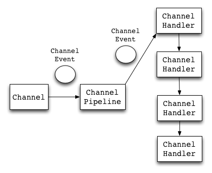

# Netty 背后的事件驱动机制

原文：https://www.jianshu.com/p/e1c39b65088f


Netty 是一个异步事件驱动的网络应用程序框架，用于快速开发可维护的高性能协议服务器和和客户端。


## 事件驱动模型

通常，设计一个事件处理模型的程序有两种思路：

* **轮询方式**

  线程不断轮询访问相关事件发生源有没有发生事件，有事件发生就调用事件处理逻辑

* **事件驱动方式**

  事件发生时，主线程把事件放入事件队列，在另外线程不断循环消费事件队列中的事件，调用事件对应的处理逻辑处理事件。事件驱动方式也被称为消息通知方式，其实是设计模式中的观察者模式的思路。

借用O'Reilly大神关于事件驱动模型的解释图：


主要包括4个基本组件：

* **事件队列**（event queue）：接收事件的入口，存储待处理事件
* **分发器**（event mediator）：将不同的事件分发到不同的业务逻辑单元
* **事件通道**（event channel）：分发器与处理器之间的联系渠道
* **事件处理器**（event processor）：实现业务逻辑，处理完成后会发出事件，触发下一步操作

可以看到，相对于传统轮询模式，事件驱动有如下的优点：

* **扩展性好**：分布式的异步架构，事件处理器之间高度解耦，方便扩展事件处理逻辑
* **高性能**：基于队列暂存事件，能方便并行异步处理事件


下面描述了Netty事件处理的流程。Channel是连接的通道，是ChannelEvent的产生者，而ChannelPipeline可以理解为ChannelHandler的集合：



事件分为**上行（UpStream）**和**下行（DownStream）**两种：

1. 当服务器从客户端接收到一个消息，那么与之相关的就是一个**上行事件**（Upstream Event），Pipeline中的***UpstreamChannelHandler***会处理它
2. 如果服务器要响应这个客户端，那么与响应消息对应的就是**下行事件**（Downstream Event），Pipeline中的***DownstreamChannelHandler***会处理它

**ChannelEvent是数据或者状态的载体**。例如，传输的数据对应MessageEvent，状态的改变对应ChannelStateEvent。当对Channel进行操作时，会产生一个ChannelEvent，并发送到ChannelPipeline。Channel Pipeline会选择一个ChannelHandler进行处理。这个ChannelHandler处理之后，可能会产生新的ChannelEvent，并流转到下一个ChannelHandler。

引用Netty官方包里的一个例子，一个简单的EchoServer，它接受客户端输入，并将输入原样返回。

```java
public void run() {
    // Configure the server.
    ServerBootstrap bootstrap = new ServerBootstrap(
                new NioServerSocketChannelFactory(
                        Executors.newCachedThreadPool(),
                        Executors.newCachedThreadPool()));
    // Set up the pipeline factory 
    bootstrap.setPipelineFactory(new ChannelPipelineFactory() {
        public ChannelPipeline getPipeline() throws Exception {
                return Channels.pipeline(new EchoServerHandler());
        }
    });    
    // Bind and start to accept incoming connections
    bootstrap.bind(new InetSocketAddress(port));
}
```

EchoServerHandler是这里的业务处理逻辑：

```java
public class EchoServerHandler extends SimpleChannelUpstreamHandler {
    @Override
    public void messageReceived(
                  ChannelHandlerContext ctx, MessageEvent e) {
        // Send back the received message to the remote peer
        e.getChannel().write(e.getMessage());
    }
}
```

其中，MessageEvent就是一个事件。这个事件携带了一些信息（ChannelBuffer），例如这里的 *e.getMessage()* 就是消息的内容，而 EchoServerHandler 则描述了处理这种事件的方式，一旦某个事件触发，相应的 Handler 就会被调用，并进行处理（解码成了一个数据对象），并生成一个新的 MessageEvent，并传递给下一个进行处理。

在Netty里，**所有事件都来自ChannelEvent接口**，这些事件涵盖监听端口、建立连接、读写数据等网络通讯的各个阶段。而事件的处理者就是ChannelHandler，这样，不但是业务逻辑，连网络通讯流程中底层的处理，都可以通过实现 ChannelHandler 来完成了。事实上，Netty内部的连接处理、协议编码、超时等机制，都是通过Handler完成的。