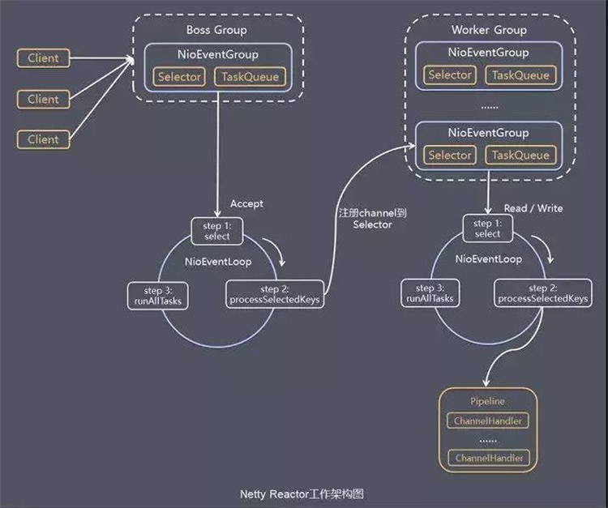
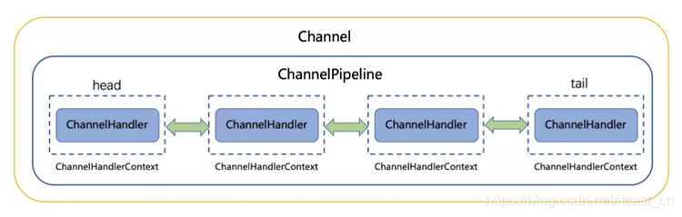
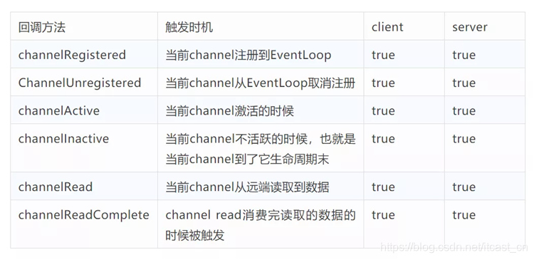
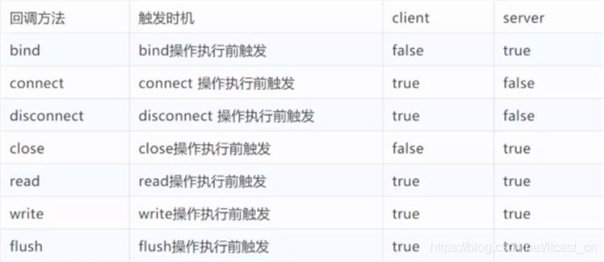

# Netty线程模型原理解析

原文：https://www.jianshu.com/p/2413dd698c4f

​        Netty是Java领域有名的开源网络库，具有高性能和高扩展性的特点。很多流行的框架都是基于它来构建的。Netty线程模型不是一成不变的，而是取决于用户的启动参数配置。通过设置不同的启动参数，Netty可以同时支持Reactor单线程模型、多线程模型。

## Netty线程模型

​        Netty线程模型就是Reactor模式的实现，如图：

​        Netty抽象了两组线程池 BossGroup 和 WorkerGroup，其类型都是 NioEventLoopGroup，BossGroup 用来接受客户端发来的连接，WorkerGroup 则负责对完成 TCP 三次握手的连接进行处理。

​        NioEventLoopGroup 里包含了多个 NioEventLoop，管理 NioEventLoop 的生命周期。**每个NioEventLoop 中包含了一个 NIO Selector、一个队列、一个线程**；其中，线程用来做轮询注册到 Selector 上的 Channel 的读写事件和对投递到队列里面的事件进行处理。

​        Boss NioEventLoop 线程的执行步骤：

1. 处理accept事件，与Client建立连接，生成 NioSocketChannel
2. 将 NioSocketChannel 注册到某个 Worker NioEventLoop 上的 selector
3. 处理任务队列的任务，即 runAllTasks

​        Worker NioEventLoop 线程的执行步骤：

1. 轮询注册到自己 Selector 上的所有 NioSocketChannel 的 read 和 write 事件
2. 处理 read 和 write 事件对应的 NioSocketChannel 处理业务
3. runAllTasks处理任务队列TaskQueue的任务，一些耗时的业务处理可以放入 TaskQueue 中慢慢处理，这样不影响数据在pipeline中的流动处理

​        Worker NioEventLoop处理NioSocketChannel业务时，使用了pipeline，管道中维护了handler处理器链表用来处理channel中的数据。

## ChannelPipeline

​        Netty将Channel的数据管道抽象为 ChannelPipeline，消息在ChannelPipeline中流动和传递。ChannelPipeline持有 I/O 事件拦截器 ChannelHandler 的双向链表，由 ChannelHandler 对 I/O 事件进行拦截和处理，可以方便地新增和删除 ChannelHandler 来实现不同的业务逻辑定制，不需要对已有的 ChannelHandler 进行修改能够实现对修改封闭和对扩展的支持。

​        ChannelPipeline 是一系列的 ChannelHandler 实例，流经一个 Channel 的入站和出站事件可以被 ChannelPipeline 拦截。每当一个新的Channel被创建了，都会建立一个新的ChannlePipeline 并绑定到该Channel上，这个关联是永久性的；Channel既不能附上另一个ChannelPipeline，也不能分离当前这个。这些都有Netty负责完成，而无需开发人员的特别处理。

​        根据起源一个事件将有 ChannelInboundhandler 或者 ChannelOutboundHandler 处理，ChannelHandlerContext 实现转发或传播到下一个 ChannelHandler。一个ChannelHandler 处理程序可以通知 ChannelPipeline 中的下一个 ChannelHandler 执行。Read事件（入栈事件）和write事件（出栈事件）使用相同的pipeline，入栈事件会从链表head往后传递到最后一个入栈的handler，出栈事件会从链表tail往前传递到最后一个出栈的handler，两种类型的handler互不相干。

ChannelInboundHandler回调方法：

ChannelOutboundHandler回调方法：

### 异步非阻塞

**写操作**：

​        通过NioSocketChannel的write方法向连接里写入数据的时候是**非阻塞**的，马上会返回，即使调用写入的线程是业务线程。Netty通过在ChannelPipeline中判断调用NioSocketChannel的write的调用线程是不是其敌营的NioEventLoop中的线程，如果发现不是，则会把写入请求封装为WriteTask投递到其对应的NioEventLoop中的队列里面，然后等其对应的NioEventLoop中的线程轮询读写事件的时候，将其从队列里面取出来执行。

**读操作**：