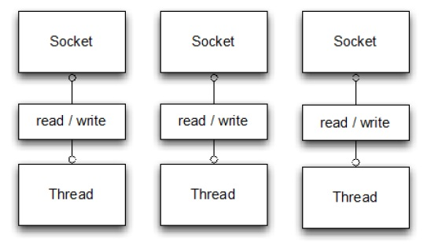
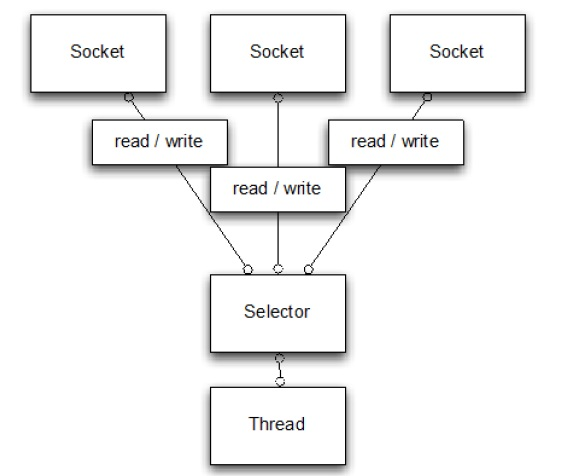
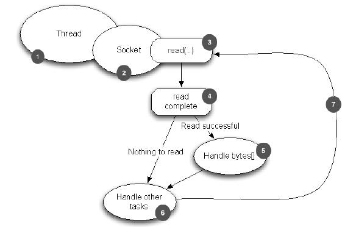
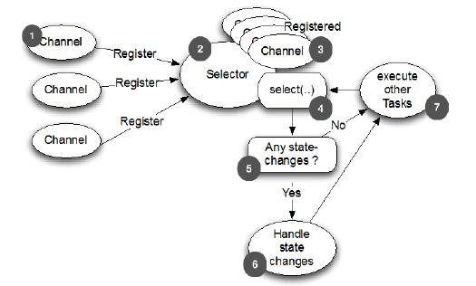
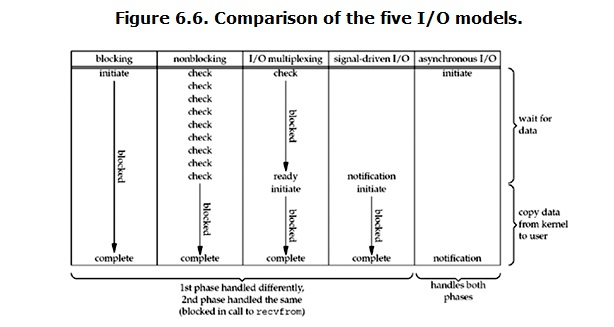
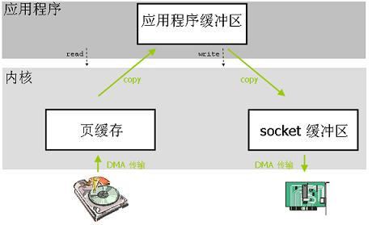
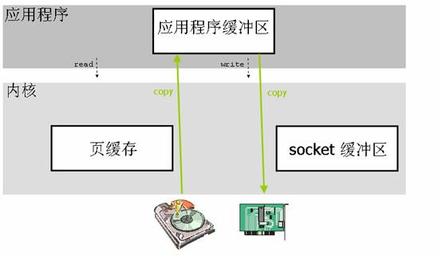
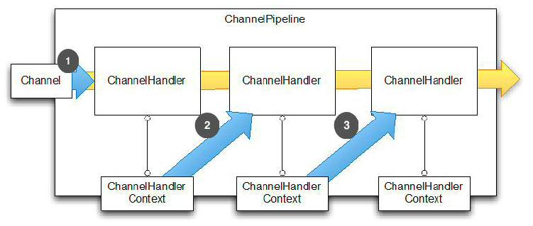
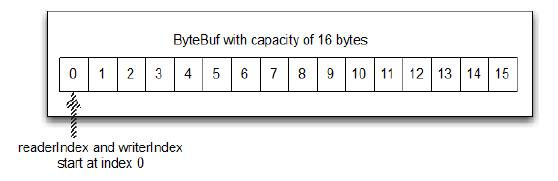

# Netty入门

原文：https://www.jianshu.com/p/b9f3f6a16911


## 一. Netty 与 Tomcat 的区别

​        Netty 与 Tomcat 最大的区别就在于通信协议，Tomcat 是基于 Http 协议的，它的实质是一个基于 http 协议的 web 容器，但是 Netty 不一样，它能通过编程自定义各种协议，因为 Netty 能够通过 codec 自己编码/解码字节流，完成类似 redis 访问的能力，这就是 Netty 与 Tomcat 最大的不同。

​        普遍的认为 Netty 的性能比 Tomcat 高。其实不然，tomcat 从 6.x 开始就支持了 nio 模式，并且后续还有 APR 模式-- 一种通过 jni 调用 apache 网络库的模式，相比于旧的 BIO 模式，并发性能得到了很大提高，特别是 APR 模式，而 netty 是否比 tomcat 性能更高，更取决于 netty 程序员的技术实力。

## 二. Netty优点

​        Netty之所以受欢迎，主要是以下三个原因：

1. 并发高
2. 传输快
3. 封装好

## 三. Netty 的高并发

​        Netty 是一款基于 NIO 开发的网络通信框架，对于比 BIO，它的并发性能得到了很大提高，下面两张图精准的把两者的区别描绘出来了：

* BIO的通信方式：



* NIO的通信方式：

  

​        从上面两张图看出，NIO 的**单线程**处理连接的数量比 BIO 要高出很多，而为什么单线程能处理更多的连接呢？原因就在于图二中出现的 ***Selector***。

​        当一个连接建立之后，它有两个步骤要做，第一步：是接收完客户端发来的全部数据；第二步：是服务端处理完请求业务之后返回 reponse 给客户端。**NIO 和 BIO 的区别主要是在第一步**。

​        在 BIO 中，**等待客户端发送数据的这个过程是阻塞的**。这样就造成了一个线程只能处理一个请求的情况，而机器能支持的最大线程数是有限的，这就是为什么 BIO 不能支持高并发的原因。

​        在 NIO 中，当一个 Socket 建立好之后，Thread 并不会阻塞去接受这个 Sokcet，而是将这个请求交给 Selector，Selector 会不断地去遍历所有的 Sokcet，一旦有一个 Socket 建立完成，它会通知 Thread，然后 Thread 处理完数据再返回给客户端----**这个过程是不阻塞的**，这样就能让一个 Thread 处理更多的请求了。

​        下面两张图是基于 BIO 的处理流程和 Netty 的处理流程，用来辅助理解二者差别：

* BIO 处理流程

  

* NIO 处理流程

  

​       除了 BIO 和 NIO 之外，还有一些其他的 IO 模型，下面的表格表现了 5 种 IO 模型的处理流程：



​        这 5 种常见的 IO 模型：

* **BIO**：

  同步阻塞 IO，阻塞整个步骤，如果连接少，它的延迟是最低的，因为一个线程只处理一个连接，适用于少连接且低延迟的场景，比如说数据库连接

* **NIO**：

  同步非阻塞 IO，阻塞业务处理但**不阻塞数据接收**，适用于高并发且处理简单的场景，比如聊天软件

* **多路复用IO**：

  它的两个步骤处理时分开的。也就是说，一个连接可能它的数据接收是*线程A*完成的，数据处理时*线程B*完成的。它比 BIO 能处理更多的请求

* **信号驱动IO**：

  这种 IO 模型主要用在嵌入式开发

* **异步IO**：

  它的数据请求和数据处理都是异步的，数据请求一次返回一次，适用于长连接的业务场景

## 四. Netty 传输快

​        大家悉知，Java 的内存有对内存、栈内存和字符串常量池等等。其中，堆内存是占用内存空间最大的一块，也是 Java 对象存放的地方。一般的，如果需要从 IO 读取数据到堆内存，中间需要经过 Socket 缓冲区，也就是说，一个数据会被拷贝两次才能到达它的目的地。如果数据量大，就会造成不必要的资源浪费。

​        Netty 的传输快，其实也是依赖了 NIO 的一个特性 -- 零拷贝。当它需要接收数据的时候，它会在堆内存**之外**开辟一块内存，数据就直接从 IO 读到了那块内存中去，在 netty 里面，通过 ByteBuf 可以直接对这些数据进行直接操作，从而加快了传输速度。

​        下面两图介绍了两种拷贝的区别：

* 传统拷贝

  

* 零拷贝

  

​        上面提到的 **ByteBuf** 是 Netty 的一个重要概念，它是 Netty 数据处理的容器，也是 Netty 封装好的一个重要体现。现在来介绍 **ByteBuf**。

## 五. Netty 封装

​        封装的好坏，难以用语言表述。上代码！

* 阻塞 IO

  ```java
  public class PlainOioServer {
  
      public void serve(int port) throws IOException {
          final ServerSocket socket = new ServerSocket(port);    //1
          try {
              for (;;) {
                  final Socket clientSocket = socket.accept();   //2
                  System.out.println("Accepted connection from " + clientSocket);
  
                  new Thread(new Runnable() {                    //3
                      @Override
                      public void run() {
                          OutputStream out;
                          try {
                              out = clientSocket.getOutputStream();
                              out.write("Hi!\r\n".getBytes(Charset.forName("UTF-8")));       //4
                              out.flush();
                              clientSocket.close();              //5
  
                          } catch (IOException e) {
                              e.printStackTrace();
                              try {
                                  clientSocket.close();
                              } catch (IOException ex) {
                                  // ignore on close
                              }
                          }
                      }
                  }).start();                                   //6
              }
          } catch (IOException e) {
              e.printStackTrace();
          }
      }
  }
  ```

  

* 非阻塞 IO

  ```java
  public class PlainNioServer {
      public void serve(int port) throws IOException {
          ServerSocketChannel serverChannel = ServerSocketChannel.open();
          serverChannel.configureBlocking(false);
          ServerSocket ss = serverChannel.socket();
          InetSocketAddress address = new InetSocketAddress(port);
          ss.bind(address);                                      //1
          Selector selector = Selector.open();                   //2
          serverChannel.register(selector, SelectionKey.OP_ACCEPT);  //3
          final ByteBuffer msg = ByteBuffer.wrap("Hi!\r\n".getBytes());
          for (;;) {
              try {
                  selector.select();                            //4
              } catch (IOException ex) {
                  ex.printStackTrace();
                  // handle exception
                  break;
              }
              Set<SelectionKey> readyKeys = selector.selectedKeys();  //5
              Iterator<SelectionKey> iterator = readyKeys.iterator();
              while (iterator.hasNext()) {
                  SelectionKey key = iterator.next();
                  iterator.remove();
                  try {
                      if (key.isAcceptable()) {                //6
                          ServerSocketChannel server =
                                  (ServerSocketChannel)key.channel();
                          SocketChannel client = server.accept();
                          client.configureBlocking(false);
                          client.register(selector, SelectionKey.OP_WRITE |
                                  SelectionKey.OP_READ, msg.duplicate());    //7
                          System.out.println(
                                  "Accepted connection from " + client);
                      }
                      if (key.isWritable()) {                //8
                          SocketChannel client =
                                  (SocketChannel)key.channel();
                          ByteBuffer buffer =
                                  (ByteBuffer)key.attachment();
                          while (buffer.hasRemaining()) {
                              if (client.write(buffer) == 0) {   //9
                                  break;
                              }
                          }
                          client.close();                       //10
                      }
                  } catch (IOException ex) {
                      key.cancel();
                      try {
                          key.channel().close();
                      } catch (IOException cex) {
                          // 在关闭时忽略
                      }
                  }
              }
          }
      }
  }
  ```

  

* Netty

  ```java
  public class NettyOioServer {
  
      public void server(int port) throws Exception {
          final ByteBuf buf = Unpooled.unreleasableBuffer(
                  Unpooled.copiedBuffer("Hi!\r\n", Charset.forName("UTF-8")));
          EventLoopGroup group = new OioEventLoopGroup();
          try {
              ServerBootstrap b = new ServerBootstrap();        //1
  
              b.group(group)                                    //2
               .channel(OioServerSocketChannel.class)
               .localAddress(new InetSocketAddress(port))
               .childHandler(new ChannelInitializer<SocketChannel>() { //3
                   @Override
                   public void initChannel(SocketChannel ch) 
                       throws Exception {
                       ch.pipeline().addLast(new ChannelInboundHandlerAdapter() {            //4
                           @Override
                           public void channelActive(ChannelHandlerContext ctx) throws Exception {
                               ctx.writeAndFlush(buf.duplicate()).addListener(ChannelFutureListener.CLOSE);//5
                           }
                       });
                   }
               });
              ChannelFuture f = b.bind().sync();        //6
              f.channel().closeFuture().sync();
          } finally {
              group.shutdownGracefully().sync();        //7
          }
      }
  }
  ```

​        从代码量来看， Netty 就已经秒杀了传统的 Socket 编程了，但是这一部分博大精深，仅仅贴几行代码是不能充分说明问题的。这里介绍一下 Netty 的一些重要概念。

* **Channel**

  数据传输流，与 channel 相关的概念就有以下 4 个，用一种图来了解 Channel：

  

  * **Channel**：

    表示一个连接，可以理解为每一个请求，就是一个 Channel

  * **ChannelHandler**：

    处理业务就在这里，用于处理业务请求

  * **ChannelHandlerContext**：

    用于传输业务数据

  * **ChannelPipeline**：

    用户保存处理过程需要用到的 ChannelHandler 和 ChannelHandlerContext

* **ByteBuf**

  ​        ByteBuf 是一个存储字节的容器，最大特点就是使用方便。它既有自己的毒索引和写索引，方便对整段字节缓存进行读写，也支持 get/set ，方便对其中每一个字节进行读写，它的数据结构如下图所示：

  

  ​        它有三种使用模式：

  1. **Heap Buffer 堆缓冲区**

     堆缓冲区是 ByteBuf 最常见的模式，它将数据存储在堆空间

  2. **Direct Buffer 直接缓冲区**

     直接缓冲区是 ByteBuf 的另外一种常见模式，它的内存分配都不发生在堆，JDK1.4 引入的 nio 的 ByteBuffer 类允许 JVM 通过本地方法调用分配内存，这种做法有以下两个好处：

     * 通过免去中间交换的内存拷贝，提升 IO 处理速度；直接缓冲区的内容可以驻留在垃圾回收扫描的堆区以外
     * DirectBuffer 在 -XX:MaxDirectMemorySize = xxM 大小限制下，使用 Heap 之外的内存，GC对此“无能为力”，也就意味着，避免了在高负载下频繁的 GC 过程对应用线程的中断影响

  3. **Composite Buffer 复合缓冲区**

     复合缓冲区相当于多个不同 ByteBuf 的视图，这是 Netty 提供的，JDK不提供这样的功能

  除此之外，Netty 还提供一大堆 API 方便使用。

* **Codec**

  Codec 是 Netty 中的编码/解码器，通过它能够完成：字节与pojo、pojo与pojo的相互转换，从而达到自定义协议的目的。

  在 Netty 里，最有名的就是 HttpRequestDecoder 和 HttpResponseEncoder 了。