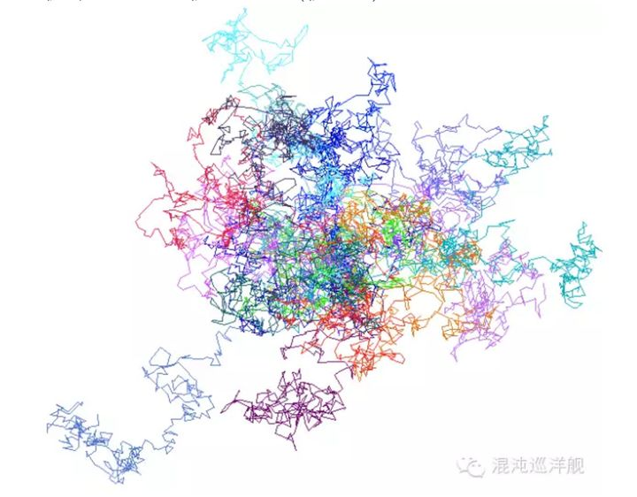
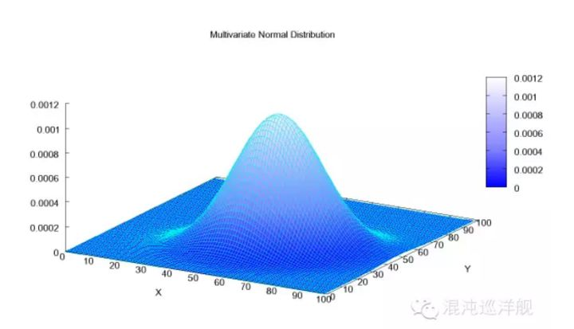
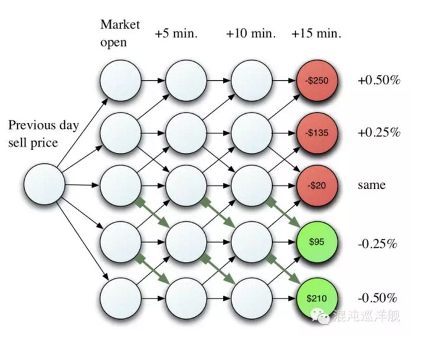
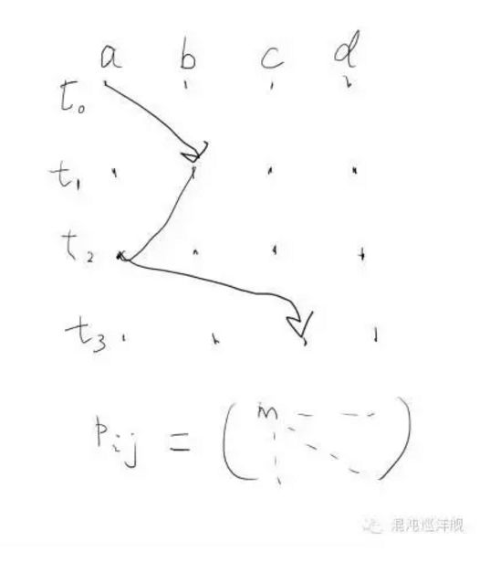

# 如何从深刻地理解随机过程的含义

原文：https://www.zhihu.com/question/26694486/answer/349872296

## 第一部分：为什么要研究随机过程？

​        人类认识世界的历史，就是一认识和描绘各种运动的历史，从宏观的天体运动到分子的运动，到人心理的运动-我们通称为变化，就是一个东西随时间的改变。

​        人们最成功的描绘运动的模型是牛顿的天体运动，确定性是牛顿体系最大的特征。给定位置和速度，运动轨迹即确定。但是20世纪后的科学却失去了牛顿美丽的确定性光环。

​        因为当人们试图描绘一些真实世界，充满复杂而未知因素的运动时候，人们发现不确定因素（通常称为杂音）对事物的变化至关重要，而牛顿的方法几乎难以应用。而我们所**能够给出的最好的事物变化的东西，是一套叫概率论的东西。而与之相应的产生的一个全新的研究运动的方法-随机过程，对不确定性下的运动进行精细的数学描述**。

​        我们周边充满了各种各样的数据，所谓大数据时代，这些数据最基本的特点就是含有巨量的噪音， 而**随机过程就是从这些噪音里提取信息的武器。**

​        其实我们生活中也处处充满“噪音”。比如说我们每天发邮件，经常有一些人时回时不回。那些不回的人到底是忘了还是真的不想回，我们却不知道。一个书呆子统计学家会告诉你，你无法从一次的行为评判他，而要看他一贯的表现。

​        第一个随机过程方法的伟大胜利是爱因斯坦的布朗运动。一些小花粉在水里，受到水分子不停碰撞，而呈现随机的运动（花粉颗粒由于很小比较容易受到水分子热扰动的影响） 。 研究这些花粉的微小运动似乎有点天然呆，我们却从中找到了分子世界重要的信息。而花粉那无序与多变的轨道，也为我们提供了随机运动的范式（随机游走）。

​                                                    计算机生成的十个粒子的布朗运动轨迹

​        如果给随机过程打个比方，它就像是一个充满交叉小径的花园。你站在现在的点上，看未来的变化，未来有千万种变化的方式， 每一种可能又不断分叉变化出其它可能。

## 第二部分：描述随机过程的武器

​         随机过程怎么研究？几样神器是不可缺少的。

### 1. 概率空间

​         面对不确定的未来，无非有两件事情需要关心：

* 一个是有哪些**可以实现的可能**：定义了一个事件空间（态空间）
* 一个是**每种可能的大小**：定义了一个数--概率。

​         关键这信息从哪儿来？如何知道要发生什么？又如何知道有多大可能发生？

​         概率论的思维基点其实是：日光下并无新事。

​         人们**对未来的预测来源于对过往的经验积累，而沟通过去经验与未来预测的工具就是概率。所谓一件事情发生可能性大小，就是一件事在历史中发生的频率**。

​         当然很多情况下概率也可以通过已知理论用演绎法推得，但是最根本的，还是由经验确定的概率。

​        **概率**，中学数学都学过，它是一个时间出现的频率，但它的含义其实很深很深。因为一个事件出现的频率来自于历史的总结，而**概率却用于对未来的预测**。因此，**概率包含的一个基本假设就是未来和过去的一致性**。一旦一些一个过程是一个随时间剧烈变化的过程，概率几乎不能应用。所以，这里只能说概率是一种近似，它对于研究那些比较简单的物理过程，如投掷硬币，才完全有效。

​         所以，所谓概率空间，只能是一种近似，它是人类现有知识的总和（综合？），用它描述已知的未知，但是却从来无法描述未知的未知（就是所谓的黑天鹅事件），因为真正的未来，永远无法只有已知的可能性。在大多数时候，还是日光下并无新事。因此，概率论的威力依然不可小觑。

​         有关概率空间的思维，可以立刻灭掉一些看似烧脑而实际脑残的题目：

​         假设你在进行一个游戏节目。现给三扇门供你选择：一扇门后面是一辆轿车，另两扇门后面什么都没有。你的目的当然是要想得到比较值钱的轿车，但你却并不能看到门后面的真实情况。主持人先让你作第一次选择。在你选择了一扇门后， 知道其余两扇门后面是什么的主持人，打开了另一扇门给你看，而且，当然，那里什么都没有。现在主持人告诉你，你还有一次选择的机会。那么，请你考虑一下，你是坚持第一次的选择不变，还是改变第一次的选择，更有可能得到轿车？

​         回答这个问题的关键即事件空间，在主持人打开门之前，事件空间即车的位置有三种可能，你有1/3 的可能拿到车。当主持人选择打开门的时候， 它实际上帮你做了一个选择，那就是告你某个车库没有车，这时候事件空间发生了变化，因为你的已知变了。如果说以前的事件空间是或者你选择的车库有车（1/3）， 或者另外两个车库中的某一个有车(各1/3)。现在的情况呢？被打开的车库有车的概率变为0， 因此你选择的车库没车的情况下车的位置已经变成确定的了，概率为2/3。而原来你车库有车的选项却不受到这一事件的影响（依然1/3概率）， 所以你当然要选择换车库。

​         这个例子第一个说明的道理是**概率是主观的，来自于你头脑中的信息**。

​         回过头看， 主持人的举动增加了你对两个车库的信息， 而车是不变的，所以你要根据新的信息调整概率空间。

> 此实例是好的思维方法的力量的典范，如果你没有这个事件空间的角度， 恐怕要做无数的试验了。

​         **条件概率**：现实生活中，一般都以条件概率的形式出现。即给定一定的已知条件，信息会得到什么样的概率。对这一大类问题，可以引出整个**贝叶斯分析理论**。

### 2. 随机变量

​         投掷筛子，得到6个结果，每种结果有1/6 的可能。把**态空间**的种种可能性都用数字表达出来，用一套用轻度装逼的数学语言描述， 就是随机变量。 这个东西包含所有输出的可能性以及相应的概率，这些**可能性（态空间）和概率的对应关系我们称之为分布函数**。如果态空间是连续的，我们就得到连续的分布函数形式。

​                                                                            一个二维高斯分布

#### 2.1 分布函数

​         随机变量已经包含了两个随机过程研究的核心武器：态空间和分布函数。分布函数是提取随机过程内有用信息的第一手段。**分布函数，是在大量数据中提取信息的入口**。

​         **随机变量的实现**：随机变量可以看作一个实验，在实验之前，结果是不确定的，所拥有的是一团可能性。当做完实验，却得到一个唯一的结果，知识预先不知道。

​         **期望**：对一个随机变量，*已知其分布函数*，可以定义一个期望。这个东西由每个结果的取值和它的可能性共同决定，表达未来结果的加权平均值。

​         实际中，可以用实验的方法确定这个数字，就是所谓蒙特卡洛方法。不停的投骰子，然后做个统计，所得到的结果的平均就是期望。（**平均值和期望的区别**：前者来自已有的数据的平均；后者是对根据已有的平均对未来的预测）。

​         关于期望，包含着一种投资世界里的基本思维方式，就是对收益的幅值和风险（概率）一起考虑。经常有一些时候一些出现机会极少而收益特别大的可能性决定了期望，如果你的心脏足够强大，就应该充分考虑这些高风险高收益的可能。

​         **相关性**：对于两个随机变量，可以定义一个相关性Convariance，描述一个随机变量随另一个而变化的趋势。这个函数特别有用，它是现实生活中常说两个事物相关性的**精确表达**。
$$
\sigma(x,y) = E[(x - E[x])(y - E[y])]
$$
理解这个算式特别简单，这个量就是 $x$ 和 $y$ 波动乘积的期望：

* 当两个变量是“此消彼长”时，则为负
* “共生共荣”时，则为正
* 若两个过程不相关，则为0

​         **方差**：上述关系，当$x = y$ 时，便得到了“方差”。方差，就是自己和自己的关联函数，当随机变量比较接近正态分布时，它可以描绘波动性的大小。

​         对于 $N$ 个随机变量，任意两个随机变量可以得到一个Convariance，而这样一组Convariance构成大名鼎鼎的Convariance Matrix：
$$
\sum = \begin{bmatrix} 
    E[(x_1 - \mu_1)(x_1 - \mu_1)] & E[(x_1 - \mu_1)(x_2 - \mu_2)] & \cdots & E[(x_1 - \mu_1)(x_n - \mu_n)] \\
    E[(x_2 - \mu_2)(x_1 - \mu_1)] & E[(x_2 - \mu_2)(x_2 - \mu_2)] & \cdots & E[(x_2 - \mu_2)(x_n - \mu_n)] \\
    \vdots & \vdots & \ddots & \vdots \\
    E[(x_n - \mu_n)(x_1 - \mu_1)] & E[(x_n - \mu_n)(x_2 - \mu_2)] & \cdots & E[(x_n - \mu_n)(x_n - \mu_n)] \\
\end{bmatrix}
$$

#### 2.2 测量分布函数的武器-蒙特卡洛方法

​         搞定一个分布函数，笨方法也是最有效的方法就是蒙特卡洛方法。例如，一般地说，骰子有6个面，每个面出现的概率有 $\frac{1}{6}$ ，但是万一骰子被动过手脚呢？所以最好的方法还是所谓蒙特卡洛抽样：不停的玩，直到认为可以**稳定**地得到每个面可能性出现的频率。所谓笨办法，确实是最常用的，尤其是随着高速计算机的普及，一些重大的工程，涉及太多复杂不好确定的因素时，就让计算机模拟，涉及一些列的蒙特卡洛抽样来求得一些结果。

#### 2.3 抽样

​         在计算机里研究牵扯随机变量的过程最基本的方法就是抽样。**抽样，就是一直分布函数取得一个随机的结果的过程**。

​        要在计算机里模拟一个随机过程都是通过抽样来实现的。抽样的成功与否，决定这些计算机模拟（simulation ）能在多少程度逼近真实。计算机的抽样都是基于最简单的随机数生成器产生的，产生的概率均等的均匀分布（Uniform Distribution）。但是这些“随机数”实际上是早已设定好的，因此更准确的被称作“伪随机数”。而对于更加复杂的分布函数的抽样，则有层出不穷的算法解决它，比如大名鼎鼎的Markov Chain Monte Carlo (MCMC) 方法。

## 第三方部分：什么是随机过程？

​        **确定性过程**，研究一个量随时间确定的变化，而**随机过程**，描述的是一个量随时间可能的变化。在这个过程中，每一个时刻变化的方向都是不确定的，或者说随机过程就是由一系列随机变量组成，每一个时刻系统的状态都有一个随机变量表述，而整个过程则构成态空间的一个轨迹（随机过程的实现）。

​         一个随机过程最终实现，会得到一组随时间变化的数值（态空间里的轨迹），实践中，都是从数据结果中推测一个随机过程的性质。

​         之前提到，概率是建立在可重复上，是一个理想模型。而建立在此上的随机过程就更是一个理想化的模型。它暗含的是历史可无限重复，然后把它们收集一起看一看。在本文一开头说的，充满分岔小径的花园是一个比喻，但说的也是，需要站在平时时空（每一个时空包含一种历史的可能性）的角度来看一个随机过程的全貌。

​         其实很容易发现，这是一个超级复杂的问题。因为一个随机过程具有无限多可能性。试想象一下，一个最简单的随机过程，这个过程由 $N$ 步组成，每一个都有两个选择 $(0, 1)$ ，那么可能的路径就有 $2^N$ 个，这个随机过程就要由 $2^N -1$ 个概率来描述，用物理的语言就是极高维度的问题。

> 离散的时间序列，是清晰表述随机过程的入门方式，虽然更一般的表述是：时间是连续的

​         因此，**能否研究一个随机过程的关键，就是减少问题的维度 - 这也是物理的核心思想**

#### 马尔可夫过程 (Markov Processes)

​         Markov过程用数学语言表述就是**马尔可夫链**，就像一台熊熊驶过的火车，前一个车厢（上一步）拉着后一个（下一步），向前运行。

​         如果一个过程是Markov过程，这个过程就得到了简化，只需要知道第 $n$ 步是如何与第 $n-1$ 步相关的，一般由一组条件概率表述，就可以求得整个过程。一个巨大的随机过程，其内核仅仅是这样一组条件概率，而知道了这组条件概率，就可以衍生整个过程。

​                                                                                               Markov过程示意图

​        一个典型的Markov过程，每一步的结果只与上一步相关，只需要一组条件概率（图中箭头）来描述。每个条件概率表明，如果态空间中的某一个事件发生，那么从这点出发，下一个事件发生的概率。

​        进一步想，如果第 $n$ 步和第 $n - 1$ 步的关系不是随机的，而是确定的，那么得到了什么？联想到牛顿力学，牛顿力学也是此刻的状态决定下一刻的变化，其本质也是链式法则。通过此刻与此刻最邻近的未来的关系，衍生出整个宇宙的过去和未来， 其灵魂同样是降维。或者说Markov就是随机过程里的牛顿法则。

​        Markov是不是真的是一个历史无关的过程？ No！ 虽然第 $N+1$ 步只与第 $N$ 步有关，但是第 $N$ 步又包含第 $N-1 $步，所以通过链式法则，历史的信息还是可以传递到现在的。

​        经典的数学描述：
$$
Pr(X_{n+1} = x | X_1 = x_1, X_2 = x_2,\cdots, X_n = x_n) = Pr(X_{n+1} = x | X_n = x_n)
$$
​        Markov链的核心条件概率表达式，就是这台火车链接不同车厢的链条。如果这个条件概率关系不随时间变化，就得到经典的稳态Markov链。**稳态Markov链有一个良好的特质：当一个过程启动一段时间，就会进入统计稳态，稳态的分布函数与历史路径无关**。

​        一个简单的例子： 关于生育偏好是否影响男女比例的问题。

​        我们知道过去的人喜欢生男孩，往往生女孩子就不停生，直到生到一个男生为止，因此就造成很多一大堆姐姐只有一个弟弟的家庭。我接触过的一些特别聪明的人都会认为这样的行为会影响男女比例。大部分人觉得会造成女孩比例多，少数人认为会增加男孩比例。 实际呢？ 

​        一言以蔽之： 不变。为什么？ 生育问题是典型的稳态马尔科夫过程，下一次生育不受上一次生育的影响。 根据马氏过程的特性，你知道历史无需考虑历史路径， 最终的平衡概率只取决于每一步的概率。所以无论你怎么玩，不论是你拼命想生男孩还是女孩，都无法影响人口比例。 

​        但是有一招却是有影响的，就是打胎。 为什么？ 答案依然很简单，你改变了每一步的概率。 

​        这就是马尔科夫过程的威力和魅力，可惜人生却不是马尔科夫过程， 因为每一步都高度依赖于过去n步，因此人生是高度历史路径依赖的。 

​        **当一个随机过程的变化只取决于当下的变化而非历史的时候，我们得到一个马尔科夫链条。它的优良性质使得巨大的计算瞬时简化。**

#### 进一步降维

​        Markov链的思维用一组前一步和后一步的条件概率关系衍生整个过程，具有巨大的简化威力。对于更加特殊的问题，维度还可以继续降低，问题得益更彻底的简化。例如：

##### 稳态过程 - Stationary Process

​        如果说Markov过程每一步与前一步的关系是与时间无关的，或符合：
$$
Pr(X_{n+1} = x | X_n = y) = Pr(X_n = x | X_{n-1} = y)
$$
这个过程就是稳态的。这个时候，只需要这样一个关系就可以描述整个过程。

​        在这个极度简化的模型下，Markov Process 可归结为一个**在态空间里的跃迁轨迹**。下图的随机变量是横轴（a，b，c，d四个态），时间是纵轴。系统从此刻的态跃迁到下一刻的态都是随机的，而且跃迁的概率由一个数字决定，这个数字不由轨迹的历史决定，因而这是一个稳态的 Markov 过程。从此刻任一状态到达下一刻任意状态包含 $4 \times 4$ 个概率，因此可以写作一个 $4 \times 4$  的跃迁矩阵。跃迁矩阵 $P_{ij}$ 涵盖了过程的全部信息。

​        **稳态过程，顾名思义，是因为在一段时间后系统会进入一个平衡状态，或者说系统的分布函数不随时间变化。** 如同上文提到的人口男女比例问题，男女比例在各个国家都在 $1:1$ 左右，就是因为生成它的过程是一个稳态过程。

​        **稳态过程有两个重要的特征：平均值和自相关函数（Auto-Correlation）**。稳态（Stationary）的含义，正是在平均值附近扰动。在这个情况下，随机性换以另一个名词 - fluctuation （扰动）。而在非稳态下，扰动和平均值的概念变得模糊，失去意义。

​        平均值自然重要，但扰动却往往包含着平均值所没有的信息。 首先我们计算方差，来看扰动的剧烈程度，但是这远远不够。

​        Auro-correlation 和之前描述的相关性具有内在的联系，事实上它描述的就是此时的扰动和彼时的扰动的相关性。
$$
R(r) = \frac{E[(X_t - \mu)(X_{t+\tau} - \mu)]}{\sigma ^2}
$$
这个量，可以理解为：现有一个信号，首先减去平均值，这样，信号就在 $0$  附近扰动。把这个信号平行移动一个时间差，然后把它和原来的信号乘起来，如果说信号本身代表的过程在时间上胡乱跳跃无迹可寻，那么这个量就很接近 $0$ 。因为正和负的部分无序地乘起来，正负相互抵消，你的期望就是 $0$。反之，如果信号内包含内在的构造（Pattern），就会得到不为 $0$ 的值。

​        **因此，日常生活中，往往能得到的只是数据，其他什么都不知道的时候，计算这个量就是起点，这个东西可以帮助寻找无需中的结构（Pattern），它将告诉系统噪音的性质。**

​        比如我们经常说的白色噪声（white noise）的定义就是自关联性为0， 因为它要的是绝对的无序， 毫无记忆，毫无结构。这种信号就是最基本的噪声形态。

​        而如果发现一个随时间差变化很慢的自相关函数，往往显示系统具有记忆的特性，因而产生了更复杂的结构， 或者系统临近相变。

​        自相关性的计算告诉我们的是， 不要只看表面的无序有序，因为人眼喜欢在无序中寻找有序，而一个有力的计算就可以告诉你比你的眼睛更准确的信息。

##### Master Equation

​        之前描述离散的Markov过程。**如果一个过程是连续的，不再分为第一步第二步第三步， 我们就可以用微分方程描述一个马尔科夫过程。 这就是master equation - 所谓大师方程**。 这是物理，化学，经济学，得到一些给力结果经常用到的微分方程。

