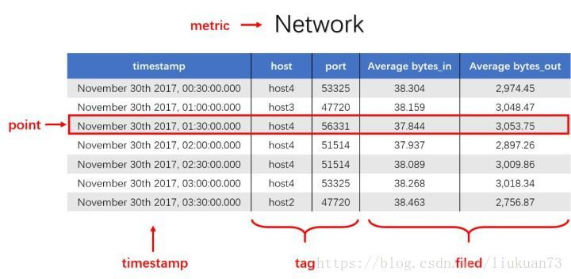

# 时序数据库介绍和使用

原文：https://blog.csdn.net/liukuan73/article/details/79950329


## 1. 基础

### 1.1 时序数据库的定义

什么是“时间序列数据（Time Series Data，TSD，以下简称时序）”？从定义上来说，就是一串按时间维度索引的数据。用描述性的语言来解释什么是时序数据，简单的说，就是这类数据描述了某个被测量的主体在一个时间范围内的每个时间点上的测量值。它普遍存在于 IT基础设置、运维监控系统和物联网中。

对时序数据进行建模的话，会包括三个重要部分，分别是：主体、时间点和测量值。套用这套模型，日常工作生活中，无时不刻不在接触这类数据。

时序数据从时间维度上将孤立的观测值连成一条线，从而揭示软硬件系统的状态变化。孤立的观测值不能叫时序数据，但如果把大量的观测值用时间线串起来，就可以研究和分析观测值的趋势和规律。

### 1.2 时序数据的特点

#### 1.2.1 时序数据的数学模型

通过时序数据的基本概念，可得知分析时序数据的意义。那么时序数据该如何存储呢？数据的存储要考虑其数学模型和特点，时序数据当然也不例外。所以先来介绍时序数据的数学模型和特点。

下图是一段时序数据，记录了一段时间内的某个集群里各个机器上个端口的出入流量，每半小时记录一个观测值。这里以图中的数据为例，介绍时序数据的数学模型（以腾讯CTSDB为例）：

* **measurement**：度量的数据集，类似于RMDB中的 table

* **point**：一个数据点，类似于RMDB中的 row

* **timestamp**：时间戳，表征采集到数据的时间点

* **tag**：**维度列**，代表数据的归属、属性，表明是哪个设备/模块产生的，一般不随着时间变化，供查询使用

* **field**：**指标列**，代表数据的测量值，随时间平滑波动，不需要查询

  

  上图中，这组数据的 measurement 为 Network，每个 point 由以下部分组成：

  * timestamp：时间戳

  * 两个tag：host、point，代表每个 point 归属于哪台机器的哪个端口

  * 两个field：bytes_in、bytes_out，代表 point 的测量值，半小时内出入流量的平均值。

    同一个 host、同一个 point，每半小时产生一个 point，随着时间的增长，field（bytes_in、bytes_out）不断变化。如 host: host4, point：51514，timestamp 从 02:00 到 02:30 的时间段内，bytes_in 从 37.937 上涨到了 38.089， bytes_out 从 2897.26 上涨到 3009.86，说明这一段时间该端口服务压力升高

#### 1.2.2 时序数据特点

* **数据模式**：时序数据随时间增长，相同维度重复取值，指标平滑变化：这点从上面的Network表的数据变化可以看出
* **写入**：**持续高并发写入，无更新操作**。时序数据库面对的往往是百万甚至千万数量级终端设备的实时数据写入，但数据大多表征设备状态，写入后不会更新
* **查询**：按不同维度对指标进行统计分析，且存在明显的冷热数据，一般只会频繁查询近期的数据

### 1.3 时序数据的存储

#### 1.3.1 传统RMDB存储时序数据的问题

有了时序数据后，该存储在哪里呢？先来看看传统的关系型数据库解决方案在存储时序数据时会遇到什么问题。

很多人认为，在传统RMDB数据库上增加时间戳一列便可以做时序数据库。数量少的时候确实可以。但是，时序数据往往都是百万级甚至千万级终端设备产生的，写入并发量比较高，属于海量数据场景。

MySQL在海量的时序数据场景下存在下面的问题：

* 存储成本高：对于时序数据压缩不佳，占用大量机器资源
* 维护成本高：单机系统，需要在上层人工的分库分表，维护成本高
* 写入吞吐低：单机写入吞吐低，很难满足时序数据千万级别的写入压力
* 查询性能差：适用于交易处理，海量数据的聚合分析性能差

另外，使用Hadoop生态（如Hadoop、Spark等）存储时序数据会有以下问题：

* 数据延迟高：离线批处理系统，数据从产生到可分析，耗时数小时，甚至天的级别
* 查询性能差：不能很好的利用索引，依赖MapReduce任务，查询耗时在分钟级

可以看到，时序数据库需要解决一下几个问题：

* 时序数据的写入：如何支持每秒上千万上亿的数据点的写入
* 时序数据的读取：如何支持秒级对上亿数据的分组聚合运算
* 成本敏感：由海量数据存储带来的是成本问题。如何更低成本的存储这些数据，将成为时序数据库需要解决的重中之重

#### 1.3.2 时序数据库

时序数据库产品的发明都是为了解决传统关系型数据库在时序数据存储和分析上的不足和缺陷，这类产品被统一归类为时序数据库。针对时序数据的特点，对写入、存储、查询等流程进行了优化，这些优化与时序数据的特点息息相关：

1. **存储成本**

   * 利用时间递增、维度重复、指标平滑变化的特性，合理选择编码压缩算法，提高数据压缩比

   * 通过预降精度，对历史数据做聚合，节省存储空间

2. **高并发写入**

   * 批量写入数据，降低网络开销

   * 数据先写入内存，再周期性的dump为不可变的文件存储

3. **低查询延时，高查询并发**

   * 优化常见的查询模式，通过索引等技术降低查询延时
   * 通过缓存、routing等技术提高查询并发

#### 1.3.3 时许数据的存储原理

传统数据库存储采用的是B tree，这是由于其在查询和顺序插入时有利于减少寻道次数的组织形式。众所周知，磁盘寻道时间是非常慢的，一般在 10ms 左右。磁盘的随机读写慢就慢在寻道上面。对于随机写入 B tree 会消耗大量的时间在磁盘寻道上，导致速度很慢。SSD虽然具有更快的寻道时间，但是并不能根本上解决这个问题。

对于 90% 以上场景都是写入的时序数据库，B tree 显然是不合适的。

业界主流都是采用了 **LSM Tree** 替换 B Tree，比如Hbase，Cassandra 等 nosql。

LSM Tree 包括内存里的数据结构和磁盘上的文件两部分。分别对应 HBase 里的 MemStore 和 HLog。对应 Cassandra 里的 MemTable 和 sstable。

LSM Tree 操作流程如下：

1. 数据写入和更新时，首先写入位于内存里的数据结构。为了避免数据丢失也会写到 WAL 文件中

2. 内存里的数据结构会定时或者达到固定大小会刷到磁盘。这些磁盘上的文件不会被修改

3. 随着磁盘上积累的文件越来越多，会定时的进行合并操作，消除冗余数据，减少文件数量

   

可以看到 LSM Tree 核心思想就是通过内存写和后续磁盘的顺序写入获得更高的写入性能，避免了随机写入。但同时也牺牲了读取性能，因为同一个 Key 的值可能存在于多个 HFile 中。为了获取更好的读取性能，可以通过 Bloom Filter 和 Compaction 得到。

#### 1.3.4 分布式存储

时序数据库面向的是海量数据的写入存储读取，单机是无法解决问题的。所以需要采取多机存储，也就是分布式存储。

分布式存储首先要考虑的是如何将数据分布到多台机器上，也就是分片（sharding）问题。分片问题由分片方法的选择和分片的设计组成。

**分片方法**

时序数据库的分片方法和其他分布式系统是相同的：

* **哈希分片**：实现简单，均衡性较好，但集群不易扩展
* **一致性哈希**：均衡性好，集群扩展容易，只是实现复杂。代表有 Amazon 的 DynamoDB 和 开源的 Cassandra
* **范围划分**：通常配合全局有序，复杂度在于合并和分裂。代表有 HBase

**分片设计**

分片设计简单来说就是以什么做分片。这是非常有技巧的，会直接影响写入读取性能。

结合时序数据库的特点，根据 measurement + tags 分片是比较好的一种方式，因为往往会按照一个时间范围查询，这样相同 metric 和 tags 的数据会分配到一台机器上连续存放，顺序的磁盘读取是很快的。再结合上面提到的单机存储内容（内存？），可以做到快速查询。

考虑时序数据时间范围很长的情况。需要根据时间范围再分成几段，分别存储到不同的机器上，这样对于大范围时序数据就可以支持并发查询，优化查询速度。

如下图，第一行和第三行都是同样的 tag（sensor = 95D8-7913；city=上海），所以分配到同样的分片，而第五行虽然也是同样的tag，但是根据时间范围再分段，被分到了不同的分片。第二、四、六行属于同样的 tag （sensor=F3CC-20F3；city=北京）也是一样的道理。


### 1.4 开源时序数据库介绍

#### 1.4.1 开源时序数据库对比

目前业内比较流行的开源时序数据库产品有 InfluxDB、OpenTSDB、Prometheus、Graphite 等，其产品特性对比如下所示：


#### 1.4.2 InfluxDB介绍

InfluxDB 是一个开源的时序数据库，使用 Go 语言开发，特别**适合用于处理和分析资源监控数据**这种时序相关数据。而 InfluxDB 自带的各种特殊函数，如求标准差、随机取样数据、统计数据变化比等，使数据统计和实时分析变得十分方便。

**重要概念**

InfluxDB 里有一些重要的概念：database，timestamp，field key，field value，field set，tag key， tag value， tag set，measurement，retention policy， series， point。结合下面的例子来说明这些概念。


**timestamp**

既然是时间序列数据库，influxDB 的数据都有一列名为 time 的列，里面存储 UTC 时间戳。

**field key，field value，field set**

butterflies 和 honeybees 两列数据称为字段（fields），influxDB 的字段由 field key 和 field value 组成。其中 butterflies 和 honeybees 为 field key，它们是 Striing 类型，用户存储元数据。

而 butterflies 这一列的数据12-7 为 butterflies 的field value。同理，honeybees 这一列的 23 - 22 为honeybees 的 field value。field value 可以为 String，Float，Integer 或者 boolean类型。field value 通常都是与时间关联的。

field key 和 field value 对组成的集合称之为 field set。如下：


在 InfluxDB 中，字段必须存在。注意，字段是没有索引的。如果使用字段作为查询条件，会扫码符合查询条件的所有字段值，性能不及 tag。类比一下，fields 相当于 SQL 的没有索引的列。

**tag key，tag value，tag set**

location 和 scientist 这两列称为标签（tag），标签由 tag key 和 tag value 组成。location 这个 tag key 有两个 tag value： 1和2， scientist 有两个 tag value：langstroth 和 perpetua。tag key 和 tag value 对组成了tag set，示例中的 tag set 如下：


tags 是可选的，但是强烈推荐使用它。因为 tag 是有索引的，tags 相当于 SQL 中有索引的列。tag value 只能是 String 类型。如果常用场景是根据 butterflies 和 honeybees 来查询，那么可以将这两列设置为tag，而其他的列设置为field，tag 和 field 依据具体的查询需求来定

**measurement**

measurement 是fields，tags 以及 time 列的容器。measurement 的名字用于描述存储在其中的字段数据，类似于 MySQL 的表名。如上面例子中 measurement 为 census。measurement 相当于SQL中的表，本文中会有地方使用“表”来指代measurement。

**retention policy**

rentention policy 指数据保留策略，示例数据中的 retention policy 为默认的 autogen。它表示数据一直保留永久不过期，副本数量为1。也可以指定数据的保留时间，如30天。

**series**

series 是共享同一个 rentention policy ， measurement 以及 tag set 的数据集合。示例中数据有4个series，如下：


**point**

point 则是同一个series中具有相同时间的 field set，points 相当于 SQL 中的数据行。如下面就是一个 point：


**database**

上面提到的结构都存储在数据库中。示例的数据库为 my_database。一个数据库可以有多个 measurement，retention policy，continuous queries以及user。InfluxDB 是一个无模式的数据库，可以很容易的添加新的 measurement，tags，fields 等。而它的操作却和传统的数据库一样，可以使用类SQL语言查询和修改数据。

InfluxDB 不是一个完整的CRUD数据库，它更像是一个CR-ud数据库。它优先考虑的是增加和读取数据而不是更新和删除数据的性能。而且它阻止了某些更新和删除行为，使得创建和读取数据更加高效。

## 2 部署

这里采用 docker 部署：

```shell
docker run --name=influxdb -d -p 8086:8086 -v /etc/localtime:/etc/localtime daocloud.io/liukuan73/influxdb:1.4
```

docker 部署grafana：

```shell
docker run -d -p 3000:3000 --name=grafana -e "GF_SERVER_HTTP_PORT=3000" -e "GF_AUTH_BASIC_ENABLED=false" -e "GF_AUTH_ANONYMOUS_ENABLED=true" -e "GF_AUTH_ANONYMOUS_ORG_ROLE=Admin" -e "GF_SERVER_ROOT_URL=/" daocloud.io/liukuan73/grafana:5.0.0
```

## 3 使用

有三种方法可以将数据写入 InfluxDB，包括：

* 客户端库
* 调用 REST API
* 命令行（类似SQL）

### 3.1 调用客户端库操作 InfluxDB

以 collectd + influxdb + grafana 为例，介绍通过 collectd 采集主机性能指标，然后通过 influxdb 的客户端写入 influxdb，最后在 grafana展示的完整过程。

#### 3.1.1 collectd 部署


### 3.2 REST API 操作

#### 3.2.1 实例

