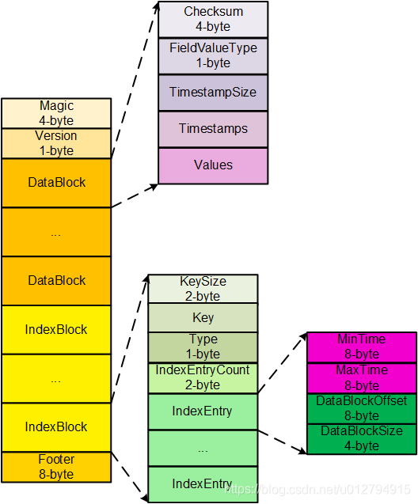

# 时序数据库技术体系(一)：存储模型设计

原文：https://sq.sf.163.com/blog/article/169864634071179264

## 1. 基本概念

时序数据库技术体系中，一个非常重要的技术点，就是时序数据模型设计。不同的时序系统有不同的设计模式，而不同的设计模式对时序数据的读写性能、数据压缩效率等各个方面都有非常重要的影响。针对当下常用的 OpenTSB、Druid、InfluxDB以及Beringei 这四个时序系统中的时序数据模型设计进行介绍。

在详细介绍数据模型之前，还是有必要回顾一下时序数据的几个基本概念。如下图所示：

上图是一个典型的时序数据库示意图。由图中可以看出，时序数据由两个维度坐标来表示：**横坐标表示时间轴**，随着时间的不断流逝，数据也会源源不断的吐出来；和横坐标不同，**纵坐标由两种元素构成，分别是数据源和metric**。数据源由一系列的标签（tag，也称为维度）唯一表示，图中数据源是一个广告数据源，这个数据源由publisher、advertiser、gender 以及 contry 四个维度值唯一表示；metric 表示待收集的数据源指标。一个数据源通常会采集很多指标（metric），上图中广告数据源就采集了impressions、clicks以及revenue 这三种指标，分别表示广告浏览量、点击率以及收入。

看到这里，对时序数据已经有了一个初步的了解，可以简单的概括为：一个时序数据点（point）由 datasource（tags）+ metric + timestamp 这三部分唯一确定。然而，这只是**逻辑上**的概念理解，那具体的时序数据库到底是如何将这一系列时序数据点进行存储的呢？针对具体的DB分别介绍。

## 2. OpenTSDB(HBase) 的存储模型

OpenTSDB 基于 HBase 存储时序数据，在 HBase 层面设计 RowKey 规则为：metrix + trimestamp + datasource（tags）。HBase 是一个 KV 数据库，一个时序数据（point）如果以 KV 的形式表示，那么其中的 V 必然是point的具体数值，而 K 就自然而然是唯一确定 point 数值的 datasource + metric + timestramp。这种规律不仅适用于 HBase，还适用于其他 KV 数据库，如Kudu。

既然 HBase 中 K 是由 datasource、metric 以及 timestamp 三者构成，现在可以简单认为 rowkey 就为这三者的组合。那问题来了：这三者组合顺序是怎么样的呢？

首先，来看哪个应该排在首位。因为HBase中一张表的数据组织方式是按照 rowkey 的字典顺序排列的，为了将同一种指标的所有数据集中放在一起，HBase 将 metric 放在了 rowkey 的最前面。假如将 timestamp 放在最前面，同一时刻的数据必然会写入同一个数据分片，无法起到散列的效果；而如果将 datasource（即tags）放在最前面，这里有个更大的问题，就是datasource本身由多个标签组成，如果用户指定其中部分标签查找，而且不是前缀标签的话，在HBase里面将会变成大范围的扫描过滤查询，查询效率非常低。举个例子，如上面提到的例子，如果将 datasource 放在最前面，那么 rowkey 就可以表示为 publisher = ultrarimfast.com&advertiser:google.com&gender:Male&country:USA_impressions_20110101000000，此时用户想着查找 20110101000000 这个时间点所有发生在 USA 的所有广告的浏览量，即只根据 country=USA 这样一个维度信息查找指定时间的某个指标，而且这个维度不是前缀维度，就会扫描大量的记录进行过滤。

确定了 metric 放在最前面之后，再来看看接下来应该将 datasource 放在中间还是应该将 timestamp 放在中间。将 metric 放在前面已经可以解决请求均匀分布（散列）的要求，因此 HBase 将 timestamp 放在中间，将 datasource 放在最后。试想，如果将 datasource 放在中间，也会遇到上文提到的后缀维度查找的问题。

因此，OpenTSDB 中 rowkey 的设计为：metric + timestamp + datasource。好了，那 HBase 就可以只设置一个 columnfamily 和一个 column。那问题又来了，OpenTSDB 的这种设计有什么问题呢？在了解设计问题之前，需要简单看看 HBase 在文件中存储 KV 的方式，即一系列时序数据在文件、内存中的存储方式，如下图所示：

上图是 HBase 中一个存储 KeyValue（KV）数据的数据结构。一个数据块由多个 KeyValue 数据组成，在这个示例中，KeyValue 就是一个时序数据点（Point）。其中 Value 结构很简单，就是一个数值。而 Key 就比较复杂了，由 rowkey + columnfamily + column + timestamp + keytype 组成，其中 rowkey 等于 metric + timestamp + datasource。

**问题一：存在很多无用的字段**。一个 KeyValue 中只有 rowkey 是有用的，其他字段，诸如 columnfamily、column、timestamp 以及 keytype 从理论上讲都是没有任何实际意义，但是在 HBase 的存储体系里必须存在，因而耗费了大量的存储成本。

**问题二：数据源和采集指标冗余**。KeyValue 中 rowkey 等于 metric + timestamp + datasource，试想，同一个数据源的同一个采集指标，随着时间的流逝不断吐出采集数据，这些数据理论上共用同一个数据源（datasource）和采集指标（metric），但是在 HBase 的这套存储体系下，共用是无法体现的，因此存在大量的数据冗余，主要是数据源冗余以及采集指标冗余。

**问题三：无法有效压缩**。HBase 提供了块级别的压缩算法 - snappy、gzip等，这些通用压缩算法并没有针对时序数据进行设置，压缩效率比较低。HBase 同样提供了一些编码算法，比如 FastDiff 等等，可以起到一定的压缩效果，但是效果不佳。效果不佳的主要原因是 HBase 没有数据类型的概念，没有schema 的概念，不能针对特定数据类型进行特定编码，只能选择通用的编码，效果自然不佳。

**问题四：不能完全保证多维度查询能力**。HBase 本身没有 schema，目前没有实现倒排索引机制，所以查询必须指定 metric、timestamp以及完整的 tags 或者前缀 tags 进行查询，对于后缀维度查询也勉为其难。

虽说有这样的问题，但是 OpenTSDB 还是针对存储模型做了两个方面的优化：

**优化一**：timestamp 并不是想象中细粒度到秒级或者毫秒级，而是精确到小时级别，然后将小时中每一秒射知道列上。这样一行就会有3600列，每一列表示一小时的一秒。这样设置据说可以有效的取出一小时整的数据

**优化二**：所有 metrics 以及所有标签信息（tags）都使用了全局编码将标签值编码成更短的 bit，减少 rowkey 的存储数据量。上文分析 HBase 这种存储方式的弊端是会存在大量的数据源（tags）冗余以及指标（metric）冗余。有冗余，就搞个编码，将 string 编码成 bit，尽最大努力减少冗余。虽说这样的全局编码可以有效降低数据的存储量，但是因为全局编码字典需要存储在内存中，因此在很多时候（海量标签值），字典所需内存会非常巨大。

上述两个优化可以参考 OpenTSDB 的这张经典示意图：

## 3. Druid 时序数据存储模型设计

和 HBase、Kudu  这类 KV 数据库不同，Druid 是另一种玩法。Druid 是一个不折不扣的列式存储系统，没有 HBase 的主键。上述时序数据在 Druid 中表示是下面的样子：

Druid 是一个列式数据库，所以每一列都会独立存储。比如 Timestamp 列会存粗在一起形成一个文件，publish 列会存储在一起形成一个文件，以此类推。即便如此存储，依然会有数据源（tags）大量冗余的问题。针对冗余的问题，Druid 和 HBase 的处理方式一样，都是采用编码字典对标签值进行编码，将 string 类型的标签值编码成 int 值。但和 HBase 不一样的是，Druid 编码是局部编码，Druid 和 HBase 都是采用 LSM 结构，数据先写入内存再 flush 到数据文件，Druid 编码是文件级别的，局部编码可以有效减小对内存的巨大压力。除此之外，Druid 的这种列式存储还有如下的好处：

* **数据存储压缩率高**。每列独立存储，可以针对每列进行压缩，而且可以为每列设置对应的压缩策略。比如时间列、int、fload、double、string 都可以分别进行压缩，压缩效果更好
* **支持多维度查询**。Druid 为 datasource 的每个列分别设置了 bitmap 索引，利用 bitmap 索引可以有效实现多维查找，比如用户想查找 20110101T00:00:00 这个时间点所有发布在 USA 的所有广告的浏览量，可以根据 contry = USA 在 bitmap 索引中找到要找的行号，再根据行号定位待查找的 metrics

然而，这样的存储模型依然存在一些问题：

* **数据冗余还在**。和 OpenTSDB 一样， tags 存在大量的冗余
* **指定数据源的范围查找并没有 OpenTSDB 高效**。这是因为 Druid 会将数据源拆成多个标签，每个标签都走 bigmap 索引，再最后使用与操作找到满足条件的行号。这个过程需要一定的开销。而 OpenTSDB 直接根据数据源拼成 rowkey，查找走 B+ Tree，效率必然更高。

## 4. InfluxDB 存储模型设计

InfluxDB 在时序数据库排行榜一直遥遥领先。InnfluxDB 是一款专业的时序数据库，只存储时序数据，因此在数据模型的额存储上可以针对时序数据做非常多的优化工作。

为了保证写入的高效，InfluxDB 也采用了 LSM 结构，数据先写入内存，当内存容量达到一定阈值之后再 flush 到文件。InfluxDB 在时序数据模型设计方面提出了一个非常重要的概念：**seriesKey**。seriesKey实际上就是 datasource（tags）+ metric，时序数据写入内存之后按照 seriesKey 进行组织：

内存中实际上就是一个 Map ：<SeriesKey, List<Timestamp | Value>>。Map 中一个 SeriesKey 对应一个 List，List中存储时间线数据。数据进来之后根据 datasource（tags） + metric 拼成 seriesKey，再将 Timestamp | Value 组合值写入时间线数据 List 中。内存中的数据 flush 的文件后，同样会将同一个 SeriesKey 中的时间线数据写入同一个 Block 块，即一个 block 块内的数据都属于同一个数据源下的 metric

这样的设计，将时间序列数据按照时间线挑了出来。先来看看其优点：

* **同一数据源的 tags 不再冗余存储**。一个 block 内的数据都共用一个 SeriesKey，只需要将这个 SeriesKey 写入这个 Block 的 Trailer 部分就可以。大大降低了时序数据的存储量
* 时间序列和 Value 可以在同一个 Block 内分开独立存储，独立存储就可以对时间列以及数值列分别进行压缩。InfluxDB 对时间列的存储借鉴了 Beringei 的压缩方式，使用 delta-delta 压缩方式极大的提高了压缩效率。而对 Value 的压缩可以针对不同的数据类型采用相同的压缩效率
* 对于给定的数据源以及时间范围的数据查找，可以非常高效的进行。和 OpenTSDB 一样

这里可能有疑问：将 datasource（tags）和 metric 拼成 SeriesKey，不是也不能实现多维度查询？确实是如此的，不过 InfluxDB 内部实现了倒排索引机制，即实现了 tag 到 SeriesKey 的映射关系，如果用户想根据某个 tag 查找的话，首先根据 tag 在倒排索引中找到对应的 SeriesKey，再根据 SeriesKey 定位具体的时间线数据。

InfluxDB 的这种存储引擎称为 TSM， 全称是 Timestamp-Structure Merge Tree，基本原理类似于 LSM。

**InfluxDB 可以称为真正的时序数据库**，存储引擎称为 TSM，基本架构类似于 LSM。数据按照 Key 组织，InfluxDB 中 Key 由维度集合加上某一个列值名构成，所有属于该维度集合加列值的时间序列数值组成的一个集合就挂在该 Key 下。这样，维度列值就不再需要冗余存储，而且 timestramp 和 point 点可以使用列式存储，独立压缩。InfluxDB 的文件格式如下图所示：

## 5. Beringei 存储模型设计

Beringei 是 Facebook 开源的一个时序数据库。

InfluxDB 时序数据模型设计很好地将时间序列按照数据源以及 metric 挑选了出来，解决了维度列值冗余存储，时间列不能有效压缩的问题。但是 InfluxDB 没有很好的解决写入缓存压缩的问题：InfluxDB 在写入内存的时候并没有压缩，而是在数据写入文件的时候进行对应压缩。

时序数据最大的特点之一，就是最近写入的数据最热，将最近写入的数据全部放到内存可以极大提升读取效率。Beringei 很好的解决了这个问题，流式压缩意味着数据写入内存之后就进行压缩，这样会使得内存中可以缓存更多的时序数据，对于最近数据的查询会有很大的帮助。

Beringei 的时序数据模型设计与 InfluxDB 基本一致，也是提出了类似于 SeriesKey 的概念，将时间线挑了出来。但是和 InfluxDB 有两个比较大的区别：

* **文件组织形式不同**。Beringei 的文件存储形式按照时间窗口组织，比如最近 5 分钟的数据全部写入同一个文件，这个文件分为很多 block，每个 block 中的所有时序数据共用一个 SeriesKey。Beringei 文件没有索引，InfluxDB 有索引
* **Beringei 没有使用倒排索引**。因为对于多位查询并不高效。

如果将 Beringei 和 InfluxDB 有效结合起来，就可以非常高效的提高数据在文件的存储效率以及查询效率，最后结合 InfluxDB 的倒排索引功能可以有效提高多维查询能力。

