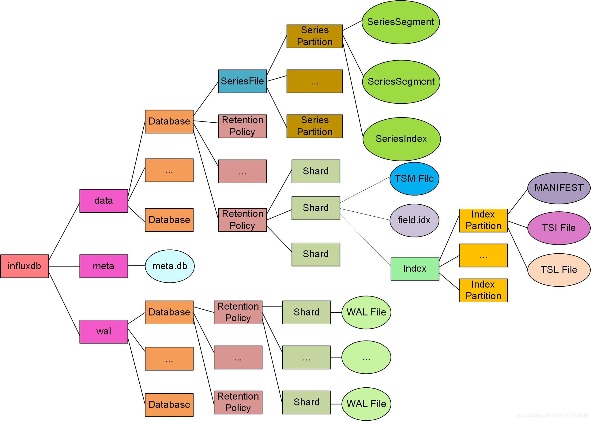
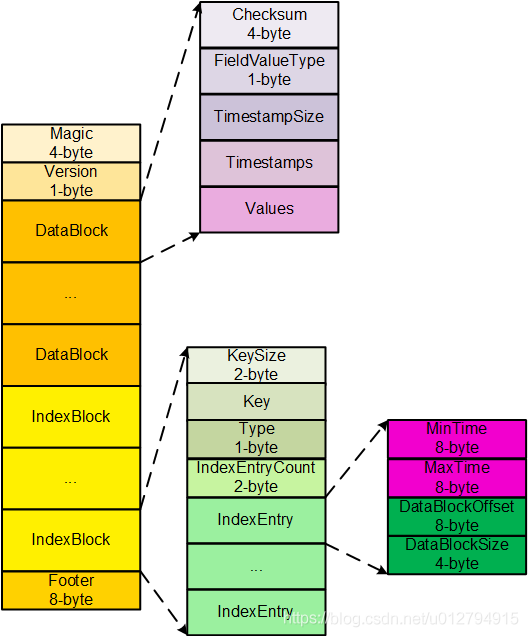
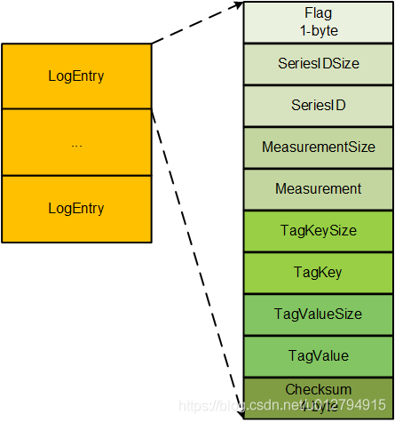
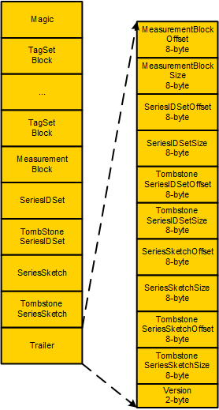
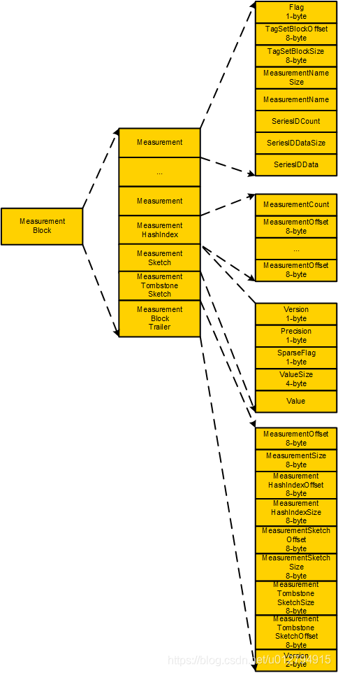
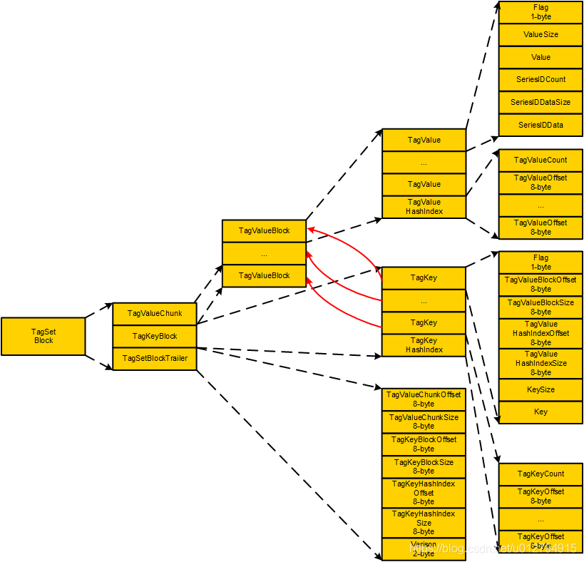
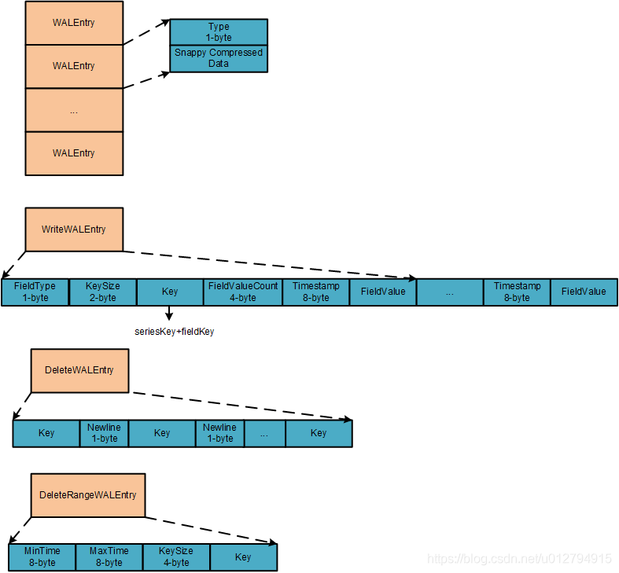
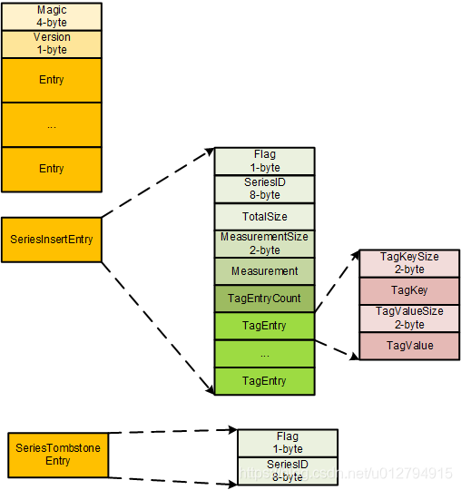
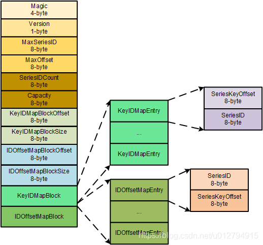

# 时序数据库技术体系(三)：InfluxDB文件结构解析

原文：https://blog.csdn.net/u012794915/article/details/100061367

# 1. InfluxDB 文件目录结构

InfluxDB 文件目录结构如上图所示，从图中可以看出 InfluxDB 主目录下有3个子目录：data、wal、meta：

* **data**：存放时序数据及其索引文件
* **wal**：存放插入数据时产生的 write ahead log （wal）
* **meta**：存放元数据

下面介绍重要文件。

## 2. Time-Structured Merge Tree(TSM) File

TSM 文件按列存储时序数据，其文件结构如上图所示。该文件主要分为两个三个部分：

* **DataBlock**：按列式存储同一个 Key = SeriesKey + 单个 FieldKey 所对应的FieldValue，以按列的方式进行存储可以获得高效的压缩，节省大量的磁盘空间。
  * CheckSum：该 DataBlock 的校验码
  * FieldValue Type：表示该 DataBlock 存储的 FieldValue 类型，InfluxDB 中存在 5 种 FieldValueType：Float、Integer、Unsigned、Boolean、String
  * TimestampSize：表示 TimeStamps block 的长度，使用可变厂编码
  * Timestamps：将时间按列使用 delta-delta 编码压缩
  * Vlaues：将 FieldValue 值按列进行压缩，不同类型的 FieldValue 使用不同的压缩算法
* **IndexBlock**：保存对应 DataBlock 的相关索引信息
  * KeySize：Key的长度
  * Key：key = SeriesKey + 单个 FieldKey。例如，插入一条记录 insert cpu, brand=dell, country=china price=100,sale=true，则这条记录有两个 Key，分别是 cpu,brand=dell,country=china#!~#price 和 cpu,brand=dell,country=china #!~#sale，#!~# 为 SeriesKey 和 FieldKey 之间的分隔符
  * Type：FieldValue 类型
  * IndexEntryCount：用于统计该 IndexBlock 中 IndexEntry 的数量
  * IndexEntry：DataBlock 索引项
    * MinTime：对应的 DataBlock 中最早数据的时间
    * MaxTime：对应的 DataBlock 中最晚数据的时间
    * DataBlockOffset：对应的 DataBlock 在该文件的偏移量
    * DataBlockSize：对应的 DataBlock 的长度
* **Footer**：第一个 IndexBlock 在文件中的偏移量，通过 Footer 能够快速查找到 IndexBlock 的起始位置，再通过 IndexBlock 能查到对应的 DataBlock

## 3. Time Series Log（TSL）文件结构

* **LogEntry**
  * Flag：LogEntry 标志，目前有 5 种标志：
    * SeriesInsertFlag：表示该 SeriesKey 插入
    * SeriesTombstoneFlag：表示该 Series 删除
    * MeasurementTombstoneFlag：表示该 Measurement 删除
    * TagKeyTombstoneFlag：表示该 TagKey 删除
    * TagValueTombstoneFlag：表示该 TagValue 删除
  * SeriesID：采用可变长编码，当 Flag 为 SeriesInsertFlag 和 SeriesTombstoneFlag 时，SeriesID 为非 0 正数，其他情况均为 0
  * MeasurementSize：表示 Measurement 项的长度
  * Measurement：Measurement的名称，当 Flag 为 SeriesInsertFlag 和 SeriesTombstoneFlag时，MeasurementSize 为 0，该项为空
  * TagKeySize：表示 TagKey 项的长度
  * TagKey：当 Flag 为 TagKeyTombstoneFlag 和 TagValueTombstoneFlag 时，TagKeySize 不为0，TagKey 保存对应值，其他情况 TagKeySize 均为0， TagKey 为空
  * TagValueSize：表示 TagValue 项的长度
  * TagValue：当 Flag 为 TagValueTombstoneFlag 时，TagValueSize 非 0，TagValue保存对应值，其他情况 TagValueSize均为0，TagValue 为空
  * Checksum：4-byte 定长 BigEndian 编码校验和

## 4. Time Series Index ( TSI ) 文件结构

当 TSL 文件大小达到配置的 compation 阈值时（由配置文件中的 max-index-log-file-size 指定，默认为 1M），TSL文件会 compaction 成 TSI 文件，TSI 文件结构如上图所示。

* **Magic**：魔数
* **TagSetBlock**：存储TagKey，TagValue相关信息 
  - TagValueChunk: 存储TagValue相关信息
    - TagValueBlock:
      - TagValue
        - Flag: 标志位，根据该标志位可以判断TagValue是否已经删除
        - ValueSize: TagValue长度
        - Value: TagValue值
        - SeriesIDCount: 该TagValue对应的seriesID的数量（一个TagValue可以对应多个SeriesKey，SeriesKey和SeriesID是一对一的关系，从而一个TagValue对应对应多个seriesID）
        - SeriesIDDataSize: 序列化后的SeriesIDs数据长度
        - SeriesIDData：序列化后的SeriesIDs数据，SeriesIDs采用roaringBitmap的方式进行存储序列化
      - TagValueHashIndex:
        - TagValueCount: 该TagValueBlock中TagValue的数量
        - TagValueOffset：该TagValueBlock中TagValue在文件中的对应的偏移量
  - TagKeyBlock:
    - TagKey:
      - Flag: 标志位，表示该TagKey是否已经删除
      - TagValueBlockOffset: 对应的TagValueBlock在文件中的偏移量
      - TagValueBlockSize: 对应的TagValueBlock长度
      - TagValueHashIndexOffset
      - TagValueHashIndexSize
      - KeySize: TagKey长度
      - Key: TagKey
  - TagSetBlockTrailer:
    - TagValueChunkOffset
    - TagValueChunkSize
    - TagKeyBlockOffset
    - TagKeyBlockSize
    - TagKeyHashIndexOffset
    - TagKeyHashIndexSize
    - Version
* **MeasurementBlock**：
  * Flag: 标志位，根据该标志位可以判断measurement是否已经删除
  * TagSetBlockOffset
  * TagSetBlockSize
  * MeasurementNameSize: measurement长度
  * MeasurrementName: measurement名称
  * SeriesIDCount: 该measurement拥有的seriesID数量
  * SeriesIDDataSize
  * SeriesIDData
* **SeriesIDSet**：插入TSL的的所有seriesID
* **TombstoneSeriesIDSet**：TSL中被删除的所有seriesID
* **SeriesSketch**：hyhperLogLog结构，存储TSL中seriesID对应的SeriesKey（与SeriesIDSet中的seriesID相对应）
* **TombstoneSketch**：存储TSL中tombstoneSeriesID对应的SeriesKey（与TombstoneSeriesIDSet中的seriesID相对应），与SeriesSketch结合使用获取measurement cardinality
* **Trailer**
  * MeasurementBlockOffset
  * MeasurementBlockSize
  * SeriesIDSetOffset
  * SeriesIDSetSize
  * TombstoneSeriesIDSetOffset
  * TombstoneSeriesIDSetSize
  * SeriesSketchOffset
  * SeriesSketchSize
  * TombstoneSketchOffset
  * TombstoneSketchSize
  * Version

## 5. Write Ahred Log(WAL) 文件结构

为了防止数据丢失，InfluxDB在进行每次写入或删除操作时首先会将该操作写入WAL文件中，WAL如上图所示：

- Type：WAL Entry类型，目前有3中类型：WriteWALEntryType，DeleteWALEntryType，DeleteRangeWALEntryType
  - WriteWALEntry
    - FieldType: 插入的Field类型
    - KeySize
    - Key: SeriesKey + 单个FieldKey（因为是按列式存储）
    - FieldValueCount：该Field列写入的数据个数
    - Timestamp
    - FieldValue
  - DeleteWALEntry
    - Key: SeriesKey + 单个FieldKey
    - Newline：换行符\n
  - DeleteRangeWALEntry
    - MinTime: 批量删除中最小记录的时间戳
    - MaxTime:批量删除中最大记录的时间戳
    - KeySize
    - Key：同上
- Snappy Compressed Data：不同类型Entry经过Snappy压缩后的数据（以上不同类型Entry经过snappy压缩后的数据）

## 6. Series Segment文件结构

Series Segment文件中存放SeriesKey，该文件结构如上所示：

- Magic
- Version
- Entry:
  - SeriesInsertEntry
    - Flag: SeriesEntryInsertFlag，标志该entry为SeriesInsertEntry
    - SeriesID
    - TotalSize: SeriesKey的总长度
    - MeasurementSize
    - Measurement
    - TagEntryCount: TagEntry数量
    - TagEntry:
      - TagKeySize: TagKey长度
      - TagKey
      - TagValueSize: TagValue长度
      - TagValue
  - SeriesTombstoneEntry
  - Flag: SeriesEntryTombstoneFlag，标志该entry为SeriesTombstoneEntry
  - SeriesID

## 7. Series Index文件结构

Series Index文件为Series segment文件的索引文件，该文件存储seriesID -> SeriesKeyOffset的映射，series segment以及series index为db级别文件

- Magic
- Version
- MaxSeriesID: 最大seriesID
- MaxOffset: 最大seriesID对应的offset
- SeriesIDCount: KeyIDMapEntry的数量（IDOffsetMapEntry数量与KeyIDMapEntry数量相同）
- Capacity: KeyIDMapBlock为hash表结构，Capacity表示hash桶的总数量
- KeyIDMapBlockOffset
- KeyIDMapBlockSize
- IDOffsetMapBlockOffset
- IDOffsetMapBlockSize
- KeyIDMapBlock：通过该block可以获取不同SeriesKey对应的seriesID，hash对象为SeriesKey
  - KeyIDMapEntry
    - SeriesKeyOffset: 高32位表示series segment文件id，通过高32为可以找到存储该SeriesKey所在的series segment文件，低32位表示在series segment文件中的偏移量，通过低32位可以得到seriseID对应的SeriesKey
    - SeriesID
- IDOffsetMapBlock：通过该block可以获得不同seriesID对应的SeriesKey，hash对象为seriesID
  - IDOffsetMapEntry:
    - SeriesID
    - SeriesKeyOffset