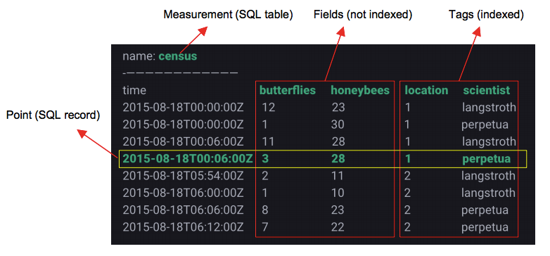
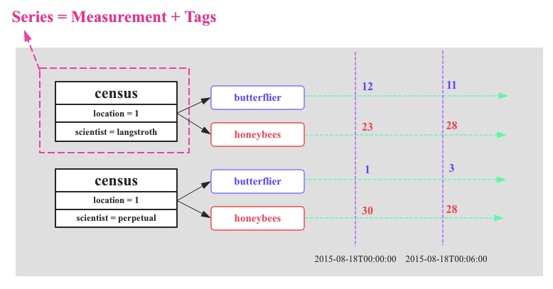
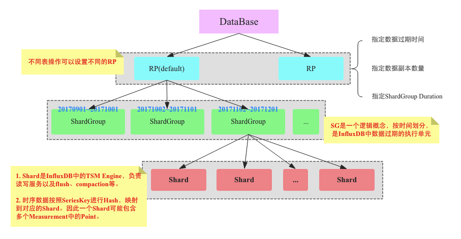
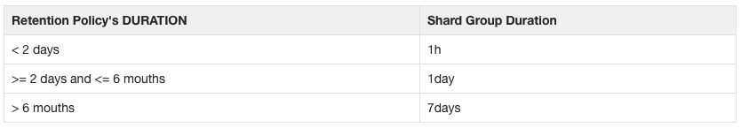
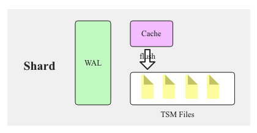

# 时序数据库技术体系(二)：初识 InfluxDB

原文：https://sq.sf.163.com/blog/article/169866295296581632


OpenTSDB基于HBase对维度值进行了全局字典编码优化，Druid采用列式存储并实现了Bitmap索引以及局部字典编码优化，InfluxDB和Beringei都将时间线挑了出来，大大降低了Tag的冗余。在这几种时序数据库中，InfluxDB无疑显的更加专业。接下来将会针对InfluxDB的基本概念、内核实现等进行深入的分析。本篇文章先行介绍一些相关的基本概念。


## 1. InfluxDB 数据模型

InfluxDB 的数据模型和其他时序数据库有些不同。下图就是 InfluxDB 的一张示意图：



### 1.1 Measurement

从原理上讲，更像 SQL 中表的概念。这和其他很多时序数据库有些不同，其他时序数据库中 Measurement 可能与 Metric 等同，类似于下文将到的 Field，这点需要注意。

### 1.2 Tags：维度列

1. 上图中 location 和 scientist 分别是表中的两个 Tag Key，其中 location 对应的维度值 Tag Values 为 {1, 2}，scientist 对应的维度值 Tag Values 为 {langstroth, perpetual }，两者的组合 TagSet 有四种：

   ```yaml
   location = 1, scientist = langstroth
   location = 1, scientist = perpetual
   location = 2, scientist = langstroth
   location = 2, scientist = perpetual
   ```

2. 在 InfluxDB 中，表中 Tags 组合会被作为记录的主键，因此主键并不唯一。比如上表中第一行和第三行记录的主键都是 location=1, scientist=langstroth。所有时序查询最终都会基于主键查询之后再经过时间戳过滤完成

### 1.3 Fields

数值列。数值列存放用户的时序数据

### 1.4 Point

类似 SQL 中一行记录，并不是一个点


## 2. InfluxDB 核心概念 - Series

上篇中提到**时间线**的概念，时序数据的时间线就是一个数据源采集的一个指标随着时间的流逝而源源不断的吐出数据，这样就形成了一条数据线，称之为时间线。如下图所示：



上图中有两个数据源，每个数据源会采集两种指标：butterfilter 和 honeybees。InfluxDB 中使用 Series 表示数据源，Series 由 Measurement 和 Tags 组合而成，Tags 组合用来唯一标识 Measurement。Series 是 InfluxDB 中最重要的概念。平时会经常用到。

## 3. InfluxDB 系统架构

InfluxDB 对数据的组织和其他数据库相比有很大的不同，为了更加清晰的说明，笔者按照自己的理解整理了下面这整 InfluxDB 的逻辑架构图：



### 3.1 Database

InfluxDB 中有 Database 的概念，用户可以通过 create database xxx 来创建一个数据库

### 3.2 Retention Policy (RP)

**数据保存策略**。InfluxDB 很重要的一个概念，核心作用有3个：指定数据的过期时间；指定数据副本数量；指定 ShardGroup Duration。

RP 创建的语句如下：

```sql
CREATE RETENTION POLICY ON <retention_policy_name> ON <database_name> DURATION <duration> REPLICATION <n> [SHARD DURATION <duration> ] [DEFAULT]
```

其中，retention_policy_name 表示 RP 的名称，database_name 表示数据库的名称，duration 表示 TTL，n 表示数据副本。SHARD DURATION 下文再说。下面是一个例子：

```sql
CREATE RETENTION POLICY "one_day_only" ON "water_database" DURATION 1d REPLICATION 1 SHARD DURATION 1h DEFAULT
```

InfluxDB 中 Retention Policy 有这么几个性质和用法：

* RP 是数据库级别而不是表级别的属性。这和很多数据库都不同

* 每个数据库可以有多个数据保留策略，但只能有一个默认策略

* 不同表可以根据保留策略规则在写入数据的时候指定 RP 进行写入。下面语句就是指定 six_month_rollup 的 RP 进行写入：

  ```sql
  curl -X POST 'http://localhost:8086/write?db=mydb&rp=six_month_rollup' --> 'disk_free,hostname=server01 value=442221834240i 1435362189575692182'
  ```

  

如果没有指定任何 RP，则使用默认的RP。

### 3.3 Shard Group

Shard Group 是 InfluxDB 中一个重要的**逻辑概念**。从字面意思看，Shard Group 会包含多个 Shard，每个 Shard Group 只存储指定时间段的数据，**不同 Shard Group 对应的时间段不会重合**。比如2017年9月份的数据落在Shard Group0 上，2017年10月份的数据落在 Shard Group1 上。

每个 Shard Group 对应多长时间是通过 Retention Policy 中字段“SHARD DURATION” 指定的，如果没有指定，也可以通过 Retention Duration （数据过期时间）计算出来，两者的关系如下：



问题来了：为什么需要将数据按照时间分成一个一个 Shard Group ？可能是一下原因：

1. 将数据按照时间分割成小的粒度会使得数据过期实现非常简单。InfluxDB 中数据过期删除的执行粒度就是 Shard Group，系统会对每个 Shard Group 判断是否过期，而不是一条一条记录判断
2. 实现了将数据按照时间分区的特性。将时序数据按照时间分区是时序数据库一个非常重要的特性，基本上所有时序数据查询操作都会带有时间的过滤条件。比如查询最近一小时或最近一天，数据分区可以有效根据时间维度选择部分目标分区，淘汰部分分区

### 3.4 Shard

Shard Group 实现了数据分区，但是 ShardGroup只是一个逻辑概念，在它里面包含了大量 Shard，Shard 才是 InfluxDB 中真正存储数据以及提供读写服务的概念。类似于 HBase中 Region，Kudu中Tablet的概念。要了解Shard，需要弄清楚下面两个方面：

1. Shard 是 InfluxDB 的存储引擎实现，具体称之为 TSM （Time Sort Merge Tree）Engine，负责数据的编码存储、读写服务等。TSM 类似于 LSM，因此 Shard 和 HBase Region 一样，包含 Cache、WAL 以及 Data File 等各个组件，也会有 flush、compaction 等这类数据操作

   

2. Shard Group 对数据按时间进行了分区，那落在一个 Shard Group 中的数据又是如何映射到哪个 Shard 上的呢？

InfluxDB 采用了 Hash 分区的方法将落到同一个 Shard Group 中的数据再次进行一次分区。这里特别需要注意的是，InfluxDB 是根据 hash(Series) 将时序数据映射到不同的 Shard，而不是根据 Measurement 进行 hash 映射，这样会使得相同 Series 的数据肯定会在同一个 Shard 中，但这样的映射策略会使得一个 Shard 中包含多个 Measurement 的数据，不像 HBase 中一个 Region 的数据肯定都是属于同一张表。

## 4. InfluxDB Sharding 策略

这里总结一下InfluxDB Sharding 策略。通常分布式数据库一般有两种 Sharding 策略：Range Sharding 和 Hash Sharding，前者对于基于主键的范围扫描比较高效，HBase 以及 TiDB 都采用这种 Sharding 策略；后者对于离散大规模写入以及随机读取相对比较友好，通常最简单的 Hash 策略是采用取模法，但是取模法有个很大的弊病就是取模基础需要固定，一旦变化就需要数据重分布，当然可以采用更加复杂的一致性 Hash 策略来缓解数据重分布的影响。

InfluxDB 的 Sharding 策略是典型的两层 Sharding：上层使用 Range Sharding，下层使用 Hash Sharding。对于时序数据库来说，基于时间的 Range Sharding 是最合里的考虑，但是如果仅仅使用 Time Range Sharding，会存在一个很严重的问题：即写入会存在热点。基于 Time Range Sharding 的时序数据库写入必然会落到最新的 Shard 上，其他老 Shard 不会接收写入请求。对写入性能要求很高的时序数据库来说，热点写入肯定不是最优方案。解决这个问题最自然的思路就是再使用 Hash 进行一次分区。基于 Key 的 Hash 分区方案可以通过三列很好的解决热点写入的问题，但同时会引入两个新问题：

1. 导致 Key Range Scan 性能比较差。InfluxDB 很优雅的解决了这个问题。时序数据库基本上所有查询都是基于 Series （数据源）来完成的，因此只要 Hash 分区是按照 Series 进行 Hash 就可以将相同 Series 的时序数据放在一起，这样 Range Scan 性能就可以得到保证。InfluxDB就只如此做的
2. Hash 分区的个数必须是固定的。如果要改变 Hash 分区数会导致大量数据重分布。除非使用一致性 Hash 算法。而 InfluxDB 源码中 Hash 分区的个数固定是 1，对此不是很理解。

## 5. 总结

本篇文章重点介绍InfluxDB中一些基本概念，为后面分析InfluxDB内核实现奠定一个基础。文章主要介绍了三个重要模块：

1. 首先介绍了InfluxDB中一些基本概念，包括Measurement、Tags、Fields以及Point。
2. 接着介绍了Series这个非常非常重要的概念。
3. 最后重点介绍了InfluxDB中数据的组织形式，总结起来就是：先按照RP划分，不同过期时间的数据划分到不同的RP，同一个RP下的数据再按照时间Range分区形成ShardGroup，同一个ShardGroup中的数据再按照Series进行Hash分区，将数据划分成更小粒度的管理单元。Shard是InfluxDB中实际工作者，是InfluxDB的存储引擎。