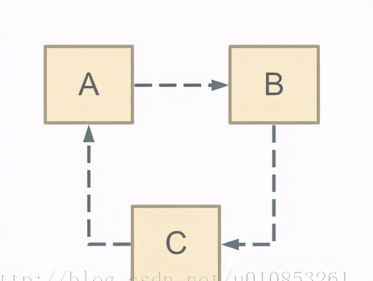
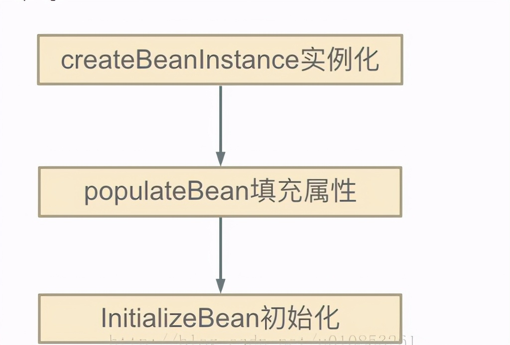

# Spring解决Bean的循环依赖方式

原文： https://www.toutiao.com/i6938961731947332109/


本文主要是分析Spring bean的循环依赖，以及Spring的解决方式。 通过这种解决方式，我们可以应用在我们实际开发项目中。

1. 什么是循环依赖？

2. 怎么检测循环依赖

3. Spring怎么解决循环依赖

   

## 1. 什么是循环依赖

循环依赖其实就是循环引用，也就是两个或者两个以上的bean互相持有对方，最终形成闭环。比如A依赖于B，B依赖于C，C又依赖于A。如下图：



注意，这里不是函数的循环调用，而是对象的相互依赖关系。循环调用其实就是一个死循环，除非有终结条件。

​        Spring中循环依赖场景有：

* 构造器的循环依赖
* field属性的循环依赖。

## 2. 怎么检测循环依赖

检测循环依赖相对比较容易，Bean在创建的时候可以给该Bean打标，如果递归调用回来发现正在创建中的话，即说明了循环依赖了。

## 3. Spring 怎么解决循环依赖

Spring的循环依赖的理论依据其实是**基于Java的引用传递 - 对象的地址**，当我们获取到对象的引用时，对象的field或者属性是可以延后设置的(但是构造器必须是在获取引用之前)。

Spring的单例对象的初始化主要分为三步：



* createBeanInstance：实例化，其实也就是调用**对象的构造方法**实例化对象

* populateBean：填充属性，这一步主要是**对bean的依赖属性**进行填充

* initializeBean：调用spring xml中的init 方法。

从上面的单例bean初始化步骤可以知道，循环依赖主要发生在第一、第二步，也就是构造器循环依赖和field循环依赖。

那么要解决循环引用也应该从初始化过程着手。对于单例来说，在Spring容器整个生命周期内，有且只有一个对象，所以很容易想到这个对象应该存在Cache中，Spring为了解决单例的循环依赖问题，使用了**三级缓存**。

首先看源码，三级缓存主要指：

```java
/** Cache of singleton objects: bean name --> bean instance */ 
private final Map<String, Object> singletonObjects = new ConcurrentHashMap<String, Object>(256); 

/** Cache of early singleton objects: bean name --> bean instance */ 
private final Map<String, Object> earlySingletonObjects = new HashMap<String, Object>(16);

/** Cache of singleton factories: bean name --> ObjectFactory */ 
private final Map<String, ObjectFactory<?>> singletonFactories = 
                                                  new HashMap<String, ObjectFactory<?>>(16); 
```

这三级缓存分别指：

* singletonObjects：单例对象的cache                                      -- 一级缓存

* earlySingletonObjects ：提前曝光的单例对象的Cache   -- 二级缓存

* singletonFactories ： 单例对象工厂的cache                       -- 三级缓存

在创建bean的时候，首先想到的是从cache中获取这个单例的bean，这个缓存就是singletonObjects。主要调用方法就是：

```java
protected Object getSingleton(String beanName, boolean allowEarlyReference) { 
  Object singletonObject = this.singletonObjects.get(beanName); 
  if (singletonObject == null && isSingletonCurrentlyInCreation(beanName)) { 
    synchronized (this.singletonObjects) { 
      singletonObject = this.earlySingletonObjects.get(beanName); 
      if (singletonObject == null && allowEarlyReference) { 
        ObjectFactory<?> singletonFactory = this.singletonFactories.get(beanName); 
        if (singletonFactory != null) { 
          singletonObject = singletonFactory.getObject();        
          this.earlySingletonObjects.put(beanName, singletonObject); 
          this.singletonFactories.remove(beanName); 
        } 
      } 
    } 
  } 
  return (singletonObject != NULL_OBJECT ? singletonObject : null); 
}
```

上面的代码需要解释两个参数：

- isSingletonCurrentlyInCreation()：判断当前单例bean是否正在创建中，也就是没有初始化完成(比如A的构造器依赖了B对象所以得先去创建B对象， 或者在A的populateBean过程中依赖了B对象，得先去创建B对象，这时的A就是处于创建中的状态。)
- allowEarlyReference：是否允许从singletonFactories中通过getObject拿到对象

分析getSingleton()的整个过程，Spring首先从**一级缓存singletonObjects**中获取。如果获取不到，并且对象正在创建中，就再从**二级缓存earlySingletonObjects**中获取。如果还是获取不到且允许singletonFactories通过getObject()获取，就从**三级缓存singletonFactory**.getObject()获取，如果获取到了则：

```java
this.earlySingletonObjects.put(beanName, singletonObject); this.singletonFactories.remove(beanName);
```

从singletonFactories中移除，并放入earlySingletonObjects中。其实也就是从三级缓存移动到了二级缓存。

从上面三级缓存的分析，可以知道，**Spring解决循环依赖的诀窍就在于singletonFactories这个三级cache**。这个cache的类型是ObjectFactory，定义如下：

```java
public interface ObjectFactory<T> { 
  T getObject() throws BeansException; 
}
```

这个接口在下面被引用:

```java
protected void addSingletonFactory(String beanName, ObjectFactory<?> singletonFactory) { 
  Assert.notNull(singletonFactory, "Singleton factory must not be null"); 
  synchronized (this.singletonObjects) { 
    if (!this.singletonObjects.containsKey(beanName)) { 
      this.singletonFactories.put(beanName, singletonFactory); 
      this.earlySingletonObjects.remove(beanName); 
      this.registeredSingletons.add(beanName); 
    } 
  } 
}
```

这里就是解决循环依赖的关键，这段代码发生在 *createBeanInstance* 之后，也就是说单例对象此时已经被创建出来(调用了构造器)。这个对象已经被生产出来了，虽然还不完美（还没有进行初始化的第二步和第三步），但是已经能被人认出来了（根据对象引用能定位到堆中的对象），所以Spring此时将这个对象提前曝光出来让大家认识，让大家使用。

这样做有什么好处呢？分析一下“A的某个field或者setter依赖了B的实例对象，同时B的某个field或者setter依赖了A的实例对象”这种循环依赖的情况。A首先完成了初始化的第一步，并且将自己提前曝光到singletonFactories中，此时进行初始化的第二步，发现自己依赖对象B，此时就尝试去get(B)，发现B还没有被create，所以走create流程，B在初始化第一步的时候发现自己依赖了对象A，于是尝试get(A)，尝试一级缓存singletonObjects(肯定没有，因为A还没初始化完全)，尝试二级缓存earlySingletonObjects（也没有），尝试三级缓存singletonFactories，由于A通过ObjectFactory将自己提前曝光了，所以B能够通过ObjectFactory.getObject拿到A对象(虽然A还没有初始化完全，但是总比没有好呀)，B拿到A对象后顺利完成了初始化阶段1、2、3，完全初始化之后将自己放入到一级缓存singletonObjects中。此时返回A中，A此时能拿到B的对象顺利完成自己的初始化阶段2、3，最终A也完成了初始化，进去了一级缓存singletonObjects中，而且更加幸运的是，由于B拿到了A的对象引用，所以B现在hold住的A对象完成了初始化。

知道了这个原理时候，肯定就知道为啥Spring<font color='red'>**不能**</font>解决“A的构造方法中依赖了B的实例对象，同时B的构造方法中依赖了A的实例对象”这类问题了！因为加入 ***singletonFactories*** 三级缓存的**前提是执行了构造器**，<font color='red'>所以构造器的循环依赖没法解决。</font>