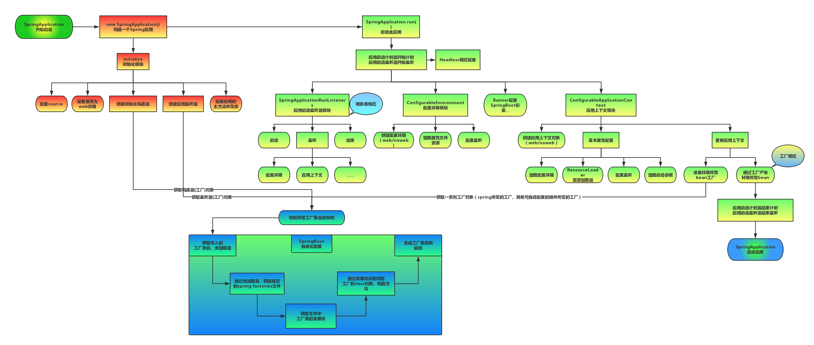
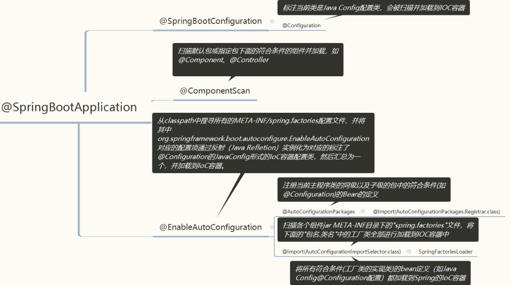
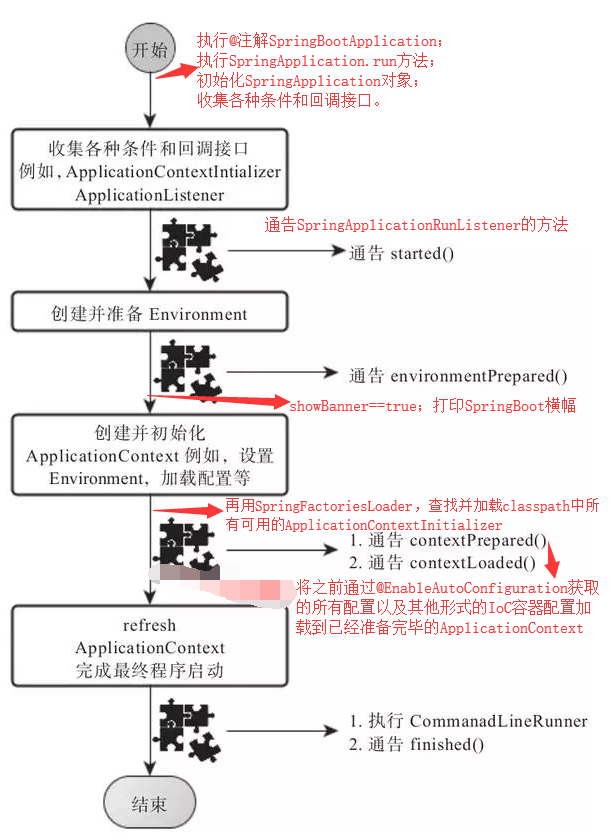

# SpringBoot启动流程及其原理

原文：https://www.cnblogs.com/zjtao/p/12197123.html


## 一. SpringBoot 与 Spring、Spring MVC的不同

​        **Spring** 框架就像是一个家族，有众多的衍生产品，如 SpringBoot、SpringJPA、Spring Security 等等。但是，它们的基础都是 Spring 的 IoC 和 AOP。IoC 提供了依赖注入的容器，AOP 解决了面向切面编程，然后在此两者的基础上实现了其他衍生产品的高级功能。

​        **Spring MVC** 提供了一种轻度耦合的方式来开发 Web 应用。它是 Spring 的一个模块，是一个 Web 框架。通过 DispatcherServlet、ModelAndView 和 View Resolver，开发 Web 应用变得很容易；解决的问题领域是网站应用程序或者服务开发 -- URL路由、Session、模版引擎、静态 Web 资源等等。

​        **SpringBoot** 实现了 auto-configuration **自动配置**（另外还有三大神器：actuator监控、cli 命令行接口、starter依赖），降低了项目搭建的复杂度。它主要为了解决使用 Spring 框架需要进行大量的配置的麻烦问题，所以它并不是用来替代 Spring 的解决方案，而是和 Spring 框架紧密结合用于提升 Spring 开发体验的工具，同时集成了大量常用的第三方库配置（如 Jackson、JDBC、Mongo、Redis等等），SpringBoot 应用中这些第三方库几乎可以领配置的开箱即用（out-of-the-box）。

## 二. SpringBoot 启动原理及相关流程概述

​        SpringBoot 是基于 Spring 框架的新型的轻量级框架，最厉害的地方就是其**自动配置**。可以根据启动流程和相关原理来看看，如何实现传奇的自动配置。



## 三. SpringBoot 的启动类入口

​        用过 SpringBoot的人都知道，SpringBoot有自己的**独立的启动类**（独立程序）：

```java
@SpringBootApplication
public class Application {
    public static void main(String[] args) {
        SpringApplication.run(Application.class, args);
    }
}
```

​        从启动类大代码来看，Annotation定义（***@SpringBootApplication***）和类定义（***SpringApplication.run()***）最为耀眼，所以要揭开SpringBoot的面纱，就要从两个类开始。

## 四. 单单是SpringBootApplication接口用到的注解

```java
@Target(ElementType.TYPE) // 注解的适用范围，其中TYPE用于描述类、接口（包括包注解类型）或enum声明
@Retention(RetentionPolicy.RUNTIME) // 注解的生命周期，保留到class文件中（三个生命周期）
@Documented // 表明这个注解应该被javadoc记录
@Inherited // 子类可以继承该注解
@SpringBootConfiguration // 继承了Configuration，表示当前是注解类
@EnableAutoConfiguration // 开启springboot的注解功能，springboot的四大神器之一，其借助@import的帮助
@ComponentScan(excludeFilters = { // 扫描路径设置（具体使用待确认）
@Filter(type = FilterType.CUSTOM, classes = TypeExcludeFilter.class),
@Filter(type = FilterType.CUSTOM, classes = AutoConfigurationExcludeFilter.class) })
public @interface SpringBootApplication {
...
}
```



​        其中比较重要的是三个注解分别是：

1. @SpringBootConfiguration ：继承了 Configuration，表示当前是注解类
2. @EnableAutoConfiguration ：开启SpringBoot的注解功能，SpringBoot 的四大神器之一，其借助 @import 的帮助
3. @ComponentScan(excludeFilters = {...}) ：扫描路径设置

### 4.1 @Configuration注解

​        按照原来 XML 配置文件的形式，在 SprintBoot 中大多使用配置类来解决配置问题。

#### 4.1.1 Bean的配置方式区别

1. XML 配置文件的形式配置Bean

   ```xml
   <?xml version="1.0" encoding="UTF-8"?>
   <beans xmlns="http://www.springframework.org/schema/beans"
   xmlns:xsi="http://www.w3.org/2001/XMLSchema-instance"
   xsi:schemaLocation="http://www.springframework.org/schema/beans http://www.springframework.org/schema/beans/spring-beans-3.0.xsd"
   default-lazy-init="true">
       
       <!--bean定义-->
   </beans>
   ```

2. Java Configuration 的形式配置Bean

   ```java
   @Configuration
   public class MockConfiguration {
       // bean 定义
   }
   ```

#### 4.1.2 Bean的注入方式区别

1. XML 配置文件方式注入Bean

   ```xml
   <bean id="mockService" class="..MockServiceImpl">
   ...
   </bean>
   ```

2. Java Configuration 方式注入Bean

   ```java
   @Configuration
   public class MockConfiguration{
       @Bean
       public MockService mockService(){
           return new MockServiceImpl();
       }
   }
   ```

   任何一个标注了 ***@Bean*** 的方法，其返回值将作为一个 Bean 定义注册到 Spring 的 IoC 容器，方法名将默认称为该 Bean 定义的 ID。

#### 4.1.3 Bean 之间的依赖关系表示的区别

1. XML 配置文件的形式表达依赖关系

   ```xml
   <bean id="mockService" class="..MockServiceImpl">
   　　<propery name ="dependencyService" ref="dependencyService" />
   </bean>
   <bean id="dependencyService" class="DependencyServiceImpl"></bean>
   ```

2. Java Configuration 配置的形式的依赖关系

   ```java
   @Configuraton
   public class MockConfiguration {
       @Bean
       public MockService mockService() {
           return new MockServiceImpl(dependencyService());
       }
       
       @Bean
       public DependencyService dependencyService() {
           return new DependencyServiceImpl();
       }
   }
   ```

### 4.2 @ComponentScan 注解

​        这个注解的作用主要有以下几点：

* 对应 XML 配置中的元素
* ComponentScan 的功能其实就是自动扫描并加载符合条件的组件（比如 @Component 和 @Repository等）或者 Bean 的定义
* 将这些 Bean 定义加载到 IoC 容器中

​        可以通过 basePackages 等属性来**细粒度**的定制 @ComponentScan 自动扫描的范围。如果不指定，则**默认是 Spring 框架实现从声明 @ComponentScan 所在类的package进行扫描**。

> ps：SpringBoot的启动类最好放在*root package*下，因为默认不指定 *basePackage*

### 4.3 @EnableAutoConfiguration

​        SpringBoot的最大优势就是**自动配置**。而这个Annotation就是为自动配置定义的，应该是SpringBoot中最重要的一个Annotation了。

​        在 Spring 中提供了各种以 **@Enable** 开头的注解，例如：@EnableScheduling、@EnableCaching、@EnableMBeanExport 等。@EnableAutoConfiguration 的理念和做事方式其实一脉相承，简单而言，就是借助 @Import 的支持，收集和注册特定场景相关的 Bean 定义：

* @EnableScheduling 是通过 @Import 将 Spring 调度框架相关的 Bean 定义都加载到了IoC容器里（包含：定时任务、时间调度任务）

* @EnableMBeanExport 是通过 @Import 将 JMX 相关的 Bean 定义加载到 IoC 容器里（用于监控 JVM 运行时状态）

* @EnableAutoConfiguration 也是借助 @Import 的帮助，将所有符合自动配置条件的 Bean 定义加载到 IoC 容器里

* @EnableAutoConfiguration 作为一个复合 Annoattion，其自身的定义如下：

  ```java
  @SuppressWarnings("deprecation")
  @Target(ElementType.TYPE)
  @Retention(RetentionPolicy.RUNTIME)
  @Documented
  @Inherited
  @AutoConfigurationPackage
  @Import(EnableAutoConfigurationImportSelector.class)
  public @interface EnableAutoConfiguration {
  
  	String ENABLED_OVERRIDE_PROPERTY = "spring.boot.enableautoconfiguration";
  
  	/**
  	 * Exclude specific auto-configuration classes such that they will never be applied.
  	 * @return the classes to exclude
  	 */
  	Class<?>[] exclude() default {};
  
  	/**
  	 * Exclude specific auto-configuration class names such that they will never be
  	 * applied.
  	 * @return the class names to exclude
  	 * @since 1.3.0
  	 */
  	String[] excludeName() default {};
  }
  ```

  


## 五. SpringBoot 启动流程概览图


## 六. 深入探索 SpringApplication执行流程



