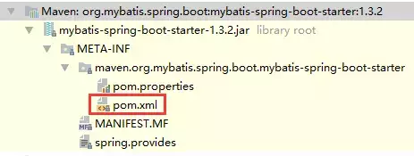
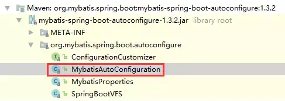
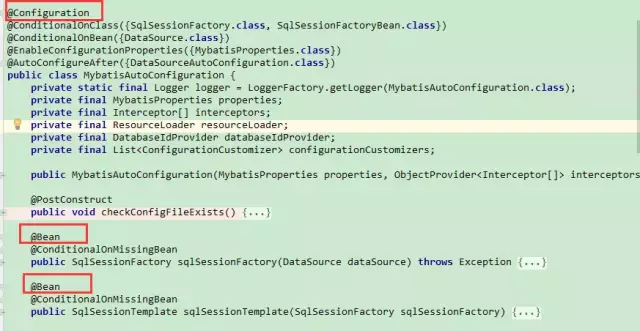
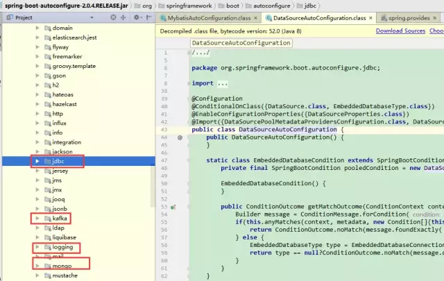

# 深入理解SpringBoot Starter 启动机制

原文：https://mp.weixin.qq.com/s/BQTCbi0yMLuFG3Yl5xqYDQ


## 一. 前言

Spring Boot 通过默认配置了很多框架的使用方式，帮助开发人员大大简化了项目初始化搭建以及开发过程。现在主要分析 Spring Boot 的自动装配。

首先回顾一下基于 Spring Framework 的一个 Web 项目的搭建过程：

1. pom.xml 文件中引入相关 jar 宝，包括 Spring、SpringMVC、redis、mybatis、log4j、mysql-connector-java 等等
2. 配置 web.xml、Listener 配置、Filter 配置、Servlet配置、log4j配置、error配置……
3. 配置数据库连接、Spring事务
4. 配置视图解析器
5. 开启注释、自动扫描功能
6. 配置完成后部署 tomcat，启动调试
7. ……

这些过程非常繁杂，且很容易出现错误。如果使用Spring Boot就会非常便捷。首先，从Spring Boot的起步依赖开始……

## 二. 起步依赖

### 2.1 pom 文件引入相关的 jar

```xml
<modelVersion>4.0.0</modelVersion>
   <parent>
       <groupId>org.springframework.boot</groupId>
       <artifactId>spring-boot-starter-parent</artifactId>
       <version>2.0.4.RELEASE</version>
       <relativePath /> <!-- lookup parent from repository -->
   </parent>
   <groupId>com.example</groupId>
   <artifactId>demo</artifactId>
   <version>0.0.1-SNAPSHOT</version>
   <name>demo</name>
   <description>Demo project for Spring Boot</description>

   <properties>
       <java.version>1.8</java.version>
   </properties>

   <dependencies>
       <dependency>
           <groupId>org.springframework.boot</groupId>
           <artifactId>spring-boot-starter-web</artifactId>
       </dependency>

       <dependency>
           <groupId>org.springframework.boot</groupId>
           <artifactId>spring-boot-starter-test</artifactId>
           <scope>test</scope>
       </dependency>

       <!--mybatis 开发包 -->
       <dependency>
           <groupId>org.mybatis.spring.boot</groupId>
           <artifactId>mybatis-spring-boot-starter</artifactId>
           <version>1.3.2</version>
       </dependency>
       <!--springboot web模块支持 -->
       <dependency>
           <groupId>org.springframework.boot</groupId>
           <artifactId>spring-boot-starter-web</artifactId>
       </dependency>
       <dependency>
           <groupId>mysql</groupId>
           <artifactId>mysql-connector-java</artifactId>
           <scope>runtime</scope>
       </dependency>
   </dependencies>

   <build>
       <plugins>
           <plugin>
               <groupId>org.springframework.boot</groupId>
               <artifactId>spring-boot-maven-plugin</artifactId>
           </plugin>
       </plugins>
   </build>
```

* Spring-boot-starter-web 包自动引入 web 模块开发需要的相关 Jar 包
* Mybatis-spring-boot-starter 自动引入 DAO 开发相关的 Jar 包
* Spring-boot-starter-xxx 是官方提供的 starter， xxx-spring-boot-starter 是第三方提供的 starter

下图是 mybatis-spring-boot-starter 的内容：



可以看出 mybatis-spring-boot-starter 并没有任何源码，只有一个 pom 文件，它的作用就是帮助开发人员引入其他的 Jar。

### 2.2 配置数据源

```yaml
spring:
 datasource:
    type: com.zaxxer.hikari.HikariDataSource
    url: jdbc:mysql://127.0.0.1:3306/mybatis_test
    username: root
    password: root
    driver-class-name: com.mysql.jdbc.Driver
    hikari:
     # 最小空闲连接数量
     minimum-idle: 5
     # 连接池最大连接数，默认是10
     maximum-pool-size: 60
     # 此属性控制从池返回的连接的默认自动提交行为,默认值：true
     auto-commit: true
     # 一个连接idle状态的最大时长（毫秒），超时则被释放（retired），缺省:10分钟
     idle-timeout: 600000
     # 此属性控制池中连接的最长生命周期，值0表示无限生命周期，默认1800000即30分钟
     max-lifetime: 1800000
     # 数据库连接超时时间,默认30秒，即30000
     connection-timeout: 60000
```

starter 机制帮助开发人员完成了项目起步所需要的相关 Jar 包。那么问题来了：传统的 Spring 应用中需要在 application.xml 中配置很多 bean，如 dataSource 的配置，transactionManager 的配置……， Sprint Boot 如何完成这些 Bean 的配置的呢？

## 三. 自动配置

### 3.1 基于 Java 代码的 Bean 配置

以 mybatis 为例，在2.1中的截图中，mybatis-spring-boot-starter 已经引入了 mybatis-spring-boot-autoconfigurre 这个包，如下图所示：



里面有 ***MybatisAutoConfiguration*** 这个类，这个类如下：



能看到熟悉的 @Configuration、@Bean 这两个注解。这两个注解一起使用，就可以创建一个基于 Java 代码的配置类，可以用来替代 XML 配置文件。

* **@Configuration**：被它注解的类可以看作是能生产让 Spring IoC 容器管理的 Bean 实例的工厂
* **@Bean**：带有 @Bean 注解的方法返回一个对象，该对象被注册到 Spring IoC 容器中

所以上面的 ***MybatisAutoConfiguration*** 类自动帮助开发人员生成了 SqlSessionFactory 这些 MyBatis 的重要实例并交给 Spring 容器管理，完成 Bean 的自动注册。

### 3.2 自动配置条件依赖

从 ***MybatisAutoConfiguration*** 这个类中使用的注解可以看出，要完成自动配置是有条件依赖的：

```java
@org.springframework.context.annotation.Configuration
@ConditionalOnClass({ SqlSessionFactory.class, SqlSessionFactoryBean.class })
@ConditionalOnBean(DataSource.class)
@EnableConfigurationProperties(MybatisProperties.class)
@AutoConfigureAfter(DataSourceAutoConfiguration.class)
public class MybatisAutoConfiguration {

 private static final Logger logger = LoggerFactory.getLogger(MybatisAutoConfiguration.class);

 private final MybatisProperties properties;

 private final Interceptor[] interceptors;

 private final ResourceLoader resourceLoader;

 private final DatabaseIdProvider databaseIdProvider;

 private final List<ConfigurationCustomizer> configurationCustomizers;
 ......
```

首先预习一下 Spring Boot 常用的条件依赖注解：

* **@ConditionalOnBean**：仅在当前上下文中存在某个 bean 时，才会实例化这个Bean
* **@ConditionalOnClass**：某个 class 位于类路径上，才会实例化这个 Bean
* **@ConditionalOnExpression**：当表达式为 true 时，才会实例化这个 Bean
* **@ConditionalOnMissingBean**：仅在当前上下文中不存在某个 Bean 时，才会实例化这个 Bean
* **@ConditionalOnMissingClass**：某个 class 在类路径上不存在时，才会实例化这个 Bean
* **@ConditionalOnNotWebApplication**：不是 Web 应用时才会实例化这个 Bean
* **@AutoConfigureAfter**：在某个 Bean 完成自动配置后实例化这个 Bean
* **@AutoConfigureBefore**：在某个 Bean 完成自动配置前实例化这个 Bean


所以，要完成 Mybatis 的自动配置，需要在路径中存在 SqlSessionFactory.class、SqlSessionFactoryBean.class 这两个类，需要存在 DataSource 这个 Bean 且这个 Bean 完成自动注册。

进入 ***DataSoureAutoConfiguration*** 这个类，可以看到这个类属于这个包：***org.springframework.boot.autoconfigure.jdbc*** ，这个包又属于 spring

-boot-autoconfigure-2.0.4.RELEASE.jar 这个包，自动配置这个包会自动引入 jdbc、kafka、logging、mail、mongo 等包。



### 3.3 Bean 参数的获取

Spring Boot 是如何读取 yml 文件或者 properties 文件中的配置信息来创建数据源的呢？ 在  ***DataSoureAutoConfiguration*** 类里，使用了 ***@EnableConfigurationProperties*** 这个注解：

```java
@Configuration
@ConditionalOnClass({ DataSource.class, EmbeddedDatabaseType.class })
@EnableConfigurationProperties(DataSourceProperties.class)
@Import({ DataSourcePoolMetadataProvidersConfiguration.class,
        DataSourceInitializationConfiguration.class })
public class DataSourceAutoConfiguration {

    @Configuration
    @Conditional(EmbeddedDatabaseCondition.class)
    @ConditionalOnMissingBean({ DataSource.class, 
                               XADataSource.class })
    @Import(EmbeddedDataSourceConfiguration.class)
    protected static class EmbeddedDatabaseConfiguration {

    }
......
```

DataSourceProperties 中封装了数据源的各个属性，且使用了注解 ConfigurationProperties 指定了配置文件的前缀：

```java
@ConfigurationProperties(prefix = "spring.datasource")
public class DataSourceProperties implements BeanClassLoaderAware, InitializingBean {

    private ClassLoader classLoader;

    /**
     * Name of the datasource. Default to "testdb" 
     * when using an embedded database.
     */
    private String name;

    /**
     * Whether to generate a random datasource name.
     */
    private boolean generateUniqueName;

    /**
     * Fully qualified name of the connection pool 
     * implementation to use. By default, it
     * is auto-detected from the classpath.
     */
    private Class<? extends DataSource> type;

    /**
     * Fully qualified name of the JDBC driver. 
     * Auto-detected based on the URL by default.
     */
    private String driverClassName;

    /**
     * JDBC URL of the database.
     */
    private String url;

    /**
     * Login username of the database.
     */
    private String username;

    /**
     * Login password of the database.
     */
    private String password;

    /**
     * JNDI location of the datasource. Class, url, 
     * username & password are ignored when
     * set.
     */
    private String jndiName;

    /**
     * Initialize the datasource with available DDL and DML scripts.
     */
    private DataSourceInitializationMode initializationMode = 
             DataSourceInitializationMode.EMBEDDED;

    /**
     * Platform to use in the DDL or DML scripts (such as schema-${platform}.sql or
     * data-${platform}.sql).
     */
    private String platform = "all";

    /**
     * Schema (DDL) script resource references.
     */
    private List<String> schema;

    /**
     * Username of the database to execute DDL scripts (if different).
     */
    private String schemaUsername;

    /**
     * Password of the database to execute DDL scripts (if different).
     */
    private String schemaPassword;

    /**
     * Data (DML) script resource references.
     */
    private List<String> data;

    ......
```

通过上述分析，可以得到：

* @ConfigurationProperties注解的作用是把 yml 或者 properties 配置文件转化为bean
* @EnableConfigurationProperties注解的作用是使@ConfigurationProperties注解生效。如果只配置@ConfigurationProperties注解，在spring容器中是获取不到yml或者properties配置文件转化的bean的

通过这种方式，把 yml 或者 properties 配置参数转化为 bean，这些 bean 又是如何被发现和加载的呢？

### 3.4 Bean的发现

Spring Boot 默认扫描启动类所在的包下的主类与子类的所有组件，但并没有包括依赖包中的类，那么依赖包中的 Bean 是如何被发现和加载的呢？

通常在启动类中加上 ***@SpringBootApplication*** 注解：

```java
@Target(ElementType.TYPE)
@Retention(RetentionPolicy.RUNTIME)
@Documented
@Inherited
@SpringBootConfiguration
@EnableAutoConfiguration
@ComponentScan(excludeFilters = {
        @Filter(type = FilterType.CUSTOM, classes = TypeExcludeFilter.class),
        @Filter(type = FilterType.CUSTOM, classes = AutoConfigurationExcludeFilter.class) })
public @interface SpringBootApplication {

    /**
     * Exclude specific auto-configuration classes such that 
     * they will never be applied.
     * @return the classes to exclude
     */
    @AliasFor(annotation = EnableAutoConfiguration.class)
    Class<?>[] exclude() default {};

    /**
     * Exclude specific auto-configuration class names 
     * such that they will never be
     * applied.
     * @return the class names to exclude
     * @since 1.3.0
     */
     ......
```

实际上重要的只有三个 Annotation：

* **@Configuration**
* **@EnableAutoConfiguration**：这个注解的功能很重要，借助 @Import 的支持，收集和注册依赖包中相关的bean定义
* **@ComponentScan**：自动扫描并加载符合条件的组件，比如 @Component 和 @Repository 等，最终将这些bean定义加载到spring容器中

```java
@Target(ElementType.TYPE)
@Retention(RetentionPolicy.RUNTIME)
@Documented
@Inherited
@AutoConfigurationPackage
@Import(AutoConfigurationImportSelector.class)
public @interface EnableAutoConfiguration {

    String ENABLED_OVERRIDE_PROPERTY 
        = "spring.boot.enableautoconfiguration";

    /**
     * Exclude specific auto-configuration classes 
     * such that they will never be applied.
     * @return the classes to exclude
     */
    Class<?>[] exclude() default {};

    /**
     * Exclude specific auto-configuration class names 
     * such that they will never be
     * applied.
     * @return the class names to exclude
     * @since 1.3.0
     */
    String[] excludeName() default {};
}
```

如上源码，@EnableAutoConfiguration 注解引入了 @AutoConfigurationPackage 和 @Import 这两个注解。 @AutoConfigurationPackage的作用就是自动配置的包，@Import导入需要自动配置的组件。

```java
@Target(ElementType.TYPE)
@Retention(RetentionPolicy.RUNTIME)
@Documented
@Inherited
@Import(AutoConfigurationPackages.Registrar.class)
public @interface AutoConfigurationPackage {
}
```

```java
/**
 * {@link ImportBeanDefinitionRegistrar} to store the base package from the importing
 * configuration.
 */
static class Registrar implements ImportBeanDefinitionRegistrar, DeterminableImports {

    @Override
    public void registerBeanDefinitions(AnnotationMetadata metadata,
            BeanDefinitionRegistry registry) {
        register(registry, 
                 new PackageImport(metadata).getPackageName());
    }

    @Override
    public Set<Object> determineImports(AnnotationMetadata metadata) {
        return Collections.singleton(new PackageImport(metadata));
    }
}
```

> new AutoConfigurationPackages.PackageImport(metadata)).getPackageName()
> new AutoConfigurationPackages.PackageImport(metadata)
>
> 这两行代码的作用就是加载启动类所在的包下的主类和子类的所有组件注册到 Spring 容器，这就是前文所说的 Spring Boot 默认扫描启动类所在的包下的主类与子类的所有组件。

搜集并注册到 Spring 容器的那些 Bean 来自哪里呢？

进入 ***AutoConfigurationImportSelector*** 类，可以发现 ***SpringFactoriesLoader.loadFactoryNames*** 方法调用 **loadingSpringFactories** 方法从所有的 jar 包中读取 META-INF/spring.factories 文件信息。

下面就是 spring-boot-autoconfigure 这个 jar 中 spring.factories 文件部分内容，其中有一个 key 是 org.springframework.boot.autoconfigure.EnableAutoConfiguration 的值定义了需要自动配置的 bean，通过读取这个配置获取一组 @Configuration 类：

```properties
org.springframework.boot.autoconfigure.AutoConfigurationImportListener=\
org.springframework.boot.autoconfigure.condition.ConditionEvaluationReportAutoConfigurationImportListener

# Auto Configuration Import Filters
org.springframework.boot.autoconfigure.AutoConfigurationImportFilter=\
org.springframework.boot.autoconfigure.condition.OnClassCondition

# Auto Configure
org.springframework.boot.autoconfigure.EnableAutoConfiguration=\
org.springframework.boot.autoconfigure.admin.SpringApplicationAdminJmxAutoConfiguration,\
org.springframework.boot.autoconfigure.aop.AopAutoConfiguration,\
org.springframework.boot.autoconfigure.amqp.RabbitAutoConfiguration,\
org.springframework.boot.autoconfigure.batch.BatchAutoConfiguration,\
org.springframework.boot.autoconfigure.cache.CacheAutoConfiguration,\
```

每个 xxxAutoConfiguration 都是一个基于 java 的 Bean 配置类。实际上，这些xxxAutoConfiguration 不是所有都会被加载，会根据 xxxAutoConfiguration 上的 @ConditionalOnClass 等条件判断是否被加载；通过反射机制将 spring.factories 中 @Configuration 类实例化为对应的 Java 实例。

好了，已经知道了Spring Boot 如何发现那些要自动配置的 Bean 了，现在就差如何将这些 Bean 加载到 Spring IoC 容器中了。

### 3.5 Bean 加载

如果要让一个普通类交给 Spring 容器管理，通常有以下的方法：

* @Configuration 与 @Bean 注解一起使用
* 使用 @Controller、@Service、@Respository、@Component 注解标注类，然后启用 @ComponentScan 自动扫描
* 使用 @import 方法

​        **Spring Boot 使用了 @Import 这个注解**

@EnableAutoConfiguration 注解中使用了 @Import({AutoConfigurationImportSelector.class}) 注解，AutoConfigurationImportSelector实现了 ***DeferredImportSelector*** 接口。

DeferredImportSelector 接口继承了继承了 ImportSelector 接口，ImortSelector 接口只有一个方法 ***selectImports***。

selectImports 方法返回一组 Bean，@EnableAutoConfiguration 注解借助 @Import 注解将这组 Bean 注入到 Spring 容器中，Spring Boot 正式通过这种机制来完成 Bean 的注入。

## 四. 总结

将自动配置的关键几步以及相应的注解总结如下：

- **@Configuration&与@Bean**：基于java代码的bean配置
- **@Conditional**XXX：设置自动配置条件依赖，筛选能被初始化并注入的Bean
- **@EnableConfigurationProperties与@ConfigurationProperties** ：读取配置文件转换为bean。
- **@EnableAutoConfiguration、@AutoConfigurationPackage 与@Import** ：实现bean发现与加载。

