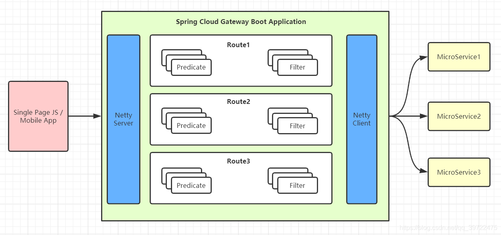
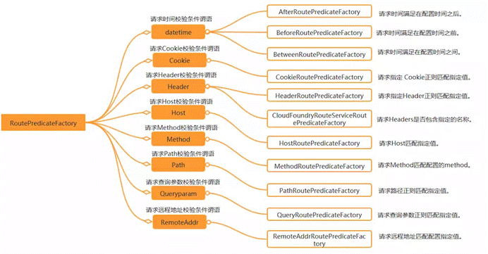

# SpringCloud Gateway

原文：https://www.cnblogs.com/crazymakercircle/p/11704077.html


​        SpringCloud Gateway 是基于 Spring5.0， SpringBoot 2.0 和 Project Reactor 等技术开发的网关。它旨在为微服务架构提供一种简单有效的统一的 API 路由管理方式。

​        SpringCloud Gateway 的目标是替代 Zuul，Gateway 是基于 WebFlux 框架实现的，而 WebFlux 框架底层则使用了高性能的 Reactor 模式通信框架 Netty。

​        SpringCloud Gateway的目标，不仅仅提供统一的路由方式，更是基于 Filter 链的方式提供了网关基本功能，如：安全、监控/指标、限流等。


## 一. SpringCloud Gateway 特征

​        SpringCloud 官方介绍中，罗列的这些 Gateway 的特征：

1. 基于 Spring Framework 5， Project Reactor 和 Sprint Boot 2.0
2. 集成 Hystrix 断路器
3. 集成 Spring Cloud DiscoveryClient
4. Predicates 和 Filters 作用于特定路由，易于编写的 Predicates 和 Filters
5. 具备一些网关的高级功能：动态路由、限流、路径重写

​        从以上的特征来说，和 Zuul 的特征差别不大，主要差别在于底层的通信框架上。

​        简要说明一下上面提到的三个术语：

1. Filter（过滤器）：

   和 Zuul 的过滤器在概念上类似，可以使用它拦截和修改请求，并且对上游的响应，进行二次处理。过滤器为 ***org.springframework.cloud.gateway.filter.GatewayFilter***

2. Route（路由）：

   网关配置的基本组成模块，和 Zuul 的路由配置模块类似。一个 Router 模块由一个 ID，一个目标 URI，一组断言和一组过滤器定义。如果断言为真，则路由匹配，目标 URI 会被访问

3. Predicate（断言）：

   这是一个 JDK 8 的 Predicate，可以使用它来匹配来自 HTTP 请求的任何内容，例如 headers 或者参数。断言的输入类型是一个 ***ServerWebExchagne***

## 二. SpringCloud Gateway 和架构

​        Spring 在 2017 年下半年开始提供 WebFlux，WebFlux 的出现为 Spring 带来了响应式编程。WebFlux 的响应式编程不仅仅是编程风格的改变，而且是对于一系列的著名框架都提供了响应式访问的开发包，包括 Netty、Redis 等。

​        SpringCloud Gateway 使用的 WebFlux 中的 reactor-netty 响应式编程组件，底层使用了 Netty 通讯框架。如下图所示：


### 2.1 SpringCloud Zuul 的 I/O 模型

​        Zuul 采用的是 Tomcat 容器，使用的是传统的 Servlet IO 处理模型。

​        servlet 由 servlet Container 进行生命周期管理。container 启动时，构造 servlet 对象并调用 servlet.init() 进行初始化；container 关闭时调用 servlet.destory() 销毁 servlet；container 运行时接受请求，并为每个请求分配一个线程（一般从线程池中获取空闲线程）然后调用 service()。

​        弊端：servlet 是一个简单的网络IO模型，当请求进入 servlet container 时，servlet container 就会为其绑定一个线程，在并发不高的场景下这种模型是适用的，但是一旦并发升高，线程数量就会上涨，而线程资源代价是昂贵的（上下文切换、内存消耗大），严重影响请求的处理时间。在一些简单的业务场景下，不希望为每个 request 分配一个线程，只需要 1 个或者几个线程就能应对极大的并发的请求。这种业务场景下 servlet 模型无法适应。


​        所以 SpringCloud Zuul 是基于 Servlet 之上的一个阻塞式处理模型，即Spring 实现了处理所有 request 请求的一个 servlet （DispatcherServlet），并由该 servlet 阻塞式处理业务。所以 Zuul 无法摆脱 Servlet 模型的弊端。

### 2.2 WebFlux服务器

​        WebFlux 模式替换了 servlet 线程模型。用少量的线程处理 request 和response 的 IO 操作，这些线程称为 **Loop 线程**。而业务交给响应式编程框架处理，响应式编程是非常灵活的，用户可以将业务中阻塞的操作提交到响应式框架的 **work 线程**中执行，而不阻塞的操作依然可以在 **Loop 线程**中进行处理，大大提高了 Loop 线程的利用率。下面是官方结构图：


​        WebFlux 虽然可以兼容多个底层的通信框架，但是一般情况下，底层使用的还是 Netty，毕竟 Netty 是目前 业界最高性能的通信框架。而 WebFlux 的 Loop 线程，正好就是著名的 Reactor 模式 IO 处理模型的 Reactor 线程，如果使用的是高性能的通信框架 Netty，这就是Netty的 EventLoop 线程。

### 2.3 SpringCloud Gateway的处理流程

​        客户端向 Gateway 发出请求，然后在 Gateway Handler Mapping 中找到与请求相匹配的路由，将其发送到 Gateway Web Handler。Handler 再通过指定的**过滤器链**将请求发送到实际的服务执行业务逻辑，然后返回。过滤器之间用虚线分开，是因为过滤器可能会在发送代理请求之前（pre）或之后（post）执行业务逻辑。


## 三. 路由配置方式

### 3.1 基础 URI 路由配置方式

​        如果请求的目标地址，是单个的 URI 资源路径，配置文件示例如下：

```yaml
server:
  port: 8080
spring:
  application:
    name: api-gateway
  cloud:
    gateway:
      routes:
        -id: url-proxy-1
          uri: https://blog.csdn.net
          predicates:
            -Path=/csdn
```

​        各个字段的含义如下：

* **id**：自定义的路由ID，**确保唯一**
* **uri**：目标服务地址
* **predicates**：路由条件，predicate 接受一个输入参数，返回一个布尔值。该接口包含多种默认方法来将 prodicate 组合成其它复杂的逻辑（如：与、或、非）

​        上面例子的含义：配置了一个 id 为 url-proxy-1 的 URI 代理规则，路由的规则是：

* 当访问地址 http://localhost:8080/csdn/1.jsp 时，会路由到上游地址 https://blog.csdn.net/1.jsp

### 3.2 基于代码的路由配置方式

​        转发功能同样可以通过代码来实现。可以在启动类 GatewayApplication 中添加方法 customRouteLocator() 来定制转发规则：

```java
package com.springcloud.gateway;
 
import org.springframework.boot.SpringApplication;
import org.springframework.boot.autoconfigure.SpringBootApplication;
import org.springframework.cloud.gateway.route.RouteLocator;
import org.springframework.cloud.gateway.route.builder.RouteLocatorBuilder;
import org.springframework.context.annotation.Bean;
 
@SpringBootApplication
public class GatewayApplication {
 
    public static void main(String[] args) {
        SpringApplication.run(GatewayApplication.class, args);
    }
 
    @Bean
    public RouteLocator customRouteLocator(
                    RouteLocatorBuilder builder) {
        return builder.routes()
                .route("path_route", r -> r.path("/csdn")
                .uri("https://blog.csdn.net"))
                .build();
    }
 
}
```

​        这段代码与在 yaml 配置文件中的配置有完全一样的效果。

### 3.3 和注册中心相结合的路由配置方式

​        在 URI 的 schema 协议部分，为自定义的 ***lb:类型***，表示从微服务注册中心（如Eureka）订阅服务，并且进行服务的路由。

​        一个典型的例子：

```yaml
server:
  port: 8084
spring:
  cloud:
    gateway:
      routes:
      -id: seckill-provider-route
        uri: lb://seckill-provider
        predicates:
        - Path=/seckill-provider/**

      -id: message-provider-route
        uri: lb://message-provider
        predicates:
        -Path=/message-provider/**

application:
  name: cloud-gateway

eureka:
  instance:
    prefer-ip-address: true
  client:
    service-url:
      defaultZone: http://localhost:8888/eureka/
```

​        注册中心相结合的路由配置方式，与单个 URI 的路由配置，区别其实很小，仅仅在与 URI 的 schema 协议不同。当个 URI 的地址的 schema 协议，一般为 http 或者 https。

## 四. 路由匹配规则

​        Gateway 的功能很强大，仅仅通过 predicates 的设计就可以看出来。前面的介绍只是使用了 predicates 进行了简单的条件匹配，其实 Gateway 内置了很多 Predicates 工能。

​        Gateway 是通过 WebFlux 的 HandlerMapping 作为底层支持来匹配到转发路由，Spring Cloud Gateway 内置了很多 Predicates 工厂，这些 Predicates 工厂通过不同的 HTTP 请求参数来匹配，多个 Predicates 工厂可以组合使用。



​        Gateway 的主要功能之一，就是转发请求，转发规则的定义主要包含三个部分：

| 功能       | 说明                                                         |
| ---------- | ------------------------------------------------------------ |
| Route      | 路由是网关的基础单元，由 ID、URI、一组 Predicates、一组 Filter 组成，根据 Predicate 进行匹配转发 |
| Predicates | 路由转发的判断条件，目前 Gateway 支持多种方式，常见如：Path、Query、Method、Header 等，写法必须遵循 key=value 的形式 |
| Filter     | 过滤器是路由转发请求时所经过的过滤逻辑，可用于修改请求，响应内容 |

其中，***Router 和 Predicate 必须同时申明***

​        示例：

```yaml
//通过配置文件配置
spring:
  cloud:
    gateway:
      routes:
        - id: gate_route
          uri: http://localhost:9023
          predicates:
          ## 当请求的路径为gate、rule开头的时，转发到http://localhost:9023服务器上
            - Path=/gate/**,/rule/**
        ### 请求路径前加上/app
          filters:
          - PrefixPath=/app
```

### 4.1 Predicate 断言条件（转发规则）介绍

​        Predicate 来源于 JDK 8，是 JDK 8 引入的一个函数。Predicate 接受一个输入参数，返回一个布尔值结果。该接口包含多种默认方法来将 Predicate 组合成其它复杂的逻辑（比如：与、或、非）。可以用于接口请求参数校验、判断新老数据是否有变化需要进行更新操作。

​        在 Gateway 中 Spring 利用 Predicate 的特性实现了各种路由匹配规则，有通过 Header、请求参数等不同的条件来进行作为条件匹配到对应的路由。下图总结了 Gateway 内置的各种 Predicate 的实现：



​        接下来介绍 Gateway 内置几种 Predicate 的使用。假定转发 URI 都设定为 http://localhost:9023

| 规则(Predicates) | 实例                                                         | 说明                                                         |
| ---------------- | ------------------------------------------------------------ | ------------------------------------------------------------ |
| Path             | - Path=/gate/,/rule/                                         | 当请求的路径为 gate、rule 开头的时候，转发到 http://localhost:9023 |
| Before           | - Before=2017-01-20T17:42:47.789-07:00[America/Denver]       | 在某个时间之前的请求才会转发到 http://localhost:9023         |
| After            | - After=2017-01-20T17:42:47.789-07:00[America/Denver]        | 在某个时间之后的请求才会转发                                 |
| Between          | \- Between=2017-01-20T17:42:47.789-07:00[America/Denver],2017-01-21T17:42:47.789-07:00[America/Denver] | 在某个时间段之间的才会被转发                                 |
| Cookie           | - Cookie=chocolate, ch.p                                     | 名为chacolate的表单或者满足正则ch.p的表单才会匹配到进行请求转发 |
| Header           | - Header=X-Request-Id, \d+                                   | 携带参数 X-Request-Id 或者满足 \d+ 的请求头才会匹配          |
| Host             | - Host=www.hd123.com                                         | 当主机名为 www.hd123.com 的时候直接转发                      |
| Method           | - Method=GET                                                 | 只有 GET 方法才会匹配转发请求，还可限定 POST、PUT 等方法     |

更多一些示例

#### 4.1.1 通过请求参数匹配

​        Query Route Predicate 支持传入两个参数，一个是属性名，一个是属性值。属性值可以是正则表达式。

```yaml
server:
  port: 8080
spring:
  application:
  	 name: api-gateway
  cloud:
    gateway:
      routes:
        -id: gateway-service
          uri: https://www.baidu.com
          order: 0
          predicates:
            -Query=smile
```

​        这样配置，只要请求中包含 smile 属性的参数即可匹配路由。例如：使用 curl 测试，输入 ***curl localhost:8080?smile=x&id=2***，URL 的查询参数中带有 *smile* ，则该请求会被赚转到baidu，不带 smile 的则不会匹配。

​        还可以将 Query 的值以键值对的方式进行配置，这样在请求过来时会对属性值和正则进行匹配，匹配上就会走路由：

```yaml
server:
  port: 8080
spring:
  application:
    name: api-gateway
  cloud:
    gateway:
      routes:
        -id: gateway-service
          uri: https://www.baidu.com
          order: 0
          predicates:
            -Query=keep, pu.
```

​        这样，只要请求中包含 ***keep*** 属性，**并且** 参数值是以 **pu** 开头的长度为三位的字符串才会进行匹配和路由。例如：使用curl 测试，输入 ***curl localhost:8080?keep=pub*** ，测试可以跳转到baidu，如果改成 ***curl localhost:8080?keep=pubx***，则提示404错误。

#### 4.1.2 通过 Header 属性匹配

​       Header Route Predicate 和 Cookie Route Predicate 一样，也接收 2 个参数，一个 header 中属性名称，另一个正则表达式。这个属性值和正则表达式都匹配上就执行路由：

```yaml
server:
  port: 8080
spring:
  application:
    name: api-gateway
  cloud:
    gateway:
      routes:
        -id: gateway-service
          uri: https://www.baidu.com
          order: 0
          predicates:
            - Header=X-Request-Id, \d+
```

​        使用 curl 测试，输入： ***curl hitp://localhost:8080 -H "X-Request-Id:88"***，则跳转到百度，如果改成 ***curl hitp://localhost:8080 -H "X-Request-Id:spring"***，则返回404

#### 4.1.3 通过 Cookie 匹配

​        Cookie Route Predicate 可以接收两个参数：一个是 Cookie 名字，另一个是正则表达式。路由规则会通过对应的 Cookie名称值和正则表达式来匹配。例如：

```yaml
server:
  port: 8080
spring:
  application:
    name: api-gateway
  cloud:
    gateway:
      routes:
        -id: gateway-service
          uri: https://www.baidu.com
          order: 0
          predicates:
            - Cookie=sessionId, test
```

使用curl测试，输入： ***curl http://locahost:8080 --cookie "sessionid=test"***，则转到baidu，如果去掉 --cookie "sessionid=test"，则返回 404

#### 4.1.4 通过 Host 匹配

​        Host Route Predicate 接收一组参数，一组匹配的域名列表，这个模版是一个 ant 分割的模版，用 . 号作为分隔符。它通过参数中的主机地址作为匹配规则

```yaml
server:
  port: 8080
spring:
  application:
    name: api-gateway
  cloud:
    gateway:
      routes:
        -id: gateway-service
          uri: https://www.baidu.com
          order: 0
          predicates:
            - Host=**.baidu.com
```

输入：

* curl http://localhost:8080 -H "Host:www.baidu.com"
* curl http://localhost:8080 -H "Host:md.baidu.com"

这两个都会匹配。如果去掉 host，则返回 404

#### 4.1.5 通过请求方式匹配

​        可以通过 POST、GET、PUT、DELETE 等不同的请求方式来进行匹配。

```yaml
server:
  port: 8080
spring:
  application:
    name: api-gateway
  cloud:
    gateway:
      routes:
        -id: gateway-service
          uri: https://www.baidu.com
          order: 0
          predicates:
            - Method=GET
```

测试：

* curl http://localhost:8080/

  匹配成功

* curl -X POST http://localhost:8080

  匹配失败，返回404

#### 4.1.6 通过请求路径匹配

​        Path Route Predicate 接收一个匹配路径的参数来判断是否走路由：

```yaml
server:
  port: 8080
spring:
  application:
    name: api-gateway
  cloud:
    gateway:
      routes:
        -id: gateway-service
          uri: https://www.baidu.com
          order: 0
          predicates:
            - Path=/foo/{segment}
```

测试：

* curl http://localhost:8080/foo/1

* curl http://localhost:8080/foo/xx

  上面两个请求都能转到baidu

* curl http://localhost:8080/boo/xx

  返回 404

#### 4.1.7 通过请求 IP 匹配

​        predicate 也支持通过设置某个 ip 区间号段的请求才会路由，RemoteAddr Route Predicate 接受 cidr 符号(IPv4 或 IPv6 )字符串的列表(最小大小为1)，例如 192.168.0.1/16 (其中 192.168.0.1 是 IP 地址，**16 是子网掩码**)。

```yaml
server:
  port: 8080
spring:
  application:
    name: api-gateway
  cloud:
    gateway:
      routes:
        -id: gateway-service
          uri: https://www.baidu.com
          order: 0
          predicates:
            - RemoteAddr=192.168.1.1/24
```

将此地址设置为本机的 ip 地址进行测试：

* curl localhost:8080

如果请求的远程地址是 192.168.1.10，则匹配上。

#### 4.1.8 组合使用

```yaml
server:
  port: 8080
spring:
  application:
    name: api-gateway
  cloud:
    gateway:
      routes:
        - id: gateway-service
          uri: https://www.baidu.com
          order: 0
          predicates:
            - Host=**.foo.org
            - Path=/headers
            - Method=GET
            - Header=X-Request-Id, \d+
            - Query=foo, ba.
            - Query=baz
            - Cookie=chocolate, ch.p
```

* 各种 Predicates 同时存在于同一个路由时，请求**必须同时满足所有**的条件才被这个路由匹配。

* 一个请求满足多个路由的断言条件时，请求只会被首个成功匹配的路由转发

### 4.2 过滤器规则（Filter）

| 过滤规则            | 实例                          | 说明                                                         |
| ------------------- | ----------------------------- | ------------------------------------------------------------ |
| PrefixPath          | - PrefixPath=/app             | 在请求路径前加上 app                                         |
| RewritePath         | - RewritePath=/test,/app/test | 访问localhost:9022/test，请求会转发到localhost:8001/app/test |
| SetPath             | SetPath=/app/{path}           | 通过模版设置路径，转发的规则时会在路径前增加app，{path}表示原请求路径 |
| RedirectTo          |                               | 重定向                                                       |
| RemoveRequestHeader |                               | 去掉某个请求头信息                                           |

注：当配置多个 filter 时，优先定义的会被调用，剩余的 filter 将不会生效。

#### 4.2.1 PrefixPath

```yaml
spring:
  cloud:
    gateway:
      routes:
      - id: prefixpath_route
        uri: https://example.org
        filters:
        - PrefixPath=/mypath
```

​        访问 /hello 的请求被发送到https://example.org/mypath/hello。

#### 4.2.2 RedirctTo

​        重定向，配置包含重定向的**返回码**和**地址**：

```yaml
spring:
  cloud:
    gateway:
      routes:
      - id: prefixpath_route
        uri: https://example.org
        filters:
        - RedirectTo=302, https://acme.org
```

#### 4.2.3 RemoveRequestHeader

​         去掉某个请求头信息：

```yaml
spring:
  cloud:
    gateway:
      routes:
      - id: removerequestheader_route
        uri: https://example.org
        filters:
        - RemoveRequestHeader=X-Request-Foo
```

去掉请求头信息 X-Request-Foo

#### 4.2.4 RemoveResponseHeader

​        去掉某个回执头信息：

```yaml
spring:
  cloud:
    gateway:
      routes:
      - id: removerequestheader_route
        uri: https://example.org
        filters:
        - RemoveResponseHeader=X-Request-Foo
```

#### 4.2.5 RemoveRequestParameter

​        去掉某个请求参数信息：

```yaml
spring:
  cloud:
    gateway:
      routes:
      - id: removerequestparameter_route
        uri: https://example.org
        filters:
        - RemoveRequestParameter=red
```

#### 4.2.6 RewritePath

​       改写路径：

```yaml
spring:
  cloud:
    gateway:
      routes:
      - id: rewrite_filter
        uri: http://localhost:8081
        predicates:
        - Path=/test/**
        filters:
        - RewritePath=/where(?<segment>/?.*), /test(?<segment>/?.*)
```

 /where/... 改成 /test/...

​        使用代码改写路径：

```java
RouteLocatorBuilder.Builder builder = routeLocatorBuilder.routes();
builder.route("path_rote_at_guigu", r -> r.path("/guonei")
       .uri("http://news.baidu.com/guonei"))
       .route("csdn_route", r -> r.path("/csdn")
       .uri("https://blog.csdn.net"))
       .route("blog3_rewrite_filter", r -> r.path("/blog3/**")
       .filters(f -> f.rewritePath("/blog3/(?<segment>.*)", "/$\\{segment}"))
       .uri("https://blog.csdn.net"))
       .route("rewritepath_route", r -> r.path("/baidu/**")
       .filters(f -> f.rewritePath("/baidu/(?<segment>.*)", "/$\\{segment}"))
       .uri("http://www.baidu.com"))
       .build();
```

#### 4.2.7 SetPath

​        设置请求路径，与RewritePath类似。

```yaml
spring:
  cloud:
    gateway:
      routes:
      - id: setpath_route
        uri: https://example.org
        predicates:
        - Path=/red/{segment}
        filters:
        - SetPath=/{segment}
```

如/red/blue的请求被转发到/blue。

#### 4.2.8 SetRequestHeader

​        设置请求头信息。

```yaml
spring:
  cloud:
    gateway:
      routes:
      - id: setrequestheader_route
        uri: https://example.org
        filters:
        - SetRequestHeader=X-Request-Red, Blue
```

#### 4.2.9 SetStatus

​        设置回执状态码。

```yaml
spring:
  cloud:
    gateway:
      routes:
      - id: setstatusint_route
        uri: https://example.org
        filters:
        - SetStatus=401
```

#### 4.2.10 StripPrefix

​        跳过指定路径

```yaml
spring:
  cloud:
    gateway:
      routes:
      - id: nameRoot
        uri: https://nameservice
        predicates:
        - Path=/name/**
        filters:
        - StripPrefix=2
```

请求/name/blue/red会转发到/red。

#### 4.2.11 RequestSize

​        请求大小。

```yaml
spring:
  cloud:
    gateway:
      routes:
      - id: request_size_route
        uri: http://localhost:8080/upload
        predicates:
        - Path=/upload
        filters:
        - name: RequestSize
          args:
            maxSize: 5000000
```

超过5M的请求会返回413错误。

#### 4.2.12 Default-filters

​        对所有请求添加过滤器

```yaml
spring:
  cloud:
    gateway:
      default-filters:
      - AddResponseHeader=X-Response-Default-Red, Default-Blue
      - PrefixPath=/httpbin
```


### 4.3 通过代码进行配置

​        通过代码进行配置，将路由规则设置为一个 Bean 即可：

```java
@Bean
public RouteLocator customRouteLocator(RouteLocatorBuilder builder) {
	return builder.routes()
			.route("path_route", r -> r.path("/get")
				.uri("http://httpbin.org"))
			.route("host_route", r -> r.host("*.myhost.org")
				.uri("http://httpbin.org"))
			.route("rewrite_route", r -> r.host("*.rewrite.org")
				.filters(f -> f.rewritePath("/foo/(?<segment>.*)", "/${segment}"))
				.uri("http://httpbin.org"))
			.route("hystrix_route", r -> r.host("*.hystrix.org")
				.filters(f -> f.hystrix(c -> c.setName("slowcmd")))
				.uri("http://httpbin.org"))
			.route("hystrix_fallback_route", r -> r.host("*.hystrixfallback.org")
				.filters(f -> f.hystrix(c -> c.setName("slowcmd").setFallbackUri("forward:/hystrixfallback")))
				.uri("http://httpbin.org"))
			.route("limit_route", r -> r
				.host("*.limited.org").and().path("/anything/**")
				.filters(f -> f.requestRateLimiter(c -> c.setRateLimiter(redisRateLimiter())))
				.uri("http://httpbin.org"))
			.build();
}
```


## 五. 实现熔断降级

​        为什么要实现熔断降级？

​        在分布式系统中，网关作为流量的入口，因此会有大量的请求进入网关，向其它服务发起调用，其它服务不可避免的会出现调用失败（超时、异常等等），失败时不能让请求堆积在网关上，需要快速失败并返回给客户端。想要实现这个需求，就必须在网关上做熔断、降级操作。

​        为什么在网关上请求失败需要快速返回给客户端？

​        因为当一个客户端请求发生故障时，这个请求会一直堆积在网关上，当然只有一个这种请求，网关肯定没问题，但是网关上堆积多了就会给网关乃至整个服务都造成巨大的压力，甚至整个服务宕机。因此要对一些服务和页面进行有策略的降级，一次缓解服务器资源的压力，以保证核心业务的正常运行，同时也保持了客户与大部分客户得到正确的响应。所以网关上请求失败需要快速返回客户端。

​        这里是一个配置示例：

```yaml
server.port: 8082
spring:
  application:
    name: gateway
  redis:
      host: localhost
      port: 6379
      password: 123456
  cloud:
    gateway:
      routes:
        - id: rateLimit_route
          uri: http://localhost:8000
          order: 0
          predicates:
            - Path=/test/**
          filters:
            - StripPrefix=1
            - name: Hystrix
              args:
                name: fallbackCmdA
                fallbackUri: forward:/fallbackA

hystrix.command.fallbackCmdA.execution.isolation.thread.timeoutInMilliseconds: 5000
```

​       这里的配置，使用了两个过滤器：

1. **StripPrefix**

   这个过滤器的作用是去掉请求路径的最前面 n 个部分截取掉。

   StripPrefix = 1，代表截取路径的个数为1，比如，前端发请求 /test/good/1/view，匹配成功后，路由到后端的请求路径就会变成 http://localhost:8000/good/1/view

2. **Hystrix**

   这个作用是通过 Hystrix 进行熔断降级。

   当上游的请求进入了 Hystrix 熔断降级机制时，就会调用 fallbackUri 配置的降级地址。需要注意的是，还需要单独设置 Hystrix 的 commandKey 的超时时间

   fallbackUri 配置的降级地址的代码如下：

   ```java
   package org.gateway.controller;
   
   import org.gateway.response.Response;
   import org.springframework.web.bind.annotation.GetMapping;
   import org.springframework.web.bind.annotation.RestController;
   
   @RestController
   public class FallbackController {
   
       @GetMapping("/fallbackA")
       public Response fallbackA() {
           Response response = new Response();
           response.setCode("100");
           response.setMessage("服务暂时不可用");
           return response;
       }
   }
   ```

   

## 六. 高级配置

### 6.1 分布式限流

​         从某种意义上讲，令牌桶算法时对漏桶算法的一种改进。桶算法能够限制请求调用的速率，而令牌桶算法能够在限制调用的平均速率的同时还允许一定程度的突发调用。在令牌桶算法中，存在一个桶，用来存放固定数量的令牌。算法中存在一种机制，**以一定的速率往桶中放令牌**。每次请求调用需要先获取令牌，只有拿到令牌，才有机会继续执行，否则选择选择等待可用的令牌、或者直接拒绝。放令牌这个动作是持续不断的进行，**如果桶中令牌数达到上限，就丢弃令牌**，所以就存在这种情况，**桶中一直有大量的可用令牌**，这时进来的请求就可以直接拿到令牌执行，比如设置qps为100，那么限流器初始化完成一秒后，桶中就已经有100个令牌了，这时服务还没完全启动好，等启动完成对外提供服务时，该限流器可以抵挡瞬时的100个请求。所以，只有桶中没有令牌时，请求才会进行等待，最后相当于以一定的速率执行。


​        在 Gateway 中， 有 Filter 过滤器，因此可以在 “pre” 类型的 Filter 中自行实现上述三种过滤器。但是限流作为网关最基本的功能，Gateway 官方就提供了 ***RequestRateLimiterGatewayFilterFactory*** 这个类，适用在 Redis 内的通过执行 Lua 脚本实现了令牌桶的方式。具体逻辑在 ***RequestRateLimiterGatewayFilterFactory*** 类中，lua 脚本在这个位置：


​        首先在工程的pom文件中引入gateway的起步依赖和redis的reactive依赖，然后配置如下：

```yaml
server:
  port: 8081
spring:
  cloud:
    gateway:
      routes:
      - id: limit_route
        uri: http://httpbin.org:80/get
        predicates:
        - After=2017-01-20T17:42:47.789-07:00[America/Denver]
        filters:
        - name: RequestRateLimiter
          args:
            key-resolver: '#{@userKeyResolver}'
            redis-rate-limiter.replenishRate: 1
            redis-rate-limiter.burstCapacity: 3
  application:
    name: cloud-gateway
  redis:
    host: localhost
    port: 6379
    database: 0
```

​        上面这个配置，指定程序端口为 8081，配置了 Redis，并配置了 ***RequestRateLImiter*** 的限流过滤器，该过滤器需要配置三个参数：

* burstCapacity：令牌桶总容量

* replenishRate：令牌桶每秒填充平均速率

* key-resolver：用于限流的键的解析器的 Bean 对象的名字。它使用 SpEL 表达式 根据 #{@beanName} 从 Spring 容器中获取 Bean 对象

  

​        这里根据用户 ID 限流，请求路径中必须携带 userId 参数：

```java
@Bean
public KeyResolver userKeyResolver() {
    return exchange -> Mono.just(exchange.getRequest().getQueryParams().getFirst("user"));
}
```

​        KeyResolver 需要实现 resolve 方法，比如根据 userid 进行限流，则需要用 userid 去判断。实现完 KeyResolver 之后，需要将这个类的 Bean 注册到Ioc容器中

​        如果需要根据 IP 限流，定义的获取限流 Key 的 bean 为：        

```java
@Bean
public KeyResolver ipKeyResolver() {
    return exchagne -> Mono.just(exchagne.getRequest().getRemoteAddress().getHostName());
}
```

通过exchange对象可以获取到请求信息，这边用了HostName。

​        如果需要根据接口的URI进行限流，则需要获取请求地址的 uri 作为限流key，定义的Bean对象为：

```java
 
@Bean
public KeyResolver apiKeyResolver() {
  return exchange -> Mono.just(exchange.getRequest().getPath().value());
}
```


### 6.2 健康检查配置

​        admin-client、actuator健康检查配置，为之后的功能提供支持，此部分比较简单，不再赘述，加入以下maven依赖和配置。

* Maven依赖

  ```xml
    <dependency>
          <groupId>org.springframework.boot</groupId>
          <artifactId>spring-boot-starter-actuator</artifactId>
   </dependency>
  <dependency>
          <groupId>de.codecentric</groupId>
          <artifactId>spring-boot-admin-starter-client</artifactId>
          <version>2.1.0</version>
      </dependency>
  <dependency>
          <groupId>org.springframework.cloud</groupId>
          <artifactId>spring-cloud-starter-netflix-eureka-client</artifactId>
      </dependency>
  ```

  

* 配置文件

  ```yaml
  spring:
    application:
      name: mas-cloud-gateway
    boot:
      admin:
        client:
        ### 本地搭建的admin-server
          url: http://localhost:8011
  eureka:
    client:
      registerWithEureka: true
      fetchRegistry: true
      healthcheck:
        enabled: true
      serviceUrl:
        defaultZone: http://localhost:6887/eureka/
      enabled: true
  feign:
    sentinel:
      enabled: true
  management:
    endpoints:
      web:
        exposure:
          include: '*'
    endpoint:
      health:
        show-details: ALWAYS
  ```

  若转发的目标地址为微服务中组件，不为具体ip:port形式的，应写成lb://mas-openapi-service形式，目标地址会从注册中心直接拉取

### 6.3 统一配置跨域请求

​        现在的请求通过经过gateWay网关时，需要在网关统一配置跨域请求，需求所有请求通过：

```yaml
spring:
  cloud:
    gateway:
      globalcors:
        cors-configurations:
          '[/**]':
            allowed-origins: "*"
            allowed-headers: "*"
            allow-credentials: true
            allowed-methods:
              - GET
              - POST
              - DELETE
              - PUT
              - OPTION
```

## 七. 整合 Nacos

### 7.1 Maven 依赖

### 7.2 服务发现配置

### 7.3 nacos 实现动态配置

## 八. 整合 Swagger

### 8.1 Maven 依赖

### 8.2 配置文件

## 九. Gateway 的过滤器开发

### 9.1 过滤器的执行次序

​        Gateway 基于过滤器实现，同Zuul类似，有 **pre** 和 **post** 两种方式的 filter，分别处理 **前置逻辑** 和 **后置逻辑**。客户端的请求先经过 pre 类型的 filter，然后将请求转发到具体的业务服务，收到业务服务的响应之后，再经过 post 类型的 filter处理，最后返回响应到客户端。

​        过滤器执行流程如下，**order 越大，优先级越低**：


​        过滤器可以分为 **全局过滤器** 和 **局部过滤器**。

* 全局过滤器：1. 多所有路由生效； 2. 接口耗时统计
* 局部过滤器：对指定路由生效

### 9.2 定义全局过滤器

​        实现 ***GlobalFilter*** 和 ***Ordered***，重写相关方法，加入到 Spring 容器管理即可，无需配置，全局过滤器对所有的路由都有效。

​        全局过滤器举例：

```java
package com.crazymaker.cloud.nacos.demo.gateway.config;

import lombok.extern.slf4j.Slf4j;
import org.springframework.cloud.gateway.filter.GatewayFilterChain;
import org.springframework.cloud.gateway.filter.GlobalFilter;
import org.springframework.context.annotation.Bean;
import org.springframework.context.annotation.Configuration;
import org.springframework.core.Ordered;
import org.springframework.core.annotation.Order;
import org.springframework.web.server.ServerWebExchange;
import reactor.core.publisher.Mono;

@Configuration
public class FilterConfig
{

    @Bean
    @Order(-1)
    public GlobalFilter a()
    {
        return new AFilter();
    }

    @Bean
    @Order(0)
    public GlobalFilter b()
    {
        return new BFilter();
    }

    @Bean
    @Order(1)
    public GlobalFilter c()
    {
        return new CFilter();
    }


    @Slf4j
    public class AFilter implements GlobalFilter, Ordered
    {

        @Override
        public Mono<Void> filter(ServerWebExchange exchange, GatewayFilterChain chain)
        {
            log.info("AFilter前置逻辑");
            return chain.filter(exchange).then(Mono.fromRunnable(() ->
            {
                log.info("AFilter后置逻辑");
            }));
        }

        //   值越小，优先级越高
//    int HIGHEST_PRECEDENCE = -2147483648;
//    int LOWEST_PRECEDENCE = 2147483647;
        @Override
        public int getOrder()
        {
            return HIGHEST_PRECEDENCE + 100;
        }
    }

    @Slf4j
    public class BFilter implements GlobalFilter, Ordered
    {
        @Override
        public Mono<Void> filter(ServerWebExchange exchange, GatewayFilterChain chain)
        {
            log.info("BFilter前置逻辑");
            return chain.filter(exchange).then(Mono.fromRunnable(() ->
            {
                log.info("BFilter后置逻辑");
            }));
        }


        //   值越小，优先级越高
//    int HIGHEST_PRECEDENCE = -2147483648;
//    int LOWEST_PRECEDENCE = 2147483647;
        @Override
        public int getOrder()
        {
            return HIGHEST_PRECEDENCE + 200;
        }
    }

    @Slf4j
    public class CFilter implements GlobalFilter, Ordered
    {

        @Override
        public Mono<Void> filter(ServerWebExchange exchange, GatewayFilterChain chain)
        {
            log.info("CFilter前置逻辑");
            return chain.filter(exchange).then(Mono.fromRunnable(() ->
            {
                log.info("CFilter后置逻辑");
            }));
        }
        //   值越小，优先级越高
//    int HIGHEST_PRECEDENCE = -2147483648;
//    int LOWEST_PRECEDENCE = 2147483647;
        @Override
        public int getOrder()
        {
            return HIGHEST_PRECEDENCE + 300;
        }
    }
}
```


### 9.3 定义局部过滤器

​        步骤：

1. 实现 GatewayFilter，Ordered，实现相关方法
2. 加入到过滤器工厂，并且注册到Spring 容器中
3. 在配置文件中配置，如果不配置则不启动此过滤器

​        局部过滤器举例，对请求头部的 user-id 进行校验，代码如下：

1. 第一步：

   ```java
   package com.crazymaker.cloud.nacos.demo.gateway.filter;
   
   import lombok.extern.slf4j.Slf4j;
   import org.apache.commons.lang3.StringUtils;
   import org.springframework.cloud.gateway.filter.GatewayFilter;
   import org.springframework.cloud.gateway.filter.GatewayFilterChain;
   import org.springframework.cloud.gateway.filter.GlobalFilter;
   import org.springframework.core.Ordered;
   import org.springframework.http.HttpStatus;
   import org.springframework.stereotype.Component;
   import org.springframework.web.server.ServerWebExchange;
   import reactor.core.publisher.Mono;
   
   //@Component
   @Slf4j
   public class UserIdCheckGateWayFilter implements GatewayFilter, Ordered
   {
       @Override
       public Mono<Void> filter(ServerWebExchange exchange, GatewayFilterChain chain)
       {
           String url = exchange.getRequest().getPath().pathWithinApplication().value();
           log.info("请求URL:" + url);
           log.info("method:" + exchange.getRequest().getMethod());
          /*   String secret = exchange.getRequest().getHeaders().getFirst("secret");
           if (StringUtils.isBlank(secret))
           {
               return chain.filter(exchange);
           }*/
            //获取param 请求参数
           String uname = exchange.getRequest().getQueryParams().getFirst("uname");
           //获取header
           String userId = exchange.getRequest().getHeaders().getFirst("user-id");
           log.info("userId：" + userId);
   
           if (StringUtils.isBlank(userId))
           {
               log.info("*****头部验证不通过，请在头部输入  user-id");
               //终止请求，直接回应
               exchange.getResponse().setStatusCode(HttpStatus.NOT_ACCEPTABLE);
               return exchange.getResponse().setComplete();
           }
           return chain.filter(exchange);
       }
   
       //   值越小，优先级越高
   //    int HIGHEST_PRECEDENCE = -2147483648;
   //    int LOWEST_PRECEDENCE = 2147483647;
       @Override
       public int getOrder()
       {
           return HIGHEST_PRECEDENCE;
       }
   }
   ```

2. 第二步：

   ```java
   package com.crazymaker.cloud.nacos.demo.gateway.config;
   
   import com.crazymaker.cloud.nacos.demo.gateway.filter.UserIdCheckGateWayFilter;
   import org.springframework.cloud.gateway.filter.GatewayFilter;
   import org.springframework.cloud.gateway.filter.factory.AbstractGatewayFilterFactory;
   import org.springframework.stereotype.Component;
   
   
   @Component
   public class UserIdCheckGatewayFilterFactory extends AbstractGatewayFilterFactory<Object>
   {
       @Override
       public GatewayFilter apply(Object config)
       {
           return new UserIdCheckGateWayFilter();
       }
   }
   ```

   

3. 第三步：

   ```yaml
           - id: service_provider_demo_route_filter
             uri: lb://service-provider-demo
             predicates:
               - Path=/filter/**
             filters:
               - RewritePath=/filter/(?<segment>.*), /provider/$\{segment}
               - UserIdCheck
   ```

   

## 十. 整合 Sentinel 完成流控和降级

### 10.1 Maven 依赖

### 10.2 配置文件

### 10.3 限流规则通用配置

### 10.4 限流规则设置

### 10.5 网关限流参数

