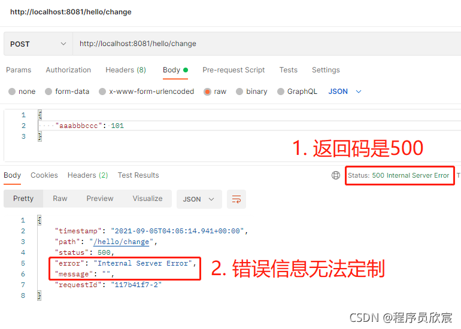
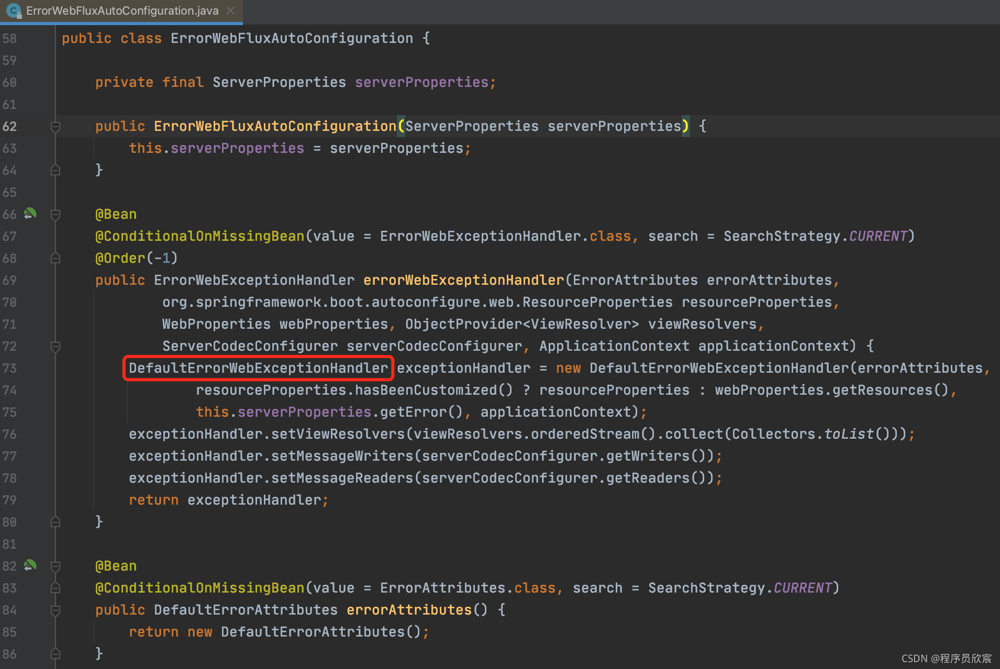
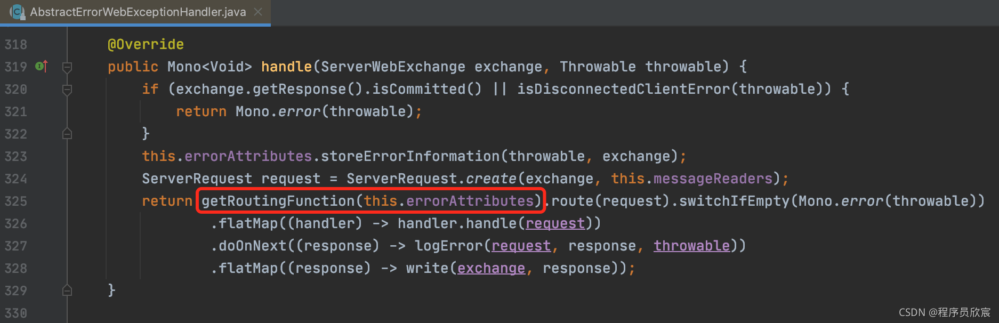

## Spring Cloud Gateway 过滤器精确控制一场返回

原文：https://www.toutiao.com/article/7190934684359295543/?log_from=1bbce68d0a86d8_1674534137564


[《Spring Cloud Gateway 修改请求和相应 Body 的内容》](./SpringCloud_Gateway_ResAndResp.md) 介绍了通过filter成功修改请求body的内容。但是filter中如果发生了异常（例如请求参数不合法），抛出异常信息的时候，调用方收到的返回码和body都是Spring Cloud Gateway框架处理后的，调用方无法根据这些内容知道真正的错误原因，如下图：



现在就来分析上面现象的原因，通过阅读源码搞清楚返回码和响应body生成的具体逻辑。

### 提前小结

1. Spring Cloud Gateway应用中，有个ErrorAttributes类型的bean，它的 getErrorAttributes 方法返回了一个map
2. 应用抛出异常时，返回码来自上述map的status的值，返回body是整个map序列化的结果
3. 默认情况下 ErrorAttributes 的实现类是 DefaultErrorAttributes

那么，map中的status值（也就是response的返回码），在DefaultErrorAttributes是如何生成的呢？

1. 先看异常对象是不是ResponseStatusException类型
2. 如果是ResponseStatusException类型，就调用异常对象的getStatus方法作为为返回值
3. 如果不是 ResponseStatusException 类型，再看异常类有没有ResponseStatus注解
4. 如果有，就取注解的code属性作为返回值
5. 如果异常对象既不是 ResponseStatusException 类型，也没有 ResponseStatus注解，就返回500

最后，看看map的message字段（也就是response body的message字段），在DefaultErrorAttributes是如何生成的：

1. 异常对象是不是 BindingResult 类型
2. 如果不是 BindingResult 类型，就看是不是 ResponseStatusException类型
3. 如果是，就用getReason作为返回值
4. 如果也不是 ResponseStatusException类型，就看异常类有没有 ResponseStatus 注解，如果有就取该注解的 reason 属性作为返回值
5. 如果通过注解取得的 reason 也无效，就返回异常的getMessage字段

### Spring Cloud Gateway 错误处理源码

* 首先看的是配置类 ErrorWebFluxAutoConfiguration.java，这里面向 Spring 注册了两个实例，每个都非常重要，先关注第一个，也就是说 ErrorWebExceptionHandler 的实现类是 DefaultErrorWebExceptionHandler：

  

* 处理异常时，会通过FluxOnErrorResume调用到这个 ErrorWebExceptionHandler 的 handle 方法，该方法在其父类 AbstractErrorWebExceptionHandler.java 中，如下图红框位置的代码是关键，异常返回内容就在这里决定的：

  

* 展开这个 getRoutingFunction 方法，可以看见会调用 renderErrorResponse 来处理：

  ```java
  @Override
  protected RouterFunction<ServerResponse> getRoutingFunction(ErrorAttributes errorAttributes) {
      return route(acceptsTextHmtl(), 
                   this::renderErrorView).andRoute(all(),
                   this::renderErrorResponse);
  }
  ```

* 打开 renderErrorResponse方法，如下所示：

  ```java
  protected Mono<ServerResponse> renderErrorResponse(ServerRequest request) {
      // 取出所有错误信息
      Map<String, Object> error = getErrorAttributes(request, getErrorAttributeOptions(request, MediaType.ALL));
      // 构造返回的所有信息
      return ServerResponse
          .status(getHttpStatus(error)) // 控制返回码
          .contentType(MediaType.APPLICATION_JSON) // 控制ContentType
          .body(BodyInserters.fromValue(error)); // 控制返回内容
  }
  ```

  

* 通过上面代码，可到两个重要结论：

  1. 返回给调用方的状态码，取决于 getHttpStatus方法的返回值
  2. 返回给调用方的body，取决于 error 的内容

* 再看看 getHttpStatus的内容，如下所示，status来自入参：

  ```java
  protected int getHttpStatus(Map<String, Object> errorAttributes) {
      return (int) errorAttributes.get("status");
  }
  ```

  

* 至此可以得到一个结论：getErrorAttributes方法的返回值是决定返回码和返回body的关键

* 再看看 getErrorAttributes 方法，在 DefaultErrorAttributes.java 中：

  ```java
  public Map<String, Object> getErrorAttributes(ServerRequest request, ErrorAttributeOptions options) {
          Map<String, Object> errorAttributes = this.getErrorAttributes(request, options.isIncluded(Include.STACK_TRACE));
          if (Boolean.TRUE.equals(this.includeException)) {
              options = options.including(new Include[]{Include.EXCEPTION});
          }
  
          if (!options.isIncluded(Include.EXCEPTION)) {
              errorAttributes.remove("exception");
          }
  
          if (!options.isIncluded(Include.STACK_TRACE)) {
              errorAttributes.remove("trace");
          }
  
          if (!options.isIncluded(Include.MESSAGE) && errorAttributes.get("message") != null) {
              errorAttributes.put("message", "");
          }
  
          if (!options.isIncluded(Include.BINDING_ERRORS)) {
              errorAttributes.remove("errors");
          }
  
          return errorAttributes;
      }
  ```

  

* 得到结论：

  1. 返回码来自 determineHttpStatus的返回
  2. message字段来自 determineMessage的返回

* 打开 determineHttpStatus方法，看到真正的核心：

  ```java
  private HttpStatus determineHttpStatus(Throwable error, MergedAnnotation<ResponseStatus> responseStatusAnnotation) {
          // 异常对象是不是ResponseStatusException类型
          return error instanceof ResponseStatusException 
          // 如果是ResponseStatusException类型，就调用异常对象的getStatus方法作为返回值
          ? ((ResponseStatusException)error).getStatus() 
          // 如果不是ResponseStatusException类型，再看异常类有没有ResponseStatus注解，
          // 如果有，就取注解的code属性作为返回值
          : (HttpStatus)responseStatusAnnotation.getValue("code", HttpStatus.class)
          // 如果异常对象既不是ResponseStatusException类型，也没有ResponseStatus注解，就返回500
          .orElse(HttpStatus.INTERNAL_SERVER_ERROR);
      }
  ```

  

* 另外，message字段的内容也确定了：

  ```java
  private String determineMessage(Throwable error, MergedAnnotation<ResponseStatus> responseStatusAnnotation) {
          // 异常对象是不是BindingResult类型
          if (error instanceof BindingResult) {
              // 如果是，就用getMessage作为返回值
              return error.getMessage();
          } 
          // 如果不是BindingResult类型，就看是不是ResponseStatusException类型
          else if (error instanceof ResponseStatusException) {
              // 如果是，就用getReason作为返回值
              return ((ResponseStatusException)error).getReason();
          } else {
              // 如果也不是ResponseStatusException类型，
              // 就看异常类有没有ResponseStatus注解，如果有就取该注解的reason属性作为返回值
              String reason = (String)responseStatusAnnotation.getValue("reason", String.class).orElse("");
              if (StringUtils.hasText(reason)) {
                  return reason;
              } else {
                  // 如果通过注解取得的reason也无效，就返回异常的getMessage字段
                  return error.getMessage() != null ? error.getMessage() : "";
              }
          }
      }
  ```

  

* 完结。