## Spring Cloud Gateway 修改请求和相应 Body 的内容


原文：https://www.toutiao.com/article/7190642750172168744/


首先是修改请求body，如下图，浏览器是请求发起方，真实参数只有user-id，经过网关时被塞入字段user-name，于是，后台服务收到的请求就带有user-name字段：

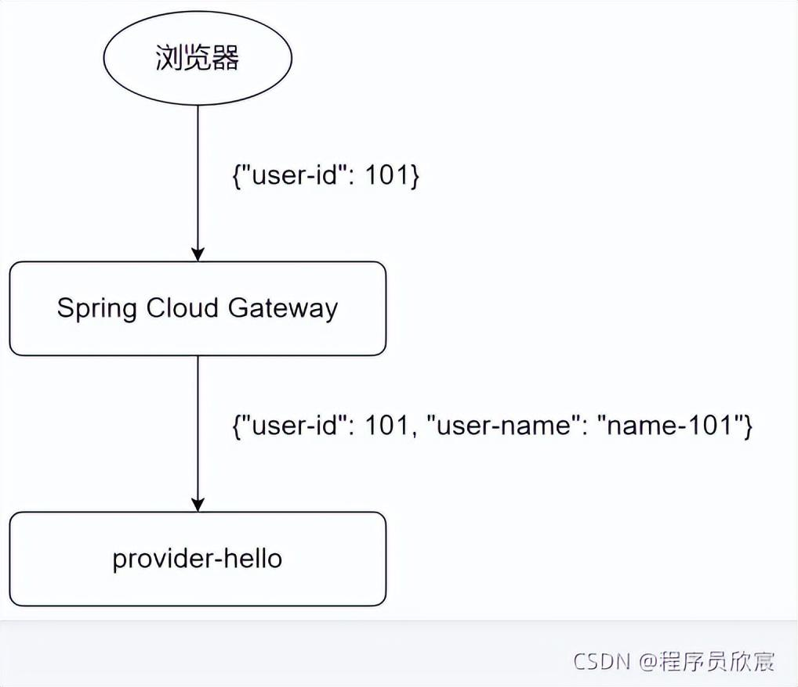

其次是修改响应，如下图，服务提供方provider-hello的原始响应只有response-tag字段，经过网关时被塞入了gateway-response-tag字段，最终浏览器收到的响应就是response-tag和gateway-response-tag两个字段：

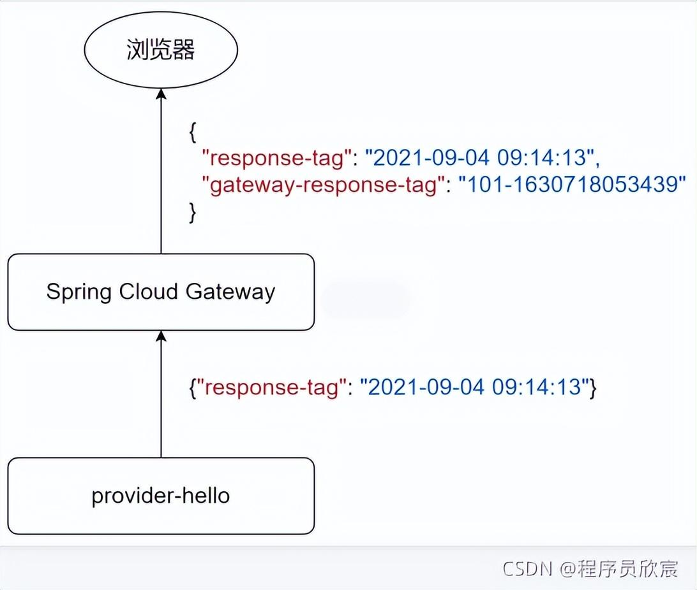

总的来说，具体如下：

1. 准备工作，在服务提供者的代码中新增一个web接口，用于验证 Gateway 的操作是否有效
2. 介绍修改请求body和响应body的套路
3. 按套路开发一个过滤器（Filter），用于修改请求的body
4. 按套路开发一个过滤器（Filter），用于修改响应的body
5. 思考和尝试：如何从Gateway返回错误？

在实战过程中，顺便搞清楚两个问题：

1. 代码配置路由时，如何给一个路由添加多个filter？
2. 代码配置路由和yml配置是否可以混搭，两者有冲突吗？

###  源码

* 本篇实战中的完整源码可在GitHub下载到，地址和链接信息如下表所示(https://github.com/zq2599/blog_demos)：

* 这个git项目中有多个文件夹，本篇的源码在spring-cloud-tutorials文件夹下，如下图红框所示：

  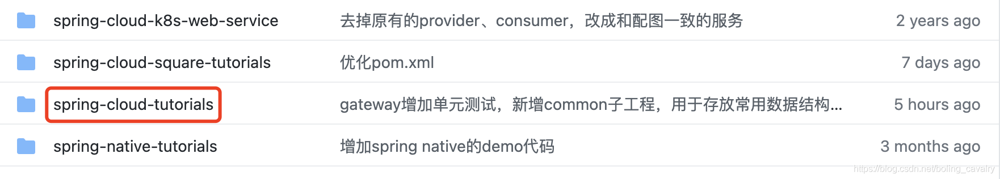

* spring-cloud-tutorials文件夹下有多个子工程，本篇的代码是gateway-change-body，如下图红框所示：

  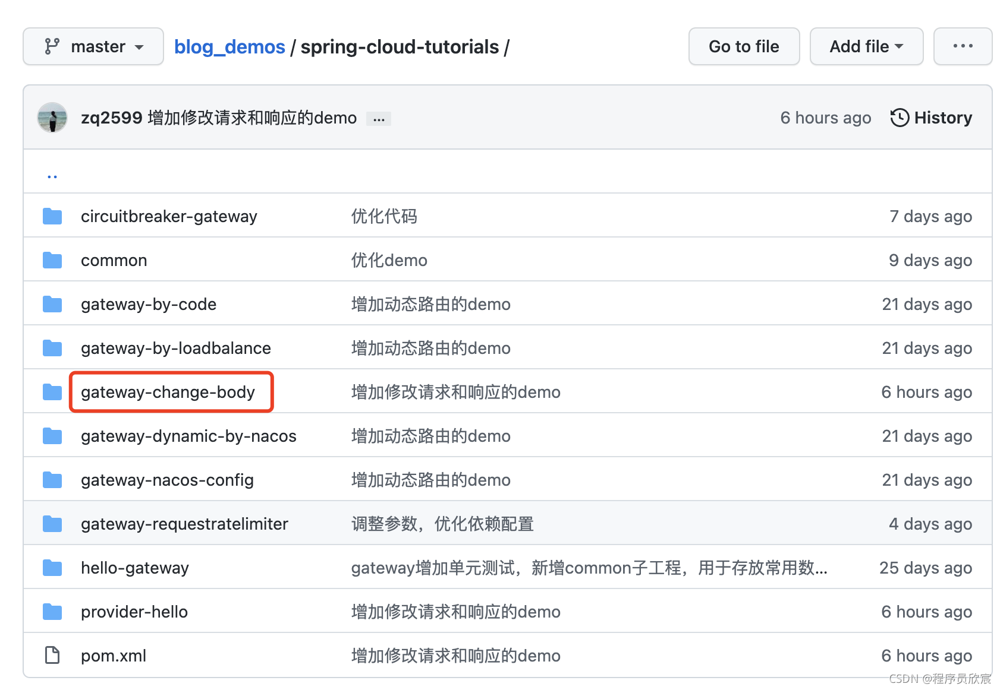


### 准备工作

* 为了观察Gateway能否按照预期去修改请求和响应的body，需要给服务提供者 provider-hello 增加一个接口，代码在 Hello.java 中，如下：

  ```java
  @PostMaping("/change")
  public Map<String, Object> change(@RequestBody Map<String, Object> map) {
      map.put("response-tag", dateStr());
      return map;
  }
  ```

  

* 可见新增的web接口很简单：将收到的请求数据作为返回值，在里面添加了一个键值对，然后返回给请求方，有了这个接口，咱们就能通过观察返回值来判断Gateway对请求和响应的操作是否生效

* 启动nacos（微服务的服务注册服务）

* 在运行provider-hello应用，用postman向其发请求，如下图所示，符合预期：

  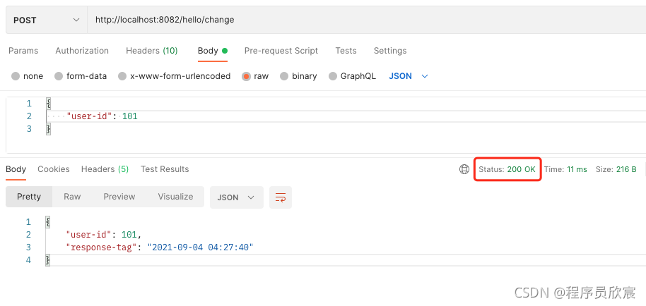

### 修改请求Body的套路

套路如下：

1. 修改请求body是通过自定义filter实现的

2. 配置路由及其filter的时候，有yml配置文件和代码配置两种方案。官方文档给出的demo是代码配置的，这里也采用代码方式

3. 在代码配置路由的时候，调用filter方法，该方法的入参是个lambda表达式

4. 此 lambda 表达式固定调用 modifyRequestBody 方法，只要定义好 modifyRequestBody 方法的三个入参即可

5. modifyRequestBody 方法的第一个入参是输入类型

6. 第二个入参是返回类型

7. 第三个是 RewriteFunction 接口的实现，这个代码需要根据业务编写，内容是将输入数据转化为返回类型数据具体逻辑。先看看官方Demo：

   ```java
   @Bean
   public RouteLocator routes(RouteLocatorBUilder builder) {
       return builder.routes()
           .route("rewrite_request_obj", r -> r.host("*.rewritequestobj.org")
           .filters(f -> f.prefixPath("/httpbin")
           .modifyRequestBody(String.class, Hello.class, MediaType.APPLICATION_JSON_VALUE, (exchange, s) -> return Mono.just(new Hello(s.toUpperCase())))).uri(uri)).build();
   }
   ```

### 修改响应Body的套路

套路如下：

1. 通过代码来配置路由和过滤器

2. 在代码配置路由的时候，调用filter方法，该方法的入参是个lambda表达式

3. 此 lambda 表达式固定调用modifyResponseBody方法，只要定义好modifyResponseBody方法的三个入参即可

4. modifyResponseBody方法的第一个入参是输入类型

5. 第二个入参是返回类型

6. 第三个是 RewriteFunction接口的实现，需要根据业务自行编写，内容是将输入数据转换为返回类型数据具体逻辑。看看官方Demo：

   ```java
   @Bean
   public RouteLocator routes(RouteLocatorBuilder builder) {
       return builder.routers()
           .route("rewrite_response_upper", r-> r.host("*.rewriteresponseupper.org")
           .filters(f -> f.prefixPath("/httpbin")
           .modifyResponseBody(String.class, String.class, (exchagne, s) -> Mono.just(s.toUpperCase()))).uri(uri))
           .build();
   }
   ```

   

### 按套路开发一个修改请求body的过滤器（filter）

在父工程spring-cloud-tutorials下新建子工程gateway-change-body，pom.xml无任何特殊之处，注意依赖spring-cloud-starter-gateway即可。

* SpringCloud微服务工程启动类：

  ```java
  package com.bolingcavalry.changebody;
  
  import org.springframework.boot.SpringApplication;
  import org.springframework.boot.autoconfigure.SpringBootApplication;
  
  @SpringBootApplication
  public class ChangeBodyApplication {
      public static void main(String[] args) {
          SpringApplication.run(ChangeBodyApplication.class,args);
      }
  }
  ```

  

* 配置：

  ```yaml
  server:
    #服务端口
    port: 8081
  spring:
    application:
      name: gateway-change-body
  ```

  

* 核心代码：修改请求 body 的代码，即 RewriteFunction 的实现类，代码很简单，将原始的请求body解析成Map对象，取出 user-id 字段，生成 user-name 字段返回map，apply方法返回的是个 Mono：

  ```java
  package com.bolingcavalry.changebody.function;
  
  import com.fasterxml.jackson.databind.ObjectMapper;
  import lombok.extern.slf4j.Slf4j;
  import org.reactivestreams.Publisher;
  import org.springframework.cloud.gateway.filter.factory.rewrite.RewriteFunction;
  import org.springframework.web.server.ServerWebExchange;
  import reactor.core.publisher.Mono;
  import java.util.Map;
  
  @Slf4j
  public class RequestBodyRewrite implements RewriteFunction<String, String> {
      private ObjectMapper objectMapper;
      public RequestBodyRewrite(ObjectMapper objectMapper) {
          this.objectMapper = objectMapper;
      }
      
      /**
       * 根据用户ID获取用户名称的方法，可以按实际情况来内部实现，例如查库或缓存，或者远程调用
       * @param userId
       * @return
       */
      private String mockUserName(int userId) {
          return "user-" + userId;
      }
      
      @Override
      public Publisher<String> apply(ServerWebExchange exchange, String body) {
          try {
  			Map<String, Object> map = objectMapper.readValue(body, Map.class);
              
              // 获取id
              int userId = (Integer)map.get("user-id");
              
              // 得到name 后写入map
              map.put("user-name", mockUserName(userId));
              
              // 添加一个key/value
              map.put("gateway-request-tag", userId + "-" + System.currentTimeMillis());
              
              return Mono.just(objectMapper.writeValueAsString(map));
          } catch(Exception e) {
              log.error("1. json process fail.", ex);
              // json操作失败后处理
              return Mono.error(new Exception("1. json process fail", ex));
          }       
      }
      
  }
  ```

  

* 然后按部就班的基于代码实现路由配置，重点是lambda表达式执行modifyRequestBody方法，并且将RequestBodyRewrite作为参数传入：

  ```java
  package com.bolingcavalry.changebody.config;
  
  import com.bolingcavalry.changebody.function.RequestBodyRewrite;
  import com.bolingcavalry.changebody.function.ResponseBodyRewrite;
  import com.fasterxml.jackson.databind.ObjectMapper;
  import org.springframework.cloud.gateway.route.RouteLocator;
  import org.springframework.cloud.gateway.route.builder.RouteLocatorBuilder;
  import org.springframework.context.annotation.Bean;
  import org.springframework.context.annotation.Configuration;
  import org.springframework.http.MediaType;
  import reactor.core.publisher.Mono;
  
  @Configuration
  public class FilterConfig {
      @Bean
      public RouteLocator routes(RouteLocatorBuilder builder, ObjectMapper objectMapper) {
          builder.routes()
              .route("path_route_change",r -> r.path("/hello/change")
              .filters(f -> f.modifyRequestBody(String.class, String.class, new RequestBodyRewrite(objectMapper)))
              .uri("http://127.0.0.1:8082"))
              .build();
      }
  }
  ```

* 运行工程 gateway-change-body，在postman发起请求，得到如下响应：

  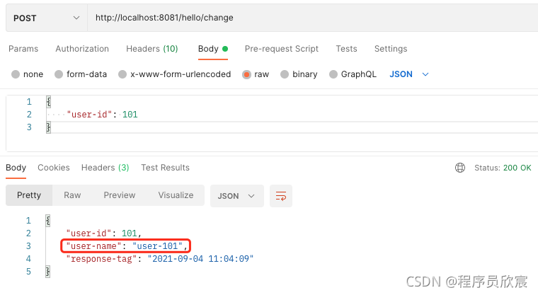

### 修改相应Body

* 新增RewriteFunction接口实现类 ResponseeBodyRewrite.java

  ```java
  package com.bolingcavalry.changebody.function;
  
  import com.fasterxml.jackson.databind.ObjectMapper;
  import lombok.extern.slf4j.Slf4j;
  import org.reactivestreams.Publisher;
  import org.springframework.cloud.gateway.filter.factory.rewrite.RewriteFunction;
  import org.springframework.web.server.ServerWebExchange;
  import reactor.core.publisher.Mono;
  import java.util.Map;
  
  @Slf4j
  public class ResponseBodyRewrite implements RewriteFunction<String, String> {
      
      private ObjectMapper objectMapper;
      
      public ResponseBodyRewrite(ObjectMapper objectMapper) {
          this.objectMapper = objectMapper;
      }
      
      @Override
      public Publisher<String> apply(ServerWebExchange exchange, String body) {
          try {
              Map<String, Object> map = objectMapper.readValue(body, Map.class);
              //获取 id
              int userId = (Integer)map.get("user-id");
              // 添加一个key/value
              map.put("gateway-response-tag", userId + "-" + System.currentTimeMillions());
              return Mono.just(objectMapper.writeValueAsString(map));
          } catch(Exception e) {
              log.error("2. json process fail", ex);
              return Mono.error("2. json process fail", ex));
          } 
      }
  }
  ```

  

* 路由配置代码中，lambda表达式里，filters 方法内部调用 modifyResponseBody，第三个入参是ResponseBodyRewrite：

  ```java
  package com.bolingcavalry.changebody.config;
  
  import com.bolingcavalry.changebody.function.RequestBodyRewrite;
  import com.bolingcavalry.changebody.function.ResponseBodyRewrite;
  import com.fasterxml.jackson.databind.ObjectMapper;
  import org.springframework.cloud.gateway.route.RouteLocator;
  import org.springframework.cloud.gateway.route.builder.RouteLocatorBuilder;
  import org.springframework.context.annotation.Bean;
  import org.springframework.context.annotation.Configuration;
  import org.springframework.http.MediaType;
  import reactor.core.publisher.Mono;
  
  @Configuration
  public class FilterConfig {
      
      @Bean
      public RouteLocator routes(RouteLocatorBuilder builder, ObjectMapper objectMapper) {
          return builder.routes()
              .route("path_route_change", r -> r.path("/hello/chagne")
              .filters(f -> f
                       .modifyRequestBody(String.class, String.class, new RequestBodyRewrite(objectMapper))
                      .moddifyResponseBody(String.class, String.class, new ResponseBodyRewrite(objectMapper)))
              .uri("http://127.0.0.1:8082"))
              .build();
      }
  }
  ```

  通过上面的代码，可以得知：用代码配置路由时，多个过滤器的配置方法就是在filters方法中反复调用内置的过滤器相关API，如下图红框所示：

  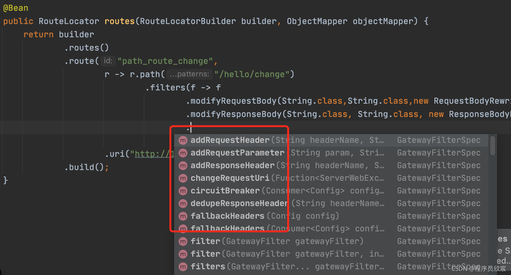

* 运行服务，用Postman验证，如下图所示，响应body中成功添加了key/value：

  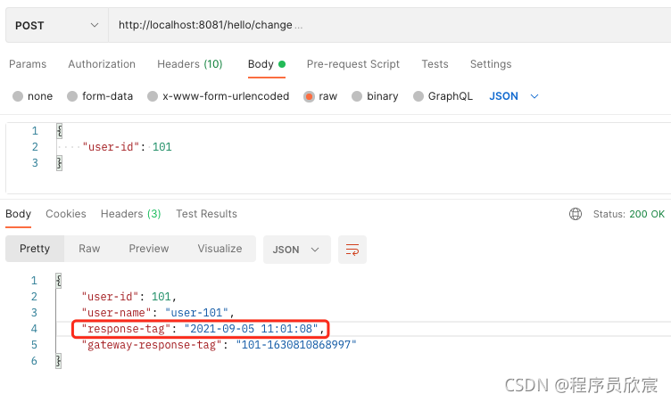

### 代码配置路由和yml配置是否可以混搭？

* 在application.yml中增加一个路由配置：

  ```yaml
  server:
    #服务端口
    port: 8081
  spring:
    application:
      name: gateway-change-body
    cloud:
      gateway:
        routes:
          - id: path_route_str
            uri: http://127.0.0.1:8082
            predicates:
              - Path=/hello/str
  ```

  

* 把gateway-change-body服务启动，此时已经有两个路由配置，一个在代码中，一个在yml中，先试试yml中的这个，如下图所示，没问题：

  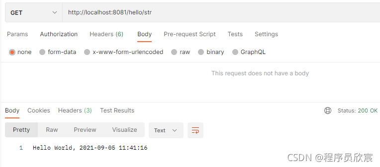

* 再试试代码配置的路由，如下图所示。结论是：代码和yml配置可以混搭

  

### 如何处理异常

修改请求或者应答body的过程中，如果发现问题需要提前返回错误（例如必要字段不存在），代码如何写呢？

修改请求body的代码集中在 RequestBodyRewrite.java，增加下面红框内容：

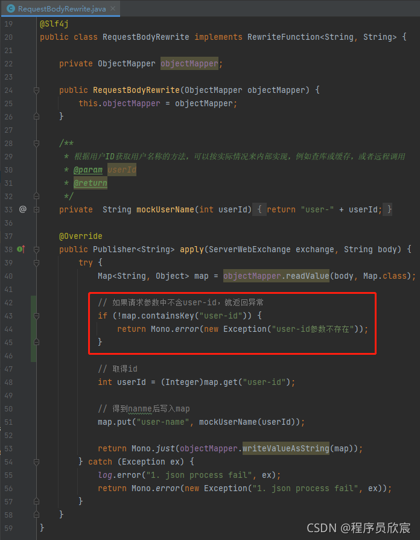

再来试试，这词请求参数中不包含user-id，收到gateway返回的错误信息如下：

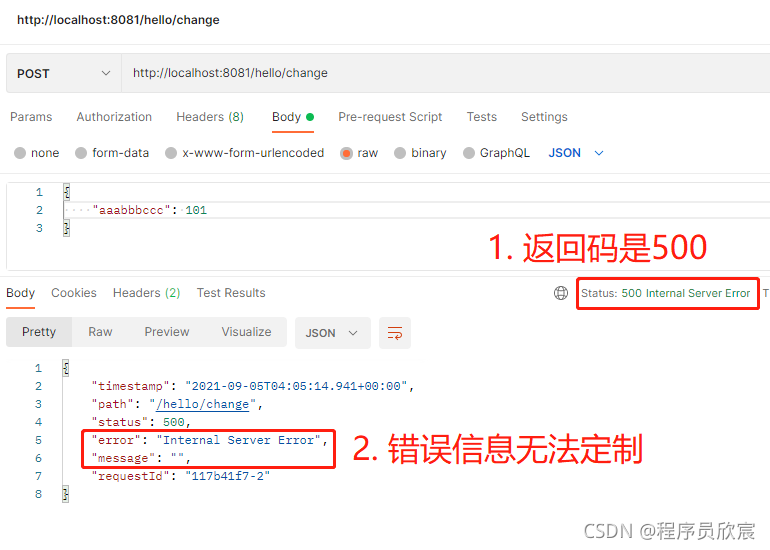

看看控制台，能看到代码中抛出异常信息：

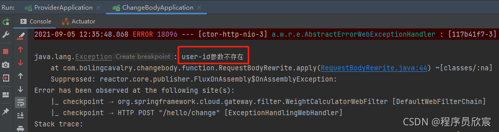

* 此时，应该是想告诉客户端具体的错误，但实际上客户端收到的是被Gateway框架处理后的内容

### 网关（Gateway）为什么要这么做？

1. 为什么Gateway要破坏原始数据？一旦系统出了问题，如何定位是服务提供方还是网关？

2. 尽管网关会破坏原始数据，但是只做一些简单固定的处理，一般以添加数据为主，网关不了解业务，最常见的就是鉴权、添加身份标签等操作

3. 网关后面一般都会有多个服务提供者，如下图，这时候诸如鉴权、获取账号信息等操作由网关统一完成，比每个后台分别实现一次更有效。后台可以更加专注于自身业务：

   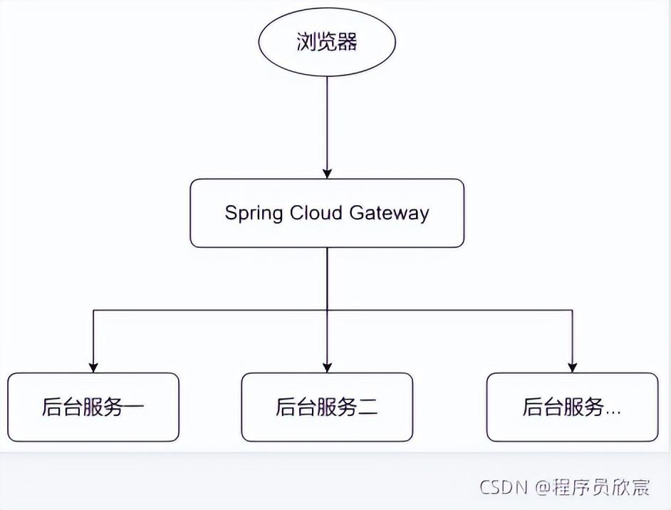

4. 网关统一鉴权、获取身份，一般都会把身份信息放入请求的header中，也不会修改请求和响应的内容