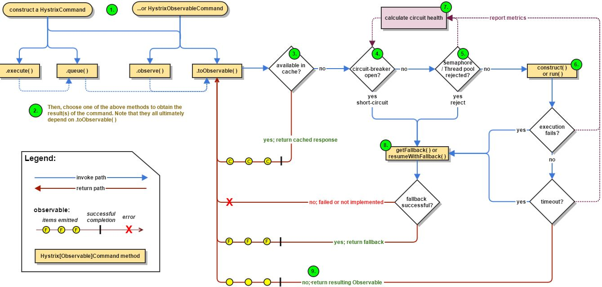

# 断路器hystrix原理及使用

原文：https://www.jianshu.com/p/53e109bf5c54




## 1. 原理

在微服务架构中，服务之间形成调用链路，链路中的任何一个服务提供者都可能面临着超时、宕机等不可用的情况。在高并发的情况下，这种情况会随着并发量的上升而恶化，形成“雪崩效应”。而断路器hystrix正是用来解决这个问题的组件。

断路器的基本原理：

* 正常情况下，断路器关闭，服务消费者正常请求微服务
* 一段时间内，失败率达到一定阈值（比如 50% 失败，或者失败了50次），断路器将开启，此时当前服务不再接收服务请求，而是执行指定的失败的方法（断路方法）
* 断路器打开一段时间后，自动进入“半开”状态。此时，断路器可以允许一个请求方法服务提供者，如果请求调用成功，则断路器关闭；否则持续保持断路器打开状态

断路器Hystrix 是保证局部发生的错误，不会扩散到整个系统，从而保证系统的可用性。

## 2. 配置和使用

下面介绍Hystrix在 RestTemplate 和 Feign 中的使用

### 2.1 RestTemplate + Ribbon 配合 Hystrix

首先，在 pom.xml 中引入 Hystrix 依赖：

```xml
<dependency>
     <groupId>org.springframework.cloud</groupId>
     <artifactId>spring-cloud-starter-hystrix</artifactId>
</dependency>
```

虽然 Eureka 依赖了 Ribbon， Ribbon 依赖了 Hystrix-core，但还是要引用上面的maven依赖。因为下面用到的 @HystrixCommand 注解用到了hystrix-javanica包：

* 启动类上加上 @EnableCircuitBreaker 注解（@EnableHystrix也可以）
* 修改 HelloWorldController 的入口请求

```java
    @GetMapping("/message")
    @HystrixCommand(fallbackMethod = "getMessageFallback")
    public HelloworldMessage getMessage() {
        HelloMessage hello = getMessageFromHelloService();
        WorldMessage world = getMessageFromWorldService();
        HelloworldMessage helloworld = new HelloworldMessage();
        helloworld.setHello(hello);
        helloworld.setWord(world);
        log.debug("Result helloworld message:{}", helloworld);
        return helloworld;
    }

	// 启动断路器后，执行的方法    
    public HelloworldMessage getMessageFallback(){
       HelloMessage helloMessage=new HelloMessage();
       helloMessage.setName("hello");
       helloMessage.setMessage("error occurs");

       WorldMessage worldMessage=new WorldMessage();
       worldMessage.setMessage("world error occurs");
       HelloworldMessage helloworldMessage=new HelloworldMessage();
       helloworldMessage.setHello(helloMessage);
       helloworldMessage.setWord(worldMessage);
       return helloworldMessage;
    }
```

通过 @HystrixCommand 注解的 fallbackMethod 指向断路方法，该方法会在调用 hello 服务或者 world 服务失败时被调用。

@HystrixCommand 注解还可以配置超时事件等其他属性

### 2.2 Feign 下整合 Hystrix

1. #### Feign 禁用 Hystrix

   在 Spring Cloud 中，只要 Hystrix 在项目的 classpath 中，Feigh 就会用断路器包裹 Feign客户端的所有方法。如果要禁用 Hystrix，则可以通过自定义Feign 的配置来解决

   ```java
   @Configuration
   public class FeignConfiguration{
        @Bean
        @Scope("prototype")
        public Feign Builder feignBuilder(){
              return Feign.builder();
        }
   }
   ```

   接口要禁用Hystrix，在该接口类中引用该配置即可：

   ```java
   @FeignClient(name="hello",configuration=FeignConfiguration.class)
   public interface HelloService{
       ......
   }
   ```

   

2. #### Feigh 启用（使用）Hystrix

   默认情况下，Feign 已经整合了 Hystrix，在配置文件中开启即可：

   ```yaml
   feign:
     hystrix:
       enabled: true
   ```

   然后，在接口中指定回退类。

   在HelloService中修改 FeignClient 类，指定 fallback的类：

   ```java
   package com.example.helloworldfeign.service;
   
   import com.example.helloworldfeign.model.HelloMessage;
   import org.springframework.cloud.netflix.feign.FeignClient;
   import org.springframework.web.bind.annotation.GetMapping;
   
   @FeignClient(value="hello", fallback=HelloServiceFallback.class)
   public interface HelloService {
       @GetMapping("/message")
       HelloMessage hello();
   }
   ```

    HelloServiceFallback是 fallback接口的具体实现：

   ```java
   package com.example.helloworldfeign.service;
   
   import com.example.helloworldfeign.model.HelloMessage;
   import org.springframework.stereotype.Component;
   
   @Component
   public class HelloServiceFallback implements HelloService {
       @Override
       public HelloMessage hello() {
           HelloMessage helloMessage=new HelloMessage();
           helloMessage.setName("hello");
           helloMessage.setMessage("error occurs");
           return helloMessage;
       }
   }
   ```

   

3. #### 查看断路器错误日志

   如果要查看详细的断路器日志，可以通过注解 @FeignClient 的 fallbackFactory 来实现。代码如下：

   ```java
   mport com.example.helloworldfeign.model.HelloMessage;
   import org.springframework.cloud.netflix.feign.FeignClient;
   import org.springframework.web.bind.annotation.GetMapping;
   
   @FeignClient(value="hello",fallbackFactory = HelloServiceFallbackFactory.class)
   public interface HelloService {
   
       @GetMapping("/message")
       HelloMessage hello();
   }
   
   ```

   HelloServiceFallbackFactory类：

   ```java
   package com.example.helloworldfeign.service;
   
   import com.example.helloworldfeign.model.HelloMessage;
   import feign.hystrix.FallbackFactory;
   import org.slf4j.Logger;
   import org.slf4j.LoggerFactory;
   import org.springframework.stereotype.Component;
   
   public class HelloServiceFallbackFactory implements FallbackFactory<HelloService> {
       private final static Logger LOGGER= 
           LoggerFactory.getLogger(HelloServiceFallbackFactory.class);
       
       @Override
       public HelloService create(Throwable throwable) {
           return new HelloService() {
               @Override
               public HelloMessage hello() {
                   LOGGER.error("fallback ,the result is:",throwable);
                   HelloMessage helloMessage=new HelloMessage();
                   helloMessage.setName("hello");
                   helloMessage.setMessage("error occurs");
                   return helloMessage;
               }
           }
       }
   }
   ```

   这样，就会在控制台把具体导致熔断的信息输出，便于跟踪错误。

   