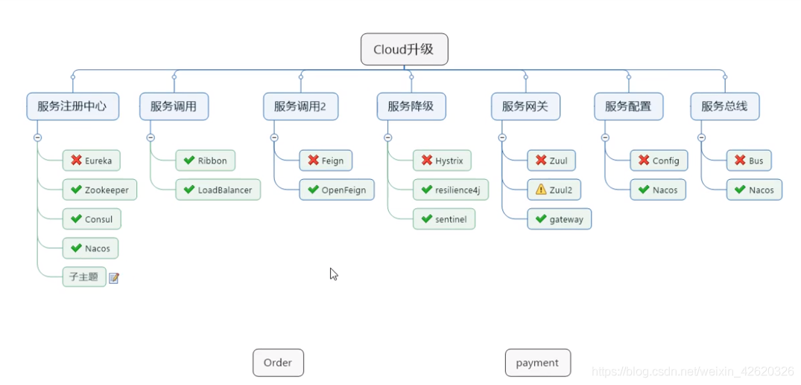
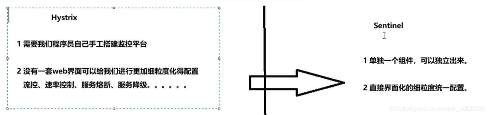

# SpringCloud高频重点面试题

原文：https://blog.csdn.net/weixin_42620326/article/details/118498162?share_token=345F322C-65C9-4B03-B4C9-789F12B73510&tt_from=weixin&utm_source=weixin&utm_medium=toutiao_ios&utm_campaign=client_share&wxshare_count=1


- Spring Cloud 相关组件
- - 1. Eureka基础知识
  - - 1.1 什么是服务治理
    - 1.2 什么是服务注册与发现
    - 1.3 Eureka包含两个组件：Eureka Server 和 Eureka Client
    - 1.4 单机Eureka构建步骤
    - - 1.4.1 服务端
      - 1.4.2 客户端
      - 1.4.3 将Eureka Client端中的服务消费端注册进Eureka Server称为Service Consumer
    - 1.5 集群Eureka构建步骤
    - 1.6 负载均衡
    - 1.7 Eureka自我保护（CAP里面的AP分支）
    - - 1.7.1 产生原因
      - 1.7.2 什么是自我保护模式？
      - 1.7.3 怎么禁止自我保护
      - 1.7.4 Eureka的三大角色
      - 1.7.5 Eureka和zookeeper的对比
- 2. SpringBoot和SpringCloud的区别？
- 3. 微服务的优缺点
- 4.Ribbon
- - 4.1是什么?
  - 4.2 负载均衡算法?
- 5.feign
- - 5.1 是什么?
  - 5.2 能干什么?
- 6.hystrix
- - 6.1 服务雪崩
  - - 6.1.1 雪崩效应
  - 6.2 是什么?
  - 6.3什么是服务熔断
  - - 6.3.1 熔断机制
  - 6.4服务的降级
- 7.zuul路由网关
- - 7.1 Gateway
  - 7.1 Gateway特性
- 8.SpringCloud config
- - 8.1分布式的配置问题
  - 8.2是什么? 怎么用？
- 9.nacos
- - 1. nacos是什么？
    2. 命名空间，分组和DataID三者关系，如何分类配置？
  - - 2.1DataID配置
    - 2.2 新建组 TEST_GROUP
    - 2.3 新建命名空间
  - 3. Nacos集群搭建
  - 4. 各种注册中心比较
- 10.sentinel
- - 10.1 sentinel是什么？
  - 10.2 为什么要用？
  - 10.3 Sentinel 分为两个部分
  - 10.4 流量控制
  - - 10.4.1 流控模式之直接失败
    - 10.4.2 流控模式之关联
    - 10.4.3 流控模式之链路
    - 10.4.4 Warm up 预热
    - 10.4.5 排队等待
  - 10.5 降级规则
  - - 10.5.1 RT
    - 10.5.2 异常比例
    - 10.5.3 异常数
  - 10.6 热点Key限流
  - 10.7 系统规则
  - 10.8 sentinelResource
  - - 10.8.1 按URL访问 rateLimit/byUrl
    - 10.8.2 存在问题：代码耦合
    - 10.8.3 解决方法
    - 10.8.4 实现原理
  - 10.9 熔断
  - - 10.9.1 服务熔断无配置
    - 10.9.2 只配置fallback
    - 10.9.2 只配置blockHandler
    - 10.9.3 fallback和blockHandler都配置
    - 10.9.4 异常忽略
    - 10.9.5 熔断框架比较
    - 10.9.6 限流配置规则持久化
- 11.seata
- - 11.1 分布式事务的由来
  - 11.2 是什么?
  - - 11.3 Seata术语
    - 11.4 使用
    - 11.5 处理过程
    - 11.6 如何使用
    - 11.7 原理讲解
    - - 11.7.1 整体机制
      - 11.7.2 写隔离
      - 11.7.3 读隔离
      - 11.7.4 工作机制
      - 11.7.4.1 一阶段
      - 11.7.4.2 二阶段-回滚
      - 11.7.4.3 二阶段-提交
      - 11.7.4.4 TCC模式
      - 11.7.45 Saga 模式
- 12.消息总线
- - 12.1 是什么？
  - 12.2 能干嘛？
  - 12.3 什么是总线？

## 一. Spring Cloud 相关组件



### 1.1 SpringBoot 与 Spring Cloud 的区别？

​        **SpringBoot**，专注于快速方便的开发单个个体微服务

​        **SpringCloud**，关注全局的微服务协调整理的治理框架，它将 SpringBoot 开发的一个个单体微服务整合并管理起来，为各个微服务之间提供：配置管理、服务发现、断路器、路由、微代理、事件总线、全局锁、决策竞选、分布式会话等等集成服务。

​        Spring Boot可以离开 SpringCloud 独立开发项目，但是 SpringCloud 离不开 SpringBoot，属于依赖关系，即SpringCloud是基于 SpringBoot开发的框架。

### 1.2 微服务的优缺点

* **优点**
  * 每个服务足够内聚，足够小，代码容易理解，这样就能聚焦一个指定的业务功能
  * 开发简单，高效，一个服务可能就是专一的，只做一件事情
  * 微服务能够被小团队单独开发，人员少适合敏捷
  * 微服务之间松耦合，便于独立开发和独立部署
  * 不局限于单一的开发技术栈
  * 易于与第三方集成
* **缺点**
  * 开发人员要处理分布式系统的复杂性
  * 多服务运维难度会随着服务的增加而不断的增大
  * 系统部署依赖复杂
  * 服务间通讯成本高
  * 数据一致性难以保证
  * 系统集成测试难度大
  * 性能监控分散

## 二. Eureka 基础知识

### 2.1 什么是服务治理

​        在传统的 RPC 远程调用框架中，管理每个服务与服务之间依赖关系比价复杂，所以需要使用服务治理。所谓治理，就是管理服务与服务之间的依赖关系，实现：**服务发现与注册、服务调用、负载均衡、容错**等等。

### 2.2 什么是服务注册与发现

​        SpringCloud 框架使用 Eureka 组件来完成服务注册与发现。Eureka 采用 **CS** 的设计架构。Eureka Server 是服务注册的服务器，是注册中心，其他服务启动时需要把自己注册到 Eureka Server来；其他服务集成 Eureka Client，用来把自己注册到 Eureka Serve，并维持与 Server 的心跳。这样，系统的维护人员就可以通过 Eureka Server 来监控系统中各个微服务是否正常运行。

* 在服务注册与发现中，有一个注册中心。当服务器启动时，会把当前自己服务器的信息（比如：服务地址、通讯地址等）以**别名**方式注册到注册中心
* 另一方面（消费者/服务提供者），以该别名的方式去注册中心上获取实际的服务通讯地址，然后再实现本地 RPC 调用。

​        RPC 远程调用框架核心框架设计思想：在于**注册中心**，因为使用注册中心管理每个服务与服务之间的依赖关系。在任何 RPC 远程框架中，都会有一个注册中心。下图是Eureka（左）和 Dubbo（右）的系统架构：


### 2.3 Eureka 包含来个组件：Eureka Server 和 Eureka Client

#### 2.3.1 Eureka Server

​        Eureka Server 提供服务注册中心。各个微服务节点通过配置启动后，会在 Eureka Server 中进行注册，这样 Eureka Server 中的服务注册表中将存储所有可用服务节点的信息，服务节点的信息可以在界面中直观看到。

#### 2.3.2 Eureka Client

​        Eureka Client 是一个 Java 客户端，集成在业务微服务中，用来注册服务并访问 Eureka Server。Eureka Client 使用轮询（round-robin）负载算法的负载均衡器。在应用启动后，向Eureka Server 发送心跳（默认周期为 30 秒）。如果 Eureka Server 在多个心跳周期内没有接收到某个节点的心跳，Eureka Server 将会从服务注册表中把这个服务节点移除（默认是90秒）

### 2.4 单机 Eureka 构建步骤

#### 2.4.1 服务端

​        这个是 Eureka Server。

​        引入依赖：

```XML
<dependency>
	<groupId>org.springframework.cloud</groupId>
    <artifactId>spring-cloud-starter-netflix-eureka-server</artifactId>
</dependency>
```

​        启动类加上注解 ***@EnableEurekaServer*** ：

```java
/**
 * @author LongXi
 * @create 2021-04-29 22:21
 */
@SpringBootApplication
@EnableEurekaServer
public class EurekaMain7001 {
    public static void main(String[] args) {
        SpringApplication.run(EurekaMain7001.class,args);
    }
}
```

​        编写配置文件：

```yaml
server:
  port: 7001

eureka:
  instance:
    hostname: localhost
  client:
    register-with-eureka: false
  fetch-registry: false
  service-url:
    defaultZone: http://${eureka.instance.hostname}:{server.port}/eureka/
```

#### 2.4.2 客户端

​        将 **Eureka Client 端中的服务提供端**注册进 Eureka Server，作为 **Service Provider**。

​        引入依赖：

```xml
<dependency>
	<groupId>org.springframework.cloud</groupId>
    <artifactId>spring-cloud-starter-netflix-eureka-client</artifactId>
</dependency>
```

​        配置文件：

```yaml
server:
  port: 8001

spring:
  application:
    name: cloud-payment-service  # 入驻Eureka服务注册中心的服务名称
  datasource:
    type: com.alibaba.druid.pool.DruidDataSource  # 当前数据源操作类型
    driver-class-name: org.gjt.mm.mysql.Driver    # mysql驱动包
    url: jdbc:mysql://localhost:3306/cloud20?useUnicode=true&characterEncoding=utf-8&useSSL=false
    username: root
    password: root

eureka:
  client:
    #表示是否将自己注册进EurekaServer默认为true。
    register-with-eureka: true
    #是否从EurekaServer抓取已有的注册信息，默认为true。单节点无所谓，集群必须设置为true才能配合ribbon使用负载均衡
    fetchRegistry: true
    service-url:
      #单机版
      defaultZone: http://localhost:7001/eureka # 入驻的服务注册中心地址

mybatis:
  mapperLocations: classpath:mapper/*.xml
  type-aliases-package: cn.sher6j.springcloud.entities  # 所有Entity别名类所在包
```

​        启动类加上注解： ***@EnableEurekaClient***

```java
/**
 * @author LongXi
 * @create 2021-04-25 22:02
 */
@SpringBootApplication
@EnableEurekaClient
public class PaymentMain8001 {
    public static void main(String[] args) {
        SpringApplication.run(PaymentMain8001.class, args);
    }
}
```

#### 2.4.3 进行服务注册

​        将 Eureka Client 端中的**服务消费端**注册进 Eureka Server，称为 ***Service Consumer***。

​        配置文件：

```yaml
server:
  port: 80

spring:
  application:
    name: cloud-order-service

eureka:
  client:
    #表示是否将自己注册进EurekaServer默认为true。
    register-with-eureka: false
    #是否从EurekaServer抓取已有的注册信息，默认为true。单节点无所谓，集群必须设置为true才能配合ribbon使用负载均衡
    fetchRegistry: true
    service-url:
      #单机
      defaultZone: http://localhost:7001/eureka # 入驻的服务注册中心地址
```

​        启动类：

```java
package cn.sher6j.springcloud;

import org.springframework.boot.SpringApplication;
import org.springframework.boot.autoconfigure.SpringBootApplication;
import org.springframework.cloud.netflix.eureka.EnableEurekaClient;

/**
 * @author sher6j
 */
@SpringBootApplication
@EnableEurekaClient
public class OrderMain80 {
    public static void main(String[] args) {
        SpringApplication.run(OrderMain80.class);
    }
}
```

​        此时，再回看最开始 Eureka 系统架构，在服务注册中心和服务提供者没有集群的情况下，7001 端口的微服务就对应了服务注册中心，而该服务不需要向服务注册中心注册自己。8001 端口的微服务作为服务提供方，入住到服务注册中心，8002 端口的微服务作为服务消费方也同样注册到服务注册中心：


### 2.5 集群 Eureka 构建步骤

#### 2.5.1 Eureka 集群原理

​        服务注册中心 Eureka Server 中分为 **服务注册** 和 **服务发现**。

* **服务注册**：这个过程将服务信息注册进服务注册中心
* **服务发现**：这个过程从服务注册中心上获取服务信息，而这个过程的实质是：将服务名作为 key 存储，然后根据 value 取得服务的调用地址

​        整个 Eureka 的过程如下：

1. 先启动 Eureka 注册中心
2. 启动服务提供者服务
3. 服务提供者服务将自身信息（如服务地址）以**别名方式**注册到 Eureka 注册中心
4. 消费者服务在需要调用接口时，**使用服务别名**到注册中心获取实际的 RPC 远程调用地址
5. 消费者获得调用地址后，底层实际是利用 **HttpClient**  技术实现远程调用
6. 消费者获得服务器地址后，会缓存在本地 JVM 内存中，默认每隔 30秒 更新一次服务调用地址

​        那么，微服务 RPC 远程服务调用**最核心**的是什么呢？

​        是**高可用！** 如果注册中心只有一个，而如果这个注册中心出现了故障，那么整个微服务就直接NG了，所有服务都不可用了。所以应该搭建 Eureka 注册中心集群，实现 **负载均衡+故障容错**。

​        那么，又如何实现 Eureka 注册中心的集群呢？策略简单--相互注册，相互守望。如下图：


1. **服务注册中心实现相互注册**，让彼此都知道对方的存在，也就是组册中心集群中的每一个注册中心都知道整个集群中的其他注册中心。比如，如果有3个注册服务中心 7001、7002、7003，那么就将 7002 和 7003 注册给 7001， 将 7002 和 7001 注册给 7003，将 7001 和 7003 注册给 7002，以此类推。而这些注册服务中心作为一个整体对外看作是一个注册服务中心
2. 将服务提供方服务 8001/8002 发布到上面 3 台 Eureka 集群配置中
3. 将服务消费方服务 80 发布到上面 3 台 Eureka 集群配置中

​        上面的设计大致用下图表示：


### 2.6 负载均衡

​        此时，使用 80 端口的服务消费方来访问 Cloud-Payment-Service 服务，输入地址 http://localhost/consumer/payment/get/1 ，但每次得到的数据都是：

```json
{
	code: 200,
	message: "查询数据库成功, 端口号：8001",
	data: {
		id: 1,
		serial: "aaaa001"
	}
}
```

​        也就是说，每次访问的具体微服务都是 8001 端口的 Cloud-Payment-Service 服务，这明星是不符合业务逻辑的，原因就是在消费方代码中把服务访问的地址写死了，没有实现负载均衡。所以，这里应该让 80 访问服务名，而不是具体的服务，同时在配置文件中通过 @LoadBalanced 注解赋予 RestTemplate 负载均衡能力，该负载均衡默认的方式为**轮询方式**，所以将 80 服务的配置文件改成如下：

```java
package cn.sher6j.springcloud.config;

import org.springframework.cloud.client.loadbalancer.LoadBalanced;
import org.springframework.context.annotation.Bean;
import org.springframework.context.annotation.Configuration;
import org.springframework.web.client.RestTemplate;

/**
 * @author sher6j
 */
@Configuration
public class ApplicationContextConfig {
    @Bean
    @LoadBalanced//使用该注解赋予RestTemplate负载均衡的能力
    public RestTemplate getRestTemplate() {
        return new RestTemplate();
    }
}
//applicationContext.xml <bean id="" class="">
```

然后重启 80 端口，发现每次访问 Cloud-Payment-Service 服务时，具体的微服务在 8001 和 8002 之间进行轮询切换。 

### 2.7 Eureka 自我包含（CAP里的AP分支）

​        保护模式主要用于一组客户端和 Eureka Server 之间**存在网络分区场景**下的保护。一旦进入保护模式，**Eureka Server 将会尝试保护其服务注册表中的信息，不再删除服务注册表中的数据，也就是不会注销任何微服务**。

​        如果在 Eureka Server 的首页看到以下提示，说明 Eureka 进入保护模式：

> EMERGENCY! EUREKA MAY BE INCORRECTLY CLAIMING INSTANCES ARE UP WHEN THEY’RE NOT. RENEWALS ARE LESSER THAN THRESHOLD AND HENCE THE INSTANCES ARE NOT BEING EXPIRED JUST TO BE SAFE.

换句话说就是：某时刻某一个微服务不可用了，Eureka 不会立刻清理，而是依旧会对该微服务的信息进行保存。

#### 2.7.1 保护机制产生原因

​        为了防止这种情况出现：Eureka Client 可以正常运行，但是与 Eureka Server 网络不通，Eureka Server 立刻将 Eureka Client 服务剔除。

#### 2.7.2 什么是自我保护模式

​        默认情况下，如果 Eureka Server 在一定时间内没有接收到某个微服务实例的心跳，Eureka Server 将会注销该实例（默认90秒）。但是当网络分区故障发生（延时、卡顿、拥挤）时，微服务与 Eureka Server 之间无法正常通信，以上行为可能变得非常危险 -- 因为微服务本身时健康的，只是由于 网络问题链接不到 Eureka Server，此时本不应该注销这个微服务。Eureka 通过“自我保护模式”来解决这个问题 -- **当 Eureka Server 节点在短时间内丢失过多客户端时（可能发生了网络分区故障，网络延时），那么这个节点就会进入自我保护模式**。

​        在自我保护模式中，Eureka Server 会保护服务注册表中的信息，不再注销任何服务实例，宁可保留错误的服务注册信息，也不盲目注销任何可能健康的服务实例。使用自我保护模式，可以让 Eureka 集群更加的健壮、稳定。

#### 2.7.3 如何禁止自我保护

* 在 Eureka Server 段修改配置文件，即可设置关闭自我保护机制

  ```yaml
  eureka：
    server:
    	# 关闭自我保护机制，保证不可用服务被及时剔除
      enable-self-preservation: false
      # 时间间隔
      eviction-interval-time-in-ms: 2000 
  ```

* 在 Eureka Client 端修改配置文件

  ```yaml
  eureka:
    instance:
      instance-id: payment8001
      # Eureka客户单向服务端发送心跳的时间间隔，默然是30秒
      lease-renewal-interval-in-seconds: 1
      # Eureka服务端在收到最后一次心跳后等待时间上限，默然为90秒，超时将剔除服务
      lease-expiration-duration-in-seconds: 2
  ```

这样就会使 Eureka Client 客户端的微服务很快死亡。

### 2.8 Eureka 三大角色

* Eureka 提供服务注册和发现
* Service Provider 服务提供方将自身服务注册到Eureka，使服务消费方能够找到
* Service Consumer 从 Eureka 获取注册服务列表，从而能够消费服务

### 2.9 Eureka 和 Zoozkeeper 对比

#### 2.9.1 ZooKeeper

​        ZooKeeper 保证了CAP中的CP，即保证了**一致性**（C）和**分区容错性**（P）。

​        当向注册中心查询服务列表时，可以容忍注册中心返回的是几分钟以前的信息，但不能容忍直接宕机而变得服务不可用。也就是说，服务注册功能对高可用性要求比较高，但是 ZK 会出现这样一种情况：当 master 节点因为网络故障与其他节点失去联系时，剩余的节点会重新选择 Leader。问题就在于，选取 Leader 的时间过程（30-120s），且选取期间 ZK 集群都不可用，这样就会导致选取期间注册服务瘫痪。在云部署的环境下，因网络问题使得 ZK 集群失去 master 节点是比较大概率发生的事，虽然服务最终恢复，但是漫长的选择时间导致的注册长期不可用是不能容忍的。

#### 2.9.2 Eureka

​        Eureka 则保证了 AP，即保证了 **高可用性**（A）和 **分区容错性**（P）。

​        Eureka 各个节点都是平等的，几个节点挂掉不会影响到正常节点的工作，剩余的节点依然可以提供注册和查询服务。而 Eureka 的客户端再向某个 Eureka 注册时如果发现连接失败，则会自动切换到其他节点，只要有一台 Eureka 还在，就能保证注册服务的可用性，只不过查询到的信息可能不是最新的（不保证一致性）。除此之外，Eureka 还有一种自我保护机制：如果在15分钟内超过85%的节点都没有正常心跳，那么 Eureka 就认为客户端与注册中心出现了网络故障，此时就会出现以下几种情况：

1. Eureka **不再**从注册列表**移除**因为长时间没有收到心跳而应该过期的服务
2. Eureka 仍然能够接受新服务的注册和查询请求，但是不会被同步到其它节点上
3. 当网络稳定时，当前实例新的注册信息会被同步到其它节点

​        Eureka 还有客户端缓存功能（Eureka 分为客户端程序和服务器端程序两部分，客户端程序负责向外提供注册与发现服务接口）。所以，即使 Eureka 集群中所有节点都失效，或者发生网络分隔故障导致客户端不能访问任何一台 Eureka 服务器；Eureka 服务的消费者仍然可以通过 Eureka 客户端缓存来获取所有的服务注册信息。甚至在极端环境下，所有正常的 Eureka 节点都不对请求产生响应，也没有更好的服务器解决方案来解决这种问题时，得益于 Eureka 客户端缓存，消费者服务仍然可以通过 Eureka 客户端查询与获取注册服务信息。因此Eureka可以很好的应对网络故障导致部分节点失去联系的情况，而不像Zookeeper那样使整个注册服务瘫痪。

## 三. Ribbon

### 3.1 Ribbon是什么

​        Ribbon 是Netflex发布的开源项目，是一套<font color='red'>**客户端**</font>的**负载均衡**工具。Ribbon 客户端组件提供一系列完善的配置项，如连接超时、重试等。简单的说，就是在配置文件中列出 LoadBalance（LB）后面所有的机器，Ribbon 会自动的帮助开发人员基于某种规则（如简单轮询、随机连接等）去连接这些机器。

#### 3.1.1 Ribbon 本地负载均衡 vs Ngnix 服务器端负载均衡

* **Ngnix**：客户端所有请求都会交给 Nginx，然后由 Nginx 实现转发请求。Nginx服务器承接了请求的压力，可能会形成瓶颈。
* **Ribbon**：这是一个本地负载均衡，在调用微服务接口时，会在注册中心上获取注册信息服务列表之后，缓存到本地JVM里，从而在本地选择连接哪个远程服务。压力分散到了各个客户端

### 3.2 负载均衡算法


* 轮询
* 随机
* 权重，响应速度越快，越被使用
* 自定义
* 故障最少的

## 四. Feign

### 4.1 Feign 是什么

​        Feign 是一个申明式的 WebService 客户端，使用 Feign 能让编写 Web Service 客户端变得更简单。它的使用方法是：定一个接口，然后在上面添加注解。

### 4.2 Feign 能干什么

​        Feign 目的就是为了编写 Java Http 客户端变得容易。Feign 已经集成了 Ribbon，默认使用 Java HttpClient，以及 Sping 的 RestTemplate。

## 五. Hystrix

### 5.1 服务雪崩

​        多个服务之间调用的时候，假设微服务A 调用微服务B 和微服务C。微服务B 和微服务C 又调用了其它的微服务，这就是所谓的“**扇出**”。如果在“**扇出**”的链路上，某个微服务的调用响应时间过长或者不可用，对微服务A 的调用就会占用越来越多的系统资源，进而引起系统崩溃，这就是所谓的“**雪崩效应**”。

​        对于高流量的应用来说，单一的后端依赖可能会导致所有服务器上的所有资源都在几秒钟内饱和。比失败更糟糕的是，这些应用程序还可能导致服务之间的延迟增加，备份队列，线程和其它系统资源紧张，导致整个系统发生更多的级联故障。这些都表示需要对故障和延迟进行隔离和管理，以便单个依赖关系的失败，不能取消整个应用程序或系统。        

#### 6.1.1 雪崩效应

1. 分布式系统中的服务通信依赖于网络，网络不好，必然会对分布式系统带来很大的影响
2. 在分布式系统中，服务之间相互依赖，如果一个服务之间出现了故障或者网络延迟，在高并发的情况下，会导致线程阻塞，在很短的时间内，该服务的线程资源会耗尽，最终使得该服务不可用
3. 由于服务的相互依赖，可能会导致整个系统的不可用，这就是“雪崩效应”。为了防止此类事件的发生，分布式系统必然要采取相应的措施，如熔断机制

### 5.2 Hystrix 是什么

​        Hystrix 是一个用于处理分布式系统的**延迟**和**熔断**的开源库，在分布式系统里，许多依赖不可避免的会调用失败，比如超时、异常等，Hystrix 能够保证在一个依赖出问题的情况下，**不会导致整体服务失败，避免级联故障，以提高分布式系统的弹性**。

​        “断路器”本身是一种开关装置，当某个服务单元发生故障之后，通过断路器的故障监控（类似熔断保险丝），**向调用方返回一个符合预期的、可处理的备选响应（FallBakc），而不是长时间的等待或者抛出调用方无法处理的异常**，这样就保证了服务调用方的线程不会被长时间、不必要地占用，从而避免了故障在分布式系统中的蔓延，乃至雪崩。

### 5.3 什么是服务熔断

​        熔断机制是应对雪崩效应的一种微服务链路保护机制。

​        当**扇出**链路的某个微服务不可用或者响应时间太长时，会进行服务的降级，进而**熔断该节点微服务的调用，快速返回“错误”的响应信息**。

​        当检测到该节点微服务调用响应正常后，恢复调用链路。在Spring Cloud 框架里，熔断机制通过 Hystrix 实现。Hystrix 会监控微服务调用的状况，当失败的调用累积到一定阈值，缺省是 **5秒内20次** 调用失败就会启动熔断机制。

​        熔断机制注解是 @HystrixCommand

#### 5.3.1 熔断机制

1. 当一个服务出现故障时，请求失败次数超过设定的阈值（默认50）之后，该服务就会开启熔断器，之后该服务就不进行任何业务逻辑操作，执行快速失败，直接返回请求失败的信息。其它依赖于该服务的服务就不会因为得不到响应而造成线程阻塞。这是除了该服务和依赖于该服务的部分功能不可用外，其它功能正常。
2. 熔断器还有一个自我修复机制，当一个服务熔断后，经过一段时间（5秒）后打开熔断器。

### 5.4 服务降级

​        整体资源快不够了，忍痛将某些服务先关掉，待度过难关，再开启回来。

## 六. Zuul 路由网关

​        Zuul 包含了对请求的**路由和过滤**两个主要的功能。其中，路由功能负责将外部请求转发到具体的微服务实例上，是实现外部统一访问入口的基础；而过滤器功能则对请求的处理过程进行干预，实现请求校验、服务聚合等共功能的基础。

​        Zuul 和 Eureka 进行整合，将 Zuul 自身注册到 Eureka 服务治理下的应用，同时从 Eureka 中获得其它微服务的消息，也即以后访问微服务都是通过 Zuul 跳转后获得。

​        注意：Zuul 服务最终还是会注册进 Eureka

## 七. Gateway

​        Spring Cloud Gateway 是 Spring Cloud 的一个全新项目，目标是替代 Zuul。为了提升网关的性能，Gateway 是基于 WebFlux 框架实现的，而 WebFlux 框架底层则使用了高性能的 **Reactor** 模式通行框架 **Netty**。在高并发和非阻塞通信时具有非常好的优势。

​        Spring Cloud Gateway 的目标是提供统一的路由方式，且**基于 Filter 链**的方式提供了网关基本功能，如：安全、监控/指标、限流。


### 7.1 Gateway 特性

​         Gateway 具有如下的特性：

* 基于 Spring Framewokr 5， Project Reactor 和 Spring Boot 2.0 进行构建
* **动态路由**：能够匹配任何请求属性
* 集成 Hystrix 的断路器功能
* 集成 Spring Cloud 服务发现功能
* 易于编的 Predicate（断言）和 Filter （过滤器）
* 请求限流
* 支持路径重写

## 八. SpringCloud Config

### 8.1 分布式配置的问题

​        微服务意味着要将单体应用中的业务拆分成一个一个子服务，每个服务的粒度相对较小，因此系统中出现大量的服务。由于每个服务都需要必须要的配置信息才能运行，所以一套集中式的、动态的配置管理设置是必不可少的。 Spring Cloud 提供了 ConfigServer 来解决这个问题。

​        每个微服务都带着一个 application.yml，微服务越多，文件就越多……

### 8.2 Config 是什么？怎么用？

#### 8.2.1 Config是什么

​         Config 为微服务框架中的微服务提供**集中化的外部配置**支持。配置服务为各个不同微服务应用的所有环境提供了一个中心化的外部配置。

#### 8.2.2 Config 怎么用

​        Config 分为**服务端**和**客户端**两部分。

​        服务端也称为**分布式配置中心**，它是一个**独立的**微服务应用，用来连接配置服务器并未客户端提供获取配置信息，加密/解密信息等访问接口

​        客户端则是通过指定的配置中心来管理应用资源，以及与业务相关的配置内容，并在启动的时候从配置中心获取和加载配置信息。配置服务器默认采用 git 来存储配置信息，有助于对环境配置进行版本管理，并且通过 git 客户端工具方便管理和访问配置内容。

## 九. Sentinel

### 9.1 什么是 Sentinel

​        一个分布式系统的流量防卫兵

### 9.2 为什么选择 Sentinel

​        Hystrix 与 Sentinel 的对比



​        随着微服务的流行，服务与服务之间的稳定性变得越来越重要。Sentinel 以流量为切入点，从***流量控制、熔断降级、系统负载保护***等多个维度保护服务的稳定性。

​        Sentinel 具有以下的特点：

1. **丰富的应用场景**：Sentinel 承接了阿里巴巴近 10 年的双十一大促流量的核心场景，例如秒杀（即突发流量控制在系统容量可以承受的范围）、消息削峰填谷、集群流量控制、实时熔断下游不可用应用等
2. **完备的实时监控**：Sentinel 同时提供实时的监控功能。可以在控制台中看到接入应用的单台机器秒级数据，甚至 500 台以下规模的集群的汇总运行情况
3. **广泛的开源生态**：Sentinel 提供开箱即用的与其它开源框架/库的整合模块，例如：与 Spring Cloud、Dubbo、gRPC 的整合。只需要引入相应的依赖并进行简单的配置即可快速接入 Sentinel
4. **完善的 SPI 扩展点**：Sentinel 提供简单易用、完善的 SPI 扩展接口。可以通过实现扩展接口来快速定制逻辑。例如：定制规则管理、适配动态数据源等。


### 9.3 Sentinel 分为两部分

* **核心库（Java客户端）**：不依赖任何框架/库，能够运行于所有 JVM，同时对 Dubbo/Spring Cloud 等框架有很好的支持
* **控制台（Dashboard）**：基于 Spring Boot开发，打包后可以直接运行，不需要额外的Tomcat 等容器支持

### 9.4 流量控制

## 十. 分布式事务 Seata

​        http://seata.io/zh-cn/

### 10.1 分布式事务的由来

​         单体应用被拆分成微服务应用后，原来的三个模块被拆分成三个独立的应用，分别使用三个独立的数据库（源），业务操作需要调用三个服务来完成。此时，每个服务内部的数据一致性由本地事务来保证，但是全局的数据一致性问题就没办法保证了。

​         即：一次业务操作需要跨多个数据源或者需要跨多个系统进行远程调用，就会产生分布式事务的问题。

​        如何解决呢？这里采用 Seata 方案。

### 10.2 什么是 Seata

​        Seata 是一款开源的分布式事务解决方案，致力于提供高性能和简单易用的分布式事务服务。Seata 将为用户提供了 **AT、TCC、SAGA** 和 **XA** 事务模式，为用户打造一站式的分布式解决方案。

### 10.3 Seata 术语

* **TC**（Transaction Coordinator）- 事务协调者

  维护全局和分支事务的状态，驱动全局事务提交或回滚

* **TM**（Transaction Manager） - 事务管理器

  定义全局事务的范围：开始全局事务、提交或者回滚全局事务

* **RM**（Resource Manager） - 资源管理器

  管理分支事务处理的资源，与 TC 交谈以注册分支事务和报告分支事务的状态，并驱动分支事务提交或回滚

### 10.4 使用

​        这里采用一个具体的业务来描述：用户购买商品的业务。这个业务的整个逻辑由 3 个微服务提供支持：

* 仓储服务：对给定的商品扣除仓储数量
* 订单服务：根据采购需求创建订单
* 账户服务：从用户账户中扣除余额

​        整个架构图如下所示：


### 10.5 处理过程

​        Seata 的分布式提交方案：


### 10.6 如何使用

​        在 Spring 下很简单，直接加上 **全局事务注解** *@GlobalTransactionsl*

### 10.7 原理


#### 10.7.1 整体机制

​        两段提交协议的演变：

* **第一阶段**：业务数据和回滚日志记录（*undo_log*）在同一个**本地事务**中提交，释放本地锁和连接资源
* **第二阶段**：
  * 提交异步化，非常快速的完成
  * 回滚通过一阶段的回滚日志进行反向补偿

#### 10.7.2 写隔离

1. 一阶段本地事务提交前，需要确保先拿到全局锁
2. 拿不到全局锁，不能提交本地事务
3. 拿**全局锁**的尝试被限制在一定范围内，超出范围将放弃，并回滚本地事务，释放本地锁

​        以下是一个示例：

​        两个全局事务 tx1 和 tx2，分别对 a 表的 m 字段进行更新操作，m 的初始值是 1000.

​        tx1 先开始，开启本地事务，拿到本地锁，更新操作 m = 1000 - 100 = 900。本地事务提交前，先拿到该记录的 **全局锁**，本地提交释放本地锁。

​        tx2 后开始，开启本地事务，拿到本地锁，更新操作 m = 900 - 100 = 800。本地事务提交前，尝试拿该记录的 **全局锁**，tx1 全局提交前，该记录的全局锁被 tx1 持有， tx2 需要重试等待 **全局锁**。


​        tx1 二阶段全局提交，释放 全局锁。tx2 拿到 全局锁，提交本地事务。


​        如果 tx1 在第二阶段全局回滚，则 tx1 需要重新获取该数据的本地锁，进行反向补偿的更新操作，实现分支的回滚。

​        此时，如果 tx2 仍在等待该数据的**全局锁**，同时持有本地锁，则 tx1 的分支回滚会失败。分支回滚会一直尝试，直到 tx2 的全局锁 等锁超时，放弃 全局锁 并回滚本地事务释放本地锁， tx1 的分支回滚最终成功。

​        因为整个过程 全局锁 在 tx1 结束前一直是被 tx1 持有的，所以不会发生 **脏写** 的问题。

#### 10.7.3 读隔离

​        在数据库本地事务隔离级别 **读已提交**（*Read Committed*）或以上的基础上，Seata（*AT模式*）的**默认**全局隔离级别是 **读未提交**（*Read Uncommitted*）

​        如果应用在特定场景下，必须要求全局的 **读已提交**，目前 Seata 的方式是通过 ***Select for update*** 语句的代理。


​        ***Select for update*** 语句的执行，会申请 **全局锁**，如果 全局锁 被其他事物持有，则释放本地锁（回滚 Select for update 语句的本地执行）并重试。

​        这个过程中，查询是被 block 的，直到全局锁拿到，即读取的相关数据是 **已提交** 的，才返回。

​        处于整体性能上的考虑，Seata 目前的方案并没有对所有 Select 语句都进行代理，仅针对 ***for update*** 的 select 语句。

#### 10.7.4 工作机制

​        以一个示例来说明整个 AT 分支的工作过程。

​        业务表：*Product*

| Field | Type         | Key  |
| ----- | ------------ | ---- |
| id    | bigint(20)   | PRI  |
| name  | varchar(100) |      |
| since | varchar(100) |      |

​        AT 分支事务的业务逻辑：

```sql
update product set name = 'GTS' where name = 'TXC';
```

##### 10.7.4.1 一阶段

​        一阶段的过程如下：

1. **解析 SQL**：得到 SQL 的类型（Update），表（product），条件（where name=‘TXC’）等相关信息

2. **查询前镜像**：根据解析得到的条件信息，生成查询语句，定位数据：

   ```sql
   select id, name, since from product where name = 'TXC';
   ```

   得到前镜像：

   | id   | name | since |
   | ---- | ---- | ----- |
   | 1    | TXC  | 2014  |

3. **执行业务SQL**：更新这条记录的 name 为 “GTS”

4. **查询后镜像**：根据前镜像的结果，通过 **主键** 定位数据：

   ```sql
   select id, name, since from product where id = 1;
   ```

   得到后镜像：

   | id   | name | since |
   | ---- | ---- | ----- |
   | 1    | GTS  | 2014  |

5. **插入回滚日志**：把前后镜像数据以及业务 SQL 相关的信息组成一条回滚日志记录，插入到 UNDO_LOG 表中：

   ```json
   {
   	"branchId": 641789253,
   	"undoItems": [{
   		"afterImage": {
   			"rows": [{
   				"fields": [{
   					"name": "id",
   					"type": 4,
   					"value": 1
   				}, {
   					"name": "name",
   					"type": 12,
   					"value": "GTS"
   				}, {
   					"name": "since",
   					"type": 12,
   					"value": "2014"
   				}]
   			}],
   			"tableName": "product"
   		},
   		"beforeImage": {
   			"rows": [{
   				"fields": [{
   					"name": "id",
   					"type": 4,
   					"value": 1
   				}, {
   					"name": "name",
   					"type": 12,
   					"value": "TXC"
   				}, {
   					"name": "since",
   					"type": 12,
   					"value": "2014"
   				}]
   			}],
   			"tableName": "product"
   		},
   		"sqlType": "UPDATE"
   	}],
   	"xid": "xid:xxx"
   }
   ```

6. **提交前，向 TC 注册分支**：申请 product 表中，主键值等于 1 的记录的 **全局锁**

7. **本地事务提交**：业务数据的更新和前面步骤中生成的 UNDO_LOG  一并提交

8. 将本地事务提交的结果上报 TC

##### 10.7.4.2 二阶段 - 回滚

1. 收到 TC 的分支回滚请求，开始一个本地事务，执行如下操作

2. 通过 XID 和 Branch ID 查找到相应的 UNDO LOG 记录

3. 数据校验：拿 UNDO LOG 中的后镜像与当前数据进行比较，如果有不同，说明数据被当前全局事务之外的动作修改了。这种情况，需要根据配置策略来做处理

4. 根据 UNDO LOG 中的前镜像和业务 SQL 的相关信息生成并执行回滚的语句：

   ```sql
   update product set name = 'TXC' where id = 1;
   ```

5. 提交本地事务，并把本地事务的执行结果（即分支事务回滚的结果）上报给TC

##### 10.7.4.3 二阶段-提交

1. 收到 TC 的分支提交请求，把请求放入一个异步任务的队列中，马上返回提交成功的结果给TC
2. 异步任务阶段的分支提交请求将异步和批量地删除相应 UNDO LOG 记录

##### 10.7.4.4 TCC模式

​        **AT** 模式基于 **支持本地ACID事务** 的关系型数据库：

* 一阶段 prepare 行为：在本地事务中，一并提交业务数据更新和相应回顾日志记录
* 二阶段 commit 行为：马上成功结束，**自动** **异步**批量清理回滚日志
* 二阶段 rollback 行为：马上回滚日志，**自动** 生成**补偿**操作，完成数据回滚

​        相应的，**TCC** 模式，不依赖于底层数据资源的事务支持：

* 一阶段 prepare 行为：调用 **自定义** 的prepare 逻辑
* 二阶段 commit 行为：调用 **自定义** 的commit 逻辑
* 二阶段 rollback 行为：调用 **自定义** rollback逻辑

​        所谓 TCC 模式，是指支持把 **自定义** 的分支事务纳入到全局事务的管理中。

##### 10.7.4.5 Saga 模式

​        Saga 模式是 SEATA 提供的**长事务**解决方案，在 Saga 模式中，业务流程中每个参与者都提交本地事务，当出现某一个参与者失败则补偿前面已经成功的参与者，一阶段正向服务和二阶段补偿服务都由业务开发实现。


​        使用场景：

1. 业务流程长，业务流程多
2. 参与者包含其他公司或遗留系统服务，无法提供 TCC 模式要求的三个接口

​        优势：

1. 一阶段提交本地事务，无锁，高性能
2. 事务驱动框架，参与者异步执行，高吞吐
3. 补偿服务易于实现

​        缺点：

1. 不能保证隔离性

## 十一. 消息总线

### 11.1 消息总线是什么


### 11.2 消息总线能干啥


### 11.3 什么是总线

​        在微服务架构的系统中，通常会使用轻量级的消息代理来构建一个公用的消息主题，并让系统中所有微服务实例都连接上来。由于该主题中产生的消息会被所有实例监听和消费，所以称它为**消息总线**。在总线上的各个实例，都可以方便的广播一些需要让其他连接在该主题上的实例都知道的消息。

#### 11.3.1 基本原理

​       ConfigClient 实例监听 MQ 中同一个 topic（默认是 Spring Cloud Bus）。当一个服务刷新数据的时候，它会把这个信息放入到 Topic 中，这样其他监听同一个 Topic 的服务就能得到通知，然后去更新自己的配置。
